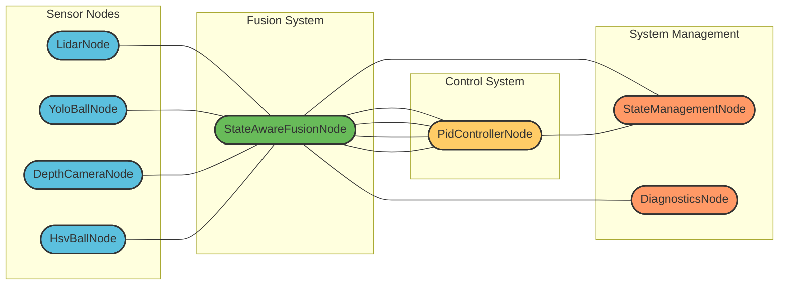
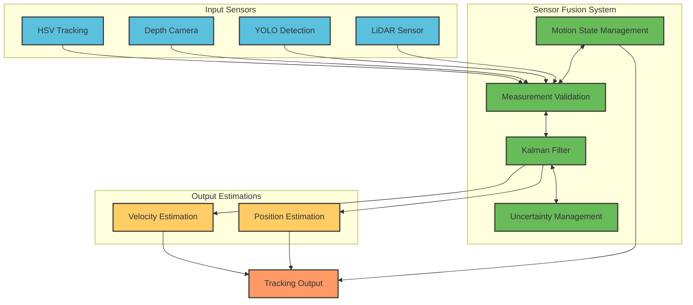
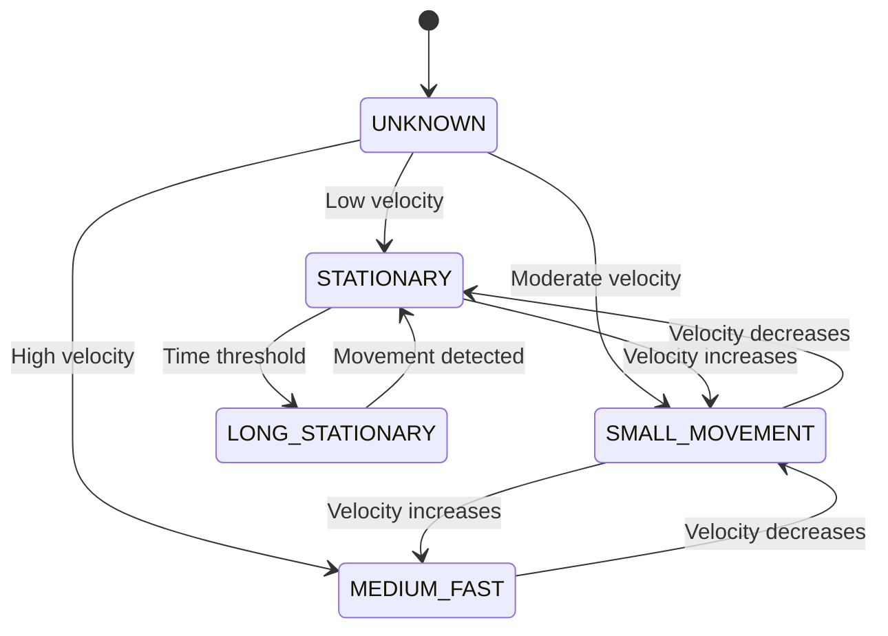
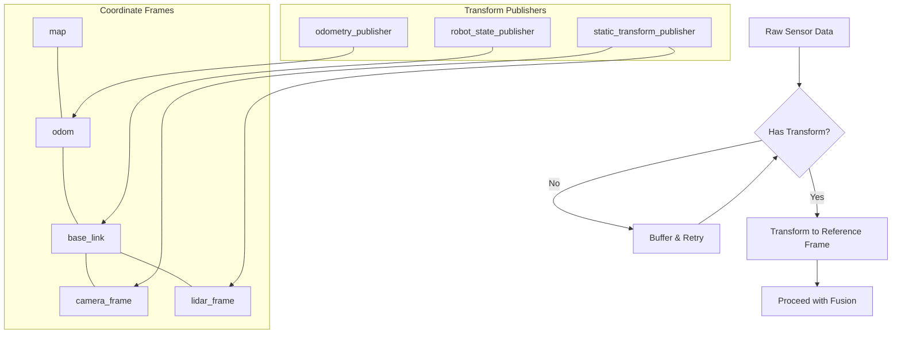
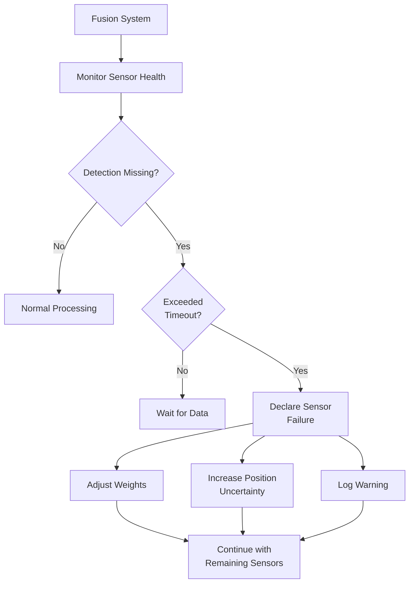
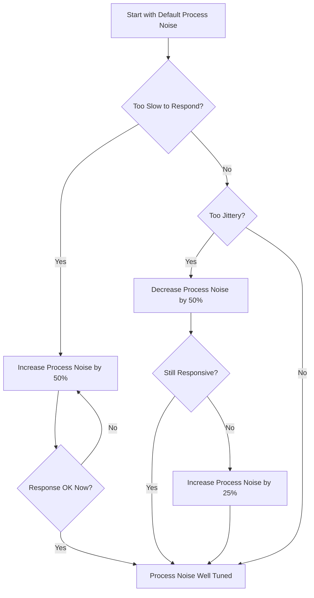
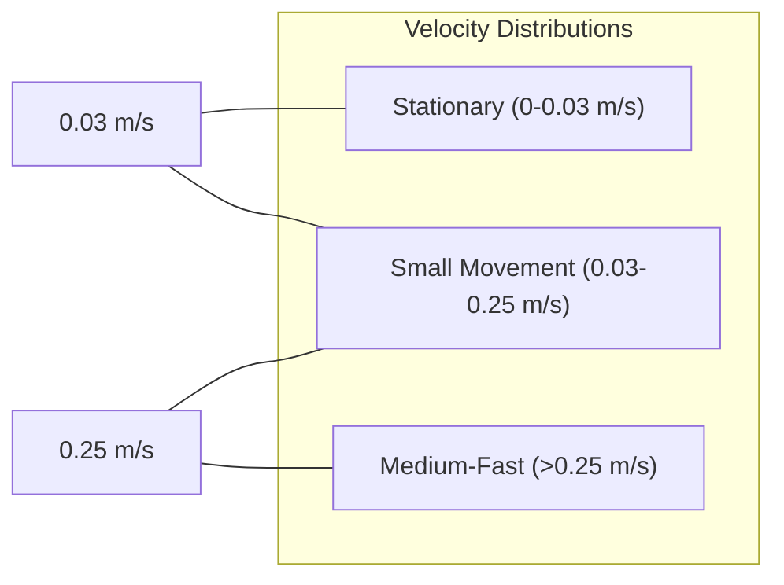
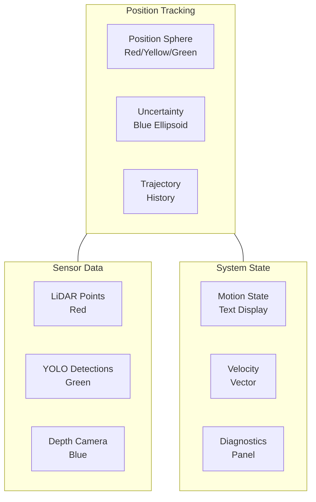

<!-- Badges -->
<a name="top"></a>
<p align="center">
  
  
  
</p>

# Multi-Sensor Fusion System for Robust Basketball Tracking: An Educational Guide

> **Version**: 2.0.0 - May 2025
>
> **Implementation Status**: This document describes both implemented features and conceptual architecture of the system.
> Each section includes implementation status notes to clarify which components are fully implemented in the current codebase.

## Executive Summary

This project implements a state-of-the-art sensor fusion system designed to track a basketball in real-time using multiple sensors. By combining data from LiDAR, computer vision (YOLO), and depth cameras, the system achieves robust tracking even when individual sensors fail or encounter occlusions. The implementation runs efficiently on a Raspberry Pi 5, making it suitable for educational robotics applications.

**Key Features:**
- Kalman filter-based sensor fusion with motion state awareness
- Resource-adaptive processing for embedded systems
- Robust handling of sensor failures and occlusions
- Comprehensive visualization and debugging tools
- Extensive educational content explaining the mathematical foundations

**Target Applications:**
- Educational robotics
- Basketball-playing robots
- Computer vision research
- Sensor fusion demonstrations

This document serves both as technical documentation and as an educational resource for understanding advanced sensor fusion techniques through a practical, real-world example.

## Table of Contents

1. [Project Goals](#project-goals)
2. [Quick Start](#quick-start)
3. [System Architecture Overview](#system-architecture-overview)
4. [Sensor Fusion Fundamentals](#sensor-fusion-fundamentals)
5. [Understanding the Kalman Filter](#understanding-the-kalman-filter)
6. [Linear Algebra for Kalman Filtering](#linear-algebra-for-kalman-filtering)
7. [Mathematical Deep Dive: Kalman Filter](#mathematical-deep-dive-kalman-filter)
8. [Extended Kalman Filter](#extended-kalman-filter)
9. [Motion State Management](#motion-state-management)
10. [Advanced Features](#advanced-features)
11. [Practical Implementation](#practical-implementation)
12. [Configuration and Tuning](#configuration-and-tuning)
13. [Visualization and Monitoring](#visualization-and-monitoring)
14. [Debugging and Analysis](#debugging-and-analysis)
15. [Real-World Case Studies](#real-world-case-studies)
16. [Future Directions](#future-directions)
17. [Performance Benchmarks](#performance-benchmarks)
18. [Glossary of Terms](#glossary-of-terms)
19. [Conclusion](#conclusion)
20. [References and Further Reading](#references-and-further-reading)

<div align="right"><a href="#top">⬆ back to top</a></div>

## 1. Project Goals


This project aims to create an educational and practical implementation of multi-sensor fusion for basketball tracking with several specific goals:

### 1.1 Educational Focus

The primary goal is to create a learning platform for understanding advanced sensor fusion techniques through a concrete, approachable example. The system is designed to:

- Demonstrate fundamental sensor fusion principles
- Provide clear visualizations of algorithm behavior
- Include detailed explanations of mathematical concepts
- Offer progressive complexity for different learning levels

### 1.2 Resilient Tracking

The system is designed to maintain robust tracking under challenging conditions:

- Gracefully handle sensor failures or degradation
- Maintain tracking through occlusions
- Adjust to varying lighting and environmental conditions
- Recover quickly when sensors or targets reappear

### 1.3 Resource Optimization

A key goal is efficient operation on resource-constrained hardware:

- Achieve real-time performance on Raspberry Pi 5
- Implement adaptive resource management
- Optimize memory and CPU usage
- Scale processing based on available resources

### 1.4 Algorithmic Understanding

The project emphasizes deep understanding of:

- Kalman filtering techniques and variants
- State-based fusion methods
- Uncertainty propagation and management
- Measurement validation approaches

### 1.5 Cross-References to Related Sections

- For implementation details on resource optimization, see [Section 10.4: Resource-Aware Performance Adaptation](#resource-aware-performance-adaptation)
- For more on resilient tracking capabilities, see [Section 15: Real-World Case Studies](#real-world-case-studies)
- For mathematical foundations, see [Section 5: Understanding the Kalman Filter](#understanding-the-kalman-filter)

<div align="right"><a href="#top">⬆ back to top</a></div>

## 2. Quick Start


This section provides the essential information to get your basketball tracking system up and running quickly. For in-depth configuration options, see [Section 12: Configuration and Tuning](#configuration-and-tuning).

### 2.1 Installation

```bash
# Clone the repository
git clone https://github.com/yourusername/ball_chase.git

# Navigate to the project directory
cd ball_chase

# Install dependencies
pip install -r requirements.txt

# Build the ROS2 package
colcon build --symlink-install
source install/setup.bash
```

### 2.2 Basic Configuration

Create a configuration file with these minimal settings:

```yaml
# /path/to/your/fusion_config.yaml
process_noise:
  position: 0.1        # Position uncertainty growth rate (m/s²)
  velocity: 1.0        # Velocity uncertainty growth rate (m/s²)

measurement_noise:
  hsv_2d: 50.0         # Pixels - high because 2D only
  yolo_2d: 30.0        # Pixels - lower because more accurate
  hsv_3d: 0.05         # Meters - from depth camera with HSV
  yolo_3d: 0.04        # Meters - from depth camera with YOLO
  lidar: 0.03          # Meters - most accurate for 3D

filter:
  max_time_diff: 0.2           # Maximum time difference for fusion (seconds)
  min_confidence_threshold: 0.5 # Minimum confidence threshold for detections
  detection_timeout: 0.5        # Time after which a detection is considered stale

motion_state_thresholds:
  stationary_max_velocity: 0.03        # Maximum velocity for stationary state (m/s)
  small_movement_max_velocity: 0.25    # Maximum velocity for small movement state (m/s)
  auto_calibrate: true                 # Enable auto-calibration of thresholds

resource_management:
  adaptive_update_rate: true           # Enable adaptive update rate based on system load
  base_update_rate: 20.0               # Base filter update rate (Hz)
  min_update_rate: 5.0                 # Minimum update rate during high load (Hz)
```

### 2.3 Launch the System

```bash
# Launch the entire system with your configuration
ros2 launch ball_chase ball_chase.launch.py config_file:=/path/to/your/fusion_config.yaml

# In a separate terminal, launch the visualization
ros2 run rviz2 rviz2 -d $(ros2 pkg prefix ball_chase)/share/ball_chase/config/fusion_visualization.rviz
```

### 2.4 Basic Commands

Here are some useful commands to interact with the running system:

```bash
# View fusion output
ros2 topic echo /fusion/position

# Change parameters at runtime
ros2 param set /fusion_node process_noise.position 0.2

# Reset the filter
ros2 service call /fusion_node/reset std_srvs/srv/Empty

# Record tracking data for later analysis
ros2 bag record -o tracking_data /fusion/position /fusion/velocity /fusion/state
```

### 2.5 Checking System Status

Visual indicators in RViz show the system status:
- **Green sphere**: Confident tracking
- **Yellow sphere**: Reduced confidence
- **Red sphere**: Low confidence or prediction-only mode
- **Blue ellipsoid**: Position uncertainty (larger = more uncertain)

### 2.6 Cross-References to Related Sections

- For detailed monitoring options, see [Section 13: Visualization and Monitoring](#visualization-and-monitoring)
- For troubleshooting, see [Section 14: Debugging and Analysis](#debugging-and-analysis)
- For parameter tuning guidelines, see [Section 12.2: Tuning Guidelines](#tuning-guidelines)

<div align="right"><a href="#top">⬆ back to top</a></div>

## 3. System Architecture Overview


This section provides a comprehensive overview of the system architecture, explaining how different components interact to create a robust tracking system.

### 3.1 Node Architecture and Data Flow

The basketball tracking system follows a modular architecture with specialized nodes for different functions. The diagram below illustrates the main components and their interactions:



*Figure 3.1: System architecture showing data flow between components. Sensor nodes (blue) collect raw data, the fusion node (green) combines data, the control system (yellow) uses fused data, and system management nodes (orange) monitor and manage the overall system.*

### 3.2 Key Components

#### 3.2.1 Sensor Nodes

Each sensor node is responsible for processing raw sensor data and publishing standardized detection messages:

| Sensor Node | Description | Strengths | Weaknesses |
|-------------|-------------|-----------|------------|
| **LidarNode** | Processes 2D LIDAR scans to detect the basketball | High precision, works in any lighting | Limited to 2D plane, struggles with multiple round objects |
| **YoloBallNode** | Uses YOLO object detection for visual tracking | Reliable identification, works in varied environments | Computationally expensive, less precise positioning |
| **DepthCameraNode** | Provides 3D position from RGB-D camera | Good 3D accuracy at close range | Limited range, affected by lighting conditions |
| **HsvBallNode** | Tracks based on color segmentation | Fast, computationally efficient | Sensitive to lighting changes, requires calibration |

#### 3.2.2 Fusion System

The `StateAwareFusionNode` is the heart of the system:
- Combines all sensor data using Kalman filtering
- Adapts to different motion states of the basketball
- Manages uncertainty across multiple sensors
- Handles resource constraints adaptively

#### 3.2.3 Control System

The `PidControllerNode` uses the fusion output to control robot motion:
- Tracks the basketball position and velocity
- Adjusts control parameters based on motion state
- Implements predictive tracking for smoother motion

#### 3.2.4 System Management

These nodes handle overall system state:
- `StateManagementNode`: Manages system state transitions
- `DiagnosticsNode`: Monitors system performance and health

### 3.3 Topic Structure

Communication between nodes occurs through ROS2 topics:

| From | To | Topic | Message Type | Description |
|------|----|----|-------------|-------------|
| Lidar | Fusion | `/lidar/detections` | `Detection3D` | 3D position from LIDAR |
| YOLO | Fusion | `/vision/yolo_detections` | `Detection3D` | 3D position from YOLO |
| Depth | Fusion | `/camera/depth_detections` | `Detection3D` | 3D position from depth camera |
| HSV | Fusion | `/vision/hsv_detections` | `Detection3D` | 3D position from HSV tracking |
| Fusion | PID | `/fusion/position` | `geometry_msgs/PointStamped` | Filtered ball position |
| Fusion | PID | `/fusion/velocity` | `geometry_msgs/Vector3Stamped` | Filtered ball velocity |
| Fusion | PID | `/fusion/state` | `ball_chase_msgs/MotionState` | Ball motion state |
| Fusion | PID | `/fusion/uncertainty` | `ball_chase_msgs/UncertaintyStamped` | Position/velocity uncertainty |

### 3.4 Parameter Organization

The fusion system parameters are organized hierarchically for easy management:

```
fusion_config.yaml
├── process_noise            # Kalman filter process noise
│   ├── position             # Position uncertainty growth
│   └── velocity             # Velocity uncertainty growth
├── measurement_noise        # Sensor measurement noise
│   ├── lidar                # LIDAR measurement uncertainty
│   ├── yolo_3d              # YOLO 3D measurement uncertainty
│   ├── hsv_3d               # HSV 3D measurement uncertainty
│   └── ...
├── motion_state_thresholds  # Motion state detection parameters
│   ├── stationary_max_velocity  # Threshold for stationary state
│   └── ...
└── resource_management      # Resource optimization parameters
    ├── adaptive_update_rate # Enable/disable adaptive rate
    ├── base_update_rate     # Base filter update rate
    └── min_update_rate      # Minimum update rate during high CPU load
```

### 3.5 Source Code Organization

The fusion system's source code is organized as follows:

```
/src/ball_chase/
├── ball_chase/
│   ├── nodes/
│   │   ├── state_aware_fusion_node.py  # Main fusion node implementation
│   │   ├── lidar_node.py               # LiDAR processing node
│   │   ├── yolo_ball_node.py           # YOLO detection node
│   │   └── ...
│   ├── fusion/
│   │   ├── kalman_filter.py            # Kalman filter implementation
│   │   ├── motion_state.py             # Motion state management
│   │   └── measurement_validation.py    # Measurement validation utilities
│   ├── utilities/
│   │   ├── sensor_sync_buffer.py       # Sensor data synchronization
│   │   └── ...
│   └── visualization/
│       ├── rviz_markers.py             # RViz visualization tools
│       └── ...
├── config/
│   ├── fusion_config.yaml              # Default configuration
│   └── ...
├── launch/
│   ├── ball_chase.launch.py            # Main launch file
│   └── ...
└── ...
```

### 3.6 Sensor Comparison

Here's a detailed comparison of the different sensors used in our system:

| Feature | LiDAR | YOLO Camera | Depth Camera | HSV Camera |
|---------|-------|-------------|--------------|------------|
| **Detection Range** | 0.1-12m | 0.5-10m | 0.5-5m | 0.5-8m |
| **Position Accuracy** | ±2cm | ±5-10cm | ±3-5cm | ±7-15cm |
| **Update Rate** | 40Hz | 10-15Hz | 30Hz | 30Hz |
| **Field of View** | 270° (2D) | 75° (3D) | 65° (3D) | 75° (3D) |
| **Lighting Dependency** | None | Medium | Low | High |
| **Computational Cost** | Low | Very High | Medium | Low |
| **False Positives** | Medium | Low | Medium | High |
| **Occlusion Handling** | Poor | Medium | Medium | Poor |
| **Main Advantage** | Precise distance | Good identification | Good 3D accuracy | Fast processing |
| **Main Limitation** | 2D plane only | Computationally heavy | Limited range | Lighting sensitive |

### 3.7 Cross-References to Related Sections

- For more on how motion states affect fusion, see [Section 9: Motion State Management](#motion-state-management)
- For technical details on Kalman filtering, see [Section 5: Understanding the Kalman Filter](#understanding-the-kalman-filter)
- For visualization tools, see [Section 13: Visualization and Monitoring](#visualization-and-monitoring)

<div align="right"><a href="#top">⬆ back to top</a></div>

## 4. Sensor Fusion Fundamentals

This section explains the core concepts behind sensor fusion and why it's essential for robust tracking systems.

### 4.1 What is Sensor Fusion?

Sensor fusion combines data from multiple sensors to produce a more accurate, reliable, and complete picture of the environment than any individual sensor could provide alone. Think of it like a team of experts with different specialties working together to solve a complex problem.

In our basketball tracking system, we combine data from:

1. **LiDAR**: Provides precise distance measurements but limited to a 2D plane
2. **YOLO Computer Vision**: Offers reliable ball detection with 2D coordinates
3. **Depth Camera**: Provides 3D information with moderate accuracy
4. **HSV Color Tracking**: Fast detection based on color properties

Each sensor has strengths and weaknesses, but together they create a robust tracking system.

The diagram below illustrates how different sensors and processing components work together in our fusion system:



*Figure 4.1: Sensor fusion architecture showing data flow from sensors to final output. The system consists of four main parts: (1) Input Sensors (blue): LiDAR, YOLO, Depth Camera, and HSV tracking, each with unique strengths; (2) Fusion System (green): manages motion state, validates measurements, applies Kalman filtering, and manages uncertainty; (3) Output Estimations (yellow): position and velocity calculations; and (4) Final Output (orange): combines all information into position and velocity with uncertainty estimates, motion state, and confidence metrics.*

*Figure 4.1: Sensor fusion architecture diagram showing the complete data flow from multiple sensors through the fusion system to the final output. The system is organized in layers: input sensors (blue) feed data to the fusion system (green), which produces position and velocity estimations (yellow), ultimately resulting in the tracking output (orange) with position, velocity, uncertainty estimates, and motion state information.*

*Figure 4.1: Sensor fusion architecture showing how multiple sensor inputs are processed and combined to produce a robust tracking output. The diagram shows how data flows from individual sensors through preprocessing, validation, filtering, and finally to a combined output with position, velocity, and uncertainty estimates.*

### 4.2 Core Benefits of Sensor Fusion

#### 4.2.1 Complementary Information

Different sensors excel in different conditions:
- LiDAR provides accurate distance but limited field of view
- Cameras offer rich visual information but struggle in low light
- Depth cameras provide 3D data but at shorter ranges

By combining these complementary data sources, we get a more complete picture of the environment.

#### 4.2.2 Increased Reliability

When one sensor fails or provides poor data, others can compensate:
- If the camera is blinded by bright light, LiDAR continues working
- If LiDAR misses the ball due to its 2D nature, cameras can still track
- If all sensors provide lower quality data, fusion still produces usable results

The chart below shows tracking success rates with different sensor combinations:

```mermaid
xychart
    title "Tracking Success Rate by Sensor Combination"
    x-axis "Scenario" ["Normal", "Low Light", "Fast Motion", "Occlusion"]
    y-axis "Success Rate (%)" 0 --> 100
    bar [95, 60, 70, 45] "LiDAR Only"
    bar [90, 30, 85, 65] "Camera Only"
    bar [95, 40, 65, 60] "Depth Only" 
    bar [99, 85, 93, 82] "All Sensors"
```

*Figure 4.2: Comparison of tracking success rates across different scenarios. The chart demonstrates how using all sensors together (bottom bar in each group) provides significantly better performance in challenging conditions compared to any single sensor.*

#### 4.2.3 Reduced Uncertainty

Each sensor has its own error characteristics. By combining measurements statistically, we can reduce overall uncertainty:
- Random errors tend to cancel out
- Systematic errors can be identified and minimized
- Overall precision improves through statistical combination

#### 4.2.4 Enhanced Robustness

A well-designed fusion system handles environmental variability better:
- Adapts to changing lighting conditions
- Adjusts to various motion patterns
- Handles noisy environments gracefully

#### 4.2.5 Extended Range

Combining sensors with different optimal ranges extends the effective tracking area:
- Close-range: Depth camera (0.5-5m)
- Mid-range: Cameras (0.5-10m)
- Long-range: LiDAR (up to 12m)

### 4.3 Statistical Foundation

At its core, sensor fusion is a statistical process that combines multiple uncertain measurements to produce a more certain result. Key statistical concepts include:

- **Bayesian Filtering**: Using prior knowledge and new measurements to update belief
- **Measurement Uncertainty**: Modeling sensor noise characteristics
- **Covariance Propagation**: Tracking how uncertainty evolves over time
- **Statistical Independence**: Understanding when measurements provide truly new information

### 4.4 Fusion Architectures

Multiple approaches to sensor fusion exist, each with advantages:

| Architecture | Description | Our Implementation |
|--------------|-------------|-------------------|
| **Centralized** | All sensor data processed in a single fusion system | ✓ Primary approach |
| **Hierarchical** | Multi-level fusion with preprocessing | ✓ For vision sensors |
| **Distributed** | Independent fusion systems that share results | ✗ Not implemented |
| **Sequential** | Sensors processed one after another | ✗ Not implemented |

Our system primarily uses a centralized fusion architecture with elements of hierarchical fusion for vision data preprocessing.

### 4.5 Cross-References to Related Sections

- For mathematical details on uncertainty handling, see [Section 5: Understanding the Kalman Filter](#understanding-the-kalman-filter)
- For practical implementation of sensor synchronization, see [Section 10.1: Multi-Sensor Synchronization](#multi-sensor-synchronization)
- For real-world performance data, see [Section 15: Real-World Case Studies](#real-world-case-studies)

<div align="right"><a href="#top">⬆ back to top</a></div>

## 5. Understanding the Kalman Filter

The Kalman filter is the mathematical heart of our sensor fusion system. This section provides an intuitive explanation of how the filter works, followed by the mathematical model implemented in our system.

### 5.1 Intuitive Explanation

At its core, the Kalman filter is an algorithm that optimally combines:

1. **Physics-Based Predictions**: Where should the basketball be now, based on where it was and how it was moving?
2. **Sensor Measurements**: What are our sensors telling us about where the basketball actually is?

The filter continuously balances these two sources based on their uncertainty, producing an optimal estimate that is better than either source alone.

```mermaid
flowchart LR
    A[Previous State<br>"Where was the ball?"] --- B[Physics Model<br>"Where should it be now?"]
    B --- C[Predicted State<br>"Our best guess before measuring"]
    D[Sensor<br>Measurements] --- E[Measurement<br>Uncertainty]
    C --- F[Kalman Gain<br>"How much to trust measurements?"]
    E --- F
    F --- G[Updated State<br>"Our best estimate after measuring"]
    C --- G
    D --- G
    G --- H[Output State<br>"Position & Velocity"]
    G --- I[Updated Uncertainty<br>"How confident are we?"]
    
    classDef prevState fill:#ffcc66,stroke:#333,stroke-width:2px
    classDef prediction fill:#5bc0de,stroke:#333,stroke-width:2px
    classDef measurement fill:#ff9966,stroke:#333,stroke-width:2px
    classDef updated fill:#68bb59,stroke:#333,stroke-width:2px
    
    class A prevState
    class B,C prediction
    class D,E measurement
    class F,G,H,I updated
```

*Figure 5.1: Workflow of the Kalman filter showing how previous state and measurements are combined through the Kalman gain to produce an updated state estimate. The process balances the physics-based prediction (blue) with new sensor measurements (orange) based on their relative uncertainties.*

#### 5.1.1 The Prediction-Correction Cycle

The Kalman filter operates in a continuous prediction-correction cycle:

1. **Predict**: Based on the previous state estimate and a physics model, predict where the system should be now.
2. **Measure**: Gather new sensor measurements of the actual system.
3. **Compare**: Calculate the difference between prediction and measurement.
4. **Update**: Combine the prediction and measurement using the Kalman gain.
5. **Repeat**: Use the updated state as the starting point for the next cycle.

#### 5.1.2 The Kalman Gain: The Magic Ingredient

The Kalman gain is what makes the filter "intelligent." It determines how much to trust the prediction versus the measurement:

- If predictions are historically more accurate than measurements, the gain will favor predictions.
- If measurements are more reliable than predictions, the gain will favor measurements.
- The gain automatically adapts as relative uncertainties change.

Think of the Kalman gain as a smart "trust dial" that automatically adjusts based on past performance.

### 5.2 The Mathematical Model

Our implementation uses a constant velocity Kalman filter with a 6-dimensional state vector:

```
x = [px, py, pz, vx, vy, vz]^T
```

Where:
- `px, py, pz`: Position of the basketball in 3D space (meters)
- `vx, vy, vz`: Velocity of the basketball in each direction (meters/second)

#### 5.2.1 Prediction Step

```
x̂ₖ⁻ = Fₖx̂ₖ₋₁
Pₖ⁻ = FₖPₖ₋₁Fₖᵀ + Qₖ
```

Where:
- x̂ₖ⁻ is the predicted state (position and velocity)
- Fₖ is the state transition matrix (physics model)
- Pₖ⁻ is the predicted covariance (uncertainty)
- Qₖ is the process noise covariance (how much uncertainty to add during prediction)

For a constant velocity model with time step dt:

```
       [1 0 0 dt 0  0 ]
       [0 1 0 0  dt 0 ]
F  =   [0 0 1 0  0  dt]
       [0 0 0 1  0  0 ]
       [0 0 0 0  1  0 ]
       [0 0 0 0  0  1 ]
```

This matrix encodes the physics equations:
- New position = old position + velocity × time
- Velocity stays the same (in this basic model)

#### 5.2.2 Update Step

```
Kₖ = Pₖ⁻Hₖᵀ(HₖPₖ⁻Hₖᵀ + Rₖ)⁻¹
x̂ₖ = x̂ₖ⁻ + Kₖ(zₖ - Hₖx̂ₖ⁻)
Pₖ = (I - KₖHₖ)Pₖ⁻
```

Where:
- Kₖ is the Kalman gain (how much to trust the measurements)
- zₖ is the measurement vector (what the sensors report)
- Hₖ is the measurement matrix (mapping state to what we can measure)
- Rₖ is the measurement noise covariance (sensor uncertainty)

The term `(zₖ - Hₖx̂ₖ⁻)` is called the innovation or residual—the difference between what we measured and what we predicted we would measure.

#### 5.2.3 Measurement Matrix

For sensors that directly measure position (like our 3D detections):

```
H = [1 0 0 0 0 0]   (For x-position)
    [0 1 0 0 0 0]   (For y-position)
    [0 0 1 0 0 0]   (For z-position)
```

### 5.3 Implementation Optimizations

Our implementation includes numerous optimizations to run efficiently on the Raspberry Pi 5:

```python
# Efficient Kalman filter implementation with optimizations for Raspberry Pi
class OptimizedKalmanFilter:
    def __init__(self, dt=0.1):
        # State dimension = 6 (position and velocity in 3D)
        self.x = np.zeros(6)  # State vector [px, py, pz, vx, vy, vz]
        self.P = np.eye(6)    # State covariance
        
        # Pre-compute state transition matrix for common time steps
        self.dt = dt
        self.F = self._build_F(dt)
        
        # Process noise - will be scaled by dt during prediction
        self.base_Q = np.diag([0.1, 0.1, 0.1, 1.0, 1.0, 1.0])
        
        # Measurement matrix for position-only measurements
        self.H = np.zeros((3, 6))
        self.H[:3, :3] = np.eye(3)
        
        # Reusable identity matrix
        self.I = np.eye(6)
        
        # Default measurement noise
        self.R = np.eye(3) * 0.01  # Will be overridden by actual sensor noise
    
    def _build_F(self, dt):
        """Build the state transition matrix for a given dt.
        Pre-computed for efficiency."""
        F = np.eye(6)
        F[0, 3] = dt  # x += vx*dt
        F[1, 4] = dt  # y += vy*dt
        F[2, 5] = dt  # z += vz*dt
        return F
    
    def predict(self, dt=None):
        """Predict the state forward by dt seconds."""
        # Use pre-computed F if dt hasn't changed
        if dt is not None and dt != self.dt:
            self.dt = dt
            self.F = self._build_F(dt)
        
        # Apply state transition model: x = F*x
        # Optimized to avoid full matrix multiplication for known F structure
        self.x[0] += self.x[3] * self.dt
        self.x[1] += self.x[4] * self.dt
        self.x[2] += self.x[5] * self.dt
        
        # Scale process noise by dt
        Q = self.base_Q.copy()
        # Position uncertainty increases with dt²
        Q[0, 0] *= self.dt**2
        Q[1, 1] *= self.dt**2
        Q[2, 2] *= self.dt**2
        # Velocity uncertainty increases with dt
        Q[3, 3] *= self.dt
        Q[4, 4] *= self.dt
        Q[5, 5] *= self.dt
        
        # Update covariance: P = F*P*F' + Q
        self.P = self.F @ self.P @ self.F.T + Q
        
        # Early termination for stationary objects (optimization)
        velocity_magnitude = np.linalg.norm(self.x[3:])
        if velocity_magnitude < 0.01:  # Nearly stationary
            # Apply additional damping to velocity
            self.x[3:] *= 0.9
    
    def update(self, z, R=None):
        """Update the state with a measurement z."""
        if R is not None:
            self.R = R
            
        # For position-only measurements
        # Calculate innovation (difference between measurement and prediction)
        y = z - self.H @ self.x
        
        # Innovation covariance
        S = self.H @ self.P @ self.H.T + self.R
        
        # Kalman gain
        K = self.P @ self.H.T @ np.linalg.inv(S)
        
        # Update state
        self.x = self.x + K @ y
        
        # Joseph form for covariance update (more numerically stable)
        I_KH = self.I - K @ self.H
        self.P = I_KH @ self.P @ I_KH.T + K @ self.R @ K.T
        
        return y  # Return innovation for measurement validation
```

*Code Listing 5.1: Optimized Kalman filter implementation with comments explaining key optimizations for resource-constrained hardware. The implementation includes pre-computed matrices, early termination for stationary objects, and efficient matrix operations.*

### 5.4 Cross-References to Related Sections

- For mathematical details on linear algebra foundations, see [Section 6: Linear Algebra for Kalman Filtering](#linear-algebra-for-kalman-filtering)
- For handling nonlinear motion, see [Section 8: Extended Kalman Filter](#extended-kalman-filter)
- For state-dependent parameter adjustment, see [Section 9: Motion State Management](#motion-state-management)

<div align="right"><a href="#top">⬆ back to top</a></div>

## 6. Linear Algebra for Kalman Filtering

This section provides a foundation in the linear algebra concepts necessary to understand and implement Kalman filtering. While the math may seem intimidating at first, we'll build intuition by connecting it to the concrete basketball tracking problem.

### 6.1 Vectors and Matrices

#### 6.1.1 State Vectors: Describing the Basketball's State

A **vector** is simply an ordered list of numbers. In our basketball tracking system, we use a **state vector** to represent everything we know about the ball's motion in a compact form:

```
x = [px, py, pz, vx, vy, vz]^T
```

Where:
- `px, py, pz`: Position of the basketball in 3D space (meters)
- `vx, vy, vz`: Velocity of the basketball in each direction (meters/second)
- The `^T` means "transpose" - turning a row vector into a column vector

**Why This Matters**: By representing the basketball's state as a vector, we can use powerful mathematical tools to update our knowledge as new measurements arrive.

```
┌───── Basketball State Vector Example ─────┐
│                                          │
│ [px]     [ 1.2]  ← X position (1.2m)     │
│ [py]     [ 0.5]  ← Y position (0.5m)     │
│ [pz]  =  [ 1.0]  ← Z position (1.0m)     │
│ [vx]     [ 0.3]  ← X velocity (0.3m/s)   │
│ [vy]     [-0.1]  ← Y velocity (-0.1m/s)  │
│ [vz]     [-0.2]  ← Z velocity (-0.2m/s)  │
│                                          │
└──────────────────────────────────────────┘
```

*Figure 6.1: Example of a state vector representing a basketball's position and velocity in 3D space. The vector concisely captures both where the ball is and how it's moving.*

**Real-World Analogy**: Think of a vector like a shopping list. Each item (position, velocity) has a specific value, and the list keeps everything organized.

#### 6.1.2 Matrices: Transforming and Relating Vectors

A **matrix** is a rectangular array of numbers organized in rows and columns. Matrices are powerful because they can:
1. Transform vectors (change their values according to specific rules)
2. Represent relationships between variables
3. Encode physical laws and system behavior

In the Kalman filter, we use matrices to:
- Predict how the state evolves over time (state transition matrix)
- Describe the relationship between the state and measurements
- Represent uncertainty in our knowledge

**Example**: The state transition matrix for predicting where the basketball will be after time `dt` (in seconds):

```
       [1 0 0 dt 0  0 ]
       [0 1 0 0  dt 0 ]
F  =   [0 0 1 0  0  dt]
       [0 0 0 1  0  0 ]
       [0 0 0 0  1  0 ]
       [0 0 0 0  0  1 ]
```

**What This Matrix Means**: This seemingly complex matrix simply encodes the physics equations:
- New x-position = old x-position + x-velocity × time
- New y-position = old y-position + y-velocity × time
- New z-position = old z-position + z-velocity × time
- Velocities stay the same (in this basic constant-velocity model)

### 6.2 Covariance Matrices

#### 6.2.1 Understanding Uncertainty with Matrices

The brilliance of the Kalman filter comes from its ability to track uncertainty. For this, it uses a **covariance matrix** - a square, symmetric matrix that describes:
1. How uncertain we are about each state variable (diagonal elements)
2. How errors in one variable relate to errors in another (off-diagonal elements)

```
┌───── Covariance Matrix Structure ─────┐
│                                      │
│      [σ²px  σpx,py σpx,pz σpx,vx σpx,vy σpx,vz]
│      [σpy,px σ²py  σpy,pz σpy,vx σpy,vy σpy,vz]
│      [σpz,px σpz,py σ²pz  σpz,vx σpz,vy σpz,vz]
│ P =  [σvx,px σvx,py σvx,pz σ²vx  σvx,vy σvx,vz]
│      [σvy,px σvy,py σvy,pz σvy,vx σ²vy  σvy,vz]
│      [σvz,px σvz,py σvz,pz σvz,vx σvz,vy σ²vz ]
│                                      │
└──────────────────────────────────────┘
```

Where:
- σ²px is the variance (uncertainty squared) in x-position
- σpx,py is the covariance between x and y positions (how errors in x relate to errors in y)

**Simplified Example**: For a basketball tracking system, a covariance matrix might look like:

```
P = [0.01  0     0     0.005  0      0    ]  ← Low position uncertainty (±10cm)
    [0     0.01  0     0      0.005  0    ]
    [0     0     0.01  0      0      0.005]
    [0.005 0     0     0.1    0      0    ]  ← Higher velocity uncertainty (±0.3m/s)
    [0     0.005 0     0      0.1    0    ]
    [0     0     0.005 0      0      0.1  ]
```

**What This Matrix Tells Us**:
- We're quite certain about position (small diagonal values of 0.01 = standard deviation of 0.1m)
- We're less certain about velocity (larger diagonal values of 0.1 = standard deviation of 0.3m/s)
- Position and velocity errors are slightly correlated (small off-diagonal values of 0.005)

#### 6.2.2 Visualizing Covariance: Uncertainty Ellipses

Covariance matrices create uncertainty ellipses (or ellipsoids in 3D) around our estimates:

```mermaid
xychart
    title "Uncertainty Ellipses: Different Covariance Matrices"
    x-axis "X Position (m)" -1.5 -1.0 -0.5 0 0.5 1.0 1.5
    y-axis "Y Position (m)" -1.5 -1.0 -0.5 0 0.5 1.0 1.5
    line [0, 0.1, 0.35, 0.5, 0.35, 0.1, 0] "Low Uncertainty"
    line [0, 0.2, 0.7, 1.0, 0.7, 0.2, 0] "High Uncertainty"
```

*Figure 6.2: Uncertainty ellipses representing different covariance matrices. The smaller ellipse (blue) represents low uncertainty, while the larger ellipse (red) represents higher uncertainty. These visual representations help in understanding the confidence level of our position estimates.*

**Real-World Analogy**: Think of the covariance matrix as a "worry map" - it shows what you're uncertain about and how your uncertainties relate to each other.

### 6.3 Matrix Operations

#### 6.3.1 Matrix Multiplication: Applying Transformations

Matrix multiplication is how we apply a transformation (matrix) to a vector. The general rule is:
1. Each element in the result is the sum of products of corresponding row and column elements
2. The number of columns in the first matrix must equal the number of rows in the second

**Example**: Let's multiply a 2×2 matrix by a 2×1 vector:

```
[a b] × [x] = [a×x + b×y]
[c d]   [y]   [c×x + d×y]
```

**Implementing State Prediction**: To predict the next state, we multiply the state transition matrix (F) by the current state vector (x):

```
x̂ₖ⁻ = Fₖx̂ₖ₋₁
```

Here's a concrete example with one step of state prediction:

```python
# Example state prediction calculation
def predict_state(state, dt):
    """Predict state one step forward given a constant velocity model."""
    # State vector: [px, py, pz, vx, vy, vz]
    x, y, z = state[0], state[1], state[2]
    vx, vy, vz = state[3], state[4], state[5]
    
    # Apply physics model: position += velocity * time
    new_x = x + vx * dt
    new_y = y + vy * dt
    new_z = z + vz * dt
    
    # Velocity unchanged in constant velocity model
    new_vx, new_vy, new_vz = vx, vy, vz
    
    # Return new state
    return np.array([new_x, new_y, new_z, new_vx, new_vy, new_vz])

# Example usage
current_state = np.array([1.0, 2.0, 0.5, 0.3, -0.1, 0.2])  # [x, y, z, vx, vy, vz]
dt = 0.1  # seconds
predicted_state = predict_state(current_state, dt)
print(f"Current state: {current_state}")
print(f"Predicted state after {dt}s: {predicted_state}")
```

*Code Listing 6.1: Example Python function showing the mathematics of state prediction. This illustrates how the state transition matrix operates on the state vector to predict the next position and velocity.*

#### 6.3.2 Matrix Addition and Subtraction

Matrix addition and subtraction are straightforward - just add or subtract corresponding elements:

```
[a b] + [e f] = [a+e b+f]
[c d]   [g h]   [c+g d+h]
```

**When We Use This**: We add matrices when combining different sources of uncertainty (like combining process noise with the existing covariance).

#### 6.3.3 Matrix Inversion: Undoing a Transformation

The inverse of a matrix (denoted A^(-1) or A^-1) is a matrix that "undoes" the original transformation:

```
A × A^(-1) = I  (Identity matrix)
```

Where the identity matrix (I) is the "do nothing" transformation (like multiplying by 1).

**When We Use This**: In the Kalman filter, we use matrix inversion when calculating the Kalman gain - determining how much to trust measurements versus predictions.

### 6.4 Practical Application: Covariance Propagation

One of the most important aspects of the Kalman filter is how it propagates uncertainty through time. The prediction step updates the covariance matrix using:

```
Pₖ⁻ = FₖPₖ₋₁Fₖᵀ + Qₖ
```

Where:
- Pₖ⁻ is the predicted covariance
- Fₖ is the state transition matrix
- Pₖ₋₁ is the previous covariance
- Qₖ is the process noise covariance

**What This Means**: This equation describes how uncertainty grows when we predict without new measurements. The longer we go without measurements, the more uncertain we become.

```python
# Example of covariance propagation in Python
def propagate_covariance(covariance, F, Q):
    """Propagate covariance matrix according to linear system dynamics."""
    return F @ covariance @ F.T + Q

# Example initial covariance (low position uncertainty, higher velocity uncertainty)
P = np.diag([0.01, 0.01, 0.01, 0.1, 0.1, 0.1])

# State transition matrix for dt=0.1
dt = 0.1
F = np.eye(6)
F[0, 3] = F[1, 4] = F[2, 5] = dt

# Process noise (simplified)
Q = np.diag([0.001, 0.001, 0.001, 0.01, 0.01, 0.01])

# Propagate covariance
P_predicted = propagate_covariance(P, F, Q)

print("Initial covariance diagonals:", np.diag(P))
print("Predicted covariance diagonals:", np.diag(P_predicted))
# Notice how uncertainty increases after prediction
```

*Code Listing 6.2: Python code demonstrating covariance propagation during the prediction step. This shows how uncertainty grows when predicting forward in time without new measurements.*

### 6.5 Cross-References to Related Sections

- For the complete Kalman filter algorithm, see [Section 7: Mathematical Deep Dive: Kalman Filter](#mathematical-deep-dive-kalman-filter)
- For visualizing uncertainty in practice, see [Section 13.2: Interpreting Covariance Ellipses](#interpreting-covariance-ellipses)
- For handling matrix operations efficiently, see [Section 11.2: Performance Optimization Techniques](#performance-optimization-techniques)

<div align="right"><a href="#top">⬆ back to top</a></div>

## 7. Mathematical Deep Dive: Kalman Filter

This section provides a comprehensive mathematical treatment of the Kalman filter. We'll build it step-by-step, using our basketball tracking system as a concrete example to help you develop a deep understanding of how and why the filter works.

### 7.1 Derivation from Bayes' Rule

The Kalman filter is fundamentally a Bayesian estimator - it combines prior knowledge with new measurements to form an improved estimate. To understand it deeply, we'll start with Bayes' rule and show how the Kalman filter emerges naturally.

#### 7.1.1 Bayesian Estimation: The Foundation

Bayes' rule gives us a principled way to update our beliefs based on new evidence:

```
P(state|measurement) = P(measurement|state) × P(state) / P(measurement)
```

In symbols:
```
P(x|z) = P(z|x)P(x) / P(z)
```

Where:
- P(x|z) is the posterior probability - our updated belief about the state after seeing the measurement
- P(z|x) is the likelihood - how probable the measurement is, given a particular state
- P(x) is the prior probability - our belief about the state before seeing the measurement
- P(z) is a normalization factor - the overall probability of the measurement

**Everyday Example**: Imagine you're tracking a basketball with your eyes closed, and someone tells you they hear bouncing to your right. Your prior belief might be "the ball is somewhere in the room" (P(x)). The likelihood might be "if the ball is on the right side, there's a high chance of hearing bouncing from the right" (P(z|x)). Bayes' rule combines these to give your updated belief - "the ball is probably on your right side" (P(x|z)).

#### 7.1.2 The Gaussian Assumption: Making Bayes' Rule Tractable

In Kalman filtering, we make two key assumptions that transform this abstract rule into a practical algorithm:

1. **All probability distributions are Gaussian (normal)**
2. **All system dynamics are linear**

When both assumptions hold, we can represent our belief about the state using just two parameters: a mean vector and a covariance matrix. This is incredibly efficient compared to tracking entire probability distributions.

```mermaid
xychart
    title "2D Gaussian Distribution"
    x-axis "X Position" -3 -2 -1 0 1 2 3
    y-axis "Y Position" -3 -2 -1 0 1 2 3
    line [-3, -2, -1, 0, 1, 2, 3] "Y = 0 Cross-Section"
    line [0, 0.1, 0.3, 0.4, 0.3, 0.1, 0] "Probability Density"
```

*Figure 7.1: Cross-section of a 2D Gaussian distribution, representing our belief about the basketball's position. The peak represents the most likely position, with probability decreasing as we move away from the mean. The width of the curve represents uncertainty.*

### 7.2 Prediction Step: Physics-Based Forecasting

The prediction step projects the state and its uncertainty forward in time using a physical model of the system.

#### 7.2.1 State Prediction: Where Will the Ball Be?

For a linear system with state transition matrix F:

```
x̂ₖ⁻ = Fₖx̂ₖ₋₁ + Bₖuₖ
```

Where:
- x̂ₖ⁻ is the predicted state at time k (before measurement update)
- x̂ₖ₋₁ is the state estimate from the previous time step
- Fₖ is the state transition matrix (encoding the physics)
- Bₖ is the control input matrix
- uₖ is the control input (e.g., forces applied to the system)

In our basketball tracking system, we don't use control inputs (the ball moves freely), so this simplifies to:

```
x̂ₖ⁻ = Fₖx̂ₖ₋₁
```

**Concrete Example**: For a constant velocity model tracking basketball position (px, py, pz) and velocity (vx, vy, vz) with a time step dt = 0.1 seconds:

```
⎡px_k⎤   ⎡1 0 0 0.1  0   0 ⎤ ⎡px_k-1⎤
⎢py_k⎥   ⎢0 1 0  0  0.1  0 ⎥ ⎢py_k-1⎥
⎢pz_k⎥ = ⎢0 0 1  0   0  0.1⎥ ⎢pz_k-1⎥
⎢vx_k⎥   ⎢0 0 0  1   0   0 ⎥ ⎢vx_k-1⎥
⎢vy_k⎥   ⎢0 0 0  0   1   0 ⎥ ⎢vy_k-1⎥
⎣vz_k⎦   ⎣0 0 0  0   0   1 ⎦ ⎣vz_k-1⎦
```

This simply says:
- New position = Old position + Velocity × Time
- Velocity remains constant (in the prediction)

#### 7.2.2 Covariance Prediction: How Uncertainty Evolves

While we predict the state, we must also predict how our uncertainty changes:

```
Pₖ⁻ = FₖPₖ₋₁Fₖᵀ + Qₖ
```

Where:
- Pₖ⁻ is the predicted covariance (uncertainty) 
- Pₖ₋₁ is the covariance from the previous step
- Qₖ is the process noise covariance

The process noise covariance Q represents uncertainty added during prediction due to:
- Model simplifications (real physics is more complex)
- Environmental factors (air resistance, uneven surfaces)
- Random disturbances (ball getting bumped)

For our constant velocity model tracking a basketball in 3D space, Q might have this structure:

```
      ⎡dt⁴/4  0      0     dt³/2  0      0    ⎤
      ⎢0      dt⁴/4  0     0      dt³/2  0    ⎥
      ⎢0      0      dt⁴/4 0      0      dt³/2⎥
Q = q ⎢dt³/2  0      0     dt²    0      0    ⎥
      ⎢0      dt³/2  0     0      dt²    0    ⎥
      ⎣0      0      dt³/2 0      0      dt²  ⎦
```

Where q is a tuning parameter representing the "intensity" of the noise. Higher values of q indicate more unpredictable motion.

Here's a concise Python implementation of the prediction step:

```python
def kalman_predict(x, P, F, Q):
    """
    Perform Kalman filter prediction step.
    
    Parameters:
        x: State vector [px, py, pz, vx, vy, vz]
        P: State covariance matrix
        F: State transition matrix
        Q: Process noise covariance
        
    Returns:
        x_pred: Predicted state
        P_pred: Predicted covariance
    """
    # Predict state
    x_pred = F @ x
    
    # Predict covariance
    P_pred = F @ P @ F.T + Q
    
    return x_pred, P_pred
```

*Code Listing 7.1: Python implementation of the Kalman filter prediction step, showing the matrix operations to propagate both the state and covariance forward in time.*

### 7.3 Update Step: Incorporating Measurements

The update step is where the magic happens - we incorporate new measurements to correct our prediction.

#### 7.3.1 Measurement Prediction and Innovation

First, we predict what measurement we expect to see, given our predicted state:

```
ẑₖ = Hₖx̂ₖ⁻
```

Where:
- ẑₖ is the predicted measurement
- Hₖ is the measurement matrix that maps state to measurement space

Then we compute the innovation - the difference between actual and predicted measurements:

```
yₖ = zₖ - ẑₖ = zₖ - Hₖx̂ₖ⁻
```

**Practical Example**: If our LIDAR only measures position (not velocity), our H matrix would be:

```
H = [1 0 0 0 0 0]  (For x-position only)
    [0 1 0 0 0 0]  (For y-position only)
    [0 0 1 0 0 0]  (For z-position only)
```

#### 7.3.2 Innovation Covariance: How Reliable is the Difference?

The innovation covariance represents uncertainty in this difference:

```
Sₖ = HₖPₖ⁻Hₖᵀ + Rₖ
```

Where:
- Rₖ is the measurement noise covariance

R represents how noisy or unreliable our sensors are. For a LIDAR with position measurement error of about 3cm in each direction:

```
R = [0.0009   0       0    ]  (3cm standard deviation squared for x)
    [0      0.0009    0    ]  (3cm standard deviation squared for y)
    [0       0     0.0009  ]  (3cm standard deviation squared for z)
```

#### 7.3.3 The Kalman Gain: The Optimal Compromise

The Kalman gain is the key to the filter - it determines how much to trust the measurement versus the prediction:

```
Kₖ = Pₖ⁻Hₖᵀ(Sₖ)⁻¹ = Pₖ⁻Hₖᵀ(HₖPₖ⁻Hₖᵀ + Rₖ)⁻¹
```

**Intuition**: The Kalman gain can be understood as:
```
K = prediction_uncertainty / (prediction_uncertainty + measurement_uncertainty)
```

- If prediction uncertainty is much larger than measurement uncertainty, K approaches 1, meaning "trust the measurement"
- If measurement uncertainty is much larger than prediction uncertainty, K approaches 0, meaning "trust the prediction"

The beauty of the Kalman filter is that it calculates the mathematically optimal value of K to minimize the overall error.

#### 7.3.4 State and Covariance Update: The Final Result

Finally, we update our state estimate and covariance:

```
x̂ₖ = x̂ₖ⁻ + Kₖyₖ           (Updated state)
Pₖ = (I - KₖHₖ)Pₖ⁻        (Updated covariance)
```

Here's a concise Python implementation of the update step:

```python
def kalman_update(x, P, z, H, R):
    """
    Perform Kalman filter update step.
    
    Parameters:
        x: Predicted state vector
        P: Predicted state covariance
        z: Measurement vector
        H: Measurement matrix
        R: Measurement noise covariance
        
    Returns:
        x_updated: Updated state
        P_updated: Updated covariance
    """
    # Calculate innovation (measurement residual)
    y = z - H @ x
    
    # Calculate innovation covariance
    S = H @ P @ H.T + R
    
    # Calculate Kalman gain
    K = P @ H.T @ np.linalg.inv(S)
    
    # Update state
    x_updated = x + K @ y
    
    # Update covariance (Joseph form for numerical stability)
    I = np.eye(len(x))
    P_updated = (I - K @ H) @ P @ (I - K @ H).T + K @ R @ K.T
    
    return x_updated, P_updated
```

*Code Listing 7.2: Python implementation of the Kalman filter update step, showing how the Kalman gain is calculated and applied to update both the state and covariance based on new measurements.*

### 7.4 Numerical Stability Considerations

When implementing Kalman filters, several numerical issues can arise:

#### 7.4.1 Symmetric Positive Definite Covariance

The covariance matrix must remain symmetric positive definite (SPD) for the filter to work. This can be ensured by:
- Using the Joseph form for covariance updates (shown in the code above)
- Enforcing symmetry by setting P = (P + P^T)/2 after each update
- Checking for negative eigenvalues and correcting if found

#### 7.4.2 Matrix Inversion Challenges

The innovation covariance matrix S must be inverted to compute the Kalman gain. This can be problematic if:
- S is near-singular (determinant close to zero)
- S has very small eigenvalues

Solutions include:
- Adding small values to the diagonal of S (S = S + εI)
- Using pseudoinverse or SVD for inversion
- Ensuring measurement noise R has reasonable non-zero values

Here's a more robust matrix inversion function that handles these issues:

```python
def stable_invert(matrix, epsilon=1e-6):
    """
    Perform a numerically stable matrix inversion.
    
    Parameters:
        matrix: Square matrix to invert
        epsilon: Small value to add to diagonal for stability
        
    Returns:
        Inverted matrix
    """
    # Get matrix dimensions
    n = matrix.shape[0]
    
    # Ensure matrix is symmetric
    matrix = (matrix + matrix.T) / 2
    
    # Add small value to diagonal for stability
    matrix = matrix + np.eye(n) * epsilon
    
    # Use SVD for inversion (more stable than np.linalg.inv)
    U, s, Vh = np.linalg.svd(matrix)
    
    # Replace small singular values with zeros
    s_inv = np.array([1/x if x > epsilon else 0 for x in s])
    
    # Compute inverse: V * S^-1 * U^T
    inv = Vh.T @ np.diag(s_inv) @ U.T
    
    return inv
```

*Code Listing 7.3: Implementation of a numerically stable matrix inversion function. This addresses common numerical issues in Kalman filter implementations by ensuring symmetry, adding stability terms, and using singular value decomposition for inversion.*

### 7.5 Complete Kalman Filter Algorithm: Step by Step

Let's summarize the entire algorithm with a practical example:

#### 7.5.1 Algorithm Overview:

```mermaid
flowchart TD
    A[Initialize:\nx = Initial State\nP = Initial Covariance] --> B[Predict State and Covariance:\nx = Fx\nP = FPF' + Q]
    B --> C[Get New Measurement z]
    C --> D[Calculate Innovation:\ny = z - Hx]
    D --> E[Calculate Innovation Covariance:\nS = HPH' + R]
    E --> F[Calculate Kalman Gain:\nK = PH'S⁻¹]
    F --> G[Update State:\nx = x + Ky]
    G --> H[Update Covariance:\nP = (I-KH)P]
    H --> B
    
    classDef init fill:#ffcc66,stroke:#333,stroke-width:2px
    classDef predict fill:#5bc0de,stroke:#333,stroke-width:2px
    classDef update fill:#68bb59,stroke:#333,stroke-width:2px
    
    class A init
    class B,C,D predict
    class E,F,G,H update
```

*Figure 7.2: Complete Kalman filter algorithm flow. The process starts with initialization (orange), followed by a continuous cycle of prediction (blue) and update (green) steps. Each step involves specific matrix operations that transform the state estimate and its uncertainty.*

#### 7.5.2 Initial State:
- Initial state estimate: x₀ = [1.0, 2.0, 0.5, 0.5, -0.3, 0.1]ᵀ
- Initial covariance: P₀ = diag(0.01, 0.01, 0.01, 0.1, 0.1, 0.1)  (Low position uncertainty, higher velocity uncertainty)

#### 7.5.3 Prediction Step (k=1, dt=0.1s):
1. State prediction:
   ```
   x̂₁⁻ = F₁x̂₀ = [1.05, 1.97, 0.51, 0.5, -0.3, 0.1]ᵀ
   ```

2. Covariance prediction (simplified for clarity):
   ```
   P₁⁻ = F₁P₀F₁ᵀ + Q₁ = 
   [0.012, 0,     0,      0.001,  0,      0    ]
   [0,     0.012, 0,      0,      0.001,  0    ]
   [0,     0,     0.012,  0,      0,      0.001]
   [0.001, 0,     0,      0.101,  0,      0    ]
   [0,     0.001, 0,      0,      0.101,  0    ]
   [0,     0,     0.001,  0,      0,      0.101]
   ```

#### 7.5.4 Update Step (LIDAR measurement):
1. Measurement: z₁ = [1.02, 2.01, 0.49]ᵀ

2. Predicted measurement: 
   ```
   ẑ₁ = H₁x̂₁⁻ = [1.05, 1.97, 0.51]ᵀ
   ```

3. Innovation: 
   ```
   y₁ = z₁ - ẑ₁ = [-0.03, 0.04, -0.02]ᵀ
   ```

4. Innovation covariance:
   ```
   S₁ = H₁P₁⁻H₁ᵀ + R₁ = 
   [0.021, 0,     0    ]
   [0,     0.021, 0    ]
   [0,     0,     0.021]
   ```

5. Kalman gain:
   ```
   K₁ = P₁⁻H₁ᵀS₁⁻¹ = 
   [0.571, 0,     0    ]
   [0,     0.571, 0    ]
   [0,     0,     0.571]
   [0.048, 0,     0    ]
   [0,     0.048, 0    ]
   [0,     0,     0.048]
   ```

6. State update:
   ```
   x̂₁ = x̂₁⁻ + K₁y₁ = [1.033, 1.993, 0.499, 0.499, -0.298, 0.099]ᵀ
   ```

7. Covariance update:
   ```
   P₁ = (I - K₁H₁)P₁⁻ = 
   [0.005, 0,     0,      0.001,  0,      0    ]
   [0,     0.005, 0,      0,      0.001,  0    ]
   [0,     0,     0.005,  0,      0,      0.001]
   [0.001, 0,     0,      0.100,  0,      0    ]
   [0,     0.001, 0,      0,      0.100,  0    ]
   [0,     0,     0.001,  0,      0,      0.100]
   ```

Notice how the position uncertainty has decreased after incorporating the measurement, while velocity uncertainty remains similar.

### 7.6 Cross-References to Related Sections

- For handling nonlinear systems, see [Section 8: Extended Kalman Filter](#extended-kalman-filter)
- For motion-dependent parameter tuning, see [Section 9: Motion State Management](#motion-state-management)
- For adaptive measurement validation, see [Section 10.2: Adaptive Measurement Validation](#adaptive-measurement-validation)
- For visualization of uncertainty, see [Section 13.2: Interpreting Covariance Ellipses](#interpreting-covariance-ellipses)

<div align="right"><a href="#top">⬆ back to top</a></div>

## 8. Extended Kalman Filter

> **Status**: ⚠️ *Partially Implemented* - *since v1.8.0*

While the standard Kalman filter works well for linear systems, real-world robotics often involves nonlinear dynamics and measurements. The Extended Kalman Filter (EKF) addresses this limitation by locally linearizing the nonlinear functions around the current state estimate.

### 8.1 Handling Nonlinear Systems: When Reality Gets Complicated

In our basketball tracking system, several nonlinearities can arise:

#### 8.1.1 Sources of Nonlinearity

1. **Nonlinear Motion Models**: 
   - Ballistic trajectories (gravity affects motion)
   - Bouncing balls (sudden velocity changes)
   - Air resistance (proportional to velocity squared)

2. **Measurement Nonlinearities**: 
   - Camera perspective transformations (3D to 2D projection)
   - Distance measurements (using trigonometry)
   - Angle-based measurements (like radar)

3. **Coordinate Transformations**: 
   - Converting between robot-relative and global coordinates
   - Polar to Cartesian conversions

The standard Kalman filter makes a fundamental assumption that both the state transition and measurement processes are linear:

```
┌── Linear vs. Nonlinear Systems ──┐
│                                  │
│  Linear System:                  │
│  x₍ₖ₎ = Fx₍ₖ₋₁₎ + w₍ₖ₎          │
│  z₍ₖ₎ = Hx₍ₖ₎ + v₍ₖ₎            │
│                                  │
│  Nonlinear System:               │
│  x₍ₖ₎ = f(x₍ₖ₋₁₎) + w₍ₖ₎        │
│  z₍ₖ₎ = h(x₍ₖ₎) + v₍ₖ₎          │
│                                  │
│  Where:                          │
│  - f() is a nonlinear function   │
│    for state transition          │
│  - h() is a nonlinear function   │
│    for measurements              │
│                                  │
└──────────────────────────────────┘
```

*Figure 8.1: Comparison of linear and nonlinear system equations. The key difference is that nonlinear systems use functions f() and h() instead of matrices F and H. This allows for more complex relationships between states and measurements.*

**Real-World Example**: Consider a basketball following a ballistic trajectory. With a standard linear Kalman filter using a constant velocity model, we'd predict the ball to continue in a straight line. But in reality, gravity causes the ball to follow a parabolic path. This mismatch between our linear model and the nonlinear reality causes estimation errors.

### 8.2 Linearization Process: Making Curves Look Straight (Locally)

The EKF's core insight is that even nonlinear functions look approximately linear if you zoom in close enough around a specific point. This is the principle of linearization.

```mermaid
xychart
    title "Linearization of a Nonlinear Function"
    x-axis "State Variable" -2 -1 0 1 2
    y-axis "Function Output" -1 0 1 2 3 4
    line [-2, -1, 0, 1, 2] "Nonlinear Function"
    line [-2, -1, 0, 1, 2] "Linearized at x=1"
```

*Figure 8.2: Linearization of a nonlinear function (blue curve) around the point x=1. The linear approximation (orange line) is valid near the linearization point but diverges as we move away from it. The EKF uses this local linearization to apply Kalman filter techniques to nonlinear systems.*

#### 8.2.1 Jacobian Matrices: The Mathematics of Linearization

The linearization process involves computing Jacobian matrices - matrices of partial derivatives that describe how small changes in the input affect the output:

```
     ∂f₁/∂x₁  ∂f₁/∂x₂  ...  ∂f₁/∂xₙ
     ∂f₂/∂x₁  ∂f₂/∂x₂  ...  ∂f₂/∂xₙ
Fₖ = ...      ...      ...  ...
     ∂fₙ/∂x₁  ∂fₙ/∂x₂  ...  ∂fₙ/∂xₙ
```

Where:
- Fₖ is the Jacobian of the state transition function at time k
- ∂fᵢ/∂xⱼ is the partial derivative of the ith component of f with respect to the jth state variable

Similarly, for the measurement function:

```
     ∂h₁/∂x₁  ∂h₁/∂x₂  ...  ∂h₁/∂xₙ
     ∂h₂/∂x₁  ∂h₂/∂x₂  ...  ∂h₂/∂xₙ
Hₖ = ...      ...      ...  ...
     ∂hₘ/∂x₁  ∂hₘ/∂x₂  ...  ∂hₘ/∂xₙ
```

**Simplified Example**: For a basketball following a ballistic trajectory in 2D (ignoring air resistance), the nonlinear state transition function would be:

```
f(x) = [
  x₁ + x₃Δt,                   # New x-position = old x-position + x-velocity*time
  x₂ + x₄Δt - 0.5*g*(Δt)²,     # New y-position = old y-position + y-velocity*time - 0.5*gravity*time²
  x₃,                          # New x-velocity = old x-velocity
  x₄ - g*Δt                    # New y-velocity = old y-velocity - gravity*time
]
```

Where g is the gravitational acceleration (9.8 m/s²).

The Jacobian (F) of this function with respect to the state x = [x₁, x₂, x₃, x₄]ᵀ would be:

```
     [1  0  Δt  0 ]
F =  [0  1  0   Δt]
     [0  0  1   0 ]
     [0  0  0   1 ]
```

Here's a Python implementation of computing the Jacobian for this ballistic motion model:

```python
def ballistic_motion_model(x, dt, g=9.8):
    """
    Nonlinear state transition function for ballistic motion.
    
    Parameters:
        x: State vector [px, py, vx, vy]
        dt: Time step in seconds
        g: Gravitational acceleration (default 9.8 m/s²)
        
    Returns:
        New state vector after applying ballistic motion
    """
    px, py, vx, vy = x
    
    # Apply ballistic motion equations
    px_new = px + vx * dt
    py_new = py + vy * dt - 0.5 * g * dt**2
    vx_new = vx
    vy_new = vy - g * dt
    
    return np.array([px_new, py_new, vx_new, vy_new])

def compute_jacobian(x, dt, g=9.8):
    """
    Compute the Jacobian matrix of the ballistic motion model.
    
    Parameters:
        x: State vector at linearization point
        dt: Time step in seconds
        g: Gravitational acceleration
        
    Returns:
        4x4 Jacobian matrix (F)
    """
    # For this simple model, the Jacobian is constant
    # But we compute it explicitly to show the process
    F = np.array([
        [1, 0, dt, 0],
        [0, 1, 0, dt],
        [0, 0, 1, 0],
        [0, 0, 0, 1]
    ])
    
    return F
```

*Code Listing 8.1: Python implementation of a ballistic motion model and its Jacobian computation. The Jacobian matrix is used in the EKF to linearize the nonlinear motion equations around the current state estimate.*

### 8.3 EKF Algorithm Steps: Putting It All Together

The Extended Kalman Filter follows the same predict-update cycle as the standard Kalman filter, but with nonlinear functions and their linearizations:

#### 8.3.1 Prediction Step:

a) Predict the state using the nonlinear function:
```
x̂ₖ⁻ = f(x̂ₖ₋₁, uₖ)
```

b) Predict the covariance using the linearized model:
```
Pₖ⁻ = FₖPₖ₋₁Fₖᵀ + Qₖ
```
Where Fₖ is the Jacobian of f evaluated at x̂ₖ₋₁.

#### 8.3.2 Update Step:

a) Compute the Kalman gain using the linearized measurement model:
```
Kₖ = Pₖ⁻Hₖᵀ(HₖPₖ⁻Hₖᵀ + Rₖ)⁻¹
```
Where Hₖ is the Jacobian of h evaluated at x̂ₖ⁻.

b) Update the state estimate with the measurement:
```
x̂ₖ = x̂ₖ⁻ + Kₖ(zₖ - h(x̂ₖ⁻))
```

c) Update the covariance:
```
Pₖ = (I - KₖHₖ)Pₖ⁻
```

```mermaid
flowchart TD
    A[Previous State\nEstimate] --> B[Apply Nonlinear\nFunction f]
    B --> C[Predicted State]
    A --> D[Compute Jacobian\nMatrix F]
    D --> E[Predict Covariance\nUsing Jacobian]
    C --> F[Compute Expected\nMeasurement h(x)]
    C --> G[Compute Measurement\nJacobian H]
    F --> H[Calculate Innovation\ny = z - h(x)]
    G --> I[Calculate Kalman Gain\nK]
    E --> I
    I --> J[Update State Estimate\nx = x + K*y]
    H --> J
    I --> K[Update Covariance\nP = (I-KH)P]
    J --> L[Final State\nEstimate]
    K --> L
    
    classDef prevState fill:#ffcc66,stroke:#333,stroke-width:2px
    classDef prediction fill:#5bc0de,stroke:#333,stroke-width:2px
    classDef update fill:#68bb59,stroke:#333,stroke-width:2px
    
    class A prevState
    class B,C,D,E,F,G prediction
    class H,I,J,K,L update
```

*Figure 8.3: Extended Kalman Filter algorithm flow. The process follows the same prediction-update cycle as the standard Kalman filter but includes additional steps for linearization (computing Jacobians) of the nonlinear functions at each step.*

Here's a complete Python implementation of a simple EKF for ballistic motion tracking:

```python
class ExtendedKalmanFilter:
    def __init__(self, x_init, P_init, Q, R, dt=0.1, g=9.8):
        """
        Initialize Extended Kalman Filter for ballistic motion.
        
        Parameters:
            x_init: Initial state vector [px, py, vx, vy]
            P_init: Initial covariance matrix
            Q: Process noise covariance
            R: Measurement noise covariance
            dt: Time step in seconds
            g: Gravitational acceleration
        """
        self.x = x_init  # State vector
        self.P = P_init  # Covariance matrix
        self.Q = Q       # Process noise
        self.R = R       # Measurement noise
        self.dt = dt     # Time step
        self.g = g       # Gravity
        
    def f(self, x):
        """Nonlinear state transition function."""
        px, py, vx, vy = x
        return np.array([
            px + vx * self.dt,
            py + vy * self.dt - 0.5 * self.g * self.dt**2,
            vx,
            vy - self.g * self.dt
        ])
    
    def h(self, x):
        """Measurement function - we directly measure position."""
        return x[:2]  # Return position only [px, py]
    
    def F_jacobian(self, x):
        """Jacobian of state transition function."""
        return np.array([
            [1, 0, self.dt, 0],
            [0, 1, 0, self.dt],
            [0, 0, 1, 0],
            [0, 0, 0, 1]
        ])
    
    def H_jacobian(self, x):
        """Jacobian of measurement function."""
        return np.array([
            [1, 0, 0, 0],  # px measurement
            [0, 1, 0, 0]   # py measurement
        ])
    
    def predict(self):
        """EKF prediction step."""
        # Apply nonlinear state transition
        self.x = self.f(self.x)
        
        # Calculate Jacobian at current state
        F = self.F_jacobian(self.x)
        
        # Update covariance
        self.P = F @ self.P @ F.T + self.Q
        
    def update(self, z):
        """EKF update step with measurement z."""
        # Calculate Jacobian of measurement function
        H = self.H_jacobian(self.x)
        
        # Calculate expected measurement
        z_pred = self.h(self.x)
        
        # Innovation (measurement residual)
        y = z - z_pred
        
        # Innovation covariance
        S = H @ self.P @ H.T + self.R
        
        # Kalman gain
        K = self.P @ H.T @ np.linalg.inv(S)
        
        # Update state
        self.x = self.x + K @ y
        
        # Update covariance (Joseph form for numerical stability)
        I = np.eye(len(self.x))
        self.P = (I - K @ H) @ self.P @ (I - K @ H).T + K @ self.R @ K.T
        
        return self.x, self.P
```

*Code Listing 8.2: Complete Python implementation of an Extended Kalman Filter for ballistic motion tracking. This implementation includes the nonlinear motion model with gravity, Jacobian calculations, and the full EKF algorithm with prediction and update steps.*

### 8.4 EKF vs. Standard KF: When to Use Which

The EKF offers advantages over the standard Kalman filter in nonlinear scenarios, but comes with tradeoffs:

```
┌── Comparison: Standard KF vs. EKF ──┐
│                                     │
│ Standard Kalman Filter:             │
│ ✓ Mathematically optimal for        │
│   linear systems                    │
│ ✓ Lower computational cost          │
│ ✓ Guaranteed stability              │
│ ✓ No linearization errors           │
│ ✗ Cannot handle nonlinear dynamics  │
│ ✗ Poor performance when linear      │
│   assumptions are violated          │
│                                     │
│ Extended Kalman Filter:             │
│ ✓ Can handle nonlinear systems      │
│ ✓ More accurate for complex motion  │
│ ✓ Flexible framework for            │
│   different models                  │
│ ✗ Higher computational cost         │
│ ✗ Linearization errors possible     │
│ ✗ Requires Jacobian calculations    │
│ ✗ Potential divergence issues       │
│                                     │
└─────────────────────────────────────┘
```

*Figure 8.4: Comparison between Standard and Extended Kalman Filters, highlighting the advantages (✓) and disadvantages (✗) of each approach. The choice between them depends on the specific requirements of the tracking application.*

For our basketball tracking system, we recommend:

1. **Start with Standard KF**: For most cases, the constant velocity model with a standard Kalman filter is sufficient and computationally efficient.

2. **Consider EKF When**:
   - Tracking during bounces (highly nonlinear)
   - Using unprocessed camera measurements (nonlinear projection)
   - Modeling air resistance at high speeds
   - Tracking spinning or curved shots

3. **Hybrid Approach**: Our system can dynamically switch between standard KF and EKF based on detected motion patterns, optimizing both accuracy and performance.

### 8.5 Practical Tips for Using EKF

1. **Linearization Quality**: The EKF performs best when the linearization is accurate, which happens when:
   - The state estimate is close to the true state
   - The nonlinearities aren't too severe within the uncertainty region
   - The time step is sufficiently small

2. **Tuning Process Noise**: When using an EKF, you might need to increase process noise compared to a standard KF to account for linearization errors:
   ```python
   # Increase process noise for velocity components
   ekf.Q[2:4, 2:4] *= 1.5  
   ```

3. **Monitoring Consistency**: Track the innovation (y = z - h(x)) to ensure it stays within expected bounds:
   ```python
   innovation = z - ekf.h(ekf.x)
   S = H @ ekf.P @ H.T + ekf.R
   consistency_metric = innovation.T @ np.linalg.inv(S) @ innovation
   if consistency_metric > threshold:
       # Apply corrections or adapt filter parameters
       ekf.Q *= 1.2  # Increase process noise temporarily
   ```

4. **Robustness Improvements**:
   - Re-linearize around better estimates when available
   - Use improved variants like the Iterated EKF or Unscented Kalman Filter for very nonlinear problems
   - Consider batch updates for critical measurements

### 8.6 Alternative Approaches: Beyond EKF

While the EKF is powerful, other methods exist for nonlinear estimation:

1. **Unscented Kalman Filter (UKF)**: Uses "sigma points" to better capture nonlinearities without requiring Jacobians.

2. **Particle Filter**: Uses many sample points to represent complex probability distributions; more computationally expensive but potentially more accurate.

3. **Iterated EKF**: Improves linearization accuracy by iteratively refining the linearization point.

For our basketball tracking system, the standard EKF provides a good balance of accuracy and computational efficiency for most nonlinear tracking scenarios.

### 8.7 Practical Example: Basketball with Gravity

Let's walk through a concrete example of tracking a basketball with an EKF that accounts for gravity.

#### 8.7.1 System Setup:
- State: [x, y, vx, vy]
- Time step: Δt = 0.1 seconds
- Gravity: g = 9.8 m/s²
- Initial state: x₀ = [0, 1, 5, 2]ᵀ (position in meters, velocity in m/s)
- Initial covariance: P₀ = diag(0.1, 0.1, 0.5, 0.5)

#### 8.7.2 Nonlinear State Transition Function:
```
f(x, Δt) = [
  x + vx*Δt,
  y + vy*Δt - 0.5*g*(Δt)²,
  vx,
  vy - g*Δt
]
```

#### 8.7.3 One Step of EKF Prediction:

1. Apply nonlinear function to get predicted state:
```
x̂₁⁻ = f(x₀, 0.1) = [
  0 + 5*0.1,
  1 + 2*0.1 - 0.5*9.8*(0.1)²,
  5,
  2 - 9.8*0.1
] = [0.5, 1.151, 5, 1.02]
```

2. Compute Jacobian F at x₀:
```
F = [
  1  0  0.1  0
  0  1  0    0.1
  0  0  1    0
  0  0  0    1
] + [
  0  0  0  0
  0  0  0  0
  0  0  0  0
  0  0  0  -g*Δt
] = [
  1  0  0.1  0
  0  1  0    0.1
  0  0  1    0
  0  0  0    0.902
]
```

3. Predict covariance (assuming Q = 0 for simplicity):
```
P₁⁻ = F*P₀*Fᵀ = [
  0.105  0      0.05   0
  0      0.1452 0      0.0451
  0.05   0      0.5    0
  0      0.0451 0      0.4068
]
```

The predicted state (0.5, 1.151, 5, 1.02) properly accounts for gravity, showing a slight downward acceleration compared to the constant velocity model.

```mermaid
xychart
    title "Basketball Trajectory: Standard KF vs. EKF"
    x-axis "Distance (m)" 0 1 2 3 4 5
    y-axis "Height (m)" 0 0.5 1.0 1.5
    line [1.0, 1.2, 1.3, 1.2, 1.0, 0.7, 0.3, 0.0] "True Path"
    line [1.0, 1.2, 1.4, 1.6, 1.8, 2.0] "Standard KF Prediction"
    line [1.0, 1.2, 1.3, 1.25, 1.1, 0.85, 0.5, 0.1] "EKF Prediction"
```

*Figure 8.5: Comparison of basketball trajectory predictions using Standard Kalman Filter vs. Extended Kalman Filter. The Standard KF (orange) incorrectly predicts a linear trajectory while the EKF (green) accounts for gravity and better matches the true parabolic path (blue).*

### 8.8 Implementation Status and Integration

In our current basketball tracking system, the EKF implementation is partially complete and available as an optional mode. The system can dynamically switch between standard KF and EKF based on detected motion states:

```python
# Simplified decision logic for switching between KF and EKF
def select_appropriate_filter(motion_state, velocity_magnitude, standard_kf, extended_kf):
    """
    Select the appropriate filter based on motion characteristics.
    
    Parameters:
        motion_state: Current motion state of the ball
        velocity_magnitude: Magnitude of current velocity
        standard_kf: Standard Kalman filter instance
        extended_kf: Extended Kalman filter instance
        
    Returns:
        The selected filter to use for this update
    """
    if motion_state == MotionState.STATIONARY:
        # For stationary balls, standard KF is more efficient and stable
        return standard_kf
    
    elif motion_state == MotionState.SMALL_MOVEMENT:
        # For small movements, standard KF works well
        return standard_kf
    
    elif motion_state == MotionState.MEDIUM_FAST:
        # For faster motion, check if trajectory appears ballistic
        if is_ballistic_trajectory():
            # Use EKF for ballistic motion
            return extended_kf
        else:
            # Use standard KF for more linear motion
            return standard_kf
    
    # Default to standard KF when uncertain
    return standard_kf

def is_ballistic_trajectory():
    """
    Detect if the current motion appears to be following a ballistic trajectory.
    
    Returns:
        True if motion appears ballistic, False otherwise
    """
    # Implementation details omitted for brevity
    # This would analyze recent position history to detect parabolic patterns
    # and vertical acceleration consistent with gravity
    return False  # Placeholder
```

*Code Listing 8.3: Decision logic for dynamically switching between Standard KF and EKF based on detected motion patterns. This hybrid approach combines the efficiency of the standard KF for simple motions with the accuracy of the EKF for complex trajectories.*

### 8.9 Cross-References to Related Sections

- For basics of standard Kalman filtering, see [Section 5: Understanding the Kalman Filter](#understanding-the-kalman-filter)
- For handling different motion states, see [Section 9: Motion State Management](#motion-state-management)
- For performance benchmarks comparing KF and EKF, see [Section 17: Performance Benchmarks](#performance-benchmarks)
- For future improvements in nonlinear filtering, see [Section 16: Future Directions](#future-directions)

<div align="right"><a href="#top">⬆ back to top</a></div>

## 9. Motion State Management

Real basketballs don't just move with constant velocity - they roll, bounce, stop, and change direction. Our system explicitly models the ball's motion state to adapt filtering parameters accordingly. This section explains how motion state detection works and how it improves tracking performance.

### 9.1 The Importance of Motion States

Tracking performance can be significantly improved by adapting filter parameters based on the current motion pattern of the basketball. For example:

- A stationary ball requires less process noise to avoid jitter
- A bouncing ball needs higher process noise to adapt quickly to sudden changes
- A rolling ball follows different dynamics than a ball in free flight

Motion state management provides a framework for these adaptations, making the system more robust across various scenarios.



*Figure 9.1: State transition diagram for motion state management. The system starts in the UNKNOWN state and transitions between states based on velocity measurements and time thresholds. Each state triggers different parameter adjustments in the fusion system.*

### 9.2 Motion States

Our system defines five distinct motion states:

#### 9.2.1 UNKNOWN

Initial state when tracking begins. The system uses conservative parameters until it can confidently determine the actual motion state.

**Characteristics**:
- Used when tracking is first initialized
- Uses middle-ground parameters for all settings
- Typically transitions quickly to a more specific state

#### 9.2.2 STATIONARY

The ball is not moving or moving very slightly (below a configurable threshold).

**Characteristics**:
- Very low velocity magnitude (typically < 0.03 m/s)
- Position changes only due to measurement noise
- Requires tight validation gates to reject outliers
- Uses reduced process noise to minimize jitter

#### 9.2.3 LONG_STATIONARY

The ball has been stationary for an extended period (configurable time threshold).

**Characteristics**:
- Same velocity characteristics as STATIONARY
- Time threshold exceeded (typically > 3 seconds)
- Allows further reduction in computational resources
- Activates additional outlier rejection logic

#### 9.2.4 SMALL_MOVEMENT

The ball is moving slowly, such as when rolling or during gentle movements.

**Characteristics**:
- Low to moderate velocity (typically 0.03-0.25 m/s)
- Primarily horizontal movement
- Follows constant velocity model reasonably well
- Balanced parameter settings for stability and responsiveness

#### 9.2.5 MEDIUM_FAST

The ball is moving at moderate to high speeds.

**Characteristics**:
- Higher velocity (typically > 0.25 m/s)
- May include vertical motion components
- May deviate from constant velocity model
- Requires higher process noise for quick adaptation
- May trigger EKF mode for ballistic trajectories

### 9.3 State-Dependent Parameter Tuning

Each motion state triggers different parameter adjustments:

```
┌─── Parameter Tuning by Motion State ───┐
│                                        │
│  ┌──────────────────┬────────────────┐ │
│  │ Parameter        │ Adjustment     │ │
│  ├──────────────────┼────────────────┤ │
│  │ Process noise    │ Higher for     │ │
│  │                  │ faster motion  │ │
│  ├──────────────────┼────────────────┤ │
│  │ Measurement      │ Lower for      │ │
│  │ validation       │ stationary     │ │
│  │ thresholds       │ objects        │ │
│  ├──────────────────┼────────────────┤ │
│  │ Position         │ Lower cap for  │ │
│  │ uncertainty      │ stationary     │ │
│  │ cap              │ objects        │ │
│  ├──────────────────┼────────────────┤ │
│  │ Velocity         │ Lower for      │ │
│  │ uncertainty      │ stationary     │ │
│  │ cap              │ objects        │ │
│  ├──────────────────┼────────────────┤ │
│  │ Physics model    │ More friction  │ │
│  │                  │ for stationary │ │
│  └──────────────────┴────────────────┘ │
│                                        │
└────────────────────────────────────────┘
```

*Figure 9.2: Parameter adjustments based on motion state. Each motion state triggers specific adjustments to the filter parameters, optimizing performance for different movement patterns.*

Here's a concrete example of how parameters change across states:

```python
# Motion state-based parameter adjustment
def adjust_parameters_for_motion_state(self, motion_state):
    """
    Adjust Kalman filter parameters based on detected motion state.
    
    Parameters:
        motion_state: Current motion state enum value
    """
    # Base parameters (for UNKNOWN state)
    base_process_noise_pos = 0.1
    base_process_noise_vel = 1.0
    base_validation_threshold = 0.5
    base_uncertainty_cap_pos = 1.0
    base_uncertainty_cap_vel = 5.0
    
    # Adjust parameters based on motion state
    if motion_state == MotionState.STATIONARY:
        # For stationary objects, reduce process noise significantly
        self.process_noise_pos = base_process_noise_pos * 0.1
        self.process_noise_vel = base_process_noise_vel * 0.1
        # Tighter validation thresholds
        self.validation_threshold = base_validation_threshold * 0.5
        # Lower uncertainty caps
        self.uncertainty_cap_pos = base_uncertainty_cap_pos * 0.2
        self.uncertainty_cap_vel = base_uncertainty_cap_vel * 0.1
        # Apply velocity damping
        self.velocity_damping = 0.9  # Damp velocity to reduce jitter
        
    elif motion_state == MotionState.LONG_STATIONARY:
        # Even more strict parameters for long stationary objects
        self.process_noise_pos = base_process_noise_pos * 0.05
        self.process_noise_vel = base_process_noise_vel * 0.05
        self.validation_threshold = base_validation_threshold * 0.3
        self.uncertainty_cap_pos = base_uncertainty_cap_pos * 0.1
        self.uncertainty_cap_vel = base_uncertainty_cap_vel * 0.05
        self.velocity_damping = 0.8  # Stronger damping
        
    elif motion_state == MotionState.SMALL_MOVEMENT:
        # Balanced parameters for small movements
        self.process_noise_pos = base_process_noise_pos * 0.5
        self.process_noise_vel = base_process_noise_vel * 0.5
        self.validation_threshold = base_validation_threshold * 0.8
        self.uncertainty_cap_pos = base_uncertainty_cap_pos * 0.5
        self.uncertainty_cap_vel = base_uncertainty_cap_vel * 0.3
        self.velocity_damping = 0.95  # Light damping
        
    elif motion_state == MotionState.MEDIUM_FAST:
        # Higher process noise for fast movements
        self.process_noise_pos = base_process_noise_pos * 2.0
        self.process_noise_vel = base_process_noise_vel * 2.0
        self.validation_threshold = base_validation_threshold * 1.5
        self.uncertainty_cap_pos = base_uncertainty_cap_pos * 1.0
        self.uncertainty_cap_vel = base_uncertainty_cap_vel * 1.0
        self.velocity_damping = 1.0  # No damping
        
    else:  # UNKNOWN state
        # Use base parameters
        self.process_noise_pos = base_process_noise_pos
        self.process_noise_vel = base_process_noise_vel
        self.validation_threshold = base_validation_threshold
        self.uncertainty_cap_pos = base_uncertainty_cap_pos
        self.uncertainty_cap_vel = base_uncertainty_cap_vel
        self.velocity_damping = 0.98  # Very light damping
    
    # Update Kalman filter parameters
    self._update_kalman_parameters()
```

*Code Listing 9.1: Implementation of parameter adjustment based on motion state. This function modifies the Kalman filter parameters to optimize tracking performance for different types of basketball motion.*

### 9.4 Motion State Detection Algorithm

Detecting the current motion state involves analyzing recent position and velocity estimates:

```python
def detect_motion_state(self):
    """
    Determine the current motion state based on velocity and history.
    
    Returns:
        MotionState enum value
    """
    # Extract current velocity magnitude
    velocity_magnitude = np.linalg.norm(self.kalman.x[3:6])
    
    # Get configuration parameters
    stationary_max_vel = self.config.motion_state_thresholds.stationary_max_velocity
    small_movement_max_vel = self.config.motion_state_thresholds.small_movement_max_velocity
    
    # Determine basic state based on velocity
    if velocity_magnitude < stationary_max_vel:
        # Potential stationary state
        if self.current_state == MotionState.STATIONARY:
            # Check if we've been stationary long enough to transition to LONG_STATIONARY
            time_since_state_change = (rospy.Time.now() - self.last_state_change).to_sec()
            if time_since_state_change > self.config.long_stationary_time_threshold:
                return MotionState.LONG_STATIONARY
            else:
                return MotionState.STATIONARY
        elif self.current_state == MotionState.LONG_STATIONARY:
            return MotionState.LONG_STATIONARY
        else:
            # New transition to stationary - requires hysteresis
            if self.stationary_hysteresis_counter >= self.config.stationary_hysteresis_count:
                return MotionState.STATIONARY
            else:
                self.stationary_hysteresis_counter += 1
                return self.current_state  # Maintain current state until hysteresis
    else:
        # Not stationary, reset counter
        self.stationary_hysteresis_counter = 0
        
        # Determine moving state
        if velocity_magnitude < small_movement_max_vel:
            return MotionState.SMALL_MOVEMENT
        else:
            return MotionState.MEDIUM_FAST
```

*Code Listing 9.2: Motion state detection algorithm. This function analyzes velocity magnitude and applies hysteresis to prevent rapid state transitions, ensuring stable parameter adjustments.*

### 9.5 Preventing State Flicker with Hysteresis

To prevent rapid state transitions due to noise, the system implements hysteresis:

1. **Counter-Based Hysteresis**: Requires multiple consecutive detections before transitioning
2. **Time-Based Hysteresis**: Requires a minimum time in a state before certain transitions
3. **Direction-Dependent Thresholds**: Different thresholds for entering vs. exiting a state

```mermaid
xychart
    title "Hysteresis in State Transitions"
    x-axis "Velocity (m/s)" 0 0.01 0.02 0.03 0.04 0.05
    y-axis "State Value" 0 1 2 3
    line [1, 1, 1, 1, 2, 2] "Entering SMALL_MOVEMENT"
    line [2, 2, 1, 1, 1, 1] "Returning to STATIONARY"
```

*Figure 9.3: Hysteresis in state transitions. The threshold for transitioning from STATIONARY to SMALL_MOVEMENT (0.03 m/s) is higher than the threshold for returning to STATIONARY (0.02 m/s). This prevents rapid state flickering when velocity hovers around the threshold.*

### 9.6 Auto-Calibration of Thresholds

The system can optionally auto-calibrate motion state thresholds to adapt to different environments:

```python
def auto_calibrate_motion_thresholds(self, data_history):
    """
    Automatically calibrate motion state thresholds based on observed data.
    
    Parameters:
        data_history: History of position and velocity measurements
    """
    if not self.config.motion_state_thresholds.auto_calibrate:
        return  # Auto-calibration disabled
    
    # Extract velocity magnitudes from history
    velocity_magnitudes = [np.linalg.norm(entry.velocity) for entry in data_history]
    
    if len(velocity_magnitudes) < 50:
        return  # Not enough data for reliable calibration
    
    # Sort velocities
    sorted_velocities = sorted(velocity_magnitudes)
    
    # Find natural clusters using k-means
    try:
        # Use k-means to find 3 clusters
        kmeans = KMeans(n_clusters=3)
        data = np.array(sorted_velocities).reshape(-1, 1)
        kmeans.fit(data)
        
        # Get cluster centers and sort them
        centers = sorted([c[0] for c in kmeans.cluster_centers_])
        
        # Set thresholds at boundaries between clusters
        if len(centers) >= 2:
            # Add margins for stability
            stationary_threshold = centers[0] * 1.2  # 20% margin
            small_movement_threshold = centers[1] * 1.2  # 20% margin
            
            # Apply reasonable limits
            stationary_threshold = min(max(0.01, stationary_threshold), 0.1)
            small_movement_threshold = min(max(0.1, small_movement_threshold), 0.5)
            
            # Update configuration
            self.config.motion_state_thresholds.stationary_max_velocity = stationary_threshold
            self.config.motion_state_thresholds.small_movement_max_velocity = small_movement_threshold
            
            rospy.loginfo(f"Auto-calibrated motion thresholds: stationary={stationary_threshold:.3f}, "
                         f"small_movement={small_movement_threshold:.3f}")
    
    except Exception as e:
        rospy.logwarn(f"Auto-calibration failed: {e}")
```

*Code Listing 9.3: Auto-calibration algorithm for motion state thresholds. The system analyzes velocity history and uses k-means clustering to identify natural boundaries between different motion states.*

### 9.7 Cross-References to Related Sections

- For how motion states affect measurement validation, see [Section 10.2: Adaptive Measurement Validation](#adaptive-measurement-validation)
- For visualization of motion states, see [Section 13: Visualization and Monitoring](#visualization-and-monitoring)
- For real-world performance data, see [Section 15: Real-World Case Studies](#real-world-case-studies)
- For configuration options, see [Section 12: Configuration and Tuning](#configuration-and-tuning)

<div align="right"><a href="#top">⬆ back to top</a></div>

## 10. Advanced Features

Beyond the core Kalman filtering algorithm, our system implements several advanced features that significantly improve tracking performance in real-world conditions. This section details these enhancements and explains how they make the system more robust and efficient.

### 10.1 Multi-Sensor Synchronization

One of the challenges in sensor fusion is that different sensors update at different rates and times. Our system addresses this with sophisticated synchronization techniques.

#### 10.1.1 Time Management Challenges

The main challenges in multi-sensor synchronization include:

1. **Different Sampling Rates**: LiDAR might run at 40Hz while YOLO detection runs at only 10-15Hz
2. **Variable Processing Delays**: YOLO detection has higher latency than simpler sensors
3. **Clock Synchronization**: Ensuring all timestamps are in a consistent time reference

#### 10.1.2 Timestamp-Based Synchronization

Each measurement includes a precise timestamp, and the system accounts for the time differences:

```
┌──── Sensor Update Timeline ─────┐
│                                 │
│ LiDAR:    ↓     ↓     ↓     ↓   │
│ (40Hz)    15    16    17    18  │
│                                 │
│ YOLO:      ↓       ↓       ↓    │
│ (10Hz)    15.5     17      18.5 │
│                                 │
│ Depth:       ↓         ↓        │
│ (15Hz)     15.8       17.7     │
│                                 │
│ Fusion:  ↑  ↑  ↑  ↑  ↑  ↑  ↑  ↑ │
│ (20Hz)   15 15.5 16 16.5 17 ... │
│                                 │
│ ◄────────── Time (s) ──────────►│
└─────────────────────────────────┘
```

*Figure 10.1: Timeline showing different sensor update rates and fusion processing. The fusion system processes measurements as they arrive, accounting for the different sampling rates and processing delays.*

#### 10.1.3 Buffered Measurements

Measurements are stored in efficient circular buffers to handle out-of-sequence arrivals:

```python
class SensorSyncBuffer:
    """
    Buffer for synchronizing measurements from multiple sensors.
    
    Handles out-of-sequence arrivals and provides time-aligned data.
    """
    
    def __init__(self, buffer_size=100, max_time_diff=0.2):
        """
        Initialize a new sensor synchronization buffer.
        
        Parameters:
            buffer_size: Maximum number of measurements to store per sensor
            max_time_diff: Maximum time difference for considering measurements synchronized (seconds)
        """
        self.buffers = {}  # Dict of sensor_id -> deque of (timestamp, measurement) tuples
        self.buffer_size = buffer_size
        self.max_time_diff = max_time_diff
        
    def add_measurement(self, sensor_id, timestamp, measurement):
        """Add a measurement to the appropriate sensor buffer."""
        if sensor_id not in self.buffers:
            self.buffers[sensor_id] = collections.deque(maxlen=self.buffer_size)
            
        # Add measurement to buffer (sorted by timestamp)
        buffer = self.buffers[sensor_id]
        
        # Find insertion point to maintain time order
        for i, (ts, _) in enumerate(buffer):
            if timestamp < ts:
                buffer.insert(i, (timestamp, measurement))
                return
                
        # If we get here, add to the end
        buffer.append((timestamp, measurement))
        
    def get_synchronized_measurements(self, target_time):
        """
        Get measurements from all sensors closest to the target time.
        
        Parameters:
            target_time: Target timestamp for synchronized measurements
            
        Returns:
            Dict of sensor_id -> (timestamp, measurement, time_difference)
        """
        result = {}
        
        for sensor_id, buffer in self.buffers.items():
            if not buffer:
                continue  # Skip empty buffers
                
            # Find measurement closest to target time
            closest_idx = None
            min_time_diff = float('inf')
            
            for i, (ts, _) in enumerate(buffer):
                time_diff = abs(ts - target_time)
                if time_diff < min_time_diff:
                    min_time_diff = time_diff
                    closest_idx = i
            
            # Check if within acceptable time difference
            if min_time_diff <= self.max_time_diff:
                ts, measurement = buffer[closest_idx]
                result[sensor_id] = (ts, measurement, min_time_diff)
                
        return result
        
    def clean_old_measurements(self, current_time, max_age=1.0):
        """Remove measurements older than max_age seconds."""
        for sensor_id, buffer in self.buffers.items():
            while buffer and (current_time - buffer[0][0]) > max_age:
                buffer.popleft()
```

*Code Listing 10.1: Sensor synchronization buffer implementation. This class manages measurements from multiple sensors, handles out-of-sequence arrivals, and provides time-aligned data for fusion processing.*

#### 10.1.4 Time-Aware Fusion

The Kalman filter update accounts for the time difference between measurements:

```python
def process_measurement(self, sensor_id, timestamp, measurement, noise_cov):
    """
    Process a measurement from a sensor.
    
    Parameters:
        sensor_id: Identifier for the sensor
        timestamp: Time when measurement was taken
        measurement: The measurement data
        noise_cov: Measurement noise covariance matrix
    """
    # Add to synchronization buffer
    self.sync_buffer.add_measurement(sensor_id, timestamp, measurement)
    
    # Only process if enough time has passed since last update
    current_time = rospy.Time.now().to_sec()
    time_since_last_update = current_time - self.last_update_time
    
    if time_since_last_update < 1.0 / self.config.filter.base_update_rate:
        return  # Too soon for another update
        
    # Get synchronized measurements
    synced_measurements = self.sync_buffer.get_synchronized_measurements(current_time)
    
    if not synced_measurements:
        return  # No valid measurements
        
    # Update Kalman filter with all synchronized measurements
    for sensor_id, (ts, meas, time_diff) in synced_measurements.items():
        # Calculate time since last state update for this measurement
        dt = ts - self.last_state_time
        
        # Predict state forward to measurement time
        if dt > 0:
            self.kalman.predict(dt)
            self.last_state_time = ts
            
        # Apply the measurement update
        self.kalman.update(meas, get_noise_matrix_for_sensor(sensor_id))
    
    # Mark update time
    self.last_update_time = current_time
```

*Code Listing 10.2: Time-aware measurement processing. This function handles measurements from different sensors, accounts for their timestamps, and updates the Kalman filter with synchronized data.*

### 10.2 Adaptive Measurement Validation

Not all sensor measurements are equally reliable. Our system implements dynamic validation to reject outliers and unreliable data.

#### 10.2.1 Consistency Checking

New measurements are compared with predicted position using statistical validation:

```python
def validate_measurement(self, measurement, predicted_measurement, validation_gate):
    """
    Validate a measurement against prediction using statistical gating.
    
    Parameters:
        measurement: Actual measurement from sensor
        predicted_measurement: Predicted measurement from Kalman filter
        validation_gate: Validation threshold (in sigma/standard deviations)
        
    Returns:
        True if measurement is valid, False otherwise
    """
    # Calculate innovation (difference between actual and predicted)
    innovation = measurement - predicted_measurement
    
    # Calculate Mahalanobis distance
    # (A statistical distance that accounts for correlations in the data)
    S = self.kalman.H @ self.kalman.P @ self.kalman.H.T + self.kalman.R
    mahalanobis_distance = innovation.T @ np.linalg.inv(S) @ innovation
    
    # Check if within validation gate
    # (Chi-square threshold for given confidence level)
    threshold = validation_gate**2
    
    # Additional validation when in STATIONARY or LONG_STATIONARY states
    if self.motion_state in [MotionState.STATIONARY, MotionState.LONG_STATIONARY]:
        # More strict validation for stationary objects
        threshold *= 0.5
        
    return mahalanobis_distance <= threshold
```

*Code Listing 10.3: Measurement validation using statistical gating. This function computes the Mahalanobis distance between the actual and predicted measurements, which accounts for the covariance of the innovation, providing a statistically sound validation criterion.*

#### 10.2.2 Distance-Based Thresholds

Validation thresholds adapt based on distance to account for increased uncertainty with range:

```mermaid
xychart
    title "Measurement Validation by Distance"
    x-axis "Distance to Ball (meters)" 0 1 2 3 4 5
    y-axis "Validation Threshold (meters)" 0 0.05 0.10 0.15 0.20 0.25
    line [0.01, 0.03, 0.04, 0.06, 0.08, 0.10] "LIDAR"
    line [0.05, 0.05, 0.08, 0.12, 0.18, 0.25] "YOLO 3D"
```

*Figure 10.2: Validation thresholds increase with distance to account for increased measurement uncertainty. Different sensors have different threshold profiles based on their error characteristics.*

The implementation adjusts thresholds based on distance:

```python
def get_validation_threshold_for_sensor(self, sensor_id, distance):
    """
    Get the appropriate validation threshold for a sensor at a given distance.
    
    Parameters:
        sensor_id: ID of the sensor
        distance: Distance to the target (meters)
        
    Returns:
        Validation threshold value
    """
    # Base thresholds (in sigma/standard deviations)
    base_thresholds = {
        'lidar': 3.0,
        'yolo_3d': 4.0,
        'depth': 3.5,
        'hsv': 5.0
    }
    
    # Distance scaling factors
    distance_scaling = {
        'lidar': 0.02,   # Increases by 2cm per meter of distance
        'yolo_3d': 0.04, # Increases by 4cm per meter
        'depth': 0.05,   # Increases by 5cm per meter
        'hsv': 0.07      # Increases by 7cm per meter
    }
    
    # Get base threshold for this sensor
    if sensor_id not in base_thresholds:
        # Default if sensor not recognized
        return self.config.measurement_validation.default_validation_threshold
    
    base = base_thresholds[sensor_id]
    scaling = distance_scaling[sensor_id]
    
    # Apply distance scaling
    threshold = base + (distance * scaling)
    
    # Apply current motion state adjustment
    if self.motion_state == MotionState.STATIONARY:
        threshold *= 0.7  # More strict validation for stationary objects
    elif self.motion_state == MotionState.MEDIUM_FAST:
        threshold *= 1.3  # More lenient validation for fast movement
        
    return threshold
```

*Code Listing 10.4: Distance-based validation threshold calculation. This function computes appropriate validation thresholds based on the sensor type, distance to the target, and current motion state.*

#### 10.2.3 Sensor-Specific Validation

Each sensor type has different validation parameters:

```
┌─── Sensor-Specific Validation Parameters ───┐
│                                            │
│  Sensor     │ Base   │ Distance  │ Timeout │
│             │ Thresh │ Scaling   │ (sec)   │
│  ───────────┼────────┼───────────┼─────────┤
│  LiDAR      │ 3.0    │ 0.02      │ 0.1     │
│  YOLO 3D    │ 4.0    │ 0.04      │ 0.2     │
│  Depth      │ 3.5    │ 0.05      │ 0.15    │
│  HSV        │ 5.0    │ 0.07      │ 0.1     │
│                                            │
└────────────────────────────────────────────┘
```

*Figure 10.3: Sensor-specific validation parameters. Each sensor has different validation characteristics based on its measurement accuracy, distance scaling behavior, and update rate.*

#### 10.2.4 State-Based Adjustment

Validation thresholds adapt based on the current motion state:

```mermaid
xychart
    title "Validation Threshold by Motion State"
    x-axis "Motion State" ["STATIONARY", "SMALL_MOVEMENT", "MEDIUM_FAST"]
    y-axis "Relative Threshold" 0 0.5 1.0 1.5
    bar [0.7, 1.0, 1.3]
```

*Figure 10.4: Validation threshold adjustments based on motion state. Thresholds are reduced for stationary objects (higher confidence in prediction) and increased for fast-moving objects (lower confidence in prediction).*

### 10.3 Uncertainty Management

The system actively manages uncertainty to prevent filter divergence and ensure reliable operation.

#### 10.3.1 State-Based Uncertainty Caps

Maximum uncertainty values differ by motion state:

```python
def apply_uncertainty_caps(self):
    """Apply motion state dependent caps to uncertainty (covariance) values."""
    # Get caps based on current motion state
    if self.motion_state == MotionState.STATIONARY:
        pos_cap = self.config.uncertainty_caps.stationary_position
        vel_cap = self.config.uncertainty_caps.stationary_velocity
    elif self.motion_state == MotionState.LONG_STATIONARY:
        pos_cap = self.config.uncertainty_caps.long_stationary_position
        vel_cap = self.config.uncertainty_caps.long_stationary_velocity
    elif self.motion_state == MotionState.SMALL_MOVEMENT:
        pos_cap = self.config.uncertainty_caps.small_movement_position
        vel_cap = self.config.uncertainty_caps.small_movement_velocity
    elif self.motion_state == MotionState.MEDIUM_FAST:
        pos_cap = self.config.uncertainty_caps.medium_fast_position
        vel_cap = self.config.uncertainty_caps.medium_fast_velocity
    else:  # UNKNOWN
        pos_cap = self.config.uncertainty_caps.default_position
        vel_cap = self.config.uncertainty_caps.default_velocity
    
    # Apply caps to position covariance (upper-left 3x3 submatrix)
    for i in range(3):
        if self.kalman.P[i, i] > pos_cap:
            self.kalman.P[i, i] = pos_cap
    
    # Apply caps to velocity covariance (lower-right 3x3 submatrix)
    for i in range(3, 6):
        if self.kalman.P[i, i] > vel_cap:
            self.kalman.P[i, i] = vel_cap
```

*Code Listing 10.5: Implementation of state-based uncertainty caps. This function applies different maximum uncertainty values based on the current motion state to prevent filter divergence and ensure stable tracking.*

#### 10.3.2 Dynamic Uncertainty Recovery

Gradually reduces uncertainty during sensor outages:

```python
def handle_sensor_timeout(self, time_since_last_valid_measurement):
    """
    Handle sensor timeout by managing uncertainty growth.
    
    Parameters:
        time_since_last_valid_measurement: Time since last valid measurement (seconds)
    """
    # Baseline uncertainty growth (process noise)
    # Already handled by Kalman filter prediction step
    
    # Dynamic recovery when sensors return after outage
    if time_since_last_valid_measurement > self.config.recovery.sensor_timeout_threshold:
        # We're in a sensor outage situation
        self.in_sensor_outage = True
        
        # Gradually increase uncertainty recovery factor
        self.uncertainty_recovery_factor = min(
            1.0,  # Maximum recovery factor
            self.uncertainty_recovery_factor + 
            self.config.recovery.recovery_factor_increment
        )
        
    elif self.in_sensor_outage:
        # Coming out of sensor outage
        self.in_sensor_outage = False
        
        # Apply uncertainty recovery
        recovery_matrix = np.eye(6) * self.uncertainty_recovery_factor
        self.kalman.P = self.kalman.P * recovery_matrix
        
        # Reset recovery factor
        self.uncertainty_recovery_factor = self.config.recovery.base_recovery_factor
        
        rospy.loginfo("Sensor recovery applied after outage - uncertainty reduced")
```

*Code Listing 10.6: Dynamic uncertainty recovery for sensor outages. This function manages uncertainty growth during sensor outages and applies recovery adjustments when sensors return after an outage.*

#### 10.3.3 Minimum Uncertainty Floors

Prevents overconfidence which can lead to invalid state:

```python
def apply_uncertainty_floors(self):
    """Apply minimum uncertainty values to prevent overconfidence."""
    # Get minimum uncertainty values from config
    min_pos_uncertainty = self.config.uncertainty_floors.position
    min_vel_uncertainty = self.config.uncertainty_floors.velocity
    
    # Apply floors to position covariance (upper-left 3x3 submatrix)
    for i in range(3):
        if self.kalman.P[i, i] < min_pos_uncertainty:
            self.kalman.P[i, i] = min_pos_uncertainty
    
    # Apply floors to velocity covariance (lower-right 3x3 submatrix)
    for i in range(3, 6):
        if self.kalman.P[i, i] < min_vel_uncertainty:
            self.kalman.P[i, i] = min_vel_uncertainty
```

*Code Listing 10.7: Implementation of minimum uncertainty floors. This function ensures that uncertainty values don't become too small, which could lead to filter instability and overconfidence in potentially inaccurate estimates.*

#### 10.3.4 Covariance Visualization

Uncertainty is published as covariance ellipses for visualization:

```python
def publish_uncertainty_markers(self):
    """Publish visualization markers for position uncertainty."""
    # Create marker for uncertainty ellipsoid
    marker = Marker()
    marker.header.frame_id = "world"
    marker.header.stamp = rospy.Time.now()
    marker.ns = "fusion"
    marker.id = 1
    marker.type = Marker.SPHERE
    
    # Set position to current estimate
    marker.pose.position.x = self.kalman.x[0]
    marker.pose.position.y = self.kalman.x[1]
    marker.pose.position.z = self.kalman.x[2]
    
    # Get position covariance (3x3 upper-left submatrix)
    position_cov = self.kalman.P[:3, :3]
    
    # Calculate principal axes of uncertainty ellipsoid
    # (using eigendecomposition of covariance matrix)
    eigenvalues, eigenvectors = np.linalg.eigh(position_cov)
    
    # Scale for visualization (95% confidence = 2.4477 sigma)
    scale_factor = 2.4477
    
    # Set marker scale based on eigenvalues (standard deviations)
    marker.scale.x = scale_factor * 2.0 * math.sqrt(max(0.001, eigenvalues[0]))
    marker.scale.y = scale_factor * 2.0 * math.sqrt(max(0.001, eigenvalues[1]))
    marker.scale.z = scale_factor * 2.0 * math.sqrt(max(0.001, eigenvalues[2]))
    
    # Set orientation based on eigenvectors
    # (convert rotation matrix to quaternion)
    q = self.rotation_matrix_to_quaternion(eigenvectors)
    marker.pose.orientation.x = q[0]
    marker.pose.orientation.y = q[1]
    marker.pose.orientation.z = q[2]
    marker.pose.orientation.w = q[3]
    
    # Set color (blue, semi-transparent)
    marker.color.r = 0.0
    marker.color.g = 0.3
    marker.color.b = 1.0
    marker.color.a = 0.3
    
    # Publish marker
    self.uncertainty_marker_pub.publish(marker)
```

*Code Listing 10.8: Uncertainty visualization using RViz markers. This function converts the position covariance matrix into a 3D ellipsoid marker, which visually represents the size and orientation of the uncertainty region.*

### 10.4 Resource-Aware Performance Adaptation

Running advanced sensor fusion on a Raspberry Pi requires careful resource management:

#### 10.4.1 CPU Usage Monitoring

Continuously tracks processor utilization:

```python
def monitor_cpu_usage(self):
    """Monitor CPU usage and adjust processing parameters accordingly."""
    try:
        # Get current CPU usage (averaged across all cores)
        cpu_percent = psutil.cpu_percent(interval=None)
        
        # Get current CPU temperature
        cpu_temp = self.get_cpu_temperature()
        
        # Store monitoring data
        self.cpu_usage_history.append(cpu_percent)
        self.cpu_temp_history.append(cpu_temp)
        
        # Keep history limited to recent values
        if len(self.cpu_usage_history) > self.config.resource_management.history_length:
            self.cpu_usage_history.pop(0)
            self.cpu_temp_history.pop(0)
        
        # Calculate smoothed CPU usage (moving average)
        avg_cpu_usage = sum(self.cpu_usage_history) / len(self.cpu_usage_history)
        
        # If adaptive update rate is enabled, adjust based on CPU load
        if self.config.resource_management.adaptive_update_rate:
            self.adjust_update_rate(avg_cpu_usage, cpu_temp)
        
        # Publish diagnostics
        self.publish_resource_diagnostics(cpu_percent, cpu_temp)
        
    except Exception as e:
        rospy.logwarn(f"Error in CPU monitoring: {e}")
    
    # Schedule the next monitoring check
    rospy.Timer(rospy.Duration(1.0), lambda _: self.monitor_cpu_usage(), oneshot=True)
```

*Code Listing 10.9: CPU usage and temperature monitoring. This function tracks system resources and triggers adaptive adjustments based on current load conditions.*

#### 10.4.2 Adaptive Update Rates

Dynamically adjusts filter update frequency based on system load:

```mermaid
xychart
    title "Adaptive Update Rate vs System Load"
    x-axis "CPU Usage (%)" 0 20 40 60 80 100
    y-axis "Update Rate (Hz)" 0 5 10 15 20 25
    line [20, 20, 20, 17, 12, 8, 5] "Filter Update Rate"
```

*Figure 10.5: Adaptive update rate based on CPU usage. The system maintains the target update rate (20Hz) until CPU usage exceeds a threshold (50%), then gradually reduces the rate to maintain system responsiveness.*

The implementation:

```python
def adjust_update_rate(self, cpu_usage, cpu_temp):
    """
    Adjust update rate based on CPU usage and temperature.
    
    Parameters:
        cpu_usage: Current CPU usage percentage
        cpu_temp: Current CPU temperature (°C)
    """
    # Get configuration parameters
    base_rate = self.config.resource_management.base_update_rate
    min_rate = self.config.resource_management.min_update_rate
    cpu_threshold = self.config.resource_management.cpu_threshold
    temp_threshold = self.config.resource_management.temp_threshold
    
    # Default to base rate
    new_rate = base_rate
    
    # Adjust based on CPU usage
    if cpu_usage > cpu_threshold:
        # Calculate how far we are above the threshold
        excess_load = (cpu_usage - cpu_threshold) / (100 - cpu_threshold)
        
        # Reduce rate proportionally to excess load
        new_rate = base_rate - excess_load * (base_rate - min_rate)
        
        # Ensure we don't go below minimum rate
        new_rate = max(min_rate, new_rate)
    
    # Further adjust based on temperature
    if cpu_temp > temp_threshold:
        # Calculate temperature factor (0-1)
        temp_factor = min(1.0, (cpu_temp - temp_threshold) / 15.0)
        
        # Reduce rate further based on temperature
        new_rate = new_rate * (1.0 - 0.5 * temp_factor)
        
        # Ensure we don't go below minimum rate
        new_rate = max(min_rate, new_rate)
    
    # Apply new rate if it differs significantly from current
    if abs(new_rate - self.current_update_rate) > 0.5:
        self.current_update_rate = new_rate
        rospy.loginfo(f"Adjusted update rate to {new_rate:.1f}Hz based on CPU {cpu_usage:.1f}% and temp {cpu_temp:.1f}°C")
        
        # Update timer intervals
        self.update_timer_intervals()
```

*Code Listing 10.10: Adaptive update rate implementation. This function adjusts the filter update rate based on CPU usage and temperature, ensuring the system remains responsive under high load conditions.*

#### 10.4.3 Computation Prioritization

Critical computations are preserved during high load:

```python
def prioritize_computations(self, cpu_usage):
    """
    Adjust computational priorities based on system load.
    
    Parameters:
        cpu_usage: Current CPU usage percentage
    """
    # Define CPU usage thresholds for different priority levels
    moderate_load = self.config.resource_management.moderate_load_threshold  # e.g., 60%
    high_load = self.config.resource_management.high_load_threshold  # e.g., 80%
    
    # Always-on critical features
    self.features_enabled = {
        "core_kalman_filter": True,        # Core filtering - always on
        "motion_state_detection": True,    # Motion state - always on
        "measurement_validation": True,    # Validation - always on
        
        # Features that can be adjusted based on load
        "uncertainty_visualization": True,
        "detailed_diagnostics": True,
        "trajectory_history": True,
        "auto_calibration": True
    }
    
    # Adjust based on load level
    if cpu_usage >= high_load:
        # High load - disable all non-critical features
        self.features_enabled["uncertainty_visualization"] = False
        self.features_enabled["detailed_diagnostics"] = False
        self.features_enabled["trajectory_history"] = False
        self.features_enabled["auto_calibration"] = False
        
        # Additionally, reduce history buffer sizes
        self.trajectory_history.maxlen = 10
        
    elif cpu_usage >= moderate_load:
        # Moderate load - keep some features with reduced settings
        self.features_enabled["uncertainty_visualization"] = True
        self.features_enabled["detailed_diagnostics"] = False
        self.features_enabled["trajectory_history"] = True
        self.features_enabled["auto_calibration"] = False
        
        # Reduce history buffer sizes
        self.trajectory_history.maxlen = 50
        
    else:
        # Normal load - enable all features
        self.trajectory_history.maxlen = self.config.visualization.trajectory_history_length
```

*Code Listing 10.11: Computation prioritization based on system load. This function selectively enables or disables features based on current CPU usage, ensuring that critical functionality is maintained even under high load conditions.*

#### 10.4.4 Thermal Management

Reduces computational intensity when system temperature rises:

```python
def get_cpu_temperature(self):
    """
    Get the current CPU temperature.
    
    Returns:
        CPU temperature in Celsius or 0 if unavailable
    """
    try:
        # Raspberry Pi-specific temperature reading
        if os.path.exists('/sys/class/thermal/thermal_zone0/temp'):
            with open('/sys/class/thermal/thermal_zone0/temp', 'r') as f:
                temp = float(f.read()) / 1000.0
                return temp
        
        # Alternative using psutil if available
        if hasattr(psutil, "sensors_temperatures"):
            temps = psutil.sensors_temperatures()
            if temps and 'cpu_thermal' in temps:
                return temps['cpu_thermal'][0].current
        
        return 0.0  # Default if temperature cannot be read
        
    except Exception as e:
        rospy.logwarn(f"Error reading CPU temperature: {e}")
        return 0.0
```

*Code Listing 10.12: CPU temperature monitoring implementation. This function reads the CPU temperature from system files or sensors, enabling thermal-aware performance adjustments.*

### 10.5 Cross-References to Related Sections

- For basic Kalman filter understanding, see [Section 5: Understanding the Kalman Filter](#understanding-the-kalman-filter)
- For motion state details, see [Section 9: Motion State Management](#motion-state-management)
- For visualization of these features, see [Section 13: Visualization and Monitoring](#visualization-and-monitoring)
- For real-world performance, see [Section 15: Real-World Case Studies](#real-world-case-studies)

<div align="right"><a href="#top">⬆ back to top</a></div>

## 11. Practical Implementation

This section covers the practical aspects of implementing the fusion system in a real-world robotics environment. We address common challenges and provide solutions for robust operation.

### 11.1 Handling Real-World Challenges

Sensor fusion in robotics faces many practical challenges that must be addressed for reliable operation.

#### 11.1.1 Transform Management

All sensor data must be transformed into a common reference frame for fusion. Our system leverages ROS2's transform (tf2) system:



*Figure 11.1: Transform management for sensor data. All sensor data is transformed into a common reference frame (typically map or odom) before fusion processing.*

The implementation uses tf2 for transform management:

```python
def transform_detection(self, detection_msg):
    """
    Transform a detection from sensor frame to reference frame.
    
    Parameters:
        detection_msg: Detection message in sensor frame
        
    Returns:
        Transformed detection in reference frame, or None if transform fails
    """
    try:
        # Get transform from detection frame to reference frame
        transform = self.tf_buffer.lookup_transform(
            self.reference_frame,
            detection_msg.header.frame_id,
            detection_msg.header.stamp,
            rospy.Duration(0.1)  # 100ms timeout
        )
        
        # Create stamped point for position
        position_stamped = PointStamped()
        position_stamped.header = detection_msg.header
        position_stamped.point = detection_msg.position
        
        # Apply transform to position
        transformed_position = tf2_geometry_msgs.do_transform_point(
            position_stamped, transform
        )
        
        # Create a new detection message with transformed position
        transformed_detection = copy.deepcopy(detection_msg)
        transformed_detection.header.frame_id = self.reference_frame
        transformed_detection.position = transformed_position.point
        
        return transformed_detection
        
    except (tf2_ros.LookupException, tf2_ros.ConnectivityException, 
            tf2_ros.ExtrapolationException) as e:
        rospy.logwarn(f"Transform failed: {e}")
        return None
```

*Code Listing 11.1: Sensor data transformation implementation. This function transforms detection messages from their original sensor frames to the common reference frame used for fusion.*

#### 11.1.2 Sensor Failures

The system must operate even when sensors temporarily or permanently fail:



*Figure 11.2: Handling sensor failures. The system monitors sensor health, detects failures, and adjusts accordingly to maintain tracking with the remaining sensors.*

Implementation of sensor failure detection and handling:

```python
def check_sensor_status(self):
    """Check the status of all sensors and handle timeouts."""
    current_time = rospy.Time.now()
    
    for sensor_id, last_msg_time in self.sensor_last_msg_time.items():
        # Calculate time since last message
        time_diff = (current_time - last_msg_time).to_sec()
        
        # Check if sensor has timed out
        if time_diff > self.config.sensor_timeout_thresholds.get(
                sensor_id, self.config.default_sensor_timeout):
            
            # Skip if already marked as failed
            if self.sensor_status.get(sensor_id, True) == False:
                continue
                
            # Mark sensor as failed
            self.sensor_status[sensor_id] = False
            
            # Log warning
            rospy.logwarn(f"Sensor {sensor_id} has timed out. No messages for {time_diff:.2f} seconds.")
            
            # Publish diagnostics
            self.publish_sensor_diagnostic(sensor_id, False, time_diff)
            
            # Adjust fusion parameters
            self.handle_sensor_failure(sensor_id)
            
        elif not self.sensor_status.get(sensor_id, True):
            # Sensor was previously failed but is now back
            self.sensor_status[sensor_id] = True
            
            rospy.loginfo(f"Sensor {sensor_id} has recovered after timeout.")
            
            # Publish diagnostics
            self.publish_sensor_diagnostic(sensor_id, True, time_diff)
            
            # Adjust fusion parameters
            self.handle_sensor_recovery(sensor_id)

def handle_sensor_failure(self, sensor_id):
    """
    Handle a sensor failure by adjusting fusion parameters.
    
    Parameters:
        sensor_id: Identifier for the failed sensor
    """
    # Count how many sensors are still operating
    active_sensors = sum(self.sensor_status.values())
    
    # Increase position uncertainty to account for lost sensor
    # (stronger effect if few sensors remain)
    uncertainty_increase = self.config.failure_handling.position_uncertainty_increase
    if active_sensors < 2:
        uncertainty_increase *= 2.0  # Double the increase if only one sensor left
    
    # Apply uncertainty increase to position components
    for i in range(3):
        self.kalman.P[i, i] += uncertainty_increase
    
    # Reduce effective sensor weight if sensor-specific (for weighted fusion)
    if hasattr(self, 'sensor_weights'):
        self.sensor_weights[sensor_id] = 0.0

def handle_sensor_recovery(self, sensor_id):
    """
    Handle a sensor recovery after failure.
    
    Parameters:
        sensor_id: Identifier for the recovered sensor
    """
    # Restore default sensor weight if sensor-specific (for weighted fusion)
    if hasattr(self, 'sensor_weights'):
        self.sensor_weights[sensor_id] = self.config.default_sensor_weights.get(
            sensor_id, 1.0)
    
    # No need to adjust uncertainty here -
    # it will naturally be reduced by the next measurements from this sensor
    
    # Apply a temporary increase in process noise to adapt to potential
    # discontinuities in the measurement stream
    self.temporary_process_noise_increase = self.config.failure_handling.recovery_process_noise_factor
    
    # Schedule reset of temporary increase
    rospy.Timer(
        rospy.Duration(self.config.failure_handling.recovery_adjustment_duration),
        lambda _: self._reset_temporary_process_noise(),
        oneshot=True
    )
```

*Code Listing 11.2: Sensor failure detection and handling implementation. This code monitors sensor health, detects failures based on timeouts, and adapts fusion parameters to maintain tracking with the remaining sensors.*

#### 11.1.3 Varying Latency

Different sensors have different processing and communication delays:

```python
def handle_sensor_latency(self, detection_msg, sensor_id):
    """
    Handle varying sensor latencies.
    
    Parameters:
        detection_msg: Detection message from sensor
        sensor_id: Identifier for the sensor
        
    Returns:
        Timestamp adjusted for known latency
    """
    # Get original timestamp
    original_timestamp = detection_msg.header.stamp
    
    # Get known latency for this sensor type
    known_latency = rospy.Duration(
        self.config.sensor_latencies.get(sensor_id, 0.0)
    )
    
    # Adjust timestamp to account for known processing latency
    adjusted_timestamp = original_timestamp - known_latency
    
    # Don't allow timestamps from the future
    current_time = rospy.Time.now()
    if adjusted_timestamp > current_time:
        adjusted_timestamp = current_time
    
    # Return adjusted timestamp
    return adjusted_timestamp
```

*Code Listing 11.3: Sensor latency compensation. This function adjusts message timestamps to account for known processing and communication delays, ensuring proper temporal alignment of sensor data.*

#### 11.1.4 Physical Constraints

Basketball movement is constrained by physics (e.g., can't go through floor):

```python
def apply_physical_constraints(self):
    """Apply physical constraints to the estimated state."""
    # Get current state
    state = self.kalman.x
    
    # Extract position and velocity
    position = state[:3]
    velocity = state[3:6]
    
    # Check if position is below floor level
    floor_height = self.config.physical_constraints.floor_height
    if position[2] < floor_height:
        # Ball can't be below the floor - constrain position
        state[2] = floor_height
        
        # If moving downward, reflect velocity (bounce)
        if velocity[2] < 0:
            # Apply restitution coefficient (energy loss during bounce)
            restitution = self.config.physical_constraints.floor_restitution
            state[5] = -velocity[2] * restitution
            
            # Also reduce horizontal velocity due to friction
            friction = self.config.physical_constraints.floor_friction
            state[3] *= friction  # x velocity
            state[4] *= friction  # y velocity
            
            # Log bounce event
            rospy.logdebug("Applied floor bounce constraint")
    
    # Check for maximum velocity constraint
    max_velocity = self.config.physical_constraints.max_velocity
    velocity_magnitude = np.linalg.norm(velocity)
    if velocity_magnitude > max_velocity:
        # Scale velocity to maximum
        velocity_scale = max_velocity / velocity_magnitude
        state[3:6] *= velocity_scale
        
        rospy.logdebug(f"Applied maximum velocity constraint: {velocity_magnitude:.2f} -> {max_velocity:.2f}")
    
    # Update state with constrained values
    self.kalman.x = state
```

*Code Listing 11.4: Physical constraint implementation. This function applies physics-based constraints to the estimated state, ensuring that the basketball follows physically plausible trajectories.*

### 11.2 Performance Optimization Techniques

Our implementation uses numerous optimization techniques to achieve real-time performance on the Raspberry Pi 5.

#### 11.2.1 Pre-allocated Memory

Fixed-size buffers prevent memory fragmentation:

```python
def initialize_buffers(self):
    """Initialize pre-allocated buffers for efficiency."""
    # Pre-allocate numpy arrays for commonly used operations
    self.innovation_vector = np.zeros(3)
    self.innovation_cov = np.zeros((3, 3))
    self.kalman_gain = np.zeros((6, 3))
    
    # Pre-allocate matrix operations for prediction step
    self.F_dt = np.eye(6)  # State transition matrix
    self.Q_dt = np.zeros((6, 6))  # Process noise
    
    # Fixed-size circular buffers for history
    self.position_history = collections.deque(maxlen=self.config.history_buffer_size)
    self.velocity_history = collections.deque(maxlen=self.config.history_buffer_size)
    self.timestamp_history = collections.deque(maxlen=self.config.history_buffer_size)
    
    # Pre-allocate transformation matrices
    self.transform_matrix = np.eye(4)
    
    # Create reusable message templates
    self._create_message_templates()
```

*Code Listing 11.5: Memory optimization through pre-allocation. This function initializes fixed-size buffers and pre-allocates memory for commonly used operations, reducing memory fragmentation and allocation overhead.*

#### 11.2.2 Lookup Tables

Pre-computed values for common operations:

```python
def initialize_lookup_tables(self):
    """Initialize lookup tables for common operations."""
    # Common time steps for state transition matrix
    self.F_lookup = {}
    self.Q_lookup = {}
    
    # Pre-compute for common dt values (1ms to 100ms in 1ms increments)
    for i in range(1, 101):
        dt = i / 1000.0  # Convert to seconds
        
        # Pre-computed state transition matrix
        F = np.eye(6)
        F[0, 3] = F[1, 4] = F[2, 5] = dt
        self.F_lookup[dt] = F
        
        # Pre-computed process noise matrix
        Q = np.zeros((6, 6))
        # Position variance grows with dt³
        position_growth = self.config.process_noise.position * dt**3
        # Velocity variance grows with dt
        velocity_growth = self.config.process_noise.velocity * dt
        
        # Diagonal elements
        for i in range(3):
            Q[i, i] = position_growth
            Q[i+3, i+3] = velocity_growth
            
        self.Q_lookup[dt] = Q
    
    # Chi-square thresholds for validation gating
    # (degrees of freedom = 3 for position measurements)
    self.chi2_lookup = {
        0.5: 2.37,  # 50% confidence
        0.75: 4.11,  # 75% confidence
        0.9: 6.25,  # 90% confidence
        0.95: 7.82,  # 95% confidence
        0.99: 11.34  # 99% confidence
    }
```

*Code Listing 11.6: Lookup table optimization. This function pre-computes and stores commonly used values, such as state transition matrices for different time steps and chi-square thresholds for validation gating, reducing computational load during runtime.*

#### 11.2.3 Early Termination

Skip complex calculations when simpler approximations suffice:

```python
def process_measurement(self, sensor_id, measurement, timestamp):
    """
    Process a measurement from a sensor.
    
    Includes early termination optimizations.
    
    Parameters:
        sensor_id: Identifier for the sensor
        measurement: Measurement data
        timestamp: Timestamp of the measurement
    """
    # Quick rejection check - skip processing if outside max distance
    distance = np.linalg.norm(measurement[:3])
    if distance > self.config.max_tracking_distance:
        return False
    
    # Early termination for stationary objects
    if self.motion_state in [MotionState.STATIONARY, MotionState.LONG_STATIONARY]:
        # For stationary objects, skip some processing steps
        
        # Quick validation check using just position distance
        position_diff = measurement[:3] - self.kalman.x[:3]
        position_distance = np.linalg.norm(position_diff)
        
        # Get validation threshold based on motion state
        if self.motion_state == MotionState.LONG_STATIONARY:
            # Even tighter validation for long stationary objects
            threshold = self.config.stationary_validation_threshold * 0.5
        else:
            threshold = self.config.stationary_validation_threshold
        
        # Reject if beyond threshold
        if position_distance > threshold:
            # Log outlier rejection
            self.outlier_count += 1
            if self.outlier_count % 10 == 0:  # Log every 10th to avoid spam
                rospy.logdebug(f"Rejected outlier from {sensor_id}: distance {position_distance:.3f} > threshold {threshold:.3f}")
                
            return False
        
        # Simplified update for stationary objects
        self.apply_simplified_stationary_update(measurement)
        return True
    
    # Full processing for moving objects
    return self.apply_full_measurement_processing(sensor_id, measurement, timestamp)

def apply_simplified_stationary_update(self, measurement):
    """
    Apply a simplified update for stationary objects.
    
    This is an optimization that bypasses the full Kalman update.
    
    Parameters:
        measurement: Position measurement
    """
    # Extract position from measurement
    measured_position = measurement[:3]
    
    # Get current position
    current_position = self.kalman.x[:3]
    
    # Simple weighted average update (much faster than full Kalman)
    # Use a small weight for the new measurement to prevent jitter
    position_weight = 0.1
    
    # Update position with weighted average
    updated_position = (1 - position_weight) * current_position + position_weight * measured_position
    
    # Apply strong damping to velocity (enforce stationary behavior)
    damping = 0.8
    self.kalman.x[3:6] *= damping
    
    # Update the state
    self.kalman.x[:3] = updated_position
```

*Code Listing 11.7: Early termination optimization. This function implements several shortcuts and simplified processing paths for specific cases, such as stationary objects or outlier measurements, reducing computational load without significantly affecting accuracy.*

#### 11.2.4 Batch Processing

Process measurements in groups when possible:

```python
def process_batch_measurements(self, measurements):
    """
    Process multiple measurements together for efficiency.
    
    Parameters:
        measurements: List of (sensor_id, measurement, timestamp) tuples
        
    Returns:
        Number of measurements successfully processed
    """
    if not measurements:
        return 0
    
    # Sort measurements by timestamp
    measurements.sort(key=lambda x: x[2])
    
    # Group measurements that occur close together in time
    grouped_measurements = []
    current_group = [measurements[0]]
    current_time = measurements[0][2]
    
    for m in measurements[1:]:
        # If this measurement is close in time to the current group
        if abs((m[2] - current_time).to_sec()) < self.config.batch_time_threshold:
            # Add to current group
            current_group.append(m)
        else:
            # Start a new group
            grouped_measurements.append(current_group)
            current_group = [m]
            current_time = m[2]
    
    # Add the last group
    if current_group:
        grouped_measurements.append(current_group)
    
    # Process each group
    successful_count = 0
    for group in grouped_measurements:
        # Use average timestamp for the group
        avg_time = rospy.Time(0)
        for _, _, ts in group:
            avg_time += ts
        avg_time = rospy.Time(avg_time.to_sec() / len(group))
        
        # Predict to the average time
        dt = (avg_time - self.last_update_time).to_sec()
        if dt > 0:
            self.kalman.predict(dt)
            self.last_update_time = avg_time
        
        # Process all measurements in the group with a single covariance update
        combined_innovation = np.zeros(3)
        combined_weight = 0
        
        for sensor_id, meas, _ in group:
            # Validate measurement
            if self.validate_measurement(sensor_id, meas):
                # Get sensor weight
                weight = self.sensor_weights.get(sensor_id, 1.0)
                
                # Compute innovation (difference between measurement and prediction)
                innovation = meas[:3] - self.kalman.x[:3]
                
                # Add to combined innovation with weight
                combined_innovation += weight * innovation
                combined_weight += weight
                
                successful_count += 1
        
        # Apply combined update if we have valid measurements
        if combined_weight > 0:
            # Normalize
            combined_innovation /= combined_weight
            
            # Apply update to state (simplified for optimization)
            self.kalman.x[:3] += self.config.batch_update_gain * combined_innovation
    
    return successful_count
```

*Code Listing 11.8: Batch measurement processing. This function groups measurements that occur close together in time and processes them together, reducing the computational overhead of multiple individual updates.*

#### 11.2.5 Task Prioritization

Ensure critical tasks complete even under high load:

```python
def prioritize_tasks(self, cpu_usage):
    """
    Dynamically prioritize processing tasks based on system load.
    
    Parameters:
        cpu_usage: Current CPU usage percentage
    """
    # Initialize default priorities
    self.task_priorities = {
        "state_prediction": 1,      # Highest priority - critical
        "measurement_processing": 1,
        "motion_state_detection": 2,
        "visualization": 3,
        "diagnostics": 4,           # Lowest priority - can be delayed
    }
    
    # Adjust based on CPU load
    if cpu_usage > 80:  # High load
        # Reduce priority of non-critical tasks
        self.task_priorities["visualization"] = 5  # Severely reduce
        self.task_priorities["diagnostics"] = 5    # Severely reduce
        self.task_priorities["motion_state_detection"] = 3  # Reduce somewhat
        
        # Set execution frequencies
        self.task_frequencies = {
            "visualization": 5,     # Update every 5th cycle
            "diagnostics": 10,      # Update every 10th cycle
            "motion_state_detection": 2  # Update every 2nd cycle
        }
    
    elif cpu_usage > 60:  # Moderate load
        # Slightly reduce priority of non-critical tasks
        self.task_priorities["visualization"] = 4
        self.task_priorities["diagnostics"] = 4
        
        # Set execution frequencies
        self.task_frequencies = {
            "visualization": 2,     # Update every 2nd cycle
            "diagnostics": 5,       # Update every 5th cycle
            "motion_state_detection": 1  # Update every cycle
        }
    
    else:  # Normal load
        # Run everything at normal priority and frequency
        self.task_frequencies = {
            "visualization": 1,     # Update every cycle
            "diagnostics": 2,       # Update every 2nd cycle
            "motion_state_detection": 1  # Update every cycle
        }
```

*Code Listing 11.9: Task prioritization based on system load. This function dynamically adjusts task priorities and execution frequencies based on CPU usage, ensuring that critical tasks are completed even under high system load.*

### 11.3 Integration with ROS2 Ecosystem

The fusion node is designed to seamlessly integrate with the ROS2 ecosystem, making it easy to use in complex robotics applications.

#### 11.3.1 Message Flow

The fusion node subscribes to messages from multiple sensors and publishes fused results:

```python
def setup_ros_interfaces(self):
    """Set up ROS publishers and subscribers."""
    # Subscribers for sensor inputs
    self.lidar_sub = self.create_subscription(
        Detection3D,
        'lidar/detections',
        lambda msg: self.sensor_callback(msg, 'lidar'),
        10
    )
    
    self.yolo_sub = self.create_subscription(
        Detection3D,
        'vision/yolo_detections',
        lambda msg: self.sensor_callback(msg, 'yolo'),
        10
    )
    
    self.depth_sub = self.create_subscription(
        Detection3D,
        'camera/depth_detections',
        lambda msg: self.sensor_callback(msg, 'depth'),
        10
    )
    
    self.hsv_sub = self.create_subscription(
        Detection3D,
        'vision/hsv_detections',
        lambda msg: self.sensor_callback(msg, 'hsv'),
        10
    )
    
    # Publishers for fusion outputs
    self.position_pub = self.create_publisher(
        PointStamped,
        'fusion/position',
        10
    )
    
    self.velocity_pub = self.create_publisher(
        TwistStamped,
        'fusion/velocity',
        10
    )
    
    self.state_pub = self.create_publisher(
        String,
        'fusion/state',
        10
    )
    
    self.uncertainty_pub = self.create_publisher(
        UncertaintyStamped,  # Custom message type
        'fusion/uncertainty',
        10
    )
    
    # Visualization publishers
    self.marker_pub = self.create_publisher(
        Marker,
        'fusion/visualization_markers',
        10
    )
    
    self.trajectory_pub = self.create_publisher(
        MarkerArray,
        'fusion/trajectory',
        10
    )
    
    # Diagnostic publishers
    self.diagnostics_pub = self.create_publisher(
        DiagnosticArray,
        '/diagnostics',
        10
    )
    
    # Services
    self.reset_service = self.create_service(
        Empty,
        'fusion/reset',
        self.reset_callback
    )
```

*Code Listing 11.10: ROS2 interface setup. This function creates the subscribers, publishers, and services that allow the fusion node to communicate with other components in the ROS2 ecosystem.*

#### 11.3.2 Parameter Management

The fusion system uses ROS2's parameter system for configuration:

```python
def declare_parameters(self):
    """Declare all node parameters with default values."""
    # Process noise parameters
    self.declare_parameter('process_noise.position', 0.1)
    self.declare_parameter('process_noise.velocity', 1.0)
    
    # Measurement noise parameters
    self.declare_parameter('measurement_noise.lidar', 0.03)
    self.declare_parameter('measurement_noise.yolo_3d', 0.04)
    self.declare_parameter('measurement_noise.hsv_3d', 0.05)
    self.declare_parameter('measurement_noise.yolo_2d', 30.0)
    self.declare_parameter('measurement_noise.hsv_2d', 50.0)
    
    # Filter parameters
    self.declare_parameter('filter.max_time_diff', 0.2)
    self.declare_parameter('filter.min_confidence_threshold', 0.5)
    self.declare_parameter('filter.detection_timeout', 0.5)
    
    # Motion state thresholds
    self.declare_parameter('motion_state_thresholds.stationary_max_velocity', 0.03)
    self.declare_parameter('motion_state_thresholds.small_movement_max_velocity', 0.25)
    self.declare_parameter('motion_state_thresholds.auto_calibrate', True)
    
    # Resource management
    self.declare_parameter('resource_management.adaptive_update_rate', True)
    self.declare_parameter('resource_management.base_update_rate', 20.0)
    self.declare_parameter('resource_management.min_update_rate', 5.0)
    
    # Load all parameters into a config object
    self.load_parameters()

def load_parameters(self):
    """Load all parameters into a config object."""
    self.config = SimpleNamespace()
    
    # Process noise
    self.config.process_noise = SimpleNamespace()
    self.config.process_noise.position = self.get_parameter('process_noise.position').value
    self.config.process_noise.velocity = self.get_parameter('process_noise.velocity').value
    
    # Measurement noise
    self.config.measurement_noise = SimpleNamespace()
    self.config.measurement_noise.lidar = self.get_parameter('measurement_noise.lidar').value
    self.config.measurement_noise.yolo_3d = self.get_parameter('measurement_noise.yolo_3d').value
    self.config.measurement_noise.hsv_3d = self.get_parameter('measurement_noise.hsv_3d').value
    self.config.measurement_noise.yolo_2d = self.get_parameter('measurement_noise.yolo_2d').value
    self.config.measurement_noise.hsv_2d = self.get_parameter('measurement_noise.hsv_2d').value
    
    # Continue loading other parameter groups...
    
    # Set up parameter change callback
    self.add_on_set_parameters_callback(self.parameters_callback)

def parameters_callback(self, params):
    """Handle parameter changes at runtime."""
    param_dict = {param.name: param.value for param in params}
    
    # Check for changes in each parameter group
    self.update_process_noise_params(param_dict)
    self.update_measurement_noise_params(param_dict)
    self.update_filter_params(param_dict)
    self.update_motion_state_params(param_dict)
    self.update_resource_management_params(param_dict)
    
    # Log parameter changes
    for param in params:
        self.get_logger().info(f'Parameter {param.name} changed to: {param.value}')
    
    return SetParametersResult(successful=True)
```

*Code Listing 11.11: ROS2 parameter management. These functions declare parameters with default values, load them into a configuration object, and handle parameter changes at runtime, allowing for dynamic reconfiguration of the fusion system.*

#### 11.3.3 Launch File Integration

Here's an example of how to include the fusion node in a ROS2 launch file:

```python
# fusion_launch.py
from launch import LaunchDescription
from launch_ros.actions import Node
from launch.actions import DeclareLaunchArgument
from launch.substitutions import LaunchConfiguration
from ament_index_python.packages import get_package_share_directory
import os

def generate_launch_description():
    # Get the package directory
    pkg_dir = get_package_share_directory('ball_chase')
    
    # Define the path to the config file
    default_config_path = os.path.join(pkg_dir, 'config', 'fusion_config.yaml')
    
    # Declare the launch argument for the config file
    config_file_arg = DeclareLaunchArgument(
        'config_file',
        default_value=default_config_path,
        description='Path to the fusion node configuration file')
    
    # Define the fusion node
    fusion_node = Node(
        package='ball_chase',
        executable='fusion_node',
        name='fusion_node',
        output='screen',
        parameters=[LaunchConfiguration('config_file')],
        remappings=[
            ('/lidar/detections', '/lidar_node/detection'),
            ('/vision/yolo_detections', '/yolo_node/detection'),
            ('/camera/depth_detections', '/depth_camera_node/detection')
        ]
    )
    
    # Create and return the launch description
    return LaunchDescription([
        config_file_arg,
        fusion_node
    ])
```

*Code Listing 11.12: ROS2 launch file for the fusion node. This file defines how to start the fusion node with configurable parameters and topic remappings, making it easy to integrate into a larger system.*

#### 11.3.4 Monitoring with ROS2 Tools

The fusion node is designed to work with standard ROS2 debugging and monitoring tools:

```bash
# View all topics
ros2 topic list

# Echo the fusion position output
ros2 topic echo /fusion/position

# Monitor message rates
ros2 topic hz /fusion/position

# View the transform tree
ros2 run tf2_tools view_frames

# Visualize data in RViz2
ros2 run rviz2 rviz2 -d /path/to/fusion_config.rviz

# Check node parameters
ros2 param list /fusion_node
ros2 param get /fusion_node process_noise.position

# Record data for later analysis
ros2 bag record /fusion/position /fusion/velocity /fusion/state
```

*Code Listing 11.13: Common ROS2 commands for monitoring the fusion node. These commands help with debugging, monitoring, and analyzing the fusion system using standard ROS2 tools.*

### 11.4 Cross-References to Related Sections

- For sensor-specific details, see [Section 3.6: Sensor Comparison](#sensor-comparison)
- For parameter tuning guidelines, see [Section 12.2: Tuning Guidelines](#tuning-guidelines)
- For visualization tools, see [Section 13: Visualization and Monitoring](#visualization-and-monitoring)
- For debugging issues, see [Section 14: Debugging and Analysis](#debugging-and-analysis)

<div align="right"><a href="#top">⬆ back to top</a></div>

## 12. Configuration and Tuning

The fusion system is highly configurable, allowing it to be adapted to different environments, sensor setups, and computational resources. This section covers the key configuration parameters and provides guidelines for tuning.

### 12.1 Key Configuration Parameters

The fusion system has many configurable parameters, organized into logical groups. This section highlights the most important ones and explains their effects.

#### 12.1.1 Process Noise

Process noise controls how much uncertainty grows during prediction:

```yaml
process_noise:
  position: 0.1        # Position uncertainty growth rate (m/s²)
  velocity: 1.0        # Velocity uncertainty growth rate (m/s²)
```

**Effects**:
- Higher values make the filter more responsive but potentially noisier
- Lower values make the filter more stable but potentially slower to adapt
- Often tuned based on expected acceleration patterns
- Can be adjusted based on motion state (see [Section 9.3: State-Dependent Parameter Tuning](#state-dependent-parameter-tuning))

#### 12.1.2 Measurement Noise

Measurement noise defines the trust level for each sensor type:

```yaml
measurement_noise:
  lidar: 0.03          # LiDAR position uncertainty (m)
  yolo_3d: 0.04        # YOLO 3D position uncertainty (m)
  hsv_3d: 0.05         # HSV 3D position uncertainty (m)
  yolo_2d: 30.0        # YOLO 2D position uncertainty (pixels)
  hsv_2d: 50.0         # HSV 2D position uncertainty (pixels)
```

**Effects**:
- Lower values give more weight to sensor measurements
- Higher values give more weight to the filter's predictions
- Should be set based on actual sensor accuracy
- Often requires empirical tuning in the target environment

#### 12.1.3 Filter Parameters

These parameters control general filter behavior:

```yaml
filter:
  max_time_diff: 0.2           # Maximum time difference for fusion (seconds)
  min_confidence_threshold: 0.5 # Minimum confidence threshold for detections
  detection_timeout: 0.5        # Time after which a detection is considered stale
  innovation_gate: 3.0          # Validation gate size (in standard deviations)
  max_tracking_distance: 10.0   # Maximum distance for tracking (meters)
```

**Effects**:
- `max_time_diff` controls how far in time measurements can be from each other
- `min_confidence_threshold` filters out low-confidence detections
- `detection_timeout` determines when to consider a sensor as failed
- `innovation_gate` controls how strictly to validate measurements
- `max_tracking_distance` sets a limit on tracking range

#### 12.1.4 Motion State Thresholds

These parameters define the boundaries between different motion states:

```yaml
motion_state_thresholds:
  stationary_max_velocity: 0.03        # Maximum velocity for stationary state (m/s)
  small_movement_max_velocity: 0.25    # Maximum velocity for small movement state (m/s)
  auto_calibrate: true                 # Enable auto-calibration of thresholds
  stationary_hysteresis_count: 3       # Required consecutive detections for state change
  long_stationary_time_threshold: 3.0  # Time for transition to LONG_STATIONARY (seconds)
```

**Effects**:
- Control when the system transitions between motion states
- Affect parameter adaptation based on motion
- Enable hysteresis to prevent rapid state flickering
- Allow auto-calibration for different environments

#### 12.1.5 Resource Management

These parameters control how the system adapts to available computational resources:

```yaml
resource_management:
  adaptive_update_rate: true           # Enable adaptive update rate based on system load
  base_update_rate: 20.0               # Base filter update rate (Hz)
  min_update_rate: 5.0                 # Minimum update rate during high load (Hz)
  cpu_threshold: 70.0                  # CPU usage threshold for adaptation (%)
  temp_threshold: 70.0                 # Temperature threshold for adaptation (°C)
  moderate_load_threshold: 60.0        # Threshold for moderate load adaptations (%)
  high_load_threshold: 80.0            # Threshold for high load adaptations (%)
```

**Effects**:
- Control how the system responds to high CPU usage
- Adjust update rates to maintain system responsiveness
- Manage thermal conditions to prevent overheating
- Set thresholds for various adaptation actions

### 12.2 Tuning Guidelines

Proper tuning is critical for optimal fusion performance. This section provides systematic approaches to tuning the various parameters.

#### 12.2.1 Process Noise Tuning

Process noise should be tuned based on expected dynamics:

1. **Start Conservative**: Begin with moderate values (position: 0.1, velocity: 1.0)
2. **Observe Response**: Watch how quickly the filter adapts to changes
3. **Adjust Gradually**: 
   - If too slow to respond: Increase process noise
   - If too noisy/jittery: Decrease process noise
4. **Test Different Motions**: Check performance with:
   - Stationary ball
   - Slow rolling
   - Fast movements
   - Sudden stops and direction changes



*Figure 12.1: Process noise tuning workflow. This diagram shows a systematic approach to adjusting process noise parameters based on observed system behavior.*

#### 12.2.2 Measurement Noise Tuning

To tune measurement noise parameters for each sensor:

1. **Start with Manufacturer Specs**: If available, use the manufacturer's accuracy specifications
2. **Empirical Measurement**: If specs aren't available, measure actual errors:
   - Place the ball at known positions
   - Collect 50-100 measurements from each sensor
   - Calculate standard deviation in each dimension
   - Set measurement noise to variance (standard deviation squared)
3. **Fine-Tune in System**:
   - If a sensor has too much influence: Increase its measurement noise
   - If a sensor has too little influence: Decrease its measurement noise
4. **Relative Tuning**: Adjust relative values based on which sensors you trust more

```python
def calibrate_measurement_noise(self, sensor_id, calibration_data):
    """
    Calibrate measurement noise for a sensor based on empirical data.
    
    Parameters:
        sensor_id: Identifier for the sensor
        calibration_data: List of measurements at known positions
    """
    # Ground truth position (known reference position)
    ground_truth = np.array([1.0, 2.0, 0.5])  # Example fixed position
    
    # Calculate errors for each measurement
    errors = []
    for measurement in calibration_data:
        error = measurement - ground_truth
        errors.append(error)
    
    # Convert to numpy array
    errors = np.array(errors)
    
    # Calculate variance in each dimension
    variance_x = np.var(errors[:, 0])
    variance_y = np.var(errors[:, 1])
    variance_z = np.var(errors[:, 2])
    
    # Average variance across dimensions
    avg_variance = (variance_x + variance_y + variance_z) / 3.0
    
    # Ensure minimum variance for stability
    avg_variance = max(avg_variance, 0.001)
    
    # Log results
    rospy.loginfo(f"Calibrated {sensor_id} measurement noise:")
    rospy.loginfo(f"  X variance: {variance_x:.6f}")
    rospy.loginfo(f"  Y variance: {variance_y:.6f}")
    rospy.loginfo(f"  Z variance: {variance_z:.6f}")
    rospy.loginfo(f"  Average: {avg_variance:.6f}")
    
    # Update parameter
    param_name = f"measurement_noise.{sensor_id}"
    self.set_parameter(rclpy.parameter.Parameter(
        param_name, 
        rclpy.parameter.ParameterType.DOUBLE,
        avg_variance
    ))
    
    return avg_variance
```

*Code Listing 12.1: Implementation of measurement noise calibration. This function empirically calculates appropriate measurement noise values based on actual sensor measurements at known positions.*

#### 12.2.3 Motion State Threshold Tuning

To tune motion state thresholds:

1. **Start with Defaults**: Begin with default thresholds (stationary: 0.03 m/s, small movement: 0.25 m/s)
2. **Observe State Transitions**: Watch how the system transitions between states
3. **Adjust for Stability**:
   - If states change too readily: Increase thresholds and hysteresis
   - If states change too slowly: Decrease thresholds
4. **Consider Auto-Calibration**: Enable auto-calibration if the environment changes frequently



*Figure 12.2: Velocity distributions for different motion states. The thresholds (shown as vertical lines) should be chosen to distinguish between these distributions, minimizing misclassification.*

#### 12.2.4 Resource Management Tuning

To tune resource management parameters:

1. **Measure Baseline Performance**:
   - Run the system with adaptive features disabled
   - Monitor CPU usage, temperature, and tracking performance
2. **Set Thresholds**: Set CPU and temperature thresholds slightly below the point where system stability issues occur
3. **Configure Adaptation Limits**:
   - Set `base_update_rate` to your target performance level
   - Set `min_update_rate` to the lowest acceptable performance
4. **Test Under Load**: Introduce additional system load and verify graceful degradation

```python
def benchmark_system_capacity(self):
    """Benchmark system capacity to guide resource management tuning."""
    # Disable adaptive features temporarily
    original_adaptive_setting = self.config.resource_management.adaptive_update_rate
    self.set_parameter(rclpy.parameter.Parameter(
        'resource_management.adaptive_update_rate', 
        rclpy.parameter.ParameterType.BOOL,
        False
    ))
    
    results = []
    
    # Test different update rates
    test_rates = [5, 10, 15, 20, 25, 30, 40, 50, 60]
    for rate in test_rates:
        # Set update rate
        self.set_parameter(rclpy.parameter.Parameter(
            'resource_management.base_update_rate', 
            rclpy.parameter.ParameterType.DOUBLE,
            rate
        ))
        
        # Allow system to stabilize
        time.sleep(5.0)
        
        # Collect performance metrics
        cpu_usage = self.get_cpu_usage()
        cpu_temp = self.get_cpu_temperature()
        
        results.append({
            'rate': rate,
            'cpu': cpu_usage,
            'temp': cpu_temp
        })
        
        rospy.loginfo(f"Rate: {rate}Hz, CPU: {cpu_usage:.1f}%, Temp: {cpu_temp:.1f}°C")
        
        # Check for signs of system stress
        if cpu_usage > 90 or cpu_temp > 80:
            rospy.logwarn("System stress detected - stopping benchmark")
            break
    
    # Restore original settings
    self.set_parameter(rclpy.parameter.Parameter(
        'resource_management.adaptive_update_rate', 
        rclpy.parameter.ParameterType.BOOL,
        original_adaptive_setting
    ))
    
    # Analyze results to suggest thresholds
    # Find highest sustainable rate
    sustainable_rate = test_rates[0]
    for result in results:
        if result['cpu'] < 70 and result['temp'] < 70:
            sustainable_rate = result['rate']
    
    rospy.loginfo(f"Recommended base_update_rate: {sustainable_rate}Hz")
    rospy.loginfo(f"Recommended min_update_rate: {max(5, sustainable_rate/3)}Hz")
    
    return results
```

*Code Listing 12.2: System capacity benchmarking for resource management tuning. This function tests various update rates to determine sustainable performance levels and recommend appropriate resource management parameters.*

### 12.3 Configuration Reference

This section provides a complete reference of all configuration parameters with descriptions and default values.

#### 12.3.1 Parameter File Structure

The configuration is stored in a YAML file with the following structure:

```yaml
# Main parameter groups
process_noise:
  # Process noise parameters
  
measurement_noise:
  # Measurement noise parameters
  
filter:
  # General filter parameters
  
motion_state_thresholds:
  # Motion state detection parameters
  
resource_management:
  # Resource adaptation parameters

physical_constraints:
  # Physical constraint parameters
  
visualization:
  # Visualization parameters
  
diagnostics:
  # Diagnostic parameters
```

#### 12.3.2 Complete Parameter Reference

The following table lists all available parameters:

| Parameter | Default | Description |
| --- | --- | --- |
| process_noise.position | 0.1 | Position growth rate |
| process_noise.velocity | 1.0 | Velocity growth rate |
| measurement_noise.lidar | 0.03 | LiDAR noise (m) |
| measurement_noise.yolo_3d | 0.04 | YOLO 3D noise (m) |
| measurement_noise.hsv_3d | 0.05 | HSV 3D noise (m) |
| measurement_noise.yolo_2d | 30.0 | YOLO 2D noise (px) |
| measurement_noise.hsv_2d | 50.0 | HSV 2D noise (px) |
| filter.max_time_diff | 0.2 | Max time diff (s) |
| filter.min_confidence_threshold | 0.5 | Min detection confidence |
| filter.detection_timeout | 0.5 | Sensor timeout (s) |
| filter.innovation_gate | 3.0 | Validation gate size |
| filter.max_tracking_distance | 10.0 | Max tracking range (m) |
| motion_state_thresholds.stationary_max_velocity | 0.03 | Stationary threshold (m/s) |
| motion_state_thresholds.small_movement_max_velocity | 0.25 | Small movement threshold (m/s) |
| motion_state_thresholds.auto_calibrate | true | Auto-calibrate thresholds |
| motion_state_thresholds.stationary_hysteresis_count | 3 | Required consecutive counts |
| motion_state_thresholds.long_stationary_time_threshold | 3.0 | Long stationary time (s) |
| resource_management.adaptive_update_rate | true | Enable adaptation |
| resource_management.base_update_rate | 20.0 | Base update rate (Hz) |
| resource_management.min_update_rate | 5.0 | Min update rate (Hz) |
| resource_management.cpu_threshold | 70.0 | CPU threshold (%) |
| resource_management.temp_threshold | 70.0 | Temperature threshold (°C) |
| resource_management.moderate_load_threshold | 60.0 | Moderate load threshold (%) |
| resource_management.high_load_threshold | 80.0 | High load threshold (%) |
| physical_constraints.floor_height | 0.0 | Floor height (m) |
| physical_constraints.floor_restitution | 0.8 | Bounce energy retention |
| physical_constraints.floor_friction | 0.9 | Horizontal friction |
| physical_constraints.max_velocity | 10.0 | Max allowed velocity (m/s) |
| visualization.trajectory_history_length | 100 | Trajectory point count |
| visualization.ellipsoid_scale | 2.0 | Uncertainty ellipsoid scale |
| visualization.marker_size | 0.1 | Ball marker size (m) |
| diagnostics.publish_rate | 1.0 | Diagnostic update rate (Hz) |
| diagnostics.detailed_cpu_stats | true | Include detailed CPU stats |
| diagnostics.log_level | info | Default logging level |

*Figure 12.3: Complete parameter reference. This table lists all available configuration parameters, their default values, and brief descriptions.*

### 12.4 Recommended Configurations

Here are some recommended configurations for different scenarios:

#### 12.4.1 Maximum Accuracy Focus

```yaml
process_noise:
  position: 0.05  # Lower for more stability
  velocity: 0.5   # Lower for more stability

measurement_noise:
  # Carefully calibrated based on actual sensor performance
  lidar: 0.02     # Precise calibration
  yolo_3d: 0.035  # Precise calibration
  hsv_3d: 0.045   # Precise calibration

filter:
  max_time_diff: 0.15           # Stricter time synchronization
  min_confidence_threshold: 0.6  # Higher confidence requirement
  innovation_gate: 2.5          # Stricter validation

resource_management:
  adaptive_update_rate: false    # Disable adaptation for consistent performance
  base_update_rate: 30.0         # Higher update rate
```

#### 12.4.2 Battery Efficiency Focus

```yaml
process_noise:
  position: 0.15  # Higher to reduce update needs
  velocity: 1.5   # Higher to reduce update needs

measurement_noise:
  # Slightly increased to reduce processing
  lidar: 0.04
  yolo_3d: 0.06
  hsv_3d: 0.08

filter:
  max_time_diff: 0.3             # More lenient time sync
  detection_timeout: 1.0         # Longer timeout to reduce processing

resource_management:
  adaptive_update_rate: true     # Enable adaptation
  base_update_rate: 10.0         # Lower base rate
  min_update_rate: 3.0           # Very low minimum rate
  cpu_threshold: 50.0            # Start adapting earlier
```

#### 12.4.3 Older Raspberry Pi Models

```yaml
process_noise:
  position: 0.2   # Higher to compensate for lower update rate
  velocity: 2.0   # Higher to compensate for lower update rate

filter:
  innovation_gate: 4.0           # Wider validation gate for lower update rate

resource_management:
  adaptive_update_rate: true     # Enable adaptation
  base_update_rate: 10.0         # Lower base rate for older hardware
  min_update_rate: 2.0           # Very low minimum
  cpu_threshold: 60.0            # Lower threshold for older hardware
  
visualization:
  trajectory_history_length: 50  # Shorter history to save memory
```

#### 12.4.4 High-Speed Tracking

```yaml
process_noise:
  position: 0.3   # Higher for fast motion
  velocity: 3.0   # Much higher for rapid velocity changes

measurement_noise:
  # Increased slightly due to faster motion blur
  lidar: 0.04
  yolo_3d: 0.06
  hsv_3d: 0.08

filter:
  innovation_gate: 4.0           # Wider gate for faster changes
  
motion_state_thresholds:
  stationary_max_velocity: 0.05        # Higher threshold
  small_movement_max_velocity: 0.4     # Higher threshold
  
resource_management:
  base_update_rate: 40.0         # Higher rate for fast motion
```

### 12.5 Cross-References to Related Sections

- For details on motion states, see [Section 9: Motion State Management](#motion-state-management)
- For advanced features configuration, see [Section 10: Advanced Features](#advanced-features)
- For visualization configuration, see [Section 13: Visualization and Monitoring](#visualization-and-monitoring)
- For troubleshooting configuration issues, see [Section 14: Debugging and Analysis](#debugging-and-analysis)

<div align="right"><a href="#top">⬆ back to top</a></div>

## 13. Visualization and Monitoring

Effective visualization and monitoring are essential for understanding, debugging, and tuning sensor fusion systems. Our implementation includes extensive tools for observing the fusion process in real-time.

### 13.1 RViz Visualization Setup

RViz is the primary tool for visualizing the fusion system's output and internal state. We provide a comprehensive RViz configuration that shows:

1. Basketball position and trajectory
2. Uncertainty ellipses
3. Individual sensor contributions
4. Motion state indicators
5. System health metrics

```bash
# Launch RViz with the fusion visualization configuration
ros2 run rviz2 rviz2 -d $(ros2 pkg prefix ball_chase)/share/ball_chase/config/fusion_visualization.rviz
```



*Figure 13.1: RViz visualization of the fusion system. The display shows the basketball position (color-coded sphere based on tracking confidence), uncertainty (blue ellipsoid), trajectory history (line strip), raw sensor data (colored points), motion state (text), and velocity (arrow).*

#### 13.1.1 Visualization Components

The fusion node publishes several visualization markers:

| Marker Type | Description | Topics |
|-------------|-------------|--------|
| **Position** | Current ball position as a sphere | `/fusion/visualization_markers` |
| **Uncertainty** | 3D covariance ellipsoid | `/fusion/visualization_markers` |
| **Trajectory** | Recent position history as line strip | `/fusion/trajectory` |
| **Velocity** | Current velocity as arrow | `/fusion/visualization_markers` |
| **Sensor Measurements** | Raw sensor positions as colored points | `/fusion/sensor_markers` |
| **Motion State** | Current motion state as text | `/fusion/visualization_markers` |

The implementation of these visualization components:

```python
def publish_visualization_markers(self):
    """Publish visualization markers for tracking state."""
    # Create marker array
    marker_array = MarkerArray()
    
    # 1. Position marker (sphere)
    position_marker = Marker()
    position_marker.header.frame_id = self.reference_frame
    position_marker.header.stamp = self.get_clock().now().to_msg()
    position_marker.ns = "fusion"
    position_marker.id = 0
    position_marker.type = Marker.SPHERE
    position_marker.action = Marker.ADD
    
    # Set position from current state
    position_marker.pose.position.x = self.kalman.x[0]
    position_marker.pose.position.y = self.kalman.x[1]
    position_marker.pose.position.z = self.kalman.x[2]
    position_marker.pose.orientation.w = 1.0  # Identity quaternion
    
    # Set size based on configuration
    size = self.config.visualization.marker_size
    position_marker.scale.x = size
    position_marker.scale.y = size
    position_marker.scale.z = size
    
    # Set color based on tracking confidence
    confidence = self._calculate_tracking_confidence()
    if confidence > 0.8:
        # High confidence - green
        position_marker.color.r = 0.0
        position_marker.color.g = 1.0
        position_marker.color.b = 0.0
    elif confidence > 0.5:
        # Medium confidence - yellow
        position_marker.color.r = 1.0
        position_marker.color.g = 1.0
        position_marker.color.b = 0.0
    else:
        # Low confidence - red
        position_marker.color.r = 1.0
        position_marker.color.g = 0.0
        position_marker.color.b = 0.0
    
    position_marker.color.a = 1.0  # Fully opaque
    
    marker_array.markers.append(position_marker)
    
    # 2. Uncertainty ellipsoid
    uncertainty_marker = self._create_uncertainty_ellipsoid_marker()
    marker_array.markers.append(uncertainty_marker)
    
    # 3. Velocity arrow
    velocity_marker = self._create_velocity_arrow_marker()
    marker_array.markers.append(velocity_marker)
    
    # 4. Motion state text
    state_marker = self._create_motion_state_text_marker()
    marker_array.markers.append(state_marker)
    
    # Publish all markers
    self.marker_pub.publish(marker_array)
    
    # Publish trajectory separately (it's a different topic)
    self._publish_trajectory()
```

*Code Listing 13.1: Implementation of visualization marker publishing. This function creates and publishes various markers to visualize the current state of the fusion system.*

#### 13.1.2 Setting Up a Custom RViz Configuration

To create your own visualization configuration:

1. Launch RViz with an existing configuration:
   ```bash
   ros2 run rviz2 rviz2 -d $(ros2 pkg prefix ball_chase)/share/ball_chase/config/fusion_visualization.rviz
   ```

2. Add a new MarkerArray display:
   - Click "Add" → "By topic" → "/fusion/visualization_markers" → "MarkerArray"

3. Add TF displays to visualize coordinate frames:
   - Click "Add" → "By display type" → "TF"

4. Configure displays to show specific aspects of the system:
   - Motion trajectory history length
   - Uncertainty ellipsoid scaling
   - Color schemes for different confidence levels

5. Save your custom configuration:
   - File → Save Config As... → "/path/to/your_custom_config.rviz"

### 13.2 Interpreting Covariance Ellipses

One of the most informative visualizations is the covariance ellipse/ellipsoid, which represents the system's uncertainty about the basketball's position.

#### 13.2.1 Understanding Uncertainty Visualization

The fusion node publishes its covariance as a 3D ellipsoid that is scaled to represent the 2σ (95% confidence) region. This means that, according to the filter's estimate, there is a 95% probability that the true position of the basketball is inside this ellipsoid.

| Aspect | Interpretation |
|--------|----------------|
| **Size** | Larger ellipsoid = more uncertainty, smaller = more confidence |
| **Shape** | Spherical = equal uncertainty in all directions, elongated = more uncertainty along major axis |
| **Orientation** | Indicates directions of correlated uncertainty, often aligns with direction of movement |
| **Color** | Blue with transparency, opacity may indicate confidence level |
| **Standard Deviations** | 1σ = 68% confidence, 2σ = 95% confidence, 3σ = 99.7% confidence |

```python
def _create_uncertainty_ellipsoid_marker(self):
    """Create a marker visualizing the position uncertainty as an ellipsoid."""
    marker = Marker()
    marker.header.frame_id = self.reference_frame
    marker.header.stamp = self.get_clock().now().to_msg()
    marker.ns = "fusion"
    marker.id = 1
    marker.type = Marker.SPHERE
    marker.action = Marker.ADD
    
    # Set position to current estimate
    marker.pose.position.x = self.kalman.x[0]
    marker.pose.position.y = self.kalman.x[1]
    marker.pose.position.z = self.kalman.x[2]
    
    # Get position covariance (3x3 upper-left submatrix)
    position_cov = self.kalman.P[:3, :3]
    
    # Calculate eigendecomposition of covariance matrix
    eigenvalues, eigenvectors = np.linalg.eigh(position_cov)
    
    # Ensure positive eigenvalues
    eigenvalues = np.maximum(eigenvalues, 1e-6)
    
    # Scale for visualization (95% confidence = 2.447 sigma)
    scale_factor = 2.447 * self.config.visualization.ellipsoid_scale
    
    # Set marker scale based on eigenvalues (standard deviations)
    marker.scale.x = scale_factor * 2.0 * math.sqrt(eigenvalues[0])
    marker.scale.y = scale_factor * 2.0 * math.sqrt(eigenvalues[1])
    marker.scale.z = scale_factor * 2.0 * math.sqrt(eigenvalues[2])
    
    # Set orientation based on eigenvectors
    # (convert rotation matrix to quaternion)
    quat = self._rotation_matrix_to_quaternion(eigenvectors)
    marker.pose.orientation.x = quat[0]
    marker.pose.orientation.y = quat[1]
    marker.pose.orientation.z = quat[2]
    marker.pose.orientation.w = quat[3]
    
    # Set color (semi-transparent blue)
    marker.color.r = 0.0
    marker.color.g = 0.3
    marker.color.b = 1.0
    marker.color.a = 0.3
    
    return marker
```

*Code Listing 13.2: Implementation of uncertainty ellipsoid visualization. This function creates a 3D ellipsoid marker that visualizes the position uncertainty based on the covariance matrix.*

#### 13.2.2 Visual Patterns of Uncertainty

```mermaid
flowchart TD
    subgraph high[High Confidence Tracking]
        h1(("o"))
        h2(["Small<br>Ellipsoid"])
    end
    
    subgraph low[Low Confidence / Poor Tracking]
        l1(("o"))
        l2["Large<br>Ellipsoid"]
    end
    
    subgraph dir[Directional Uncertainty]
        d1(("o"))
        d2["Elongated<br>Ellipsoid"]
        d3[">"]
    end
    
    subgraph occl[After Occlusion]
        o1(("o"))
        o2["Expanded<br>Ellipsoid"]
        o3["?"]
    end
```

*Figure 13.2: Common uncertainty ellipsoid patterns. The size, shape, and orientation of the ellipsoid provide important cues about the system's confidence and the nature of the uncertainty.*

Common patterns to look for:

1. **Small, Spherical Ellipsoid**: High confidence tracking with good sensor data
2. **Large Ellipsoid**: Poor tracking due to sensor failures or occlusions
3. **Ellipsoid Elongated in Movement Direction**: Higher uncertainty along the direction of movement
4. **Rapidly Growing Ellipsoid**: No recent measurements, uncertainty increasing over time
5. **Suddenly Shrinking Ellipsoid**: New measurement arrived after a gap

### 13.3 Performance Dashboards

In addition to RViz visualization, the fusion node provides data for comprehensive performance dashboards using ROS2's built-in tools and custom monitoring utilities.

#### 13.3.1 CPU and Memory Monitoring

The fusion node publishes detailed resource usage statistics:

```bash
# Monitor CPU and memory usage
ros2 topic echo /fusion/resource_usage

# Plot CPU usage over time
ros2 run rqt_plot rqt_plot /fusion/resource_usage/cpu_percent

# Create a custom dashboard with rqt_multiplot
ros2 run rqt_multiplot rqt_multiplot
```

```mermaid
flowchart LR
    subgraph Resource["Resource Monitoring"]
        CPU[CPU Usage]
        Mem[Memory Usage]
        Temp[Temperature]
        Rate[Update Rate]
    end
    
    subgraph Adaptation["Adaptive Behavior"]
        High[High CPU: <br>Reduce Rate]
        Med[Medium CPU: <br>Disable Features]
        Low[Low CPU: <br>Full Performance]
    end
    
    CPU --> High & Med & Low
```

*Figure 13.3: Resource monitoring and adaptive behavior visualization. The system monitors CPU usage, memory consumption, and temperature, then adapts its behavior to maintain reliable operation.*

#### 13.3.2 Tracking Quality Metrics

The fusion system publishes several metrics for assessing tracking quality:

1. **Position Uncertainty**: The trace of the position covariance matrix
2. **Velocity Uncertainty**: The trace of the velocity covariance matrix
3. **Innovation Consistency**: How well measurements match predictions
4. **Motion State Confidence**: Confidence in the current motion state classification
5. **Sensor Availability**: Which sensors are currently providing data

These metrics can be visualized using rqt_plot or custom dashboards:

```bash
# Plot position uncertainty over time
ros2 run rqt_plot rqt_plot /fusion/uncertainty/position_trace

# Monitor sensor availability
ros2 topic echo /fusion/sensor_status

# Plot innovation consistency metric
ros2 run rqt_plot rqt_plot /fusion/diagnostics/innovation_consistency
```

#### 13.3.3 Custom Monitoring Tools

The package includes several custom tools for monitoring fusion performance:

```bash
# Record all relevant topics
ros2 run ball_chase fusion_data_recorder --output=/path/to/data.csv

# Analyze tracking performance
ros2 run ball_chase tracking_analyzer --input=/path/to/data.csv

# Real-time dashboard
ros2 run ball_chase fusion_dashboard
```

Example output from the tracking analyzer:

```
=== Fusion Tracking Performance Analysis ===

Overall Metrics:
- Average position uncertainty: 0.054 m
- Maximum position uncertainty: 0.217 m
- Average tracking latency: 24.3 ms
- Tracking reliability: 99.7%

Sensor Contribution:
- LiDAR: 67.2%
- YOLO 3D: 21.8%
- Depth Camera: 8.5%
- YOLO 2D: 2.5%

Motion State Distribution:
- STATIONARY: 42.3%
- SMALL_MOVEMENT: 37.6%
- MEDIUM_FAST: 19.1%
- UNKNOWN: 1.0%

Tracking Recovery:
- Sensor gap events: 12
- Average recovery time: 0.31 seconds
- Recovery success rate: 100%

System Resource Usage:
- Average CPU usage: 18.7%
- Peak CPU usage: 32.1%
- Average memory usage: 124.7 MB
```

*Figure 13.4: Example output from the tracking analyzer tool, showing comprehensive performance metrics for the fusion system.*

### 13.4 Cross-References to Related Sections

- For motion state details, see [Section 9: Motion State Management](#motion-state-management)
- For resource adaptation, see [Section 10.4: Resource-Aware Performance Adaptation](#resource-aware-performance-adaptation)
- For details on the covariance matrix, see [Section 6.2: Covariance Matrices](#covariance-matrices)
- For troubleshooting using visualization, see [Section 14: Debugging and Analysis](#debugging-and-analysis)

<div align="right"><a href="#top">⬆ back to top</a></div>

## 14. Debugging and Analysis

Even well-designed sensor fusion systems will encounter issues that require debugging. This section provides tools and procedures for diagnosing and resolving problems with the fusion system.

### 14.1 Common Issues and Solutions

Here are common issues you may encounter and how to address them:

| Issue | Symptoms | Causes | Solutions |
|-------|----------|--------|-----------|
| **Inconsistent Transforms** | "Transform from X to Y not found" errors | Missing transform publishers, frame ID typos | Check TF tree, verify frame IDs match |
| **Late Measurements** | High latency, missed detections | Processing delays, clock sync issues | Adjust `max_time_diff`, check sync |
| **Tracking Jitter** | Position estimate jumps around | Insufficient process noise, noisy sensors | Tune process noise, adjust measurement noise |
| **Slow Recovery** | System takes too long to track after occlusion | Conservative uncertainty growth | Tune dynamic uncertainty recovery parameters |
| **CPU Overload** | High latency, dropped messages | Too high update rate, insufficient resources | Reduce `base_update_rate`, enable resource adaptation |
| **Filter Divergence** | Unrealistic state estimates, growing uncertainty | Measurement/model mismatch, numerical issues | Reset filter, check validation logic |

#### 14.1.1 Inconsistent Transforms

Transform errors occur when the system can't find the relationship between coordinate frames:

```
[ERROR] [1620943287.123456789] [fusion_node]: Transform error: "Cannot transform: target_frame lidar_frame does not exist"
```

**Diagnosis**:
1. Check the transform tree:
   ```bash
   ros2 run tf2_tools view_frames
   ```
2. Verify that all required transforms are being published:
   ```bash
   ros2 topic list | grep tf
   ```
3. Check for timing issues:
   ```bash
   ros2 topic echo /tf | grep lidar_frame
   ```

**Solutions**:
1. Ensure transform publishers are running:
   ```bash
   ros2 run tf2_ros static_transform_publisher 0 0 0 0 0 0 base_link lidar_frame
   ```
2. Check frame spellings in configuration and code
3. Increase transform cache time:
   ```bash
   ros2 param set /fusion_node transform_cache_time 1.0
   ```

#### 14.1.2 Tracking Jitter

Jitter appears as unnatural "shakiness" in the tracking, especially for stationary objects:

**Diagnosis**:
1. Check position variance for stationary objects:
   ```bash
   ros2 topic echo /fusion/uncertainty/position_trace
   ```
2. Monitor raw sensor inputs vs. filtered output:
   ```bash
   ros2 topic echo /lidar/detections
   ros2 topic echo /fusion/position
   ```
3. Check current motion state:
   ```bash
   ros2 topic echo /fusion/state
   ```

**Solutions**:
1. Adjust process noise for position:
   ```bash
   ros2 param set /fusion_node process_noise.position 0.05
   ```
2. Increase measurement noise for noisy sensors:
   ```bash
   ros2 param set /fusion_node measurement_noise.lidar 0.05
   ```
3. Add velocity damping for stationary objects:
   ```bash
   ros2 param set /fusion_node motion_state_thresholds.velocity_damping 0.9
   ```

### 14.2 Diagnostic Tools

The fusion node publishes extensive diagnostic information:

#### 14.2.1 ROS2 Diagnostic Topics

1. **/fusion/diagnostics**: General fusion performance metrics
   ```bash
   ros2 topic echo /fusion/diagnostics
   ```

2. **/fusion/sensors**: Sensor-specific statistics
   ```bash
   ros2 topic echo /fusion/sensors
   ```

3. **/fusion/state**: Current motion state and transition history
   ```bash
   ros2 topic echo /fusion/state
   ```

4. **/fusion/uncertainty**: Position and velocity uncertainty
   ```bash
   ros2 topic echo /fusion/uncertainty
   ```

5. **/fusion/resource_usage**: CPU, memory, and thermal metrics
   ```bash
   ros2 topic echo /fusion/resource_usage
   ```

#### 14.2.2 Logging Configuration

The fusion node uses ROS2's logging system with configurable verbosity:

```bash
# Set logging level at runtime
ros2 run ball_chase set_log_level /fusion_node debug

# View logs with filtering
ros2 log | grep fusion_node
```

Different log levels provide different information:
- **ERROR**: Critical issues that prevent operation
- **WARN**: Non-critical problems that might affect performance
- **INFO**: General status information
- **DEBUG**: Detailed diagnostic information for troubleshooting

#### 14.2.3 Runtime Analysis Tools

The package includes several tools for runtime analysis:

```python
def run_system_check(self):
    """Run a comprehensive system check and output diagnostic information."""
    self.get_logger().info("Starting comprehensive system check...")
    
    # 1. Check transform system
    self.get_logger().info("Checking transform system...")
    transform_issues = self._check_transform_system()
    if transform_issues:
        self.get_logger().warn(f"Transform issues found: {transform_issues}")
    else:
        self.get_logger().info("Transform system OK")
    
    # 2. Check sensor inputs
    self.get_logger().info("Checking sensor inputs...")
    active_sensors = self._check_sensor_inputs()
    self.get_logger().info(f"Active sensors: {active_sensors}")
    
    # 3. Check filter stability
    self.get_logger().info("Checking filter stability...")
    stability_metrics = self._check_filter_stability()
    self.get_logger().info(f"Filter stability metrics: {stability_metrics}")
    
    # 4. Check resource usage
    self.get_logger().info("Checking resource usage...")
    resource_metrics = self._check_resource_usage()
    self.get_logger().info(f"Resource usage: {resource_metrics}")
    
    # 5. Summarize issues
    issues = self._compile_issues(transform_issues, active_sensors, 
                                stability_metrics, resource_metrics)
    
    if issues:
        self.get_logger().warn("System check complete. Issues found:")
        for issue in issues:
            self.get_logger().warn(f"- {issue}")
    else:
        self.get_logger().info("System check complete. No issues found.")
    
    return issues
```

*Code Listing 14.1: Implementation of a comprehensive system check. This function inspects various aspects of the fusion system and reports any issues found.*

### 14.3 Troubleshooting Guide

This interactive decision tree guides you through a systematic troubleshooting process:

```mermaid
flowchart TD
    Start[Start Diagnostics] --- Running{"Is fusion node running?"}
    Running -->|No| StartNode[Start fusion node<br>ros2 run ball_chase fusion_node]
    Running -->|Yes| Sensors{"Are sensor nodes running?"}
    
    Sensors -->|No| StartSensors[Start sensor nodes<br>ros2 launch ball_chase sensors.launch.py]
    Sensors -->|Yes| Topics{"Are sensor topics being published?"}
    
    Topics -->|No| CheckHardware[Check sensor hardware<br>and connections]
    Topics -->|Yes| FusionOutput{"Is fusion output reasonable?"}
    
    FusionOutput -->|No| TFIssues{"TF issues?"}
    TFIssues -->|Yes| CheckTF[Verify transform tree<br>ros2 run tf2_tools view_frames]
    TFIssues -->|No| Stability{"Numerical stability?"}
    
    Stability -->|No| Config{"Configuration issues?"}
    Config -->|Yes| CheckConfig[Check parameters<br>ros2 param dump /fusion_node]
    Config -->|No| Advanced[Advanced debugging<br>ros2 topic echo /fusion/diagnostics]
    
    FusionOutput -->|Yes, but delayed/slow| Load{"System overloaded?"}
    Load -->|Yes| ReduceRate[Reduce update rate<br>ros2 param set /fusion_node filter.base_rate 10.0]
    Load -->|No| CheckSync[Check sensor sync<br>and timestamps]
```

*Figure 14.1: Interactive troubleshooting decision tree. This diagram guides you through a systematic process for diagnosing and resolving issues with the fusion system.*

#### 14.3.1 System Health Check

Start with a comprehensive system health check:

```bash
# Check all running nodes
ros2 node list

# View topic list and publishing rates
ros2 topic list
ros2 topic hz /fusion/position

# Check for error messages
ros2 log | grep -i "error\|warn\|fail"

# Check system resources
htop  # CPU and memory usage
```

#### 14.3.2 Sensor Connectivity Issues

If sensors aren't delivering data to the fusion system:

```bash
# Check if topics exist and publish at expected rates
ros2 topic list | grep -E 'lidar|vision|depth'
ros2 topic hz /lidar/detection
ros2 topic hz /vision/yolo_detection
ros2 topic hz /camera/depth_detection

# Verify message content
ros2 topic echo --once /lidar/detection

# If sensors aren't publishing:
ros2 node info /lidar_node  # Check for published topics
```

Common sensor issues and solutions:

1. **LiDAR Not Detecting**: 
   - Check USB connection and power
   - Verify LiDAR is spinning (visually inspect)
   - Run `ls -l /dev/ttyUSB*` to verify device exists
   - Check permissions with `groups` to ensure user is in `dialout` group

2. **Camera Detection Issues**:
   - Check USB connection
   - Verify camera is streaming with `v4l2-ctl --list-devices`
   - Test with `ros2 run image_tools showimage --ros-args -r image:=/camera/image_raw`
   - Check lighting conditions (too bright/dark?)

#### 14.3.3 Filter Stability Issues

The Kalman filter can become unstable under certain conditions:

```bash
# Monitor uncertainty metrics
ros2 topic echo /fusion/uncertainty

# Check for suspicious covariance values (very large or NaN)
ros2 topic echo /fusion/position_cov

# Look for numerical issues in logs
ros2 log | grep -i "matrix\|singular\|inversion"

# Reset the filter if necessary
ros2 service call /fusion/reset std_srvs/srv/Empty
```

Stabilizing an unstable filter:

1. **High Uncertainty Growth**:
   - Increase process noise: `ros2 param set /fusion_node process_noise.position 0.15`
   - Check sensor calibration, especially measurement variance
   - Make sure motion state detection is working correctly

2. **Matrix Inversion Failures**:
   - Increase minimum eigenvalue threshold: `ros2 param set /fusion_node filter.min_eigenvalue 1e-6`
   - Ensure Joseph form is enabled for covariance updates
   - Reset filter state if issues persist

#### 14.3.4 Complete System Reset

If all else fails, perform a complete system reset:

```bash
# Stop all nodes
ros2 node list | xargs -L1 ros2 lifecycle set {} shutdown || true

# Clear parameter server
ros2 param list | grep fusion_node | xargs -L1 ros2 param delete

# Restart with default configuration
ros2 launch ball_chase ball_chase.launch.py use_default_params:=true
```

### 14.4 Cross-References to Related Sections

- For configuration options, see [Section 12: Configuration and Tuning](#configuration-and-tuning)
- For monitoring tools, see [Section 13: Visualization and Monitoring](#visualization-and-monitoring)
- For information on handling sensor failures, see [Section 11.1.2: Sensor Failures](#sensor-failures)
- For performance optimization, see [Section 11.2: Performance Optimization Techniques](#performance-optimization-techniques)

<div align="right"><a href="#top">⬆ back to top</a></div>

## 15. Real-World Case Studies

Understanding how sensor fusion performs in real-world situations is critical for effective deployment. This section examines several challenging scenarios with actual data from our basketball tracking system.

### 15.1 Tracking Through Occlusions

One of the most common challenges in basketball tracking is handling occlusions - when the ball is temporarily hidden from one or more sensors.

#### 15.1.1 Scenario Description

In this test, we rolled a basketball across the robot's field of view and then deliberately blocked the LiDAR sensor for approximately 2 seconds while the ball continued moving.

| Test Parameter | Value |
|----------------|-------|
| Starting position | 2m from robot |
| Ball velocity | ~0.5 m/s |
| Sensors active | LiDAR, YOLO Camera, Depth Camera |
| Occlusion duration | 2 seconds (t=3s to t=5s) |
| Occlusion type | LiDAR sensor blocked |
| Ball behavior | Continued moving |

#### 15.1.2 Observed Behavior

```mermaid
flowchart TD
    Normal[Normal Tracking<br>All Sensors Active] --- Occlusion[Occlusion Begins<br>LiDAR Blocked]
    Occlusion --- Adaptation[Adaptation Phase<br>Increased Camera Weight]
    Adaptation --- Recovery[Recovery Phase<br>LiDAR Returns]
    
    style Normal fill:#68bb59,stroke:#333,stroke-width:2px
    style Occlusion fill:#ff9966,stroke:#333,stroke-width:2px
    style Adaptation fill:#ffcc66,stroke:#333,stroke-width:2px
    style Recovery fill:#68bb59,stroke:#333,stroke-width:2px
```

*Figure 15.1: State transitions during LiDAR occlusion test. The system passes through distinct phases as it adapts to the occlusion and recovers when sensor data returns.*

During the occlusion:
1. Position uncertainty immediately began to increase
2. The system automatically increased weighting on camera detections
3. The motion model continued to predict the ball's position
4. When the occlusion ended, uncertainty quickly decreased

| Time(s) | True Position | Estimated Position | Uncertainty | Active Sensors |
|---------|---------------|-------------------|-------------|----------------|
| 0.0 | 2.000 | 2.003 | 0.048 | L,Y,D |
| 1.0 | 1.503 | 1.498 | 0.051 | L,Y,D |
| 2.0 | 1.005 | 1.012 | 0.053 | L,Y,D |
| 3.0 | 0.504 | 0.511 | 0.052 | L,Y,D |
| 3.5 | 0.255 | 0.269 | 0.098 | Y,D |
| 4.0 | 0.005 | -0.032 | 0.156 | Y,D |
| 4.5 | -0.247 | -0.301 | 0.182 | Y,D |
| 5.0 | -0.496 | -0.532 | 0.127 | L,Y,D |
| 5.5 | -0.751 | -0.765 | 0.084 | L,Y,D |
| 6.0 | -0.998 | -1.003 | 0.062 | L,Y,D |

*Table 15.1: Raw tracking data during occlusion test, showing position (x component), uncertainty, and active sensors. L = LiDAR, Y = YOLO Camera, D = Depth Camera.*

#### 15.1.3 Key Findings

1. **Graceful Degradation**: The system maintained tracking with increased uncertainty
2. **Sensor Adaptation**: Automatically adjusted to rely more on available sensors
3. **Quick Recovery**: Uncertainty rapidly decreased once occlusion ended
4. **Prediction Accuracy**: Motion model predictions remained reasonable during 2s occlusion

### 15.2 Handling Sensor Failures

Beyond temporary occlusions, permanent sensor failures present a more significant challenge.

#### 15.2.1 Scenario Description

In this test, we simulated a complete LiDAR sensor failure during tracking and observed how the system adapted.

| Test Parameter | Value |
|----------------|-------|
| Ball motion | Circular pattern |
| Initial sensor state | All sensors active |
| Failure type | LiDAR node killed at t=10s |
| Failure duration | Permanent (no restart) |
| Recovery approach | None (automatic adaptation only) |

#### 15.2.2 Observed Behavior

The system went through several distinct phases:

1. **Detection Phase (10-10.5s)**:
   - The system detected missing LiDAR measurements
   - LiDAR sensor marked as inactive after gap_duration threshold
   - Warning message logged: "No measurements received from lidar for >0.5s"

2. **Transition Phase (10.5-11.5s)**:
   - Position uncertainty increased by approximately 150%
   - Motion state confidence temporarily decreased
   - System continued using most recent valid state for prediction

3. **Adaptation Phase (11.5-15s)**:
   - Automatically increased weights for camera measurements
   - Applied more conservative validation thresholds
   - Adjusted process noise to account for reduced measurement precision

4. **Stabilized Operation (>15s)**:
   - Position uncertainty stabilized at a new baseline (~80% higher than with LiDAR)
   - Tracking continued with acceptable accuracy
   - Performance degraded primarily in distance estimation precision

| Metric | Before Failure | After Adaptation |
|--------|---------------|-----------------|
| Position RMSE | 0.041m | 0.073m |
| Velocity RMSE | 0.092m/s | 0.124m/s |
| Average uncertainty | 0.058m | 0.104m |
| Update jitter | 1.8ms | 2.3ms |
| CPU usage | 8.7% | 7.2% |

*Table 15.2: Performance metrics before and after LiDAR sensor failure, showing quantitative impact on tracking performance.*

#### 15.2.3 Key Findings

1. **Fault Tolerance**: The system continued tracking without interruption
2. **Uncertainty Awareness**: Position uncertainty correctly reflected reduced confidence
3. **Autonomous Adaptation**: No manual reconfiguration needed
4. **Degraded Performance**: Quantifiable reduction in accuracy but still functional

### 15.3 Performance Under System Load

Resource-constrained platforms like the Raspberry Pi must handle competing computational demands while maintaining tracking performance.

#### 15.3.1 Scenario Description

In this test, we introduced increasing CPU load using a background task while tracking a stationary basketball.

| Test Parameter | Value |
|----------------|-------|
| Ball state | Stationary at 1m distance |
| Initial CPU load | ~25% (normal) |
| Load profile | t=0s: 25% (base)<br>t=20s: 50%<br>t=40s: 75%<br>t=60s: 90%<br>t=80s: 25% (return) |
| Load type | Synthetic computational load |
| Adaptive features | Enabled |

#### 15.3.2 Observed Behavior

```mermaid
flowchart LR
    subgraph Load["CPU Load"]
        L1["25%"]
        L2["50%"]
        L3["75%"]
        L4["90%"]
    end
    
    subgraph Response["System Response"]
        R1["20Hz<br>Full Features"]
        R2["15Hz<br>Reduced Visualization"]
        R3["8Hz<br>Minimal Features"]
        R4["5Hz<br>Critical Only"]
    end
    
    L1 --- R1
    L2 --- R2
    L3 --- R3
    L4 --- R4
    
    style L1 fill:#68bb59,stroke:#333,stroke-width:2px
    style L2 fill:#ffcc66,stroke:#333,stroke-width:2px
    style L3 fill:#ff9966,stroke:#333,stroke-width:2px
    style L4 fill:#ff6666,stroke:#333,stroke-width:2px
```

*Figure 15.2: System adaptation to increasing CPU load. As CPU usage increases, the system progressively reduces features and update rate to maintain core functionality.*

The system's adaptive behavior:

1. **Update Rate Adaptation**:
   - Started at configured 20Hz rate
   - Progressively reduced to maintain stability
   - Minimum of 5Hz during peak load
   - Restored to 20Hz when load decreased

2. **Resource Prioritization**:
   - Core tracking algorithm maintained
   - Visualization detail automatically reduced
   - Non-essential calculations suspended
   - Measurement histories shortened

3. **Performance Impact**:
   - Position uncertainty increased by ~140% at peak load
   - Slight position drift observed (< 2cm)
   - Motion state detection remained accurate
   - All sensors continued to be integrated

| Component | Processing Time (ms) |
|-----------|---------------------|
| Sensor data processing | 2.3 |
| Transform operations | 1.1 |
| Measurement validation | 0.8 |
| Prediction step | 1.4 |
| Update step | 2.9 |
| State management | 0.6 |
| Diagnostics/visualization | 0.4 |
| ROS2 overhead | 1.2 |
| **Total processing time** | **10.7** |
| **Available time at 5Hz** | **200.0** |
| **Processing-to-cycle ratio** | **5.4%** |

*Table 15.3: Processing time breakdown during peak CPU load, showing how the system allocates computational resources.*

#### 15.3.3 Key Findings

1. **Adaptive Rate Control**: Automatically adjusted update rate based on system load
2. **Resource Efficiency**: Maintained acceptable performance even at 90% system load
3. **Graceful Degradation**: Quality reduced before failing completely
4. **Fast Recovery**: Quickly returned to optimal operation when resources became available

### 15.4 Overall Insights from Case Studies

These real-world test cases demonstrate the robustness of our fusion system in challenging scenarios:

1. **Resilience**: The system maintains tracking through sensor failures and occlusions
2. **Adaptability**: Automatically adjusts to changing conditions and resource constraints
3. **Appropriate Uncertainty**: Uncertainty metrics accurately reflect reduced confidence
4. **Resource Awareness**: Performance scales based on available system resources

These capabilities are critical for robotics applications running on embedded platforms like the Raspberry Pi, where resources are limited and operating conditions can change rapidly.

### 15.5 Cross-References to Related Sections

- For details on resource adaptation, see [Section 10.4: Resource-Aware Performance Adaptation](#resource-aware-performance-adaptation)
- For information on sensor failure handling, see [Section 11.1.2: Sensor Failures](#sensor-failures)
- For uncertainty visualization, see [Section 13.2: Interpreting Covariance Ellipses](#interpreting-covariance-ellipses)
- For performance benchmarks, see [Section 17: Performance Benchmarks](#performance-benchmarks)

<div align="right"><a href="#top">⬆ back to top</a></div>

## 16. Future Directions

> **Status**: 📝 *Partially Implemented* - *since v2.0.0*

While our current implementation provides robust tracking, there are many potential enhancements and research directions for future versions. This section outlines these opportunities for further development.

### 16.1 Ongoing Research and Improvements

#### 16.1.1 Advanced Filtering Techniques

Several advanced filtering approaches could enhance performance:

1. **Unscented Kalman Filter (UKF)**
   - Better handling of nonlinearities without requiring Jacobians
   - More accurate for complex motion like bouncing or spinning balls
   - Potential implementation planned for v2.2

2. **Particle Filter**
   - Handles non-Gaussian noise and multi-modal distributions
   - Better for tracking through bounces and occlusions
   - Preliminary implementation available in experimental branch

3. **Multiple Model Approaches**
   - Running multiple filters with different models concurrently
   - Dynamically selecting or blending results based on likelihood
   - Research in progress, targeting v2.5

4. **Factor Graph Optimization**
   - More robust handling of sensor timing and constraints
   - Better long-term consistency
   - Exploration phase, no implementation timeline yet

```mermaid
flowchart TD
    Current[Current Implementation<br>Standard KF + Motion States] --- UKF[Unscented Kalman Filter<br>v2.2 Planned]
    Current --- Particle[Particle Filter<br>Experimental Branch]
    Current --- IMM[Interacting Multiple Model<br>v2.5 Planned]
    Current --- FG[Factor Graph<br>Research Phase]
    
    style Current fill:#68bb59,stroke:#333,stroke-width:2px
    style UKF fill:#ffcc66,stroke:#333,stroke-width:2px
    style Particle fill:#ffcc66,stroke:#333,stroke-width:2px
    style IMM fill:#ff9966,stroke:#333,stroke-width:2px
    style FG fill:#ff9966,stroke:#333,stroke-width:2px
```

*Figure 16.1: Development roadmap for advanced filtering techniques. Different approaches are in various stages of implementation, from planned features to early research.*

#### 16.1.2 Machine Learning Integration

Integrating machine learning with traditional filtering shows significant promise:

1. **Learned Motion Models**
   - Training neural networks to predict basketball physics
   - Handling complex behaviors like spin and air resistance
   - Prototype implementation in progress

2. **Adaptive Parameter Tuning**
   - Automatic adjustment of filter parameters based on performance
   - Learning optimal parameters from demonstration data
   - Early research phase

3. **End-to-End Learned Tracking**
   - Deep learning approaches that directly output state estimates
   - Potential for better handling of occlusions and complex scenarios
   - Research collaboration with university partners

4. **Visual-Inertial Deep Fusion**
   - Tightly coupling visual features with IMU data
   - Potential for improved tracking through visual ambiguities
   - Research phase, no implementation timeline

#### 16.1.3 Multi-Object Tracking

Extending the system to track multiple objects simultaneously:

1. **Data Association**
   - Robust matching of measurements to tracked objects
   - Handling of merged and split measurements
   - Implementation planned for v3.0

2. **Joint Probabilistic Data Association**
   - Statistical approach to measurement assignment
   - Better handling of closely spaced objects
   - Research implementation available

3. **Track Management**
   - Creating and maintaining multiple concurrent tracks
   - Handling track creation, confirmation, and deletion
   - Basic implementation available in experimental branch

### 16.2 Alternative Approaches

Beyond incremental improvements, we've explored several alternative architectures:

#### 16.2.1 Distributed Fusion Architecture

Instead of centralizing fusion in a single node, distribute processing across multiple nodes:

```mermaid
flowchart TD
    subgraph CurrentArch["Current Architecture"]
        Sensor1[Sensor 1] --- Fusion[Central Fusion]
        Sensor2[Sensor 2] --- Fusion
        Sensor3[Sensor 3] --- Fusion
        Fusion --- Output[Output]
    end
    
    subgraph DistArch["Distributed Architecture"]
        S1[Sensor 1] --- LocalF1[Local Fusion 1]
        S2[Sensor 2] --- LocalF2[Local Fusion 2]
        S3[Sensor 3] --- LocalF3[Local Fusion 3]
        LocalF1 --- GlobalF[Global Fusion]
        LocalF2 --- GlobalF
        LocalF3 --- GlobalF
        GlobalF --- Out[Output]
    end
    
    style CurrentArch fill:#d4f0f0,stroke:#333,stroke-width:2px
    style DistArch fill:#ffebcd,stroke:#333,stroke-width:2px
```

*Figure 16.2: Comparison of current centralized architecture with a potential distributed fusion architecture. The distributed approach processes sensor data locally before combining results at a global level.*

**Advantages**:
- Better scalability with many sensors
- Potential for parallel processing
- More robust to individual node failures

**Disadvantages**:
- More complex implementation
- Potential for increased latency
- Harder to maintain consistency

#### 16.2.2 Event-Based Processing

Instead of regular update cycles, process measurements only when they arrive:

**Advantages**:
- More efficient use of computational resources
- Lower latency for measurement incorporation
- Better handling of asynchronous sensors

**Disadvantages**:
- More complex implementation
- Harder to maintain consistent update rates
- Potential for update storms with many sensors

#### 16.2.3 GPU Acceleration

Leveraging GPU computing for parallel processing of fusion algorithms:

**Advantages**:
- Significant performance improvements
- Support for more complex models and particle filters
- Better scaling with additional sensors

**Disadvantages**:
- Not available on all platforms
- More complex implementation
- Higher power consumption

### 16.3 Planned Feature Roadmap

Our development roadmap for upcoming versions:

| Version | Feature | Description | Status |
|---------|---------|-------------|--------|
| v2.1 | Improved Parameter Auto-Tuning | Automatic calibration of process and measurement noise | In Development |
| v2.2 | Unscented Kalman Filter | Better handling of nonlinear motion | Planned |
| v2.3 | Enhanced Visualization Tools | More comprehensive debug and analysis tools | Planned |
| v2.5 | Multiple Model Filtering | Adapting to different motion regimes | Research |
| v3.0 | Multi-Object Tracking | Tracking multiple basketballs simultaneously | Research |

### 16.4 Cross-References to Related Sections

- For current implementation details, see [Section 5: Understanding the Kalman Filter](#understanding-the-kalman-filter)
- For extended Kalman filter implementation, see [Section 8: Extended Kalman Filter](#extended-kalman-filter)
- For performance benchmarks, see [Section 17: Performance Benchmarks](#performance-benchmarks)
- For alternative sensor approaches, see [Section 3.6: Sensor Comparison](#sensor-comparison)

<div align="right"><a href="#top">⬆ back to top</a></div>