<!-- Badges -->
<p align="center">
  
  
  
  
  
</p>

# Optimizing Raspberry Pi OS for Real-Time ROS2 Robotics: A Curriculum Introduction

<a name="table-of-contents"></a>
## Table of Contents
1. [Course Overview](#course-overview)
   1. [Curriculum Structure](#curriculum-structure)
   2. [Learning Approach](#learning-approach)
   3. [Prerequisites](#prerequisites)
2. [System Overview](#system-overview)
   1. [Core Components](#core-components)
   2. [Operational Features](#operational-features)
   3. [System Architecture Diagram](#system-architecture-diagram)
3. [Introduction](#introduction)
4. [Part I: Computer Systems Fundamentals for Robotics](#part-i)
   1. [OS Scheduler Mechanics: From General-Purpose to Real-Time](#os-scheduler-mechanics)
   2. [The Hidden Costs of Context Switching](#hidden-costs-context-switching)
   3. [Multi-Core Architecture and Core Dedication](#multi-core-architecture)
5. [Part II: System-Level Optimizations](#part-ii)
   1. [Kernel Preemption Models In-Depth](#kernel-preemption)
   2. [Memory Management Architecture for Determinism](#memory-management)
   3. [CPU Frequency, Thermal Management, and Microarchitectural Considerations](#cpu-thermal)
6. [Part III: ROS2 Architecture and Communication Framework](#part-iii)
   1. [ROS2 Framework Architecture: Beyond Just Middleware](#ros2-framework)
   2. [Container Networking Architecture](#container-networking)
7. [Part IV: Process Prioritization and Scheduling for Robotics Systems](#part-iv)
   1. [Process Prioritization in Real-Time Systems: Why It Matters](#process-prioritization)
   2. [CPU Affinity and Cache Coherency](#cpu-affinity)
8. [Part V: Application-Specific Architecture for Real-Time Robotics](#part-v)
   1. [Computer Vision Pipeline Architecture for Real-Time Robotics](#vision-pipeline)
   2. [Sensor Fusion and State Estimation Architecture](#sensor-fusion)
9. [Part VI: Verification and Performance Analysis](#part-vi)
   1. [Latency Testing and Analysis](#latency-testing)
10. [Conclusion: Holistic System Design for Real-Time Robotics](#conclusion)
11. [Next Steps in the Ball-Tracking Robot Curriculum](#next-steps)

<a name="course-overview"></a>
## 1. Course Overview: The Ball-Tracking Robot Curriculum

Welcome to the first module in our comprehensive curriculum on real-time robotics using ROS2 Humble. This course uses a functional ball-tracking robot as a learning platform to explore various aspects of modern robotics systems. Each module builds upon existing working code, allowing you to focus on understanding concepts and experimenting with algorithmic modifications rather than building systems from scratch.

<a name="curriculum-structure"></a>
### 1.1 Curriculum Structure

This document is the foundational module that explores the computer systems engineering principles necessary for real-time robotics. Subsequent modules will dive deeper into specialized topics:

1. **Core Systems Engineering (This Document)**: Operating system optimization, real-time principles, and system architecture
2. **YOLO Computer Vision**: Deep learning object detection and real-time performance optimization with YOLOv12
3. **LiDAR Sensing and Processing**: Point cloud processing, object detection, and environment mapping
4. **3D Depth Camera Integration**: Structured light and time-of-flight sensing technologies
5. **Sensor Fusion Techniques**: Multi-sensor integration, Kalman filtering, and state estimation
6. **State Management Systems**: Robotics state machines, error handling, and operational modes
7. **PID Control Implementation**: Closed-loop control, parameter tuning, and stability analysis
8. **Diagnostics and Performance Analysis**: System monitoring, debugging, and performance optimization

Each module provides both theoretical foundations and practical implementation guidance. You'll work with functional code for each component, allowing you to run experiments, modify algorithms, and observe the impact of different approaches.

<a name="learning-approach"></a>
### 1.2 Learning Approach

This curriculum is designed with a practical, hands-on approach:
- **Working Code First**: Each module includes functional code you can run immediately
- **Understand Then Modify**: First understand how existing components work, then experiment with modifications
- **Comparative Analysis**: Compare different algorithmic approaches to understand performance tradeoffs
- **System Integration**: Learn how specialized components work together in a complete robotic system

<a name="prerequisites"></a>
### 1.3 Prerequisites

This curriculum assumes:
- **Programming Experience**: Familiarity with basic programming concepts; some experience with C++ or Python
- **Basic Physics Understanding**: Fundamental concepts of motion, forces, and coordinate systems
- **Scientific Mindset**: Comfort with experimentation, measurement, and analysis
- **Linux Basics**: Elementary command-line skills for working with the Raspberry Pi OS

No specialized robotics or computer vision experience is required. More advanced concepts are explained as they are introduced.

> **Key Takeaway**: This curriculum provides a structured, hands-on approach to learning real-time robotics, starting with fundamental systems engineering principles and progressing through all major subsystems of a complete robotics platform. It's designed to be accessible to those with basic programming and Linux skills, while providing depth for more experienced engineers.

---

<a name="system-overview"></a>
## 2. System Overview

The basketball tracking robot is an autonomous system designed to track and follow a basketball in real-time using multiple sensors and coordinated control mechanisms. It features a comprehensive architecture optimized for the Raspberry Pi 5 platform.

<a name="core-components"></a>
### 2.1 Core Components

#### Sensor System
The robot employs a multi-sensor approach combining:

- **YOLOv12-based camera detection** for 2D visual tracking
  - Optimized for edge devices with reduced parameter count
  - Efficient 320x320 input resolution for real-time processing on Raspberry Pi 5
  - Capable of 200ms inference time with medium precision settings
- **LiDAR** for precise distance and position measurements
- **3D depth camera** for enhanced spatial awareness

#### Sensor Fusion
A sophisticated fusion node integrates data from all sensors using:

- **Kalman filtering** for position estimation and prediction
- **Motion state detection** to determine if the ball is stationary or moving
- **Uncertainty management** to assess confidence in position data

#### State Management
A state machine governs the robot's behavior through distinct operational states:

- **Tracking**: Active basketball following
- **Lost ball**: Handling temporary tracking failures
- **Searching**: Systematic scanning for a missing ball
- **Stopped**: Stationary mode when ball is close and not moving
- **Recovery**: Special procedures for regaining tracking after failures

#### PID Control System
Sophisticated control algorithms guide the robot's movement using:

- **Angular-first control strategy** for efficient trajectory adjustment
- **Coordinated movement** with balanced parameters
- **Adaptive control rates** based on system performance
- **Resource-aware processing** optimized for CPU constraints

#### Diagnostics Framework
A comprehensive monitoring system ensures reliability:

- **Pipeline health monitoring** for sensor-to-actuator data flow
- **Performance tracking** and optimization
- **Event correlation** for root cause analysis
- **Robust error recovery** mechanisms

<a name="operational-features"></a>
### 2.2 Operational Features

- **Adaptive Performance**: The system adjusts processing rates and computational complexity based on available resources.
- **Resilience**: Implements graceful degradation under challenging conditions with sensor gap tolerance.
- **Motion Intelligence**: Adapts tracking parameters based on ball movement characteristics.
- **Resource Optimization**: Employs memory-efficient data structures, RAM disks for temporary storage, and prioritized processing.
- **Memory Optimizations**: Utilizes RAM disks for logs and temporary files, huge pages for efficient memory access, and tuned kernel memory parameters to minimize paging and optimize caching behavior.

The entire system is designed for real-time operation on resource-constrained hardware while maintaining reliable tracking performance.

<a name="system-architecture-diagram"></a>
### 2.3 System Architecture Diagram

```mermaid
flowchart TD
    subgraph Sensors["Sensor Nodes"]
        YOLO["YOLO v12 2D Detection Node
        - Processes camera images with optimized ML model
        - Detects basketball position in 2D image space
        - Publishes coordinates and bounding box dimensions
        - Adapts processing based on system load"]
        
        LIDAR["LiDAR Sensor Node
        - Processes 2D LIDAR scans to detect circular objects
        - Uses RANSAC circle fitting with early termination
        - Provides accurate 3D position with confidence score
        - Employs distance-based processing strategies"]
        
        DEPTH["3D Depth Camera Node
        - Converts 2D detections to 3D using depth data
        - Implements distance-tiered sampling techniques
        - Uses historical depth data for continuity
        - Features adaptive processing rates and resource management"]
    end
    
    subgraph FusionNode["Sensor Fusion"]
        SM["Sensor Manager
        - Tracks all sensor data with timestamps
        - Monitors sensor health and activity
        - Maintains optimized data buffers
        - Calculates update rates and data quality"]
        
        MSM["Motion State Manager
        - Identifies if ball is stationary or moving
        - Uses velocity thresholds with hysteresis
        - Adapts validation parameters based on state
        - Maintains state confidence and transitions"]
        
        KF["Kalman Filter
        - Predicts ball position using physics model
        - Updates state with validated measurements
        - Maintains covariance for uncertainty tracking
        - Applies constraints based on motion state"]
        
        SM --> KF
        MSM --> KF
    end
    
    subgraph StateManagement["State Management Node"]
        FSM["Finite State Machine
        - Manages system operational states (tracking, lost_ball, etc.)
        - Handles state transitions with hysteresis
        - Uses motion state for adaptive parameter tuning
        - Implements sensor gap tolerance mechanism"]
        
        HM["Health Monitor
        - Tracks system-wide confidence metrics
        - Monitors fusion uncertainty and tracking reliability
        - Applies trend analysis to detect degradation
        - Uses optimized data structures for memory efficiency"]
        
        RB["Recovery Behavior
        - Handles recovery from tracking failures
        - Implements progressive recovery strategies
        - Monitors recovery success/failure rates
        - Provides system resilience against transient issues"]
        
        FSM <--> HM
        FSM --> RB
    end
    
    subgraph PIDController["PID Controller Node"]
        TCM["Target Control Module
        - Processes position data with filtering
        - Calculates errors for distance, lateral offset, and bearing
        - Manages position history with optimized buffers
        - Implements motion prediction for improved tracking"]
        
        PCM["PID Computation Module
        - Implements Angular-first control strategy
        - Features coordinated angular-lateral control
        - Uses enhanced integral term management
        - Adapts to ball motion characteristics"]
        
        VCM["Velocity Control Module
        - Applies optimized velocity limiting
        - Controls approach behavior with smooth profiles
        - Coordinates movement with balanced parameters
        - Manages movement transitions for smooth tracking"]
        
        RM["Resource Monitor
        - Tracks CPU and memory usage
        - Implements adaptive control rate adjustment
        - Enables cycle skipping under high system load
        - Optimizes computation based on resource constraints"]
        
        TCM --> PCM
        PCM --> VCM
        RM -.-> PCM
        RM -.-> VCM
    end
    
    subgraph DiagnosticsNode["Diagnostics Node"]
        ET["Event Tracker
        - Records state transitions and system events
        - Uses ring buffers for memory efficiency
        - Implements event correlation for root cause analysis
        - Provides searchable event history"]
        
        PHMC["Pipeline Health Monitor
        - Monitors detection-fusion-control pipeline integrity
        - Analyzes sensor performance and consistency
        - Detects processing bottlenecks and delays
        - Reports system-wide data flow status"]
        
        PPM["Performance Profiler
        - Tracks processing times across all nodes
        - Monitors communication latency between components
        - Provides resource usage metrics for optimization
        - Implements adaptive diagnostics frequency"]
        
        LOG["Diagnostic Logger
        - Maintains structured log files in RAM disk
        - Implements log rotation and management
        - Provides configurable verbosity levels
        - Generates periodic system summaries"]
        
        ET --> LOG
        PHMC --> LOG
        PPM --> LOG
    end
    
    subgraph Output["System Output"]
        POS["Position Publisher
        - Publishes fused 3D position
        - Uses reference coordinate frame"]
        
        VEL["Velocity Publisher 
        - Publishes velocity vector
        - Indicates movement direction"]
        
        STAT["Status Publisher
        - Reports tracking reliability
        - Indicates sensor availability"]
        
        DIAG["Diagnostics Publisher
        - Provides detailed system metrics
        - Reports uncertainties and processing rates"]
        
        CMD["Command Velocity Publisher
        - Publishes Twist messages with calculated velocities
        - Controls robot movement for basketball tracking"]
    end
    
    YOLO --> |"2D position & bbox"| FusionNode
    LIDAR --> |"3D position"| FusionNode
    DEPTH --> |"3D position"| FusionNode
    
    FusionNode --> POS
    FusionNode --> VEL
    FusionNode --> STAT
    FusionNode --> DIAG
    
    %% State Management Connections
    FusionNode --> |"position data, tracking confidence"| StateManagement
    FusionNode --> |"motion state"| StateManagement
    FusionNode --> |"uncertainty, sensor status"| StateManagement
    StateManagement --> |"robot state"| Output
    
    %% PID Controller Connections
    StateManagement --> |"current state"| PIDController
    FusionNode --> |"filtered position"| PIDController
    PIDController --> CMD
    
    %% Diagnostics Connections
    DiagnosticsNode -.-> |"monitors"| Sensors
    DiagnosticsNode -.-> |"monitors"| FusionNode
    DiagnosticsNode -.-> |"monitors"| StateManagement
    DiagnosticsNode -.-> |"monitors"| PIDController
    DiagnosticsNode -.-> |"monitors"| Output
```



*Figure 1: Complete system architecture diagram showing all major components and their interactions.*

> **Key Takeaway**: The basketball tracking robot is a complex, multi-layered system that integrates multiple sensors, advanced fusion techniques, and adaptive control algorithms. The architecture emphasizes robustness, efficiency, and real-time performance on resource-constrained hardware.

<a name="introduction"></a>
## 3. Introduction

This document explores the fundamental computer science and engineering principles behind optimizing operating systems for real-time robotics applications. Using a Raspberry Pi 5 running ROS2 Humble as our case study, we'll examine how operating system design choices impact the deterministic behavior required for robotics. By understanding these principles, you'll gain insight into the critical relationship between system-level software architecture and the physical constraints of robotics applications.

```
┌─────────────────────────────────── Robotics System Architecture ───────────────────────────────────┐
│                                                                                                    │
│  ┌─────────────────────┐     ┌───────────────────────┐     ┌─────────────────────────────────┐    │
│  │    Application      │     │                       │     │                                 │    │
│  │  ┌───────────────┐  │     │     Middleware        │     │      Operating System           │    │
│  │  │ Task Planning │  │     │  ┌────────────────┐   │     │  ┌───────────┐ ┌────────────┐  │    │
│  │  └───────────────┘  │     │  │  ROS2 Nodes    │   │     │  │ Scheduler │ │  Memory    │  │    │
│  │  ┌───────────────┐  │     │  └────────────────┘   │     │  └───────────┘ │  Management │  │    │
│  │  │ Vision/Sensors│  │◄────┼─►┌────────────────┐   │◄────┼─►┌───────────┐ └────────────┘  │    │
│  │  └───────────────┘  │     │  │Communication   │   │     │  │ Real-time │ ┌────────────┐  │    │
│  │  ┌───────────────┐  │     │  │Framework (DDS) │   │     │  │ Extensions│ │ Interrupt  │  │    │
│  │  │ Controllers   │  │     │  └────────────────┘   │     │  └───────────┘ │ Handling   │  │    │
│  │  └───────────────┘  │     │                       │     │                └────────────┘  │    │
│  └─────────────────────┘     └───────────────────────┘     └─────────────────────────────────┘    │
│                                                                                                    │
│  ┌─────────────────────────────────────────────────────────────────────────────────────────────┐  │
│  │                                      Hardware                                                │  │
│  │  ┌──────────────┐  ┌──────────────┐  ┌───────────────┐  ┌────────────────┐  ┌────────────┐  │  │
│  │  │ Raspberry Pi │  │ CPU/Memory   │  │ I/O Devices   │  │ Sensors        │  │ Actuators  │  │  │
│  │  └──────────────┘  └──────────────┘  └───────────────┘  └────────────────┘  └────────────┘  │  │
│  └─────────────────────────────────────────────────────────────────────────────────────────────┘  │
│                                                                                                    │
└────────────────────────────────────────────────────────────────────────────────────────────────────┘
```
*Figure 2: Overview of a real-time robotics system architecture showing the relationships between hardware, operating system, middleware, and application layers.*

Real-time robotics represents a unique intersection of digital computing and physical systems, where timing is as crucial as logical correctness. Unlike traditional software systems that prioritize overall throughput or average performance, robotics systems must guarantee consistent timing to interact safely and effectively with the physical world.

This document provides a comprehensive exploration of the systems engineering principles that enable deterministic, real-time performance on resource-constrained platforms like the Raspberry Pi 5. We'll move systematically from fundamental concepts to advanced optimizations, with a focus on practical implementation.

To optimize our robotics platform, we'll employ several key strategies:

1. **Real-time kernel configuration** to minimize scheduling latency
2. **Memory optimization techniques** including RAM disks, huge pages, and kernel parameter tuning
3. **CPU isolation and affinity** to dedicate cores to critical tasks
4. **ROS2 middleware optimization** using CycloneDDS and shared memory transport
5. **Container-based deployment** with proper resource allocation and privileges

The principles covered here form the foundation for all subsequent modules in this curriculum. By establishing a solid understanding of real-time systems engineering, you'll be prepared to implement and optimize the specialized components that make up a complete robotics system, from computer vision to motor control.

> **Key Takeaway**: Real-time robotics requires a different approach to system design than general-purpose computing, with an emphasis on deterministic timing over maximum throughput. This document provides the foundational knowledge needed to configure and optimize an operating system for robotics applications, setting the stage for more specialized topics in later modules.

<a name="part-i"></a>
# 4. Part I: Computer Systems Fundamentals for Robotics

<a name="os-scheduler-mechanics"></a>
## 4.1 OS Scheduler Mechanics: From General-Purpose to Real-Time

<a name="general-purpose-os-schedulers"></a>
### 4.1.1 General-Purpose OS Schedulers: The Fairness Problem

To understand why real-time robotics needs special operating system configurations, let's start with how normal computers manage tasks.

**The Daily Juggling Act: How Regular OS Schedulers Work**

```
┌───── General Purpose Scheduler ─────┐  ┌────── Real-Time Scheduler ──────┐
│                                     │  │                                  │
│  Fair Distribution                  │  │  Deadline Adherence              │
│                                     │  │                                  │
│  Process A  [|||||||||||]          │  │  HIGH Priority [█████]           │
│  Process B  [|||||||||||]          │  │  MED Priority   [..........]     │
│  Process C  [|||||||||||]          │  │  LOW Priority   [waiting...]     │
│  Process D  [|||||||||||]          │  │                                  │
│                                     │  │  ↑                              │
│  Goal: Everyone gets CPU time       │  │  Goal: Critical tasks NEVER miss│
│                                     │  │        deadlines                │
└─────────────────────────────────────┘  └──────────────────────────────────┘
```
*Figure 3: Comparison between general-purpose scheduler (left) prioritizing fair distribution of resources versus real-time scheduler (right) prioritizing deadline adherence.*

Imagine a busy office manager (the OS scheduler) trying to give fair attention to dozens of employees (processes) who all need time with a single resource (the CPU). This manager uses a system called the Completely Fair Scheduler (CFS) in Linux.

**How the Completely Fair Scheduler Works:**

The CFS uses an elegant approach to manage all the competing demands for CPU time:

1. **Virtual Runtime Tracking**: The scheduler keeps track of how much CPU time each process has received using a sophisticated data structure called a "red-black tree" (think of it as a smart priority list)

2. **Fair Share Allocation**: The basic principle is simple—processes that have used less CPU time get to run before processes that have used more

3. **Dynamic Time Slices**: Unlike older schedulers with fixed time slices, CFS adjusts how long each process runs based on:
   - How many processes are competing for CPU time
   - Process priority ("nice" values from -20 to +19, with lower values getting more time)
   - Interactive vs. background nature of the process

4. **Responsiveness Balancing**: The scheduler tries to keep the system feeling responsive by giving preference to interactive tasks (like user interface elements) while still ensuring background tasks make progress

5. **Load Balancing**: On multi-core systems, CFS tries to spread work evenly across all available cores, moving processes around to maximize overall throughput

**The Nitty-Gritty Details:**

Let's look closer at how a standard scheduler actually operates:

1. **Time Slices**: Processes typically get 1-10 milliseconds of CPU time before the scheduler considers switching to another process

2. **Context Switching Points**: The scheduler makes decisions at several key points:
   - When a process voluntarily yields (for example, waiting for I/O)
   - When a process's time slice expires
   - When a higher-priority process becomes ready to run
   - When a hardware interrupt occurs

3. **Priority Calculations**: The effective priority of a process is determined by:
   ```
   effective_priority = base_priority + nice_adjustment + interactive_bonus
   ```

4. **Completely Fair Algorithm**: The next process chosen to run is typically the one with the smallest "virtual runtime" (vruntime), which roughly corresponds to how much CPU time it has already received, normalized by its priority

This approach works beautifully for laptops, desktops, and servers—but creates serious problems for robots.

**Why "Fair" Isn't Always "Good": The Robotics Problem**

In general-purpose computing, unpredictable timing is merely annoying (like a slight delay when clicking a button). In robotics, it can be catastrophic.

Consider this real-world scenario:

1. Your robot is balancing on two wheels using a PID controller that must run every 5ms
2. The robot has been running fine for hours
3. Suddenly, the OS decides it's time for:
   - A system backup process to run
   - Package updates to check
   - Log files to be compressed
4. Your controller misses several deadlines in a row
5. The robot falls over and damages itself

From a general computing perspective, the OS made a reasonable decision—all processes deserve some CPU time. But from a robotics perspective, it's like an air traffic controller deciding to take a coffee break during a critical landing.

```
   Missed Deadlines in Control System
   
   PID Controller Execution:
   Expected: | | | | | | | | | | |  (Every 5ms)
   Actual:   | |  |   ||    |  |    (Irregular, missing deadlines)
             
   System Tasks:
                [Backup Process]
                      [Package Update Check]
                               [Log Compression]
                               
   Physical Result:
   
   Robot:    _Λ_       _Λ_       _Λ_       _Λ_       _/¯\_
            (balanced) (balanced) (balanced) (wobbling) (CRASH!)
             
   Timeline: 0ms      20ms       40ms       60ms       80ms
```
*Figure 4: Visualization of deadline misses in a control system when background tasks interrupt critical processing.*

**The Core Issue: Different Definitions of "Fair"**

For general computing, "fair" means everyone gets their turn eventually.
For real-time systems, "fair" means critical tasks never miss their deadlines, even if non-critical tasks have to wait.

This fundamental difference is why we need to reconfigure the operating system for robotics applications—we need to change the definition of "fair" that the system uses.

<a name="real-time-schedulers"></a>
### 4.1.2 Real-Time Schedulers: Predictability Over Fairness

**Real-Time Scheduling: A Different Philosophy**

Real-time schedulers invert the priorities of general-purpose systems:
- **General-purpose priority**: Overall system throughput and fairness
- **Real-time priority**: Meeting deadlines for critical tasks, even at the expense of other tasks

Let's explore how real-time schedulers actually work:

**SCHED_FIFO: First-In, First-Out Real-Time Scheduling**

The simplest form of real-time scheduling follows these principles:

1. **Strict Priority Enforcement**: Higher-priority tasks always preempt lower-priority ones—immediately
   
2. **Run-to-Completion Model**: Once a SCHED_FIFO task starts running, it continues until one of three things happens:
   - It voluntarily yields the CPU (by sleeping, waiting for I/O, etc.)
   - It is preempted by a higher-priority real-time task
   - It is explicitly removed by the system administrator

3. **No Time Slices**: Unlike CFS, there are no automatic time slices—a SCHED_FIFO task can potentially run forever

4. **Priority Range**: Real-time priorities range from 1 to 99, completely separate from and above the "nice" values used by CFS

```
┌───── SCHED_FIFO Operation ───────┐  ┌────── SCHED_RR Operation ──────┐
│                                  │  │                                 │
│ Priority 90 ┌─────────────────┐  │  │ Priority 90 ┌──────┐ ┌──────┐  │
│             │ Task A          │  │  │ Task A      │      │ │      │  │
│             └─────────────────┘  │  │             └──────┘ └──────┘  │
│                                  │  │                                 │
│ Priority 80         ┌─────────┐ │  │ Priority 80         ┌──────┐   │
│                     │ Task B  │ │  │ Task C/D/E  ┌──────┐│Task F │   │
│                     └─────────┘ │  │             └──────┘└──────┘   │
│                                  │  │                                 │
│ Priority 70                ┌───┐│  │ Priority 70                     │
│                            │Tsk││  │ Task G   ┌───┐ ┌───┐ ┌───┐ ┌───┐│
│                            └───┘│  │          │   │ │   │ │   │ │   ││
│                                  │  │          └───┘ └───┘ └───┘ └───┘│
│ - No time slices                 │  │ - Equal priority tasks take     │
│ - Run until complete or preempted│  │   turns with time slices        │
└──────────────────────────────────┘  └─────────────────────────────────┘
```
*Figure 5: Comparison of SCHED_FIFO (no time slices) versus SCHED_RR (with time slices for equal priority tasks) operations.*

**SCHED_RR: Round-Robin Real-Time Scheduling**

A slight variation on SCHED_FIFO, adding time-sharing among equal-priority tasks:

1. **Same priority rules** as SCHED_FIFO
2. **Time slice enforcement** among tasks of equal priority
3. **Rotation mechanism**: After a task's time quantum expires, it moves to the back of the queue for its priority level

**SCHED_DEADLINE: Earliest Deadline First**

An advanced scheduler particularly well-suited for control systems:

1. **Deadline Specification**: Tasks specify:
   - Runtime needed (execution time)
   - Deadline by which they must complete
   - Period between activations

2. **Mathematical Guarantees**: If the total utilization is below 100%, the system can mathematically guarantee all deadlines will be met

3. **Dynamic Priority**: The task with the earliest upcoming deadline always gets to run first

**How Preemption Actually Works**

The word "preemption" is used often in real-time discussions, but it's worth understanding what it actually means:

1. **Non-preemptive scheduling**: Once a task starts, it runs until it voluntarily gives up the CPU

2. **Preemptive scheduling**: The system can interrupt a running task to run a more important one

In a real-time kernel (like PREEMPT_RT), preemption can happen at nearly any time:

- A hardware interrupt occurs (like a sensor sending data)
- A higher-priority task wakes up (like a control loop that needs to run)
- A system timer expires (triggering a periodic task)

The crucial difference from normal scheduling is that preemption happens nearly instantly—within microseconds rather than potentially waiting for a time slice to expire.

**The Cost of Real-Time: CPU Utilization Impacts**

Implementing real-time scheduling comes with tradeoffs, particularly in total CPU utilization. Here's why:

1. **Priority Inversion Problems**:
   When high-priority tasks wait for low-priority ones (for example, waiting for a shared resource), the system must temporarily boost the priority of the low-priority task—a process called "priority inheritance"—which adds overhead

2. **Reduced Opportunistic Optimization**:
   General-purpose schedulers use techniques like:
   - Batching similar operations together
   - Delaying work until idle periods
   - Grouping related tasks to maximize cache efficiency

   Real-time schedulers often can't use these optimizations because they might delay critical tasks

3. **Conservative Resource Allocation**:
   To guarantee worst-case performance, real-time systems often:
   - Keep CPU cores partially idle as a safety margin
   - Reserve memory and I/O bandwidth
   - Run critical tasks at predictable intervals even when no work is needed

```
  ┌──── CPU Utilization Comparison ────┐
  │                                    │
  │  General-Purpose System:           │
  │  ████████████████████████████  92% │
  │                                    │
  │  Real-Time System:                 │
  │  █████████████████████         70% │
  │                                    │
  │  ▲                                 │
  │  │                                 │
  │  └── Unused capacity reserved      │
  │      to guarantee determinism      │
  │                                    │
  └────────────────────────────────────┘
```
*Figure 6: Comparison of CPU utilization patterns between general-purpose and real-time systems, showing the utilization penalty paid for deterministic timing.*

**Real-World Utilization Impact:**

Consider a robotic system running a mix of tasks:
- Real-time control loops (20% CPU if run optimally)
- Vision processing (40% CPU if run optimally)
- Navigation and planning (20% CPU if run optimally)

In a standard scheduler aiming for maximum throughput, this system might achieve 80% total CPU utilization.

With a real-time scheduler prioritizing the control loops, the system might only achieve:
- 65-70% overall CPU utilization
- But with the critical guarantee that control loops never miss deadlines

**This utilization penalty is the price we pay for deterministic timing—essentially, we're trading efficiency for reliability.**

<a name="implementing-rt-scheduling"></a>
### 4.1.3 Implementing Real-Time Scheduling for Robotics

To implement proper real-time scheduling for our robotics system, we need several components:

**1. PREEMPT_RT Patched Kernel**

The PREEMPT_RT patch transforms the Linux kernel into a real-time capable system by:
- Making almost all kernel code preemptible
- Converting interrupt handlers into preemptible threads
- Implementing priority inheritance for locks
- Reducing sources of non-determinism

Installing this on a Raspberry Pi 5:
```bash
sudo apt-get install linux-image-rt-arm64
```

**2. Configuring Process Priorities**

Once we have a real-time kernel, we can set different real-time priorities for our robot processes:

```bash
# Set highest real-time priority (99) for control process
chrt -f 99 ./my_control_process

# Set high real-time priority (80) for sensor data acquisition
chrt -f 80 ./my_sensor_process  

# Set medium real-time priority (60) for path planning
chrt -f 60 ./my_planning_process

# Leave vision processing at normal priority
./my_vision_process
```

**3. CPU Isolation and Shielding**

To further improve determinism, we can isolate cores from the standard scheduler:

```
# In /boot/cmdline.txt, add:
isolcpus=1,2,3 nohz_full=1,2,3 rcu_nocbs=1,2,3
```

This configuration:
- Prevents the regular scheduler from using cores 1-3
- Requires us to manually assign processes to these cores
- Leaves core 0 for regular system operations

**4. Setting CPU Affinity**

Finally, we bind our critical real-time processes to the isolated cores:

```bash
# Bind control process to core 1
taskset -c 1 chrt -f 99 ./my_control_process

# Bind sensor process to core 2
taskset -c 2 chrt -f 80 ./my_sensor_process
```

```
┌────── CPU Core Allocation Strategy ──────┐
│                                          │
│  ┌────────┐ ┌────────┐ ┌────────┐ ┌────────┐
│  │ Core 0 │ │ Core 1 │ │ Core 2 │ │ Core 3 │
│  └────────┘ └────────┘ └────────┘ └────────┘
│      │          │          │          │    
│      ▼          ▼          ▼          ▼    
│  ┌────────┐ ┌────────┐ ┌────────┐ ┌────────┐
│  │ System │ │Control │ │ Sensor │ │ Vision │
│  │  OS    │ │ Tasks  │ │ Tasks  │ │  Tasks │
│  │ Tasks  │ │ RT-99  │ │ RT-80  │ │ RT-60  │
│  └────────┘ └────────┘ └────────┘ └────────┘
│                                          │
│  - Core 0: General system processes      │
│  - Core 1: High-priority control tasks   │
│  - Core 2: Medium-priority sensor tasks  │
│  - Core 3: Compute-intensive tasks       │
│                                          │
└──────────────────────────────────────────┘
```
*Figure 7: Visual representation of CPU core allocation strategy for a real-time robotics system on Raspberry Pi 5.*

With this complete configuration, we've created an environment where:
- Critical processes run at predictable times
- System processes can't interfere with real-time operation
- Each component has appropriate priority and dedicated resources

This is the foundation for reliable real-time robotics applications, where consistent timing can be the difference between a smoothly operating robot and a disastrous failure. In the ball-tracking robot, this configuration ensures that control algorithms run consistently, regardless of what the vision system or other components are doing.

> **Key Takeaway**: Real-time scheduling fundamentally changes how the operating system allocates CPU time, prioritizing deadline adherence over fair resource distribution. By implementing the PREEMPT_RT kernel patch, configuring process priorities, isolating CPU cores, and setting CPU affinity, we create a robust environment for real-time robotics applications that ensures critical tasks never miss their deadlines.

> **Looking Ahead to Module 6: State Management Systems**  
> The real-time scheduling principles covered here form the foundation for the comprehensive state management system we'll explore in Module 6, where we'll implement a hierarchical state machine that adapts priorities dynamically based on the robot's operational mode.

<a name="hidden-costs-context-switching"></a>
## 4.2 The Hidden Costs of Context Switching

<a name="memory-hierarchy"></a>
### 4.2.1 Memory Hierarchy and Cache Effects: An Intuitive Guide

To understand why context switching hurts performance so much, let's look at how modern CPUs actually access data—through a carefully designed memory hierarchy that balances speed and capacity.

**The Memory Pyramid: From Lightning Fast to Simply Fast**

Imagine your computer's memory as a pyramid with several levels:

```
                    ┌─────────┐
                    │ CPU     │
                    │Registers│ ~0.5ns
                    └─────────┘
                   ┌───────────┐
                   │  L1 Cache │ ~2ns
                   └───────────┘
                 ┌───────────────┐
                 │   L2 Cache    │ ~6ns
                 └───────────────┘
               ┌─────────────────────┐
               │      L3 Cache       │ ~20ns
               └─────────────────────┘
           ┌───────────────────────────────┐
           │         Main Memory (RAM)     │ ~100ns
           └───────────────────────────────┘
      ┌───────────────────────────────────────────┐
      │           Storage (SSD/HDD)               │ ~10,000-100,000ns
      └───────────────────────────────────────────┘

        Speed ──────────────────────▶ Capacity
       Fastest                        Largest
```
*Figure 8: The memory hierarchy pyramid showing access times and sizes for different memory levels, from CPU registers to storage.*

1. **CPU Registers** - Tiny but incredibly fast storage directly inside the CPU
2. **L1 Cache** - Small, very fast memory (typically 32-64KB per core)
3. **L2 Cache** - Medium-sized, still quite fast (typically 256KB-1MB per core)
4. **L3 Cache** - Larger, shared among cores (typically 2-8MB total)
5. **Main Memory (RAM)** - Large but much slower (gigabytes)
6. **Storage (SSD/HDD)** - Vast but extremely slow by comparison

This hierarchy exists because physics and economics make it impossible to have memory that is both vast and lightning-fast. Instead, the system tries to keep the most frequently accessed data in the fastest levels.

**Cache Lines: The Building Blocks of Memory**

The CPU doesn't move individual bytes between these levels—it moves fixed-size chunks called "cache lines" (typically 64 bytes). Think of these as memory "building blocks" that always move together.

When your program needs data:
1. The CPU first checks if the data is in L1 cache
2. If not (an "L1 miss"), it checks L2 cache
3. If not there either, it checks L3 cache
4. If still not found, it must fetch from main memory (very slow!)

```
┌───── Cache Line Operation ──────┐
│                                 │
│  CPU requests data at address X │
│  ┌─────────────────┐            │
│  │Check L1 Cache   │─────┐      │
│  └─────────────────┘     │      │
│           │              │      │
│           │ Miss         │      │
│           ▼              │      │
│  ┌─────────────────┐     │      │
│  │Check L2 Cache   │─────┐      │
│  └─────────────────┘     │      │
│           │              │ Hit! │
│           │ Miss         │      │
│           ▼              │      │
│  ┌─────────────────┐     │      │
│  │Check L3 Cache   │─────┘      │
│  └─────────────────┘            │
│           │                     │
│           │ Miss                │
│           ▼                     │
│  ┌─────────────────┐            │
│  │Fetch from RAM   │            │
│  └─────────────────┘            │
│                                 │
└─────────────────────────────────┘
```
*Figure 9: Visualization of cache line operations showing how data moves between different cache levels during memory access.*

**Context Switching: The Great Cache Disruption**

Now imagine what happens during a context switch, when the CPU switches from running your robot's control code to some other task:

1. **Cache Eviction Storm**: The new task needs its own data, which pushes your robot's data out of the limited cache space
2. **Pipeline Disruption**: The CPU's instruction pipeline (which pre-processes instructions for efficiency) must be completely cleared
3. **Prediction Reset**: All the careful pattern learning that helps the CPU predict branches and data access patterns is now invalid

When your robot code runs again, it faces a "cold cache" scenario:
1. Almost none of its data remains in L1 cache
2. Some data might remain in L2 cache (but much less than before)
3. More might be in L3 cache (but accessing it is ~10x slower than L1)
4. Some data may have been pushed all the way to main memory (~50-100x slower than L1)

**The Numbers Tell the Story**

These timing differences are staggering:
- L1 cache access: ~4 cycles (~2ns) - like grabbing something from your desk
- L2 cache access: ~12 cycles (~6ns) - like walking to a nearby shelf
- L3 cache access: ~40 cycles (~20ns) - like walking to another room
- Main memory access: ~200-300 cycles (~100ns) - like going to another building
- Complete context switch: ~1,000-10,000 cycles (~500-5000ns) - like relocating your entire workspace

For real-world perspective: If your robot is tracking a ball at 30fps, you have about 33ms per frame. A single poorly timed context switch might consume up to 15% of your available time budget just in switching overhead—not even counting the actual work that needs to be done!

**Visualizing the Cache Impact**

```
┌──── Context Switch Cache Impact ────┐
│                                     │
│  Before Context Switch:             │
│  L1 Cache: ███████████████████  90% │
│            [Control Process Data]   │
│                                     │
│  After Context Switch:              │
│  L1 Cache: ██                  10%  │
│            [Control Process Data]   │
│                                     │
│  Performance Impact:                │
│                                     │
│  Same computation:                  │
│  - With "hot" cache:  ~1ms          │
│  - With "cold" cache: ~3-4ms        │
│                                     │
│  Result: 3-4x slower execution      │
│                                     │
└─────────────────────────────────────┘
```
*Figure 10: Visualization of cache state before and after a context switch, showing how much of the data needs to be reloaded.*

Imagine running a control loop that needs to update 100 times per second (every 10ms):
1. With "hot" caches (data already in L1), the computation might take 1ms
2. After a context switch with "cold" caches, the exact same computation might take 3-4ms

This means that a supposedly 10% CPU load (1ms out of 10ms) suddenly spikes to 30-40% simply because of cache effects—potentially causing missed deadlines and unstable robot behavior.

This is why isolating cores and preventing unnecessary context switches is so crucial for real-time robotics: it preserves the precious cache state that makes computations fast and predictable.

<a name="real-world-quantification"></a>
### 4.2.2 Real-World Quantification

Consider a practical example from robotics control:

1. A PID controller needs to run at 200Hz (every 5ms)
2. Each control cycle computation takes about 0.5ms on a clean cache
3. After a context switch with cold caches, the same computation might take 1.5ms
4. This 1ms additional latency can make the difference between stable control and oscillation

```
┌──── PID Control Performance with Cache Effects ────┐
│                                                    │
│  Ball Position                                     │
│  ^                                                 │
│  |                                                 │
│  |    /\      Ideal Performance                    │
│  |   /  \     (Clean Cache)                        │
│  |  /    \    ~~~~~~~~~~~~~~~                      │
│  | /      \                                        │
│  |/        \                                       │
│  |          \                                      │
│  |           \                                     │
│  |            \                                    │
│  |             \__________                         │
│  |                                                 │
│  |           /\       /\    Disrupted Performance  │
│  |          /  \     /  \   (Context Switches)     │
│  |         /    \   /    \  ~~~~~~~~~~~~~~~~~      │
│  |        /      \ /      \                        │
│  |       /        X        \                       │
│  |      /                   \                      │
│  |     /                     \                     │
│  |    /                       \                    │
│  |___/                         \________________   │
│  |                                                 │
│  +---------------------------------------→ Time    │
│                                                    │
└────────────────────────────────────────────────────┘
```
*Figure 11: Graph showing the impact of cache state on PID controller performance, comparing ideal performance (smooth line) with disrupted cache performance (oscillating line).*

By isolating cores and preventing unnecessary context switches, we effectively give our real-time processes private L1/L2 caches, dramatically improving deterministic performance.

> **Key Takeaway**: Context switching causes far more overhead than most developers realize, primarily due to cache effects. When a process is switched out, its data is evicted from CPU caches, causing significant performance degradation when it runs again. For real-time robotics, these effects can mean the difference between stable control and erratic behavior, highlighting why proper CPU isolation and scheduling are essential.

> **Looking Ahead to Module 7: PID Control Implementation**  
> The timing consistency principles we're establishing here will be critical when we implement and tune PID controllers in Module 7. You'll see how minor timing variations can significantly impact control stability, and how proper system configuration makes control parameter tuning more reliable and repeatable.

<a name="multi-core-architecture"></a>
## 4.3 Multi-Core Architecture and Core Dedication

<a name="cpu-core-allocation"></a>
### 4.3.1 CPU Core Allocation Theory

Modern SoCs (including Raspberry Pi 5) have heterogeneous multi-core architectures that we can exploit:

**Core Specialization Patterns:**
- Core 0: Often handles interrupts, scheduler decisions, and general system tasks
- Other cores: Can be isolated for dedicated, deterministic processing

```
┌───── Core Specialization Architecture ─────┐
│                                            │
│  ┌────────┐    ┌────────┐    ┌────────┐    │
│  │ Core 0 │    │ Core 1 │    │ Core 2 │    │
│  └────────┘    └────────┘    └────────┘    │
│       │             │             │        │
│       ▼             ▼             ▼        │
│  ┌─────────┐   ┌─────────┐   ┌─────────┐   │
│  │ System  │   │Real-time│   │Real-time│   │
│  │ Services│   │Control  │   │Sensor   │   │
│  └─────────┘   └─────────┘   └─────────┘   │
│  Interrupts    Dedicated     Dedicated     │
│  Scheduling    Processing    Processing    │
│  I/O Handling  No Interrupts No Interrupts │
│                                            │
│  OS Kernel     Motion        Perception    │
│  Services      Control       Processing    │
│                                            │
└────────────────────────────────────────────┘
```
*Figure 12: Visualization of core specialization architecture showing different roles for each CPU core in a real-time robotics system.*

**Memory and Cache Hierarchy Implications:**
- Shared Last-Level Cache (LLC) means cores still contend for cache space
- Memory controller access patterns can still cause interference
- NUMA (Non-Uniform Memory Access) considerations on larger systems

On the Raspberry Pi 5, we have four Cortex-A76 cores with a relatively simple cache architecture. The CPU cores share a unified L3 cache but have dedicated L1 and L2 caches. This architecture is ideal for our core specialization approach.

<a name="interrupt-handling"></a>
### 4.3.2 Interrupt Handling Architecture

From a computer architecture perspective, interrupts are a major source of non-determinism:

**Interrupt Flow on Multi-core Systems:**
1. Hardware signals an interrupt
2. Interrupt controller routes it to a specific core (often core 0)
3. CPU saves context, runs Interrupt Service Routine (ISR)
4. After completion, returns to previous task

By dedicating cores and configuring interrupt routing, we ensure critical real-time tasks on isolated cores are never interrupted by hardware events. This requires kernel parameters like:

```
isolcpus=1,2,3 nohz_full=1,2,3 rcu_nocbs=1,2,3
```

These create a clear separation in function:
- Core 0: Handles interrupts, system tasks, non-critical processes
- Cores 1-3: Clean, deterministic execution environments for real-time processes

```
┌───── Interrupt Handling Comparison ─────┐
│                                         │
│  Standard Configuration:                │
│  ┌────────┐   ┌────────┐   ┌────────┐   │
│  │ Core 0 │   │ Core 1 │   │ Core 2 │   │
│  └────────┘   └────────┘   └────────┘   │
│       │            │            │       │
│       │            │            │       │
│  ┌────▼─────┐ ┌────▼─────┐ ┌────▼─────┐ │
│  │ Process A│ │ Process B│ │ Process C│ │
│  └──────────┘ └──────────┘ └──────────┘ │
│       ▲            ▲            ▲       │
│       │            │            │       │
│  └────┴─────┐ └────┴─────┐ └────┴─────┐ │
│  │Interrupts│ │Interrupts│ │Interrupts│ │
│  └──────────┘ └──────────┘ └──────────┘ │
│                                         │
│  With Core Isolation:                   │
│  ┌────────┐   ┌────────┐   ┌────────┐   │
│  │ Core 0 │   │ Core 1 │   │ Core 2 │   │
│  └────────┘   └────────┘   └────────┘   │
│       │            │            │       │
│       │            │            │       │
│  ┌────▼─────┐ ┌────▼─────┐ ┌────▼─────┐ │
│  │ Process A│ │ Process B│ │ Process C│ │
│  └──────────┘ └──────────┘ └──────────┘ │
│       ▲            │            │       │
│       │            │            │       │
│  └────┴─────┐      │            │       │
│  │Interrupts│      │            │       │
│  └──────────┘      │            │       │
│                                         │
└─────────────────────────────────────────┘
```
*Figure 13: Comparison of interrupt handling with and without core isolation, showing how isolation protects real-time processes from interrupt disruption.*

For the Raspberry Pi 5, we can take this a step further by configuring specific core affinity for hardware interrupts. This ensures that all interrupts are directed to core 0, leaving the other cores completely free for real-time tasks:

```bash
# Direct all IRQs to core 0
echo 1 | sudo tee /proc/irq/default_smp_affinity

# For each interrupt, force it to core 0
for IRQ in $(ls /proc/irq/ | grep -E '^[0-9]+$')
do
  echo 1 | sudo tee /proc/irq/$IRQ/smp_affinity
done
```

> **Key Takeaway**: Multi-core architectures allow us to create specialized execution environments with different characteristics. By dedicating specific cores to real-time tasks and configuring interrupt handling to route all interrupts to a designated system core, we create isolated, deterministic execution environments for critical robotics processes, dramatically improving timing predictability.

<a name="part-ii"></a>
# 5. Part II: System-Level Optimizations

<a name="kernel-preemption"></a>
## 5.1 Kernel Preemption Models In-Depth

<a name="kernel-preemption-architecture"></a>
### 5.1.1 Kernel Preemption Architecture

The Linux kernel offers different preemption models, progressively increasing real-time capabilities:

**PREEMPT_NONE (Server):**
- No preemption in kernel mode
- Maximizes throughput for CPU-bound server workloads
- Latency can reach hundreds of milliseconds

**PREEMPT_VOLUNTARY:**
- Kernel code periodically checks if preemption is needed
- Balances throughput and latency
- Latency typically 10-100ms

**PREEMPT:**
- Most kernel code preemptible
- Good latency for desktop systems
- Typically 1-10ms latency

**PREEMPT_RT:**
- Nearly all kernel code (including critical sections and interrupt handlers) becomes preemptible
- Converts interrupts to threaded interrupts that can be prioritized
- Replaces spinlocks with mutexes that respect priority inheritance
- Achieves sub-millisecond latency (typically 50-200μs)

```
┌───── Kernel Preemption Models Comparison ─────┐
│                                               │
│                         Increasing Determinism│
│                                 ───────────► │
│  ┌───────────┐ ┌──────────┐ ┌─────┐ ┌──────┐ │
│  │PREEMPT_   │ │PREEMPT_  │ │     │ │      │ │
│  │NONE       │ │VOLUNTARY │ │PREEP│ │PREEPT│ │
│  └───────────┘ └──────────┘ └─────┘ └──────┘ │
│                                               │
│  Latency:      Latency:    Latency: Latency: │
│  100-500ms     10-100ms    1-10ms   50-200µs │
│                                               │
│  Non-          Voluntary   Limited  Full     │
│  Preemptible   Preemption  Kernel  Kernel    │
│  Kernel                    Preempt Preempt   │
│                                               │
│  Throughput    Balanced    Desktop Real-time │
│  Optimized     Approach    Systems Systems   │
│                                               │
└───────────────────────────────────────────────┘
```
*Figure 14: Comparison of different Linux kernel preemption models showing latency characteristics and design tradeoffs.*

From a computer engineering perspective, PREEMPT_RT achieves this by transforming asynchronous interrupts into schedulable threads, bringing nearly all sources of non-determinism under scheduler control.

For the Raspberry Pi 5, we can install the PREEMPT_RT kernel using specific packages:

```bash
# Update package information
sudo apt update

# Install the real-time kernel for Raspberry Pi 5
sudo apt install linux-image-rt-arm64

# Verify installation
uname -a

# Check preemption model
cat /sys/kernel/debug/sched/preemption
```

After installation, you'll need to reboot your Raspberry Pi. The real-time kernel will be listed in the bootloader, and you can verify it's running by checking for "PREEMPT RT" in the kernel name with `uname -a`.

<a name="priority-inversion"></a>
### 5.1.2 Priority Inversion Problem and Solutions

A classic computer science problem in real-time systems is priority inversion:

**Classic Priority Inversion Scenario:**
1. High-priority task A needs a resource locked by low-priority task C
2. Medium-priority task B preempts C, indirectly blocking A
3. Result: Medium-priority effectively runs before high-priority (inversion!)

This isn't just theoretical—it caused the Mars Pathfinder mission to fail repeatedly until detected and fixed remotely.

```
┌───── Priority Inversion Problem ─────┐
│                                      │
│  Priority  │   Task   │   Status     │
│  High (99) │     A    │   BLOCKED!   │
│            │           waiting for C  │
│                                      │
│  Medium(50)│     B    │   RUNNING    │
│            │          │              │
│  Low (10)  │     C    │   PREEMPTED  │
│            │holds lock│   by B       │
│            │needed by A│             │
│                                      │
│  Result: Medium priority task runs   │
│  while high priority task waits!     │
│                                      │
└──────────────────────────────────────┘
```
*Figure 15: Visualization of the priority inversion problem showing how a medium-priority task can indirectly block a high-priority task.*

**Solutions Implemented in PREEMPT_RT:**
- Priority Inheritance Protocol: When a high-priority task waits for a resource held by a low-priority task, the low-priority task temporarily inherits the high priority
- Mutexes with PI (Priority Inheritance) replace spinlocks
- Makes lock acquisition time bounded and predictable

To see these mechanisms in action on a Raspberry Pi 5 with PREEMPT_RT:

```bash
# Check if priority inheritance is enabled
cat /sys/kernel/debug/sched/pi

# Check for any priority inheritance events
grep -i "pi boost" /var/log/kern.log

# Test priority inheritance with a tool from rt-tests
sudo apt install rt-tests
sudo pi_stress -p 90,80,70 -l 10000
```

> **Key Takeaway**: The PREEMPT_RT kernel patch transforms Linux into a real-time operating system by making nearly all kernel code preemptible, converting asynchronous interrupts into schedulable threads, and implementing priority inheritance to prevent priority inversion problems. These changes reduce latency from tens of milliseconds to hundreds of microseconds, making it suitable for real-time robotics applications.

<a name="memory-management"></a>
## 5.2 Memory Management Architecture for Determinism

<a name="memory-hierarchy-determinism"></a>
### 5.2.1 Memory Hierarchy and Determinism Challenges

Modern computer memory systems present several challenges to deterministic execution:

**Virtual Memory System Impacts:**
- Page faults cause massive jitter (ms-scale)
- TLB misses introduce variable latency
- Page table walks can consume hundreds of cycles

**Memory Allocation Variance:**
- `malloc()` timing is non-deterministic
- Memory fragmentation changes performance over time
- Garbage collection (in languages like Python) introduces large pauses

```
┌───── Memory Allocation Timing Variance ─────┐
│                                             │
│  Time (µs)                                  │
│  ^                                          │
│  │                                          │
│  │     ▲                                    │
│  │     │                                    │
│  │     │        ▲                          │
│  │     │        │      ▲                   │
│  │     │        │      │        ▲          │
│  │     │        │      │        │     ▲    │
│  │  ▲  │     ▲  │   ▲  │     ▲  │  ▲  │    │
│  │ _│__│_____|__|___|__|_____|__|__|__|___ │
│  │  1  2  3  4  5  6  7  8  9  10 11 12    │
│  │                                          │
│  │              Allocation #                │
│  │                                          │
│  │ Same size allocations have highly        │
│  │ variable execution times due to:         │
│  │ - Memory fragmentation                   │
│  │ - Page faults                            │
│  │ - Cache misses                           │
│  │ - TLB misses                             │
│  │                                          │
└─────────────────────────────────────────────┘
```
*Figure 16: Graph showing variation in memory allocation timing over multiple allocations, highlighting the non-deterministic nature of standard memory management.*

**Solutions from Systems Engineering:**
- Memory locking (mlockall) prevents paging to disk
- Pre-faulting pages ensures physical memory is allocated upfront
- Pre-allocation patterns: Allocate all needed memory during initialization
- Memory pool allocators with deterministic allocation times

On the Raspberry Pi 5, these issues are particularly important to address because:
1. The system has limited RAM (4GB or 8GB depending on model)
2. The default setup uses SD card or SSD for swap, which is extremely slow
3. ARM architecture TLB misses can be more costly than on some other architectures

<a name="deterministic-memory"></a>
### 5.2.2 Implementing Deterministic Memory Management

In our Raspberry Pi 5 configuration, we implement several memory optimizations:

1. **Creating RAM Disks for Temporary Storage**
   ```bash
   # Create a 4GB RAM disk for temporary storage
   sudo mkdir -p /mnt/ramdisk
   sudo mount -t tmpfs -o size=4G tmpfs /mnt/ramdisk
   
   # Make it persistent across reboots
   echo "tmpfs /mnt/ramdisk tmpfs size=4G,mode=1777 0 0" | sudo tee -a /etc/fstab
   ```

2. **RAM-Based Logging**
   ```bash
   # Create a 1GB RAM disk for logs
   sudo mkdir -p /var/log/ramlogs
   sudo mount -t tmpfs -o size=1G tmpfs /var/log/ramlogs
   
   # Make it persistent
   echo "tmpfs /var/log/ramlogs tmpfs size=1G,mode=0755 0 0" | sudo tee -a /etc/fstab
   ```

3. **Disabling Swap Completely:**
   ```bash
   sudo swapoff -a
   sudo systemctl disable dphys-swapfile
   ```

4. **System Memory Parameter Optimizations**
   ```bash
   # Apply memory optimizations
   sudo sysctl -w vm.swappiness=1
   sudo sysctl -w vm.vfs_cache_pressure=50
   sudo sysctl -w vm.dirty_ratio=60
   sudo sysctl -w vm.dirty_background_ratio=30
   sudo sysctl -w vm.overcommit_memory=1
   
   # Make them persistent
   echo "vm.swappiness=1" | sudo tee -a /etc/sysctl.conf
   echo "vm.vfs_cache_pressure=50" | sudo tee -a /etc/sysctl.conf
   echo "vm.dirty_ratio=60" | sudo tee -a /etc/sysctl.conf
   echo "vm.dirty_background_ratio=30" | sudo tee -a /etc/sysctl.conf
   echo "vm.overcommit_memory=1" | sudo tee -a /etc/sysctl.conf
   ```

5. **Huge Pages Configuration**
   ```bash
   # Enable transparent huge pages
   echo always | sudo tee /sys/kernel/mm/transparent_hugepage/enabled
   echo always | sudo tee /sys/kernel/mm/transparent_hugepage/defrag
   
   # Make them persistent
   echo 'echo always > /sys/kernel/mm/transparent_hugepage/enabled' | sudo tee -a /etc/rc.local
   echo 'echo always > /sys/kernel/mm/transparent_hugepage/defrag' | sudo tee -a /etc/rc.local
   sudo chmod +x /etc/rc.local
   ```

6. **Allowing Memory Locking for Real-Time Processes:**
   ```bash
   # Add real-time group
   sudo groupadd realtime
   sudo usermod -aG realtime $USER
   
   # Configure limits
   echo "@realtime soft memlock unlimited" | sudo tee -a /etc/security/limits.conf
   echo "@realtime hard memlock unlimited" | sudo tee -a /etc/security/limits.conf
   ```

7. **Docker Container Memory Optimization**
   ```bash
   # Run the container with memory optimizations
   sudo docker run -d \
     --name RobotContainer \
     --privileged \
     --network host \
     --cap-add CAP_SYS_NICE \
     -v /dev:/dev \
     -v /mnt/ramdisk:/mnt/ramdisk \
     -v /var/log/ramlogs:/var/log/robot_logs \
     --ulimit memlock=-1:-1 \
     --ulimit rtprio=99:99 \
     --shm-size=2g \
     your_robot_image:latest
   ```

These optimizations collectively eliminate many sources of non-determinism in memory management:
- RAM disks prevent disk I/O for temporary files and logs
- Disabling swap ensures all memory accesses stay in RAM
- Huge pages reduce TLB misses by using 2MB pages instead of 4KB pages
- Memory locking prevents page faults by keeping memory resident
- Container configuration ensures these benefits extend to containerized applications

From an engineering perspective, these configurations make a profound difference because they eliminate the possibility of page faults causing multi-millisecond pauses during critical operations.

> **Key Takeaway**: Virtual memory and dynamic memory allocation introduce unpredictable timing variations that can disrupt real-time performance. By implementing RAM disks, disabling swap, configuring huge pages, locking memory pages in RAM, and tuning kernel memory parameters, we can eliminate major sources of timing jitter and ensure more deterministic behavior for robotics applications.

<a name="cpu-thermal"></a>
## 5.3 CPU Frequency, Thermal Management, and Microarchitectural Considerations

<a name="dvfs-effects"></a>
### 5.3.1 Dynamic Frequency/Voltage Scaling Effects

Modern CPUs dynamically adjust frequency and voltage to save power:

**P-states (Performance States):**
- Vary both frequency and voltage
- Transition time: 10-500μs
- Completely changes instruction execution timing

**C-states (Idle States):**
- C0: Operational state
- C1-C10: Progressively deeper sleep states
- Wake-up latency increases with deeper states (up to several ms)
- Portions of the CPU are powered down, requiring wake-up time

```
┌───── CPU P-states and C-states ─────┐
│                                     │
│  P-States (Performance States):     │
│  P0 ■■■■■■■■■■ 100% freq/voltage    │
│  P1 ■■■■■■■■   80%  freq/voltage    │
│  P2 ■■■■■■     60%  freq/voltage    │
│  P3 ■■■■       40%  freq/voltage    │
│                                     │
│  Transition time: 10-500µs          │
│                                     │
│  C-States (Idle States):            │
│  C0 [Active]    0µs wake latency    │
│  C1 [Halt]      1-5µs wake latency  │
│  C2 [Stop Clock] 10-100µs latency   │
│  C3 [Sleep]     100-500µs latency   │
│  C6 [Deep Sleep] 1-10ms latency     │
│                                     │
│  Components Powered Down:           │
│  C1: Stop CPU execution             │
│  C2: Stop CPU clocks                │
│  C3: Flush caches, sleep core       │
│  C6: Save state, cut core voltage   │
│                                     │
└─────────────────────────────────────┘
```
*Figure 17: Visualization of CPU P-states (performance states) and C-states (idle states) showing transitions and latency impacts.*

For real-time systems, these energy-saving features introduce unacceptable non-determinism. The Raspberry Pi 5 is particularly susceptible to frequency scaling, as it has a wide operating range from 600MHz to 2.4GHz.

By setting the CPU governor to `performance` mode, we force the CPU to remain in its highest P-state (P0) and avoid deeper C-states, enabling consistent instruction execution timing:

```bash
# Set the CPU governor to performance
echo performance | sudo tee /sys/devices/system/cpu/cpu*/cpufreq/scaling_governor

# Make this persistent across reboots
echo 'GOVERNOR="performance"' | sudo tee -a /etc/default/cpufrequtils

# Disable automatic CPU frequency scaling
sudo apt install cpufrequtils
sudo systemctl disable ondemand
```

To verify this is working correctly:

```bash
# Check the current CPU frequencies
cat /sys/devices/system/cpu/cpu*/cpufreq/scaling_cur_freq

# Verify the governor setting
cat /sys/devices/system/cpu/cpu*/cpufreq/scaling_governor
```

You should see all cores showing `performance` as the governor and running at their maximum frequency.

<a name="thermal-throttling"></a>
### 5.3.2 Thermal Throttling: The Silent Performance Killer

**What is Thermal Throttling?**

Thermal throttling is a critical protective mechanism in modern processors that automatically reduces performance when temperature limits are reached. While essential for hardware safety, it presents a significant challenge for real-time robotics systems.

**The Thermal Protection Mechanism**

All modern CPUs, including those in Raspberry Pi 5, implement multi-stage thermal protection:

1. **Active Cooling Stage**: Fans speed up (if present)
2. **Frequency Reduction Stage**: CPU clock frequency is progressively lowered
3. **Voltage Reduction Stage**: CPU voltage is reduced to lower power consumption
4. **Emergency Throttling**: Drastic performance reduction to prevent damage
5. **Thermal Shutdown**: Complete system shutdown as a last resort

```
┌───── Thermal Throttling Impact on Performance ─────┐
│                                                    │
│  Temperature (°C)       Frequency (MHz)            │
│  55 │                   ██████████████ 2400         │
│  60 │                   ████████████   2200         │
│  65 │                   ██████████     2000         │
│  70 │                   ████████       1800         │
│  75 │                   █████          1500         │
│  80 │                   ██             1000         │
│  85 │                   █              700          │
│                                                    │
│  As temperature rises, CPU frequency drops to      │
│  protect the processor, causing irregular          │
│  performance.                                      │
└────────────────────────────────────────────────────┘
```
*Figure 18: Graph showing the relationship between CPU temperature and frequency during thermal throttling events. As temperature increases, frequency decreases.*

**Why This Matters for Real-Time Robotics**

For a real-time robotics system, thermal throttling is particularly problematic because:

1. **Unpredictable Performance Drops**:
   - A robot controller that normally takes 2ms to compute might suddenly take 5-10ms
   - PID control loops become unstable with inconsistent timing
   - Motion planning algorithms might fail to complete within deadlines

2. **Invisible Root Cause**:
   - Thermal throttling happens silently with no obvious error messages
   - System appears to slow down randomly
   - Timing issues appear intermittent and difficult to diagnose

3. **Cascading Failures**:
   - Initial slowdown causes processes to take longer
   - Longer processes generate more heat (CPU active longer)
   - More heat causes more throttling
   - System enters a negative feedback loop

**Real-World Scenario: The Overheating Robot**

Consider a real-world scenario:

1. Your robot runs fine during development and testing
2. When deployed, it initially performs as expected
3. After 30-45 minutes of operation, particularly in a warm environment or enclosure:
   - Controllers start missing deadlines
   - Movements become jerky or unstable
   - Sensor processing lags
   - Eventually, the system becomes unusable

This pattern often indicates thermal throttling is occurring.

**Measuring and Detecting Thermal Throttling**

You can monitor thermal conditions on a Raspberry Pi 5 using:

```bash
# View current CPU temperature
vcgencmd measure_temp

# Monitor temperature over time
watch -n 1 vcgencmd measure_temp

# Check current CPU frequency (drops indicate throttling)
vcgencmd measure_clock arm

# Check throttling status
vcgencmd get_throttled
```

The `get_throttled` command returns a bitmask that indicates:
- Bit 0: Under-voltage detected
- Bit 1: ARM frequency capped
- Bit 2: Currently throttled
- Bit 16: Under-voltage has occurred
- Bit 17: ARM frequency capping has occurred
- Bit 18: Throttling has occurred

A non-zero value indicates current or past throttling events.

**Thermal Solutions for Real-Time Robotics**

Several strategies can mitigate thermal throttling issues on the Raspberry Pi 5:

1. **Improved Physical Cooling**:
   - Use the official Raspberry Pi 5 Active Cooler
   - Install larger heatsinks on the CPU, RAM, and power chip
   - Ensure proper airflow in enclosures
   - Consider active cooling (40mm fans) for demanding applications
   - Design cases with thermal management in mind

2. **Thermal Load Management**:
   - Distribute computation across multiple devices if possible
   - Schedule intensive tasks with cooling periods in between
   - Consider offloading vision processing to dedicated hardware
   - Use computation-efficient algorithms

3. **Conservative Performance Settings**:
   - Slightly underclock the CPU from maximum
   - Set sustainable performance levels rather than maximum
   - For example, cap at 2.0GHz instead of 2.4GHz to create thermal headroom

4. **Environmental Considerations**:
   - Account for ambient temperature in deployments
   - Consider thermal challenges in direct sunlight or hot environments
   - Test under worst-case thermal conditions

5. **Monitoring and Adaptation**:
   - Implement temperature monitoring in your application
   - Gracefully degrade performance when approaching thermal limits
   - Prioritize critical real-time tasks when thermal throttling occurs

```
┌───── Thermal Management Strategy ─────┐
│                                       │
│  ┌────────────────────────────────┐   │
│  │     Hardware Solutions          │   │
│  │ ┌──────────┐  ┌──────────────┐ │   │
│  │ │Heatsinks │  │Active Cooling│ │   │
│  │ └──────────┘  └──────────────┘ │   │
│  │ ┌──────────┐  ┌──────────────┐ │   │
│  │ │Thermal   │  │Case Design   │ │   │
│  │ │Interface │  │with Airflow  │ │   │
│  │ └──────────┘  └──────────────┘ │   │
│  └────────────────────────────────┘   │
│                 ▲                      │
│                 │                      │
│  ┌─────────────┴────────────────┐     │
│  │    Temperature Management    │     │
│  └─────────────┬────────────────┘     │
│                 │                      │
│                 ▼                      │
│  ┌────────────────────────────────┐   │
│  │     Software Solutions         │   │
│  │ ┌──────────┐  ┌──────────────┐ │   │
│  │ │Frequency │  │Dynamic Load  │ │   │
│  │ │Capping   │  │Balancing     │ │   │
│  │ └──────────┘  └──────────────┘ │   │
│  │ ┌──────────┐  ┌──────────────┐ │   │
│  │ │Real-time │  │Task          │ │   │
│  │ │Monitoring│  │Prioritization│ │   │
│  │ └──────────┘  └──────────────┘ │   │
│  └────────────────────────────────┘   │
│                                       │
└───────────────────────────────────────┘
```
*Figure 19: Comprehensive thermal management strategy diagram showing hardware, software, and environmental approaches to mitigating thermal throttling.*

**CPU Frequency Configuration for Thermal Stability**

Rather than always using maximum performance, a more nuanced approach uses a sustainable fixed frequency:

```bash
# View available frequencies
cat /sys/devices/system/cpu/cpu0/cpufreq/scaling_available_frequencies

# Set a specific sustainable frequency (e.g., 2000MHz instead of 2400MHz)
echo 2000000 | sudo tee /sys/devices/system/cpu/cpu*/cpufreq/scaling_max_freq
echo 2000000 | sudo tee /sys/devices/system/cpu/cpu*/cpufreq/scaling_min_freq

# Then ensure performance governor is still used
echo performance | sudo tee /sys/devices/system/cpu/cpu*/cpufreq/scaling_governor
```

This configuration gives you both the predictable timing of a fixed frequency while avoiding thermal throttling by staying within sustainable thermal limits.

**Monitoring in Production**

For deployed robots, it's valuable to implement continuous temperature and throttling monitoring as part of the diagnostics system:

```python
# Example Python monitoring code
import subprocess
import time
import logging

def check_thermal_status():
    # Get CPU temperature
    temp = subprocess.check_output(['vcgencmd', 'measure_temp']).decode()
    temp = float(temp.split('=')[1].split('\'')[0])
    
    # Get throttling status
    throttled = int(subprocess.check_output(['vcgencmd', 'get_throttled']).decode().split('=')[1], 16)
    
    # Check if currently throttled (bit 2)
    currently_throttled = (throttled & 0x4) != 0
    
    # Check if throttling has occurred (bit 18)
    throttling_occurred = (throttled & 0x40000) != 0
    
    return {
        'temperature': temp,
        'currently_throttled': currently_throttled,
        'throttling_occurred': throttling_occurred
    }

# Example usage in a monitoring thread
while True:
    status = check_thermal_status()
    if status['currently_throttled']:
        logging.warning(f"System currently throttled! Temp: {status['temperature']}°C")
    elif status['temperature'] > 80:
        logging.warning(f"System approaching thermal limits: {status['temperature']}°C")
    time.sleep(60)  # Check every minute
```

By understanding and proactively managing thermal effects, you can ensure your real-time robotics system maintains consistent performance over extended operation, avoiding the unpredictable timing variations that thermal throttling introduces.

> **Key Takeaway**: Dynamic frequency scaling and thermal throttling introduce significant timing variability that can disrupt real-time performance. By forcing the CPU to run at a fixed frequency with the performance governor, implementing proper thermal management solutions, and monitoring temperature and throttling events, we can maintain consistent performance over extended operation periods.

> **Looking Ahead to Module 8: Diagnostics and Performance Analysis**  
> The thermal monitoring approaches introduced here will be expanded in Module 8, where we'll implement comprehensive system diagnostics that include not just thermal monitoring but also CPU load analysis, memory usage tracking, and network performance metrics to ensure optimal system operation.

<a name="part-iii"></a>
# 6. Part III: ROS2 Architecture and Communication Framework

<a name="ros2-framework"></a>
## 6.1 ROS2 Framework Architecture: Beyond Just Middleware

<a name="ros2-architectural-overview"></a>
### 6.1.1 ROS2 Architectural Overview: A Complete Robotics Platform

**What Makes ROS2 Different from ROS1**

ROS2 Humble (Robot Operating System 2) represents a complete redesign from its predecessor, addressing fundamental limitations while preserving the modular philosophy that made ROS1 successful.

**Core Architectural Components of ROS2:**

1. **Layer Structure**:
   - **Application Layer**: User code, nodes, and applications
   - **ROS Client Library Layer (RCL)**: Language-specific APIs (C++, Python, etc.)
   - **ROS Client Library Common Layer (RCLcpp)**: Language-independent capabilities
   - **ROS Middleware Interface (RMW)**: Abstraction over DDS implementations
   - **DDS Layer**: Data Distribution Service middleware
   - **Operating System Layer**: Linux, Windows, macOS

```
┌───── ROS2 Architectural Layers ─────┐
│                                     │
│  ┌─────────────────────────────────┐│
│  │        Application Layer        ││
│  │  User Nodes, Applications       ││
│  └───────────────┬─────────────────┘│
│                  │                  │
│  ┌───────────────▼─────────────────┐│
│  │  ROS Client Library Layer (RCL) ││
│  │  rclcpp (C++), rclpy (Python)   ││
│  └───────────────┬─────────────────┘│
│                  │                  │
│  ┌───────────────▼─────────────────┐│
│  │        RCL Common Layer         ││
│  │  Language-independent API       ││
│  └───────────────┬─────────────────┘│
│                  │                  │
│  ┌───────────────▼─────────────────┐│
│  │   ROS Middleware Interface      ││
│  │   Abstract DDS API              ││
│  └───────────────┬─────────────────┘│
│                  │                  │
│  ┌───────────────▼─────────────────┐│
│  │       DDS Implementation        ││
│  │  FastDDS, CycloneDDS, Connext   ││
│  └───────────────┬─────────────────┘│
│                  │                  │
│  ┌───────────────▼─────────────────┐│
│  │      Operating System Layer     ││
│  │  Linux, Windows, macOS          ││
│  └─────────────────────────────────┘│
│                                     │
└─────────────────────────────────────┘
```
*Figure 20: The ROS2 architectural layers showing the complete stack from operating system to application code.*

2. **Execution Models**:

   ROS2 introduced several execution models that can be selected based on application needs:

   - **Single-Threaded Executor**: All callbacks processed sequentially
   - **Multi-Threaded Executor**: Parallel processing with automatic thread management
   - **Static Single-Threaded Executor**: Optimized for deterministic, real-time applications
   - **Event-Based Executor**: Process callbacks based on event triggers

3. **Component Architecture**:

   ROS2 introduced a component model that allows:
   
   - Dynamic loading/unloading of components
   - Lifecycle management (inactive, active, finalized)
   - Composition of multiple nodes within a single process

**Node Execution Models: Separate Processes vs Shared Memory**

One of the most significant advances in ROS2 is the flexibility in how nodes can be deployed:

1. **Traditional Multiple Processes**:
   - Each node runs as a separate OS process
   - Complete isolation and fault containment
   - Communication via DDS middleware
   - Overhead from inter-process communication

2. **Intra-Process Communications**:
   - Multiple nodes within a single process
   - Direct memory sharing between nodes
   - Zero-copy data transfer
   - Significantly reduced latency

```
┌───── Inter-Process vs Intra-Process Communication ─────┐
│                                                        │
│  Traditional Inter-Process:                            │
│                                                        │
│  ┌──────────┐     ┌─────────┐     ┌───────────┐       │
│  │ Camera   │     │ Image   │     │ Control   │       │
│  │ Node     │────►│ Process │────►│ Node      │       │
│  └──────────┘     └─────────┘     └───────────┘       │
│      │                │               │                │
│  ┌───▼────────────────▼───────────────▼────────────┐  │
│  │  DDS Middleware (serialization/deserialization) │  │
│  └──────────────────────────────────────────────┬──┘  │
│                                                 │      │
│  Intra-Process:                                 │      │
│                                                 │      │
│  ┌──────────────────────────────────────────────┴──┐  │
│  │                 Single Process                   │  │
│  │                                                  │  │
│  │  ┌──────────┐    ┌─────────┐    ┌───────────┐   │  │
│  │  │ Camera   │    │ Image   │    │ Control   │   │  │
│  │  │ Component│───►│ Process │───►│ Component │   │  │
│  │  └──────────┘    └─────────┘    └───────────┘   │  │
│  │                                                  │  │
│  │       Direct Memory References (Zero-Copy)       │  │
│  └──────────────────────────────────────────────────┘  │
│                                                        │
└────────────────────────────────────────────────────────┘
```
*Figure 21: Comparison of traditional inter-process communication versus intra-process communication in ROS2, highlighting the performance benefits of the latter.*

**Example: Traditional vs Intra-Process Communication**

Consider a vision-based control system:

**Traditional (Multi-Process) Approach**:
```
[Camera Node] → DDS → [Image Processing Node] → DDS → [Control Node]
```
Data flows through middleware, serialized and deserialized multiple times.

**Intra-Process Approach**:
```
Single Process
|-- [Camera Component]
|-- [Image Processing Component] 
|-- [Control Component]
```
Data flows through direct memory references, with no serialization overhead.

**Implementing Intra-Process Communication in C++**:

```cpp
// Create a component container
rclcpp::executors::SingleThreadedExecutor executor;
rclcpp::NodeOptions options;
options.use_intra_process_comms(true);  // Enable intra-process communication

// Create nodes with shared memory
auto camera_node = std::make_shared<CameraNode>(options);
auto processing_node = std::make_shared<ProcessingNode>(options);
auto control_node = std::make_shared<ControlNode>(options);

// Add nodes to the executor
executor.add_node(camera_node);
executor.add_node(processing_node);
executor.add_node(control_node);

// Run all nodes in the same process
executor.spin();
```

This configuration allows zero-copy data transfer between nodes, critical for high-bandwidth data like images or point clouds, and dramatically reduces latency—often by an order of magnitude or more compared to inter-process communication.

<a name="ros2-comprehensive-framework"></a>
### 6.1.2 ROS2 as a Comprehensive Robotics Framework

Beyond just providing communication middleware, ROS2 offers a complete ecosystem for robotics development:

**1. Built-in Abstractions for Common Robotics Tasks**

ROS2 provides ready-to-use solutions for fundamental robotics challenges:

- **Coordinate Transforms (tf2)**: Maintains spatial relationships between sensors, actuators, and environmental elements
  
  ```cpp
  // Example: Looking up a transform between frames
  geometry_msgs::msg::TransformStamped transform = 
      tf_buffer_->lookupTransform("base_link", "camera_link", tf2::TimePointZero);
  ```

- **Robot State Publishers**: Broadcasts robot configuration from joint positions

- **Standard Message Types**: Pre-defined data structures for common robotics data (poses, joint states, sensor readings, etc.)

- **Time Handling**: Synchronized time across distributed systems
  
  ```cpp
  // Using ROS2 time instead of system time
  rclcpp::Time now = this->get_clock()->now();
  ```

- **Parameter System**: Dynamic reconfiguration of robot behavior without recompilation

**2. Tools and Utilities**

ROS2 comes with numerous tools that accelerate development:

- **RViz2**: 3D visualization for debugging and monitoring
- **rqt**: GUI framework for creating custom control interfaces
- **Launch System**: Complex system startup coordination
- **Rosbag2**: Data recording and playback for testing and debugging
- **Simulation Integration**: Seamless connections to Gazebo and other simulators

```
┌───── ROS2 Ecosystem Components ─────┐
│                                     │
│   Core Framework                    │
│  ┌─────────────────────────────────┐│
│  │ ┌───────────┐  ┌──────────────┐ ││
│  │ │ Messaging │  │ Node         │ ││
│  │ │ & Comms   │  │ Lifecycle    │ ││
│  │ └───────────┘  └──────────────┘ ││
│  │ ┌───────────┐  ┌──────────────┐ ││
│  │ │ Parameter │  │ Launch       │ ││
│  │ │ System    │  │ System       │ ││
│  │ └───────────┘  └──────────────┘ ││
│  └─────────────────────────────────┘│
│                                     │
│   Tools & Utilities                 │
│  ┌─────────────────────────────────┐│
│  │ ┌───────────┐  ┌──────────────┐ ││
│  │ │ RViz2     │  │ rosbag2      │ ││
│  │ │ Visual    │  │ Data         │ ││
│  │ │ Debug     │  │ Recording    │ ││
│  │ └───────────┘  └──────────────┘ ││
│  │ ┌───────────┐  ┌──────────────┐ ││
│  │ │ rqt Tools │  │ Testing      │ ││
│  │ │ & Plugins │  │ Framework    │ ││
│  │ └───────────┘  └──────────────┘ ││
│  └─────────────────────────────────┘│
│                                     │
│   High-Level Capabilities           │
│  ┌─────────────────────────────────┐│
│  │ ┌───────────┐  ┌──────────────┐ ││
│  │ │Navigation2│  │ MoveIt2      │ ││
│  │ │ Path      │  │ Manipulation │ ││
│  │ │ Planning  │  │ Framework    │ ││
│  │ └───────────┘  └──────────────┘ ││
│  │ ┌───────────┐  ┌──────────────┐ ││
│  │ │SLAM       │  │ Diagnostics  │ ││
│  │ │Toolbox    │  │ Framework    │ ││
│  │ └───────────┘  └──────────────┘ ││
│  └─────────────────────────────────┘│
│                                     │
└─────────────────────────────────────┘
```
*Figure 22: The ROS2 ecosystem showing key components, tools, and utilities that support robotics development.*

**3. High-Level Capabilities**

Beyond basic functionality, ROS2 provides high-level capabilities:

- **Navigation2**: Complete autonomous navigation stack
- **MoveIt2**: Motion planning framework for manipulation
- **SLAM Toolbox**: Simultaneous Localization and Mapping
- **Image Pipeline**: Camera calibration and image processing
- **Diagnostics**: System health monitoring

**4. Hardware Abstraction**

ROS2 abstracts hardware interfaces through:

- **ros2_control**: Unified framework for actuator control
  - Supports position, velocity, effort control
  - Handles different communication protocols (CAN, EtherCAT, etc.)
  - Real-time capable design
  
- **Hardware Interface Drivers**: Pre-built drivers for common sensors and actuators
  
- **Micro-ROS**: Extends ROS2 to microcontrollers and resource-constrained devices

**Benefits of Using ROS2 as a Platform**

1. **Accelerated Development**:
   - No need to reinvent common components
   - Leverage a vast ecosystem of packages
   - Focus engineering effort on novel aspects of your robot

2. **Community Support**:
   - Large developer community
   - Regular updates and security patches
   - Extensive documentation and tutorials

3. **Industry Standard Compliance**:
   - Implementation of best practices
   - Integration with standard tools
   - Commercial support options

4. **Flexibility**:
   - Works on multiple operating systems
   - Supports multiple programming languages
   - Scales from microcontrollers to distributed systems

<a name="ros2-real-world-examples"></a>
### 6.1.3 Real-World Examples: What ROS2 Handles vs. What You Build

To understand ROS2's value, consider what you'd need to build without it:

**Direct Motor Control Example**

**Without ROS2**:
1. Implement hardware communication layer (CAN, RS485, EtherCAT)
2. Create custom protocol for communicating with motor controllers
3. Design interpolation algorithms for smooth motion
4. Build safety systems for limits and fault detection
5. Create threading model for real-time performance
6. Implement logging and debugging infrastructure

**With ROS2**:
1. Select appropriate `ros2_control` hardware interface
2. Define URDF model with actuator specifications
3. Configure controllers (position, velocity, effort)
4. Use standard interfaces to command motion

```xml
<!-- URDF controller specification -->
<ros2_control name="RoboticArm" type="system">
  <hardware>
    <plugin>my_robot_hardware/MyRobotHardware</plugin>
    <param name="example_param">1234</param>
  </hardware>
  <joint name="joint1">
    <command_interface name="position"/>
    <state_interface name="position"/>
    <state_interface name="velocity"/>
  </joint>
</ros2_control>
```

**Computer Vision System Example**

**Without ROS2**:
1. Create camera acquisition code
2. Design threading model for image processing
3. Implement communication between perception and control systems
4. Build visualization tools for debugging
5. Create calibration infrastructure
6. Design data recording/playback system

**With ROS2**:
1. Use existing camera driver node
2. Create vision processing node using standard interfaces
3. Leverage tf2 for spatial relationships
4. Use RViz2 for visualization
5. Employ camera_calibration package
6. Use rosbag2 for data recording

```
┌───── ROS2 vs Custom Implementation ─────┐
│                                         │
│  Example Task: Ball Tracking Robot      │
│                                         │
│  ┌─────────────────┐  ┌────────────────┐│
│  │  With ROS2      │  │Without ROS2    ││
│  │                 │  │                ││
│  │  Camera Driver  │  │  USB           ││
│  │  Package        │  │  Protocol      ││
│  │  │              │  │  │             ││
│  │  ▼              │  │  ▼             ││
│  │  Image Topic    │  │  Custom        ││
│  │  │              │  │  Comms         ││
│  │  ▼              │  │  │             ││
│  │  Vision Node    │  │  Threading     ││
│  │  │              │  │  Model         ││
│  │  ▼              │  │  │             ││
│  │  Pose Topic     │  │  Custom IPC    ││
│  │  │              │  │  │             ││
│  │  ▼              │  │  ▼             ││
│  │  tf2 Transform  │  │  Custom        ││
│  │  │              │  │  Coord System  ││
│  │  ▼              │  │  │             ││
│  │  Control Node   │  │  Comms Layer   ││
│  │  │              │  │  │             ││
│  │  ▼              │  │  ▼             ││
│  │  Motor Driver   │  │  Device        ││
│  │  Package        │  │  Protocol      ││
│  │                 │  │                ││
│  │~100 lines of    │  │~2000+ lines of ││
│  │application code │  │custom code     ││
│  └─────────────────┘  └────────────────┘│
│                                         │
└─────────────────────────────────────────┘
```
*Figure 23: Comparison of implementation effort required with and without ROS2 for typical robotics subsystems.*

<a name="ros2-key-challenges"></a>
### 6.1.4 Key Challenges in Learning and Using ROS2

Despite its benefits, ROS2 presents several challenges for developers:

**1. Conceptual Complexity**

ROS2 introduces many abstractions that can be overwhelming for newcomers:

- Node lifecycle management
- Quality of Service configurations
- Parameter systems
- Component composition
- Build system (colcon)
- Complex launch files

**Learning Strategy**: Start with minimal examples and incrementally add features rather than trying to understand the entire framework at once.

**2. Real-Time Configuration Challenges**

Creating deterministic behavior in ROS2 requires understanding:

- Execution models and callback groups
- Intra-process vs. inter-process communication tradeoffs
- DDS tuning parameters
- System-level configuration (as covered earlier in this document)

**Learning Strategy**: Begin with non-real-time applications to understand the base architecture, then gradually apply real-time optimizations with careful benchmarking.

**3. Middleware Complexity**

The DDS layer, while powerful, introduces complexity:

- Multiple DDS implementations (Fast DDS, Cyclone DDS, RTI Connext)
- Quality of Service parameter tuning
- Discovery configuration
- Security settings

**Learning Strategy**: Start with default middleware settings, then explore specific DDS features as needed for your application.

**4. Documentation Fragmentation**

ROS2 information is spread across:

- Official documentation
- Package-specific wikis
- GitHub repositories
- Community discussions
- Academic papers

**Learning Strategy**: Follow structured tutorials from ros2.org, then explore specific package documentation as needed.

**5. API Evolution**

ROS2 is still evolving, with API changes between major releases:

- Function name changes
- Parameter reorganization
- Package restructuring

**Learning Strategy**: Always check release notes when upgrading, and consider sticking with LTS (Long Term Support) releases for production systems.

<a name="ros2-communication-model"></a>
### 6.1.5 ROS2 Communication Model: DDS and Alternatives

As mentioned earlier, ROS2's communication is built on the Data Distribution Service (DDS) standard, which offers several advantages:

**Key DDS Features for Real-Time Robotics:**

1. **Quality of Service Policies**:
   - Reliability: Best-effort vs. reliable delivery
   - Durability: Transient-local vs. volatile
   - Deadline: Maximum acceptable time between updates
   - Lifespan: Time-to-live for messages
   - History: How many messages to store

2. **Discovery Mechanism**:
   - Automatic node finding without central registry
   - Works across network segments
   - Configurable timeouts and intervals

3. **Security**:
   - Authentication
   - Access control
   - Encryption
   - Logging

```
┌───── DDS Quality of Service Policies ─────┐
│                                           │
│  ┌───────────────┐  ┌───────────────────┐ │
│  │ Reliability   │  │ Durability        │ │
│  ├───────────────┤  ├───────────────────┤ │
│  │ RELIABLE      │  │ VOLATILE          │ │
│  │ Guarantees    │  │ No history for    │ │
│  │ delivery      │  │ late joiners      │ │
│  │               │  │                   │ │
│  │ BEST_EFFORT   │  │ TRANSIENT_LOCAL   │ │
│  │ No guarantees │  │ Keep history for  │ │
│  │ faster        │  │ late joiners      │ │
│  └───────────────┘  └───────────────────┘ │
│                                           │
│  ┌───────────────┐  ┌───────────────────┐ │
│  │ History       │  │ Deadline          │ │
│  ├───────────────┤  ├───────────────────┤ │
│  │ KEEP_LAST     │  │ Duration          │ │
│  │ Store N most  │  │ Maximum time      │ │
│  │ recent samples│  │ between updates   │ │
│  │               │  │                   │ │
│  │ KEEP_ALL      │  │ Missed deadlines │ │
│  │ Store all     │  │ trigger callbacks│ │
│  │ samples       │  │                  │ │
│  └───────────────┘  └───────────────────┘ │
│                                           │
└───────────────────────────────────────────┘
```
*Figure 24: Overview of DDS Quality of Service policies and their effects on communication behavior.*

**Optimizing DDS for Real-Time Robotics**

For real-time performance, several DDS settings are crucial:

```cpp
// Creating a publisher with optimized QoS for sensor data
rclcpp::QoS sensor_qos(10);
sensor_qos.reliability(RMW_QOS_POLICY_RELIABILITY_BEST_EFFORT);
sensor_qos.durability(RMW_QOS_POLICY_DURABILITY_VOLATILE);
sensor_qos.deadline(std::chrono::milliseconds(10));

auto publisher = create_publisher<sensor_msgs::msg::LaserScan>(
    "scan", sensor_qos);
```

**Alternatives to DDS in ROS2**

ROS2 also supports alternative communication methods:

1. **Zero Copy Shared Memory**: For ultra-low latency on the same machine

    ```bash
    # Enable shared memory transport
    export RMW_IMPLEMENTATION=rmw_cyclonedds_cpp
    export CYCLONEDDS_URI='<CycloneDDS><Domain><SharedMemory enable="true"/></Domain></CycloneDDS>'
    ```

2. **micro-ROS**: For resource-constrained devices
   - Optimized middleware (Micro XRCE-DDS)
   - Static memory allocation
   - Smaller message footprint

3. **Direct Fast DDS Tuning**: For advanced network configuration
   ```xml
   <profiles>
     <participant profile_name="participant_profile">
       <rtps>
         <builtin>
           <discovery_config>
             <leaseDuration>
               <sec>3</sec>
               <nanosec>0</nanosec>
             </leaseDuration>
           </discovery_config>
         </builtin>
       </rtps>
     </participant>
   </profiles>
   ```

**ROS2 Humble Memory Optimization for Raspberry Pi 5**

For the Raspberry Pi 5 specifically, we can optimize ROS2 Humble's memory usage by configuring our environment as follows:

```bash
# Add to ~/.bashrc or similar
export RMW_IMPLEMENTATION=rmw_cyclonedds_cpp
export CYCLONEDDS_URI="<CycloneDDS><Domain><General><SharedMemory>true</SharedMemory><NetworkInterfaceAddress>lo</NetworkInterfaceAddress></General></Domain></CycloneDDS>"
export RMW_IMPLEMENTATION_SETTINGS="-DCycloneDDS_IDLC_USE_ZEROCOPY=ON"
export CYCLONEDDS_RT="LIFO,BATCH"
export TMPDIR="/mnt/ramdisk/robot_temp" 
export ROS_LOG_DIR="/var/log/ramlogs/robot"
```

These settings:
1. Use CycloneDDS middleware for better performance
2. Enable shared memory transport for zero-copy local communication
3. Use only the loopback interface for improved determinism
4. Enable zero-copy optimization
5. Configure real-time scheduling settings for the middleware
6. Redirect temporary and log files to RAM disks for better determinism

<a name="ros2-conclusion"></a>
### 6.1.6 Conclusion: ROS2 as an Enabling Framework for Real-Time Robotics

ROS2 represents a significant advancement in robotics software architecture, particularly for real-time applications. By providing both high-level abstractions and low-level control, it allows developers to focus on their specific robotics challenges rather than rebuilding common infrastructure.

For real-time performance, the key is understanding both the ROS2 framework and the underlying system optimizations covered throughout this document. When properly configured, ROS2 Humble on an optimized Raspberry Pi 5 can provide the deterministic performance needed for complex robotics applications, from simple motor control to sophisticated sensor fusion and autonomous navigation.

> **Key Takeaway**: ROS2 provides a comprehensive ecosystem for robotics development, handling common infrastructure needs while allowing developers to focus on unique aspects of their robot. Its layered architecture, flexible execution models, and quality of service controls make it suitable for real-time applications when properly configured, significantly accelerating development compared to building similar capabilities from scratch.

> **Looking Ahead to All Future Modules**  
> The ROS2 framework serves as the integrating backbone for all the specialized components we'll explore in subsequent modules. Each module will build upon this foundation, showing how to implement specific functionality within the ROS2 architecture while maintaining the real-time properties established here.

<a name="container-networking"></a>
## 6.2 Container Networking Architecture

<a name="container-network-models"></a>
### 6.2.1 Container Network Models and Performance Impact

Docker offers multiple networking models, each with different performance characteristics:

**Bridge Networking:**
- Creates virtual interfaces and bridges
- Adds NAT and routing overhead
- Introduces 20-100μs additional latency
- Requires port mapping for external access

**Host Networking:**
- Container shares host's network namespace
- Zero network virtualization overhead
- Direct access to network interfaces
- Preferred for real-time applications

```
┌───── Docker Networking Models ─────┐
│                                    │
│  Bridge Networking:                │
│  ┌────────────────────────────────┐│
│  │ Container                      ││
│  │ ┌─────────┐   ┌─────────┐     ││
│  │ │Process A│   │Process B│     ││
│  │ └────┬────┘   └────┬────┘     ││
│  │      │             │          ││
│  │ ┌────▼─────────────▼────┐     ││
│  │ │ Container Network Stack│     ││
│  │ └────────────┬───────────┘     ││
│  └──────────────│────────────────┘│
│                 │                  │
│     ┌───────────▼──────────┐      │
│     │Docker Virtual Bridge │      │
│     └───────────┬──────────┘      │
│                 │                  │
│     ┌───────────▼──────────┐      │
│     │   Host Network Stack  │      │
│     └────────────┬─────────┘      │
│                  │                 │
│                  ▼                 │
│              Physical NIC          │
│                                    │
│  Host Networking:                  │
│  ┌────────────────────────────────┐│
│  │ Container                      ││
│  │ ┌─────────┐   ┌─────────┐     ││
│  │ │Process A│   │Process B│     ││
│  │ └────┬────┘   └────┬────┘     ││
│  │      │             │          ││
│  │      └─────────────┘          ││
│  │            │                  ││
│  └────────────│──────────────────┘│
│                │                   │
│     ┌──────────▼───────────┐      │
│     │   Host Network Stack  │      │
│     └────────────┬─────────┘      │
│                  │                 │
│                  ▼                 │
│              Physical NIC          │
│                                    │
└────────────────────────────────────┘
```
*Figure 25: Comparison of Docker networking models showing the performance impact of different approaches.*

**Engineering tradeoff analysis:**
The `--net=host` flag eliminates a layer of network virtualization, saving both latency and CPU overhead. While this reduces isolation, the performance benefit is significant for real-time distributed systems like ROS2.

**Optimized Docker Network Configuration**

For our ball-tracking robot, we use host networking with additional configuration to optimize ROS2 communications:

```bash
# Run container with optimized networking
sudo docker run -d \
  --name RobotContainer \
  --net=host \
  --privileged \
  --cap-add=NET_ADMIN \
  -v /dev:/dev \
  -v /mnt/ramdisk:/mnt/ramdisk \
  -v /var/log/ramlogs:/var/log/robot_logs \
  -e RMW_IMPLEMENTATION=rmw_cyclonedds_cpp \
  -e CYCLONEDDS_URI="<CycloneDDS><Domain><General><SharedMemory>true</SharedMemory><NetworkInterfaceAddress>lo</NetworkInterfaceAddress></General></Domain></CycloneDDS>" \
  your_robot_image:latest
```

This configuration:
1. Uses host networking for minimal latency
2. Provides privileges needed for real-time networking
3. Mounts RAM disks for temporary data
4. Configures ROS2 to use CycloneDDS with shared memory transport
5. Restricts DDS communication to the loopback interface for determinism

<a name="multicast-discovery"></a>
### 6.2.2 Multicast and Discovery Optimization

ROS2 node discovery relies heavily on multicast:

**DDS Discovery Protocol:**
- Uses multicast address 239.255.0.1 by default
- Sends periodic participant announcements
- Exchanges QoS information and compatibility

**Network Configuration for Optimal Discovery:**
- Ensure multicast routing enabled: `sudo sysctl net.ipv4.conf.all.forwarding=1`
- Set appropriate multicast time-to-live: `ROS_MULTICAST_TTL=4`

For improved determinism on the Raspberry Pi 5, we configure our ROS2 system to use the loopback interface only, eliminating network variability entirely:

```bash
# Configure network interface for ROS2
echo "net.ipv4.conf.lo.forwarding=1" | sudo tee -a /etc/sysctl.conf
sudo sysctl -p

# In Docker container environment setup
echo "export CYCLONEDDS_URI='<CycloneDDS><Domain><General><NetworkInterfaceAddress>lo</NetworkInterfaceAddress></General></Domain></CycloneDDS>'" >> ~/.bashrc
echo "export ROS_LOCALHOST_ONLY=1" >> ~/.bashrc
```

This configuration ensures that all ROS2 communication remains on the local machine, reducing latency and eliminating network-related jitter.

> **Key Takeaway**: Container networking choices have significant implications for real-time performance. Using host networking (`--net=host`) eliminates virtualization overhead critical for low-latency communications in robotics applications. Proper multicast configuration and interface selection are equally important for reliable ROS2 node discovery and deterministic communication.

<a name="part-iv"></a>
# 7. Part IV: Process Prioritization and Scheduling for Robotics Systems

<a name="process-prioritization"></a>
## 7.1 Process Prioritization in Real-Time Systems: Why It Matters

<a name="prioritization-critical-role"></a>
### 7.1.1 The Critical Role of Prioritization in Real-Time Systems

**Why Process Priorities Are Essential**

In a real-time robotics system, not all tasks are created equal. Some processes are critical for the robot's operation and safety, while others are more flexible. Process prioritization is the mechanism that ensures the most important tasks get CPU time precisely when they need it.

**The Fundamental Problem: Resource Contention**

At its core, process prioritization addresses a fundamental issue: multiple processes competing for limited CPU time. Without proper prioritization:

1. **Timing Violations**: Critical processes might miss deadlines
2. **Unstable Control**: Control loops could be interrupted at random times
3. **Unpredictable Behavior**: The robot would behave inconsistently

**Building Intuition: The Airport Security Analogy**

Think of process prioritization like the security screening at an airport:

- **Critical Processes (Priority 99)**: Like expedited security lanes for flights departing immediately
- **High-Priority Processes (Priority 80-90)**: Like priority lanes for first-class passengers or frequent flyers
- **Medium-Priority Processes (Priority 60-70)**: Like standard security lanes for regular passengers
- **Low-Priority Processes (Priority 0-50)**: Like standby passengers who go through security only when resources are available

Just as an airport would ensure passengers with imminent departures get through security first to avoid missing their flights, a real-time OS ensures critical processes get CPU time immediately to avoid missing their deadlines.

```
┌───── Process Priority Analogy ─────┐
│                                    │
│  ┌────────────────────────────────┐│
│  │Priority 99: EXPEDITED          ││
│  │┌──────────┐                    ││
│  ││Emergency │=====================││
│  ││Processes │       │            ││
│  │└──────────┘       ▼            ││
│  └────────────────────────────────┘│
│  ┌────────────────────────────────┐│
│  │Priority 80-90: FIRST CLASS     ││
│  │┌──────────┐ ┌──────────┐      ││
│  ││Control   │ │Critical  │======││
│  ││Loops     │ │Sensing   │  │   ││
│  │└──────────┘ └──────────┘  ▼   ││
│  └────────────────────────────────┘│
│  ┌────────────────────────────────┐│
│  │Priority 60-70: STANDARD        ││
│  │┌──────────┐ ┌──────────┐      ││
│  ││Vision    │ │Planning  │======││
│  ││Processing│ │Algorithms│  │   ││
│  │└──────────┘ └──────────┘  ▼   ││
│  └────────────────────────────────┘│
│  ┌────────────────────────────────┐│
│  │Priority 0-50: STANDBY          ││
│  │┌──────────┐ ┌──────────┐      ││
│  ││Logging   │ │System    │      ││
│  ││Data      │ │Updates   │======││
│  │└──────────┘ └──────────┘   │  ││
│  │                             ▼  ││
│  └────────────────────────────────┘│
│                                    │
│       CPU Resources (Time)         │
│                                    │
└────────────────────────────────────┘
```
*Figure 26: Visual analogy comparing process prioritization to airport security lanes, showing how different priority levels ensure timely processing.*

**The Cost of Incorrect Prioritization**

Getting priorities wrong can have severe consequences. Consider these failure modes:

1. **Priority Inversion**: A low-priority process holds a resource needed by a high-priority process
   - **Result**: The high-priority process waits for the low-priority one, essentially inverting their priorities
   - **Real-world example**: This caused random system resets on the Mars Pathfinder mission

2. **Deadline Misses**: A critical process gets CPU time too late
   - **Result**: Control actions happen too late to be effective
   - **Real-world example**: A self-balancing robot falls over because control updates come too late

3. **Jitter**: Critical processes run at inconsistent intervals
   - **Result**: Control algorithms become unstable
   - **Real-world example**: A robot arm moves erratically instead of smoothly

<a name="starvation-problems"></a>
### 7.1.2 Starvation Problems and Solutions

**Understanding Process Starvation**

Process starvation occurs when lower-priority processes are permanently prevented from running because higher-priority processes consume all available CPU time. In a real-time system, this presents a complex challenge:

- We want critical processes to always get CPU time when needed
- But we also need non-critical processes to make progress eventually

**The Starvation Paradox**

Here's the fundamental tension:
- If we let low-priority processes interrupt high-priority ones, we violate real-time guarantees
- If we never let low-priority processes run, essential background tasks (like logging, diagnostics, or garbage collection) can't function

```
┌───── Process Starvation Problem ─────┐
│                                      │
│  Time →                              │
│  ┌────────────────────────────────┐  │
│  │High Priority Task              │  │
│  │████████████████████████████████│  │
│  └────────────────────────────────┘  │
│                                      │
│  ┌────────────────────────────────┐  │
│  │Medium Priority Task            │  │
│  │░░░░░░░░░░░░░░░░░░░░░░░░░░░░░░░░│  │
│  └────────────────────────────────┘  │
│                                      │
│  ┌────────────────────────────────┐  │
│  │Low Priority Task               │  │
│  │░░░░░░░░░░░░░░░░░░░░░░░░░░░░░░░░│  │
│  └────────────────────────────────┘  │
│                                      │
│  █ = Running   ░ = Blocked/Waiting   │
│                                      │
│  Problem: If high-priority task never│
│  yields, lower tasks are "starved"   │
│  of CPU time and cannot make progress│
│                                      │
└──────────────────────────────────────┘
```
*Figure 27: Visualization of the process starvation problem showing how high-priority tasks can completely block lower-priority tasks from execution.*

**Engineering Solutions to Starvation**

Several techniques address starvation while preserving real-time behavior:

1. **Aging Mechanisms**:
   - Gradually increase the priority of waiting processes
   - After sufficient wait time, even low-priority processes get their turn
   - Example implementation: Dynamically adjust priority based on wait time
     ```bash
     # Example script snippet for priority aging
     current_wait_time=$(($(date +%s) - $start_time))
     if [ $current_wait_time -gt $threshold ]; then
       new_priority=$((original_priority + (current_wait_time / $aging_factor)))
       sudo chrt -p $new_priority $pid
     fi
     ```

2. **Priority Inheritance**:
   - When a low-priority process blocks a high-priority one, it temporarily inherits the higher priority
   - Prevents indefinite priority inversion
   - Automatically implemented in PREEMPT_RT kernels
   - Example problem addressed: A mutex locked by a low-priority process needed by a high-priority process

3. **Bandwidth Reservation**:
   - Guarantee minimum CPU percentage to lower-priority tasks
   - Implemented in the SCHED_DEADLINE scheduler
   - Example:
     ```bash
     # Reserve 5% of CPU for background tasks even under load
     sudo chrt -d -T 5000000 -P 100000000 -D 100000000 -p $pid
     ```

4. **Periodic Yielding**:
   - Critical processes voluntarily yield at safe points
   - Control loops include explicit yield points when timing is not critical
   - Example in control loop code:
     ```cpp
     void control_loop() {
       while (running) {
         // Critical timing section
         read_sensors();
         compute_control_output();
         send_commands_to_actuators();
         
         // Safe to yield briefly here before next cycle
         if (low_priority_tasks_starving) {
           std::this_thread::yield();
         }
         
         wait_until_next_control_cycle();
       }
     }
     ```

**Real-World Case Study: Mars Pathfinder Priority Inversion**

One of the most famous examples of priority problems occurred on the Mars Pathfinder mission in 1997:

1. A high-priority task (A) needed data from a low-priority task (C)
2. A medium-priority task (B) preempted the low-priority task
3. The high-priority task was blocked indefinitely, waiting for the low-priority task
4. The system detected a watchdog timer violation and reset

The solution was to enable priority inheritance in the operating system, which solved the problem by temporarily boosting the priority of task C when task A was waiting for it.

<a name="priority-assignment"></a>
### 7.1.3 Priority Assignment Methodology for Robotics

**Scientific Basis for Priority Assignment**

Priority assignment isn't arbitrary—it follows established principles from real-time systems theory:

1. **Rate Monotonic Priority Assignment**:
   - Higher frequency tasks get higher priority
   - Mathematically provable optimal for periodic tasks
   - Key insight: Tasks with tighter deadlines need higher priority

2. **Deadline Monotonic Priority Assignment**:
   - Tasks with shorter deadlines get higher priority
   - Generalizes Rate Monotonic when periods and deadlines differ
   - Optimal under certain conditions

3. **Criticality-Based Assignment**:
   - Safety-critical tasks get highest priority regardless of rate
   - Example: Emergency stop function always gets top priority

```
┌───── Priority Assignment Methodologies ─────┐
│                                             │
│  Rate Monotonic:                            │
│  ┌─────────────────┬──────────┬───────────┐ │
│  │ Task            │ Frequency│ Priority  │ │
│  ├─────────────────┼──────────┼───────────┤ │
│  │ Motion Control  │ 1000 Hz  │ 95        │ │
│  │ Sensor Fusion   │  200 Hz  │ 80        │ │
│  │ Path Planning   │   50 Hz  │ 70        │ │
│  │ Vision          │   30 Hz  │ 60        │ │
│  └─────────────────┴──────────┴───────────┘ │
│                                             │
│  Deadline Monotonic:                        │
│  ┌─────────────────┬──────────┬───────────┐ │
│  │ Task            │ Deadline │ Priority  │ │
│  ├─────────────────┼──────────┼───────────┤ │
│  │ Emergency Stop  │   1 ms   │ 99        │ │
│  │ Balance Control │   5 ms   │ 90        │ │
│  │ Obstacle Avoid  │  20 ms   │ 75        │ │
│  │ Navigation      │ 100 ms   │ 65        │ │
│  └─────────────────┴──────────┴───────────┘ │
│                                             │
│  Criticality-Based:                         │
│  ┌─────────────────┬──────────┬───────────┐ │
│  │ Task            │Criticality│ Priority  │ │
│  ├─────────────────┼──────────┼───────────┤ │
│  │ Safety Monitor  │ Safety   │ 99        │ │
│  │ Motion Control  │ Critical │ 90        │ │
│  │ Perception      │ Important│ 70        │ │
│  │ User Interface  │ Normal   │ 50        │ │
│  └─────────────────┴──────────┴───────────┘ │
│                                             │
└─────────────────────────────────────────────┘
```
*Figure 28: Comparison of different priority assignment methodologies showing their mathematical basis and application scenarios.*

**Concrete Priority Assignment for Your Ball-Tracking Robot**

For your specific ball-tracking robot with YOLOv12, LiDAR, and PID control, here's a detailed priority breakdown with rationale:

**Highest Priority Tasks (RT Priority 90-99)**:
- **Motor Safety Monitoring (99)**: Safety-critical function that can shut down motors in emergency
- **PID Control Loop (95)**: Must run at precise intervals (typically 100-1000Hz) for stable control
- **Real-time Diagnostics (90)**: Monitors system health at high frequency but with minimal processing

**High Priority Tasks (RT Priority 70-89)**:
- **Sensor Data Acquisition (85)**: Raw data collection from LiDAR and cameras
- **Sensor Fusion (80)**: Combines multiple sensor inputs; needs consistent timing but can tolerate slight jitter
- **State Estimation (75)**: Updates robot's understanding of its environment and internal state
- **Simple Object Tracking (70)**: Basic tracking of detected objects between frames

**Medium Priority Tasks (RT Priority 50-69)**:
- **Path Planning (65)**: Computes future trajectories; can tolerate some delay
- **YOLOv12 Processing (60)**: Computer vision is computationally intensive but can run at lower frequency (typically 10-30Hz)
- **Map Building (55)**: Updates environmental maps based on sensor data
- **Behavior Decision Making (50)**: High-level robot decision making

**Standard Priority Tasks (Non-RT Priority)**:
- **Logging and Telemetry (0)**: Data recording for later analysis
- **User Interface (0)**: Status displays and operator interfaces
- **System Monitoring (0)**: Long-term system statistics
- **Network Communication (0)**: Non-critical data transmission

**Implementation Example**:

```bash
# Critical real-time tasks
sudo chrt -f 99 ./safety_monitor
sudo chrt -f 95 ./pid_controller
sudo chrt -f 90 ./real_time_diagnostics

# High-priority real-time tasks
sudo chrt -f 85 ./sensor_acquisition
sudo chrt -f 80 ./sensor_fusion
sudo chrt -f 75 ./state_estimation
sudo chrt -f 70 ./object_tracker

# Medium-priority real-time tasks
sudo chrt -f 65 ./path_planner
sudo chrt -f 60 ./yolo_vision
sudo chrt -f 55 ./map_builder
sudo chrt -f 50 ./behavior_engine

# Non-real-time tasks run at standard priority
./logger
./user_interface
./system_monitor
./network_comms
```

<a name="dynamic-priority"></a>
### 7.1.4 Dynamic Priority Adjustment and Adaptation

Modern robotics systems can benefit from more sophisticated priority management:

**Adaptive Priority Based on Robot State**:

Different robot modes may require different priority assignments:

1. **Normal Operation Mode**:
   - Balanced priorities across all systems
   - YOLO vision at medium priority (60)
   - Standard motion control

2. **Precision Task Mode**:
   - Control loops elevated to highest priority (99)
   - Sensor acquisition elevated (90)
   - Vision processing reduced priority (40)

3. **Search Mode**:
   - Vision processing elevated (80)
   - Path planning elevated (80)
   - Control loops at standard priority (90)

```
┌───── Dynamic Priority Adjustment ─────┐
│                                       │
│  Task            │ Normal │ Precision │
│  ────────────────┼────────┼──────────┤
│                  │        │           │
│  Control         │   90   │    99     │
│  ────────────────┼────────┼──────────┤
│  Sensor          │   80   │    90     │
│  Acquisition     │        │           │
│  ────────────────┼────────┼──────────┤
│  Vision          │   60   │    40     │
│  ────────────────┼────────┼──────────┤
│  Path Planning   │   65   │    50     │
│  ────────────────┼────────┼──────────┤
│                  │        │           │
│  Mode            │ Search │Emergency  │
│  ────────────────┼────────┼──────────┤
│                  │        │           │
│  Control         │   90   │    80     │
│  ────────────────┼────────┼──────────┤
│  Sensor          │   85   │    70     │
│  Acquisition     │        │           │
│  ────────────────┼────────┼──────────┤
│  Vision          │   80   │    60     │
│  ────────────────┼────────┼──────────┤
│  Path Planning   │   80   │    99     │
│  ────────────────┼────────┼──────────┤
│                                       │
└───────────────────────────────────────┘
```
*Figure 29: Dynamic priority adjustment based on robot operational mode, showing how priorities shift to optimize for different tasks.*

**Implementing Mode-Based Priority Shifts**:

```cpp
/**
 * Dynamic priority management based on robot operational mode
 * 
 * Different robot modes (normal, precision, search) require different
 * priority configurations to optimize performance for the current task.
 */
bool set_robot_mode(RobotMode mode) {
    // Validate input mode
    if (!is_valid_mode(mode)) {
        log_error("Invalid robot mode requested");
        return false;  // Indicate failure
    }
    
    // Get current mode to detect changes
    RobotMode previous_mode = current_robot_mode;
    
    // Skip if no actual mode change
    if (mode == previous_mode) {
        return true;  // Nothing to do
    }
    
    try {
        // Log mode transition for diagnostics
        log_info("Changing robot mode: " + 
                 mode_to_string(previous_mode) + " -> " + 
                 mode_to_string(mode));
        
        // Apply priority changes for each task based on the mode
        // The priorities_table contains the appropriate RT priority
        // for each task in each mode
        
        // Update control task priorities
        pid_task->set_priority(priorities_table[mode][TASK_PID]);
        motion_control_task->set_priority(priorities_table[mode][TASK_MOTION]);
        
        // Update perception task priorities
        vision_task->set_priority(priorities_table[mode][TASK_VISION]);
        lidar_task->set_priority(priorities_table[mode][TASK_LIDAR]);
        
        // Update planning task priorities
        planning_task->set_priority(priorities_table[mode][TASK_PLANNING]);
        path_planning_task->set_priority(priorities_table[mode][TASK_PATH]);
        
        // Update mode state after all changes succeed
        current_robot_mode = mode;
        
        log_info("Mode change complete");
        return true;  // Indicate success
        
    } catch (const std::exception& e) {
        // Handle priority change failures
        log_error("Failed to change mode: " + std::string(e.what()));
        
        // Attempt to restore previous priorities
        // (not shown for brevity)
        
        return false;  // Indicate failure
    }
}
```

**Self-Tuning Systems**:

Advanced robotics systems can even adjust priorities automatically based on performance metrics:

```cpp
/**
 * Self-tuning priority adjustment system for real-time robotics
 * 
 * This system dynamically balances priorities based on runtime performance,
 * ensuring critical tasks meet deadlines while preventing starvation.
 */
void monitor_and_adjust_priorities() {
    // Configuration constants (would typically be parameterized)
    const int DEADLINE_MISS_THRESHOLD = 5;     // Max acceptable missed deadlines
    const int MAX_STARVATION_MS = 1000;        // Max time without execution
    const int ADJUSTMENT_INTERVAL_MS = 100;    // How often to check and adjust
    const int MAX_PRIORITY_CHANGES = 5;        // Limit changes per minute
    
    // Track rate of adjustments to prevent oscillation
    int recent_adjustments = 0;
    int64_t last_adjustment_time = get_current_time_ms();
    
    // Main monitoring loop
    while (running) {
        try {
            // Reset adjustment counter every minute
            if (get_current_time_ms() - last_adjustment_time > 60000) {
                recent_adjustments = 0;
                last_adjustment_time = get_current_time_ms();
            }
            
            // Only make adjustments if we haven't reached the limit
            if (recent_adjustments < MAX_PRIORITY_CHANGES) {
                // ---- Critical Task Management ----
                // Check for timing violations in high-priority tasks
                if (pid_controller->deadline_misses > DEADLINE_MISS_THRESHOLD) {
                    log_warning("PID controller missing deadlines, adjusting priorities");
                    
                    // Increase priority of critical control task
                    pid_controller->increase_priority();
                    
                    // Decrease priority of less critical tasks to compensate
                    // This maintains overall system balance
                    vision_system->decrease_priority();
                    
                    recent_adjustments++;
                }
                
                // ---- Starvation Prevention ----
                // Ensure lower-priority tasks eventually get CPU time
                int64_t vision_idle_time = get_current_time_ms() - 
                                        vision_system->last_execution_time;
                                        
                if (vision_idle_time > MAX_STARVATION_MS) {
                    log_info("Vision system experiencing starvation, temporary boost");
                    
                    // Apply temporary priority boost
                    // This will automatically expire after execution
                    vision_system->temporary_priority_boost();
                    
                    recent_adjustments++;
                }
            }
            
            // Sleep until next check interval
            // Using adaptive interval based on system load could be even better
            sleep_ms(ADJUSTMENT_INTERVAL_MS);
            
        } catch (const std::exception& e) {
            // Defensive exception handling to prevent monitor failure
            log_error("Priority monitor exception: " + std::string(e.what()));
            
            // Continue operation despite errors
            sleep_ms(ADJUSTMENT_INTERVAL_MS * 2); // Sleep longer after error
        }
    }
}
```

<a name="measuring-priority"></a>
### 7.1.5 Measuring and Validating Priority Effectiveness

After implementing priority assignments, it's crucial to verify they're working as intended:

**Timing Analysis Tools**:

1. **Tracing Tools**:
   - `trace-cmd`: Captures kernel events including scheduling decisions
   - `kernelshark`: Visualizes scheduling behavior
   - `LTTng`: Lightweight tracing framework for detailed analysis

2. **Latency Measurement**:
   - `cyclictest`: Measures scheduling latency
   - `rt-tests`: Suite of real-time testing utilities
   - Custom instrumentation for application-specific metrics

**Example Analysis Workflow**:

1. Run your robot system with instrumentation
2. Collect timing data:
   ```bash
   trace-cmd record -e sched_switch -e sched_wakeup -e irq -e timer
   ```

3. Analyze scheduling behavior:
   ```bash
   kernelshark
   ```

4. Look for these specific issues:
   - Priority inversions
   - Unexpected preemptions
   - Missed deadlines
   - Starvation of lower-priority tasks

```
┌───── Schedule Visualization with Kernelshark ─────┐
│                                                   │
│  Time →                                           │
│  ┌───────────────────────────────────────────────┐│
│  │CPU 0 │████│    │████████│    │████│    │█████ ││
│  │      │Sys │    │ System │    │Sys │    │System││
│  │      │Task│    │ Task   │    │Task│    │Task  ││
│  └───────────────────────────────────────────────┘│
│  ┌───────────────────────────────────────────────┐│
│  │CPU 1 │███████████████████████████████████████ ││
│  │      │          PID Controller                ││
│  │      │          (Priority 99)                 ││
│  └───────────────────────────────────────────────┘│
│  ┌───────────────────────────────────────────────┐│
│  │CPU 2 │██████████│      │██████████│     │████ ││
│  │      │ Sensor   │      │ Sensor   │     │Sensr││
│  │      │Processing│      │Processing│     │Proc ││
│  └───────────────────────────────────────────────┘│
│  ┌───────────────────────────────────────────────┐│
│  │CPU 3 │██████████████│         │███████████████││
│  │      │ Vision Processing      │ Vision Proc   ││
│  │      │ (Priority 60)          │ (Priority 60) ││
│  └───────────────────────────────────────────────┘│
│                                                   │
│  Events:                                          │
│  ▼ = Preemption   × = Wakeup   ✱ = Priority Change│
│                                                   │
└───────────────────────────────────────────────────┘
```
*Figure 30: Example visualization of process scheduling using Kernelshark, showing scheduling events, preemptions, and execution timelines.*

By properly configuring process priorities and verifying their effectiveness, you create a robotics system that maintains both deterministic real-time behavior for critical tasks and appropriate progress for all necessary functions—achieving the balance needed for reliable operation.

> **Key Takeaway**: Process prioritization is the cornerstone of real-time system design, ensuring that critical tasks receive CPU time when needed while allowing less critical tasks to make sufficient progress. Using scientific priority assignment methodologies like Rate Monotonic or Deadline Monotonic scheduling, implementing dynamic priority adaptation based on robot state, and validating effectiveness through timing analysis tools help create a balanced, responsive system.

> **Looking Ahead to Module 5: Sensor Fusion Techniques**  
> The priority management techniques discussed here will be essential when implementing the multi-rate sensor fusion system in Module 5, where different sensors operate at different rates and priorities. You'll learn how to coordinate these diverse data streams while maintaining real-time performance.

<a name="cpu-affinity"></a>
## 7.2 CPU Affinity and Cache Coherency


<a name="processor-affinity"></a>
### 7.2.1 Processor Affinity: Keeping Processes at Home

**What is CPU Affinity?**

CPU affinity is like assigning a specific desk to each employee in an office. It means binding a process to run only on specific CPU cores, rather than letting the OS scheduler move it around freely between cores. 

Think of it this way:
- **Without affinity**: Your robot's control software keeps getting moved between different workspaces, having to pack and unpack its materials each time
- **With affinity**: Your control software has a dedicated workspace where all its materials stay organized and instantly accessible

**Why CPU Affinity Matters: The Cache Home Advantage**

When a process stays on the same core, it creates a "home field advantage" effect:

1. **Cache Warmth**: The process's data stays in that core's L1 and L2 caches
2. **Memory Locality**: Frequent data stays close to where it's used
3. **Predictive Mechanisms**: The core learns the process's patterns

These effects translate to significant performance benefits:

**Cache Hit Rate Improvements:**
- **L1/L2 cache hits**: When your process finds data in its local cache, operations complete 5-50x faster
- **TLB efficiency**: The Translation Lookaside Buffer (which speeds up virtual-to-physical address translation) stays populated with your process's mappings
- **Branch prediction**: The CPU builds up history-based prediction of your code's execution paths
- **Pre-fetching**: The CPU learns which data to pre-load based on access patterns

```
┌───── CPU Affinity Cache Effects ─────┐
│                                      │
│  Without CPU Affinity:               │
│  ┌─────────────────────────────────┐ │
│  │                                 │ │
│  │  Core 0       Core 1           │ │
│  │  ┌─────┐      ┌─────┐          │ │
│  │  │L1 $ │      │L1 $ │          │ │
│  │  └─────┘      └─────┘          │ │
│  │     │            │             │ │
│  │  Process A       │             │ │
│  │  Initial Run     │             │ │
│  │                  │             │ │
│  │  Cache Hit Rate: 0%            │ │
│  │                                 │ │
│  └─────────────────────────────────┘ │
│                                      │
│  Process A moved to core 1 by OS:    │
│  ┌─────────────────────────────────┐ │
│  │                                 │ │
│  │  Core 0       Core 1           │ │
│  │  ┌─────┐      ┌─────┐          │ │
│  │  │L1 $ │      │L1 $ │          │ │
│  │  └─────┘      └─────┘          │ │
│  │                  │             │ │
│  │                Process A       │ │
│  │                Second Run      │ │
│  │                                 │ │
│  │  Cache Hit Rate: 0% (cold start)│ │
│  │                                 │ │
│  └─────────────────────────────────┘ │
│                                      │
│  With CPU Affinity:                  │
│  ┌─────────────────────────────────┐ │
│  │                                 │ │
│  │  Core 0       Core 1           │ │
│  │  ┌─────┐      ┌─────┐          │ │
│  │  │L1 $ │      │L1 $ │          │ │
│  │  └─────┘      └─────┘          │ │
│  │     │                          │ │
│  │  Process A                     │ │
│  │  Initial Run                   │ │
│  │                                 │ │
│  │  Cache Hit Rate: 0%            │ │
│  │                                 │ │
│  └─────────────────────────────────┘ │
│                                      │
│  Process A stays on core 0:          │
│  ┌─────────────────────────────────┐ │
│  │                                 │ │
│  │  Core 0       Core 1           │ │
│  │  ┌─────┐      ┌─────┐          │ │
│  │  │L1 $ │      │L1 $ │          │ │
│  │  └─────┘      └─────┘          │ │
│  │     │                          │ │
│  │  Process A                     │ │
│  │  Second Run                    │ │
│  │                                 │ │
│  │  Cache Hit Rate: 90%           │ │
│  │                                 │ │
│  └─────────────────────────────────┘ │
│                                      │
└──────────────────────────────────────┘
```
*Figure 31: Visualization of cache state before and after a context switch, showing how much of the data needs to be reloaded.*

Imagine a robot's PID controller that needs to run every 5ms. With consistent CPU affinity:
- First run: 100μs (cold caches)
- Subsequent runs: 50μs (warm caches)

Without affinity, it might continually pay the "cold cache penalty" and need 100μs or more, potentially missing critical deadlines.

**Implementing CPU Affinity: The Taskset Command**

Setting CPU affinity is straightforward using the `taskset` tool:

```bash
# Run the process only on CPU core 1
taskset -c 1 ./my_sensor_process

# Allow the process to use either core 2 or 3
taskset -c 2,3 ./my_vision_process
```

For our ball-tracking robot on the Raspberry Pi 5, we implement the following affinity settings:

```bash
# Real-time control loop on core 1
taskset -c 1 chrt -f 99 ./control_loop

# Sensor fusion on core 2
taskset -c 2 chrt -f 80 ./sensor_fusion

# YOLOv12 vision processing on core 3
taskset -c 3 chrt -f 60 ./yolo_vision

# System tasks remain on core 0 by default
```

On the Raspberry Pi 5, these configurations can be combined with the core isolation parameters discussed earlier to create a complete CPU partitioning strategy:

```
# In /boot/cmdline.txt
isolcpus=1,2,3 nohz_full=1,2,3 rcu_nocbs=1,2,3
```

This configuration ensures:
1. Cores 1, 2, and 3 are isolated from the standard scheduler
2. Core 0 handles all interrupts and system tasks
3. Critical real-time processes can run undisturbed with warm caches
4. System processes and background tasks don't interfere with real-time operation

For Docker-based deployments, CPU affinity can be specified at container startup:

```bash
# Run container with specific CPU bindings
sudo docker run --cpuset-cpus=1 -it my_control_container

# Or in docker-compose.yml
services:
  control:
    image: my_control_container
    cpuset: "1"
```

By properly configuring CPU affinity, we can drastically improve the deterministic behavior of our robotics system, ensuring that time-critical processes run with consistent timing and maximum efficiency.

<a name="numa-architecture"></a>
### 7.2.2 NUMA and Multi-Core Memory Architecture: The Distance Penalty

**Understanding NUMA: Memory Isn't Equally Accessible**

NUMA (Non-Uniform Memory Access) is a computer architecture where memory access time depends on the memory location relative to the processor. In simple terms: some memory is closer to certain cores than others.

Even on smaller systems like the Raspberry Pi 5, memory access patterns can show NUMA-like effects: accessing memory that "belongs" to another core is slower than accessing local memory.

**Visualizing NUMA Effects**

Imagine a library where each researcher (CPU core) has their own collection of books (memory) nearby:
- Reaching for a book from your own collection is quick
- Borrowing from a colleague across the room takes longer
- Getting a book from the central repository (main memory) takes longest

```
┌───── NUMA Memory Access ─────┐
│                              │
│  Core 0       Core 1         │
│  ┌────┐       ┌────┐         │
│  │    │       │    │         │
│  └────┘       └────┘         │
│    │            │            │
│    │            │            │
│    ▼            ▼            │
│  ┌────┐       ┌────┐         │
│  │Loc │       │Loc │         │
│  │Mem │◄──┐   │Mem │         │
│  └────┘   │   └────┘         │
│    ▲      │     ▲            │
│    │      │     │            │
│    │      └─────┘            │
│    │      Remote             │
│    │      Access             │
│    │      Slower             │
│    │                         │
│    │                         │
│  ┌─────────────────────────┐ │
│  │    Main Memory (RAM)    │ │
│  │       Slowest           │ │
│  └─────────────────────────┘ │
│                              │
└──────────────────────────────┘
```
*Figure 32: NUMA memory access model showing how memory access times vary depending on which core is accessing which memory region.*

In real numbers:
- Local L1 cache: ~2ns access time
- Another core's L2 cache: ~12-20ns access time
- Main memory: ~100ns access time

For a real-time robotics application running at 200Hz (5ms cycle), these differences can be significant—especially if they cause unpredictable timing variations.

**Cache Coherency: The Hidden Cost of Sharing**

When cores share data, they need a system to ensure everyone sees the latest version. This is handled by the "cache coherency protocol" (often MESI: Modified, Exclusive, Shared, Invalid).

While invisible to your code, this protocol creates significant overhead:

1. **The "Cache Line Ping-Pong" Effect**:
   - Core 1 modifies shared data
   - Core 2 tries to read it
   - The system must transfer the data between cores' caches
   - If both cores keep modifying the same data, the cache line bounces back and forth

2. **Visualizing the Impact**:
   Imagine two robot control processes sharing status data:
   - Process A writes status (50ns)
   - Hardware spends time synchronizing caches (100-200ns)
   - Process B reads status (50ns)
   
   What should be a 100ns operation becomes 200-300ns due to coherency overhead!

```
┌───── Cache Line Ping-Pong ─────┐
│                                │
│  Time →                        │
│                                │
│  Core 0    │ Core 1            │
│  ┌─────────┴─────────┐         │
│  │ ┌───────────────┐ │         │
│  │ │ Shared Data:  │ │         │
│  │ │ Cache Line X  │ │         │
│  │ └───────────────┘ │         │
│  │ Process A writes  │         │
│  │ to shared data    │         │
│  └───────────────────┘         │
│            │                   │
│            ▼                   │
│  ┌───────────────────┐         │
│  │ Coherency Protocol│         │
│  │ Invalidates Line X│         │
│  │ on Core 1         │         │
│  └───────────────────┘         │
│            │                   │
│            ▼                   │
│  Core 0    │ Core 1            │
│            │ ┌───────────────┐ │
│            │ │ Process B     │ │
│            │ │ reads shared  │ │
│            │ │ data - MISS!  │ │
│            │ └───────────────┘ │
│            │         │         │
│            │         ▼         │
│            │ ┌───────────────┐ │
│            │ │Cache line X   │ │
│            │ │transferred    │ │
│            │ │from Core 0    │ │
│            │ └───────────────┘ │
│            │                   │
│           ...                  │
│            │                   │
│            ▼                   │
│  Core 0    │ Core 1            │
│  ┌─────────┴─────────┐         │
│  │ ┌───────────────┐ │         │
│  │ │ Process A     │ │         │
│  │ │ writes again  │ │         │
│  │ │ - PING PONG!  │ │         │
│  │ └───────────────┘ │         │
│  └───────────────────┘         │
│                                │
└────────────────────────────────┘
```
*Figure 33: Visualization of the cache line ping-pong effect showing how shared data causes costly cache coherency traffic between cores.*

**Practical Solutions for Real-Time Systems**

To minimize these effects in your ball-tracking robot:

1. **Minimize sharing between real-time processes**:
   - Give each process its own copy of frequently accessed data
   - Use message passing rather than shared memory where possible

2. **Align data to cache lines**:
   - Structure data so frequently modified values don't share cache lines
   - Use padding to prevent "false sharing" (when independent variables happen to be on the same cache line)

3. **Consider core-private data strategies**:
   ```c
   // Instead of this (causes cache coherency traffic)
   struct {
     int sensor_value_core0;
     int sensor_value_core1;
   } shared_data;
   
   // Do this (each core has local data)
   struct {
     int sensor_value;
   } core_private_data[NUM_CORES];
   ```

For the Raspberry Pi 5, these optimizations can be particularly effective due to its four-core architecture. By implementing proper CPU affinity and minimizing data sharing, we can achieve much more predictable timing behavior.

> **Key Takeaway**: CPU affinity and memory access patterns significantly impact real-time performance. Setting process affinity ensures cache efficiency by keeping processes on the same cores, while careful attention to data sharing patterns reduces cache coherency overhead. These optimizations are essential for achieving consistent, low-latency execution in robotics applications.

> **Looking Ahead to Module 2: YOLO Computer Vision**  
> The cache coherency and memory access principles discussed here will be particularly important when we optimize YOLO performance in Module 2, as computer vision algorithms are highly memory-intensive and can benefit greatly from proper cache optimization.

<a name="part-v"></a>
# 8. Part V: Application-Specific Architecture for Real-Time Robotics

<a name="vision-pipeline"></a>
## 8.1 Computer Vision Pipeline Architecture for Real-Time Robotics

<a name="vision-pipelines"></a>
### 8.1.1 Understanding Modern Computer Vision Pipelines: From Pixels to Decisions

**The Challenge of Real-Time Vision**

Computer vision in robotics presents a fundamental challenge: it's both computationally expensive and critical for timely decision-making. Your ball-tracking robot needs to see the ball quickly enough to react to its movements, yet the computational load of modern vision algorithms can easily overwhelm a Raspberry Pi 5.

**A Complete Computer Vision Pipeline: Breaking Down the Steps**

Let's examine the entire vision pipeline to understand where bottlenecks occur and how to optimize them:

1. **Image Acquisition**:
   - Camera captures raw pixel data
   - Data transferred to system memory
   - Frame synchronization and timestamping

2. **Pre-processing**:
   - Format conversion (Bayer to RGB/grayscale)
   - Resolution scaling
   - Color normalization
   - Noise reduction

3. **Feature Extraction**:
   - Edge detection
   - Blob analysis
   - Image segmentation
   - Feature point detection

4. **Object Detection**:
   - Classification of regions
   - Bounding box generation
   - Object identification

5. **Tracking**:
   - Temporal correlation between frames
   - Motion prediction
   - Object persistence

6. **Decision Integration**:
   - Converting visual data to actionable information
   - Coordinate transformation
   - Control input generation

```
┌───── Computer Vision Pipeline ─────┐
│                                    │
│  ┌────────────────────┐            │
│  │ Image Acquisition  │            │
│  │ ┌─────────────────┐│            │
│  │ │ Raw pixel data  ││            │
│  │ └─────────────────┘│            │
│  └────────┬───────────┘            │
│           │                        │
│           ▼                        │
│  ┌────────────────────┐            │
│  │   Pre-processing   │            │
│  │ ┌─────────────────┐│            │
│  │ │Normalized image ││            │
│  │ └─────────────────┘│            │
│  └────────┬───────────┘            │
│           │                        │
│           ▼                        │
│  ┌────────────────────┐            │
│  │ Feature Extraction │            │
│  │ ┌─────────────────┐│            │
│  │ │  Image features ││            │
│  │ └─────────────────┘│            │
│  └────────┬───────────┘            │
│           │                        │
│           ▼                        │
│  ┌────────────────────┐            │
│  │  Object Detection  │            │
│  │ ┌─────────────────┐│            │
│  │ │ Detected objects││            │
│  │ └─────────────────┘│            │
│  └────────┬───────────┘            │
│           │                        │
│           ▼                        │
│  ┌────────────────────┐            │
│  │      Tracking      │            │
│  │ ┌─────────────────┐│            │
│  │ │Object trajectories│           │
│  │ └─────────────────┘│            │
│  └────────┬───────────┘            │
│           │                        │
│           ▼                        │
│  ┌────────────────────┐            │
│  │Decision Integration│            │
│  │ ┌─────────────────┐│            │
│  │ │Control commands ││            │
│  │ └─────────────────┘│            │
│  └────────────────────┘            │
│                                    │
└────────────────────────────────────┘
```
*Figure 34: Complete computer vision pipeline showing data flow from image acquisition through processing to decision integration.*

**Visualizing the Pipeline's Computational Profile**

| Stage            | CPU Usage         | Memory Usage      | Typical Latency   |
|------------------|------------------|-------------------|-------------------|
| Acquisition      | ▓░░░░░░░░░        | ▓▓░░░░░░░░░       | ~1-2ms            |
| Pre-process      | ▓▓░░░░░░░░        | ▓▓░░░░░░░░░       | ~2-4ms            |
| Feature Ext      | ▓▓▓░░░░░░░        | ▓▓░░░░░░░░░       | ~3-6ms            |
| YOLO Detect      | ▓▓▓▓▓▓▓▓▓▓        | ▓▓▓▓▓▓▓▓░░        | ~50-100ms         |
| Tracking         | ▓▓░░░░░░░░        | ▓░░░░░░░░░        | ~2-4ms            |
| Integration      | ▓░░░░░░░░░        | ▓░░░░░░░░░        | ~1ms              |

Let's look at the computational load profile for each stage on a typical Raspberry Pi 5 tracking a ball at 30fps:

```
                CPU Usage  |  Memory Usage  |  Typical Latency
                          |                |
Acquisition:   ▓░░░░░░░░░  |  ▓▓░░░░░░░░░  |  ▓░░░░░░░░░  (~1-2ms)
Pre-process:   ▓▓░░░░░░░░  |  ▓▓░░░░░░░░░  |  ▓░░░░░░░░░  (~2-4ms)
Feature Ext:   ▓▓▓░░░░░░░  |  ▓▓░░░░░░░░░  |  ▓▓░░░░░░░░  (~3-6ms)
YOLO Detect:   ▓▓▓▓▓▓▓▓▓▓  |  ▓▓▓▓▓▓▓▓░░  |  ▓▓▓▓▓▓▓▓░░  (~50-100ms)
Tracking:      ▓▓░░░░░░░░  |  ▓░░░░░░░░░  |  ▓░░░░░░░░░  (~2-4ms)
Integration:   ▓░░░░░░░░░  |  ▓░░░░░░░░░  |  ▓░░░░░░░░░  (~1ms)
```

This profile immediately reveals the bottleneck: YOLO detection consumes the vast majority of resources and time.

<a name="yolo-architecture"></a>
### 8.1.2 YOLO Architecture and Real-Time Considerations: Deep Dive

**What Makes YOLO Special Yet Challenging**

YOLO (You Only Look Once) revolutionized object detection by using a single neural network to predict bounding boxes and class probabilities directly from full images in one evaluation. This approach offers several advantages:

- **Single pass architecture**: Unlike two-stage detectors that first find regions of interest and then classify them
- **Speed advantage**: Typically faster than previous approaches (though still computationally intensive)
- **Global context**: The network "sees" the entire image, improving accuracy

```
┌───── YOLO Architecture ─────┐
│                             │
│  Input Image                │
│  ┌───────────────┐          │
│  │               │          │
│  │     320x320   │          │
│  │               │          │
│  └───────┬───────┘          │
│          │                  │
│          ▼                  │
│  ┌───────────────┐          │
│  │  Convolutional│          │
│  │    Backbone   │          │
│  │               │          │
│  └┬──────┬──────┬┘          │
│   │      │      │           │
│   ▼      ▼      ▼           │
│  Small  Medium  Large       │
│  Scale  Scale   Scale       │
│  Detect Detect  Detect      │
│   │      │      │           │
│   └──────┴──────┘           │
│          │                  │
│          ▼                  │
│  ┌───────────────┐          │
│  │Non-Max        │          │
│  │Suppression    │          │
│  └───────┬───────┘          │
│          │                  │
│          ▼                  │
│  ┌───────────────┐          │
│  │  Detections   │          │
│  │ ┌─────┐       │          │
│  │ │Ball │       │          │
│  │ └─────┘       │          │
│  └───────────────┘          │
│                             │
└─────────────────────────────┘
```
*Figure 35: Simplified YOLO architecture showing the single-pass design that processes the entire image to directly predict object locations and classes.*

**The Inner Workings of YOLO: A Detailed Architecture Explanation**

To fully understand YOLO's computational demands and optimization opportunities, we need to examine its architecture in detail:

1. **Input Processing Stage**: 
   - Image is resized to a fixed dimension (320×320 pixels for YOLOv12s on Raspberry Pi 5)
   - Pixel values normalized to range [0,1]
   - Data organization optimized for GPU processing (NCHW format)
   - Memory requirements: ~0.5-1MB for input tensor
   - Operations: ~500K (primarily memory transfers and basic arithmetic)

2. **Feature Extraction Backbone**:
   - **Architecture Evolution**:
     - YOLOv1: Custom architecture with 24 convolutional layers
     - YOLOv2: Darknet-19 (19 convolutional layers)
     - YOLOv3: Darknet-53 (53 convolutional layers with residual connections)
     - YOLOv4: CSPDarknet-53 (modified Darknet with Cross-Stage Partial connections)
     - YOLOv5: Custom CSP-based architecture with focus on efficiency
     - YOLOv8: Advanced backbone with improved parameter efficiency
     - YOLOv12: Highly optimized architecture designed specifically for edge devices
   
   - **Residual Connections**: Allow deeper networks by providing gradient shortcuts
   
   - **Feature Pyramid Network (FPN)**:
     - Creates multi-scale feature maps at different resolutions
     - Enables detection of objects at different sizes
     - Output features at 3 scales:
       - Large scale features (small stride): Detect small objects
       - Medium scale features (medium stride): Detect medium objects
       - Small scale features (large stride): Detect large objects

3. **Detection Heads**:
   - Separate detector heads for different object scales
   - Each prediction includes:
     - Bounding box coordinates (x, y, width, height)
     - Objectness score (confidence that box contains an object)
     - Class probabilities (for multiple class detection)
   
   - **Anchor Boxes**:
     - Predefined box shapes that predictions are made relative to
     - Improves detection of objects with consistent aspect ratios
     - YOLOv12 uses advanced anchor-free detection for simpler computation
   
   - **Grid-Based Prediction**:
     - Image divided into grid cells
     - Each grid cell predicts potential objects
     - Multiple prediction layers at different scales

4. **Non-Maximum Suppression (NMS)**:
   - Purpose: Remove duplicate detections of the same object
   - Algorithm:
     1. Sort all detections by confidence score
     2. Take highest-scoring detection and add to final detections
     3. Remove all other detections with high IoU (Intersection over Union) with this detection
     4. Repeat until no detections remain
   
   - **Computational Characteristics**:
     - CPU-bound operation (not easily parallelizable)
     - Time complexity: O(n²) where n is number of preliminary detections
     - Memory requirements: Relatively small (~100KB)
     - Performance impact increases with number of detected objects

**Detailed Computational Profile**

On a Raspberry Pi 5, the computational breakdown for different YOLO variants reveals why optimization is critical:

```
┌─────────────────────────────────────────────────────────────────────┐
│              Computational Profile on Raspberry Pi 5                │
├────────────────┬───────────┬────────────┬───────────┬───────────────┤
│ YOLO Variant   │ Parameters│ Operations │ Memory    │ Inference Time│
├────────────────┼───────────┼────────────┼───────────┼───────────────┤
│ YOLOv3-tiny    │   8.7M    │   5.6G     │   23MB    │  150-250ms    │
├────────────────┼───────────┼────────────┼───────────┼───────────────┤
│ YOLOv3         │  61.5M    │  65.9G     │  236MB    │ 800-1200ms    │
├────────────────┼───────────┼────────────┼───────────┼───────────────┤
│ YOLOv4-tiny    │  6.06M    │   6.9G     │   24MB    │  120-200ms    │
├────────────────┼───────────┼────────────┼───────────┼───────────────┤
│ YOLOv5s        │   7.2M    │  16.5G     │   29MB    │  200-350ms    │
├────────────────┼───────────┼────────────┼───────────┼───────────────┤
│ YOLOv8n        │   3.2M    │   8.7G     │   13MB    │  150-250ms    │
├────────────────┼───────────┼────────────┼───────────┼───────────────┤
│ YOLOv12s       │   ~2M     │   ~2G      │   ~8MB    │  80-120ms     │
│ (320x320)      │           │            │           │               │
└────────────────┴───────────┴────────────┴───────────┴───────────────┘
```

For our ball-tracking robot on Raspberry Pi 5, the computational breakdown for YOLOv12s shows where the time is spent:

```
YOLOv12s Stage          | Operations | Memory Access | Typical Time
------------------------|------------|---------------|-------------
Input Processing         | ~200K      | ~0.5MB        | ~1-2ms
Convolutional Backbone   | ~1.8G      | ~6MB          | ~60-80ms
Detection Heads          | ~30M       | ~1MB          | ~10-15ms
Non-Maximum Suppression  | ~5-20K     | ~100KB        | ~2-5ms
```

The newest YOLOv12s with a 320x320 input resolution demonstrates significant performance improvements, particularly on the Raspberry Pi 5. This makes it an ideal option for real-time applications on resource-constrained devices.

The convolutional backbone still dominates computation time, performing billions of multiply-accumulate operations to extract features from the image. This is why hardware acceleration (like OpenCL, NEON SIMD, or external accelerators) can dramatically improve performance.

**Memory Access Patterns and Optimization Opportunities**

The memory access patterns in YOLO are particularly important for optimization:

1. **Convolutional Layer Memory Patterns**:
   - **Filter Weights**: Reused across spatial dimensions
   - **Input Activations**: Sliding window access pattern
   - **Output Activations**: Written once, read multiple times in subsequent layers

2. **Optimization Approaches**:
   - **Memory Tiling**: Process data in cache-sized blocks
   - **Weight Quantization**: Reduce precision (float32 → int8)
   - **Winograd Convolution**: Reduce multiplication count
   - **Channel Pruning**: Remove unnecessary channels
   - **Layer Fusion**: Combine operations to reduce memory traffic

```
┌───── Memory Access Patterns in YOLO ─────┐
│                                          │
│  Ideal Memory Access (Contiguous):       │
│  Data:    [0][1][2][3][4][5][6][7]...    │
│  Access:   ↓  ↓  ↓  ↓  ↓  ↓  ↓  ↓        │
│  Timeline: ───────────────────►          │
│                                          │
│  Convolutional Access (Strided):         │
│  Data:    [0][1][2][3][4][5][6][7]...    │
│  Access:   ↓     ↓     ↓     ↓           │
│           [0]   [3]   [6]   [9]...       │
│  Timeline: ───────────────────►          │
│                                          │
│  Channel-wise Access (Non-local):        │
│  Data:    [R0][G0][B0][R1][G1][B1]...    │
│  Access:   ↓           ↓                 │
│           [R0]        [R1]...            │
│  Timeline: ─────────────────────►        │
│                                          │
│  Result: Cache misses & stalled pipeline │
│                                          │
└──────────────────────────────────────────┘
```
*Figure 36: Memory access patterns in YOLO showing how convolutional operations access non-contiguous memory, leading to cache inefficiency.*

**YOLOv12 Implementation on Raspberry Pi 5: Practical Considerations**

For the ball-tracking robot, we optimize YOLOv12 for maximum performance:

1. **Framework Optimization**: 
   - **MNN (Alibaba Mobile Neural Network)**:
     - Highly optimized for ARM CPUs, including Raspberry Pi 5
     - Supports int8 quantization and Winograd convolution for faster inference
     - Efficient multi-threading and NEON acceleration
     - Demonstrated to run YOLO models significantly faster than other frameworks

2. **Single-Class Optimization**:
   - Remove unnecessary class outputs (only need "basketball")
   - Reduce detection head size by ~80%
   - Focus object detection on spherical objects

3. **Resolution and Precision Adaptation**:
   - Use 320x320 input resolution for optimal speed/accuracy tradeoff
   - Employ int8 quantization to reduce memory bandwidth
   - Implement dynamic input scaling based on ball proximity

Example YOLOv12 quantization and optimization for Raspberry Pi 5:

```bash
# Convert to MNN with optimization
python3 -m mnnconvert -f ONNX --modelFile yolov12s.onnx --MNNModel yolov12s_optimized.mnn \
  --fp16 --bizCode MNN --optimize MEMORY --targetVersion 1.8

# Apply basketball-specific quantization
python3 -m mnnquant --model yolov12s_optimized.mnn --quan QUANTIZE_FLOAT_TO_INT8 \
  --quanWeightBits 8 --quanFeatureBits 8 --quanImageBits 8 \
  --dataset basketball_dataset/ --outputModel yolov12s_quant.mnn
```

<a name="vision-optimization"></a>
### 8.1.3 Vision Pipeline Optimization Strategies for Real-Time Robotics

**Algorithmic Optimizations: Doing Less Work Smartly**

Several strategies can reduce the computational load:

1. **Region of Interest (ROI) Processing**:
   - Only process relevant parts of the image
   - For ball tracking, this might mean ignoring the sky or distant areas
   - Can reduce computation by 30-70%

   ```python
   # Example ROI processing
   def process_with_roi(frame, last_ball_position):
       # If we have a previous position, focus around it
       if last_ball_position is not None:
           x, y = last_ball_position
           # Create ROI with margin around last position
           roi_x = max(0, x - ROI_MARGIN)
           roi_y = max(0, y - ROI_MARGIN)
           roi_width = min(frame.width - roi_x, 2 * ROI_MARGIN)
           roi_height = min(frame.height - roi_y, 2 * ROI_MARGIN)
           
           roi = frame[roi_y:roi_y+roi_height, roi_x:roi_x+roi_width]
           # Process the ROI only
           results = detect_in_roi(roi)
           # Transform results back to full frame coordinates
           return transform_detections(results, roi_x, roi_y)
       else:
           # First frame or lost tracking - process full frame
           return detect_full_frame(frame)
   ```

2. **Frame Decimation**:
   - Process only every N-th frame with the full pipeline
   - Use lightweight tracking between full detections
   - Can reduce average computation by 50-80%

   ```python
   # Example frame decimation
   frame_count = 0
   def process_with_decimation(frame):
       nonlocal frame_count
       if frame_count % DECIMATION_FACTOR == 0:
           # Full detection pipeline
           detections = run_full_detection(frame)
           # Initialize trackers
           initialize_trackers(detections)
       else:
           # Just update trackers - much cheaper
           update_trackers(frame)
       
       frame_count += 1
       return get_current_tracking_results()
   ```

```
┌───── ROI and Frame Decimation ─────┐
│                                    │
│  Region of Interest:               │
│  ┌────────────────────────────────┐│
│  │                                ││
│  │                                ││
│  │         ┌──────────┐          ││
│  │         │   ROI    │          ││
│  │         │  around  │          ││
│  │         │   ball   │          ││
│  │         └──────────┘          ││
│  │                                ││
│  │                                ││
│  └────────────────────────────────┘│
│                                    │
│  Frame Decimation:                 │
│                                    │
│  Frame: 0    1    2    3    4      │
│         │    │    │    │    │      │
│         ▼    ▼    ▼    ▼    ▼      │
│  Proc:  FULL │    │    │    FULL   │
│              │    │    │           │
│      Low-cost tracking between     │
│      full YOLO detections          │
│                                    │
└────────────────────────────────────┘
```
*Figure 37: Visualization of ROI processing and frame decimation techniques, showing how they reduce computational requirements while maintaining tracking performance.*

3. **Resolution Scaling**:
   - Process at lower resolution when possible
   - Dynamically adjust resolution based on object distance
   - Computation scales quadratically with resolution reduction

4. **Early Termination**:
   - Stop processing when confidence exceeds threshold
   - Particularly effective for single-object detection (basketball)
   - Can save 20-40% computation in favorable conditions

**Parallelization Strategies: Using All Available Resources**

1. **Pipeline Parallelism**:
   - Different stages run on different cores
   - Each stage processes a different frame simultaneously
   - Increases throughput at the cost of latency

   ```
   Core 0: [Frame 1] → [Frame 2] → [Frame 3] → ...
   Core 1: [Wait] → [Frame 1] → [Frame 2] → ...
   Core 2: [Wait] → [Wait] → [Frame 1] → ...
   ```

2. **Data Parallelism**:
   - Split a single image across multiple cores
   - Each core processes a different region
   - Reduces latency but requires careful synchronization

3. **Hardware Acceleration**:
   - Use the Raspberry Pi 5's GPU for certain operations
   - Leverage OpenCL and VideoCore for parallel image processing
   - Take advantage of NEON SIMD instructions for vectorization

**Memory Optimization: Reducing the Bottleneck**

1. **Memory Alignment and Padding**:
   - Align image data to cache line boundaries
   - Pad rows to avoid cache line splits
   - Can improve performance by 5-15%

   ```cpp
   // Example aligned image allocation
   // Ensure rows are aligned to cache lines
   const size_t row_bytes = width * channels;
   const size_t padded_row_bytes = (row_bytes + 63) & ~63; // Align to 64 bytes
   
   // Allocate with alignment
   uint8_t* aligned_image = (uint8_t*)aligned_alloc(64, height * padded_row_bytes);
   ```

2. **Zero-Copy Processing**:
   - Avoid copying image data between pipeline stages
   - Use views/slices of the original data
   - Can save 10-20% of processing time

3. **Memory Preallocation**:
   - Allocate all buffers during initialization
   - Avoid dynamic allocation during processing
   - Reduces jitter and improves cache behavior

4. **RAM Disk for Temporary Storage**:
   - Use RAM disk for temporary image data (as configured earlier)
   - Prevents disk I/O affecting vision processing timing
   - Reduces jitter and improves determinism

```
┌───── Memory Optimization Techniques ─────┐
│                                          │
│  Standard Memory Layout:                 │
│  ┌────────────────────────────────────┐  │
│  │Row 0: [R][G][B][R][G][B][R][G][B]...│  │
│  │Row 1: [R][G][B][R][G][B][R][G][B]...│  │
│  │Row 2: [R][G][B][R][G][B][R][G][B]...│  │
│  └────────────────────────────────────┘  │
│                                          │
│  Cache-Aligned Memory Layout:            │
│  ┌────────────────────────────────────┐  │
│  │Cache Line 0                         │  │
│  │[Row0 RGB...][Padding]              │  │
│  │Cache Line 1                         │  │
│  │[Row1 RGB...][Padding]              │  │
│  └────────────────────────────────────┘  │
│                                          │
│  Tile-Based Processing:                  │
│  ┌───────────────────────────────────┐   │
│  │┌───┐┌───┐┌───┐┌───┐               │   │
│  ││Tile││Tile││Tile││Tile│           │   │
│  │└───┘└───┘└───┘└───┘               │   │
│  │┌───┐┌───┐┌───┐┌───┐               │   │
│  ││Tile││Tile││Tile││Tile│           │   │
│  │└───┘└───┘└───┘└───┘               │   │
│  │                                   │   │
│  │Process one cache-sized tile       │   │
│  │at a time for better cache usage   │   │
│  └───────────────────────────────────┘   │
│                                          │
└──────────────────────────────────────────┘
```
*Figure 38: Memory optimization techniques showing the impact of alignment, zero-copy processing, and cache-conscious algorithm design.*

<a name="vision-control-balance"></a>
### 8.1.4 Balancing Vision Processing with Control Loops: The Integration Challenge

**The Timescale Mismatch Problem**

A fundamental challenge in vision-guided robotics is balancing two competing timescales:

1. **Control Loop Requirements**:
   - PID controllers need consistent, high-frequency updates (100Hz+)
   - Timing jitter must be minimal for stable control
   - Control parameters are tuned assuming consistent timing

2. **Vision Processing Realities**:
   - YOLOv12 processing takes 80-120ms on a Raspberry Pi 5 (8-12Hz)
   - Processing time varies based on image complexity
   - Vision algorithms frequently suffer from jitter

**The Naive Approach and Its Problems**

The simplest integration approach runs vision and control in the same thread:

```
Loop:
  1. Capture image
  2. Process with YOLO
  3. Update control based on results
  4. Send commands to motors
  5. Repeat
```

This creates several problems:
- Control rate is limited by vision processing (8-12Hz)
- Unpredictable vision processing time causes control jitter
- If vision fails or stalls, the entire system freezes

**The Asynchronous Architecture Solution**

A better approach separates vision and control into different threads with appropriate synchronization:

```
Vision Thread (lower priority, on dedicated core):
  1. Capture image
  2. Process with YOLO (time-consuming)
  3. Update shared state with latest object locations
  4. Repeat

Control Thread (high priority real-time):
  1. Read latest data from shared state
  2. Apply control calculations
  3. Send commands to motors
  4. Wait precisely until next control cycle
  5. Repeat
```

```
┌───── Asynchronous Vision-Control Architecture ─────┐
│                                                    │
│  ┌─────────────────┐         ┌──────────────────┐  │
│  │ Vision Thread   │         │ Control Thread   │  │
│  │ (Core 3, PT-60) │         │ (Core 1, RT-95)  │  │
│  │                 │         │                  │  │
│  │ ┌─────────────┐ │         │ ┌──────────────┐ │  │
│  │ │ Capture     │ │         │ │Read Shared   │ │  │
│  │ │ Image       │ │         │ │State         │ │  │
│  │ └──────┬──────┘ │         │ └───────┬──────┘ │  │
│  │        │        │         │         │        │  │
│  │ ┌──────▼──────┐ │         │ ┌───────▼──────┐ │  │
│  │ │Process with │ │         │ │Apply Control │ │  │
│  │ │YOLO         │ │         │ │Algorithms    │ │  │
│  │ └──────┬──────┘ │         │ └───────┬──────┘ │  │
│  │        │        │         │         │        │  │
│  │ ┌──────▼──────┐ │         │ ┌───────▼──────┐ │  │
│  │ │Update       │ │         │ │Send Commands │ │  │
│  │ │Shared State │ │◄───────►│ │to Motors     │ │  │
│  │ └─────────────┘ │         │ └───────┬──────┘ │  │
│  │                 │         │         │        │  │
│  │ 8-12 Hz         │         │ ┌───────▼──────┐ │  │
│  │                 │         │ │Wait for Next │ │  │
│  │                 │         │ │Control Cycle │ │  │
│  │                 │         │ └──────────────┘ │  │
│  │                 │         │                  │  │
│  │                 │         │ 100-200 Hz       │  │
│  └─────────────────┘         └──────────────────┘  │
│                                                    │
└────────────────────────────────────────────────────┘
```
*Figure 39: Asynchronous vision-control architecture showing separate processing paths with different priorities and timing requirements.*

This architecture provides several key benefits:
- Control loop runs at consistent high frequency regardless of vision performance
- Vision processing gets maximum available resources without affecting control
- System remains responsive even if vision temporarily fails

**State Estimation and Prediction: Bridging the Gap**

To handle the timing mismatch between vision (slow) and control (fast), we implement state estimation:

1. **Kalman Filtering**:
   - Combines vision measurements with motion models
   - Predicts object position between vision updates
   - Handles variable-rate sensor inputs naturally

   ```cpp
   // Simplified Kalman filter update
   void update_ball_state(const BallDetection& detection) {
       // When we get a new detection
       if (detection.is_valid) {
           // Measurement update (correction)
           kalman.correct(detection.position, detection.timestamp);
       }
       
       // Every control cycle we predict current position
       Vector2D predicted_position = kalman.predict(current_time);
       return predicted_position;
   }
   ```

2. **Multi-rate Fusion**:
   - Vision system: Provides accurate but delayed updates (8-12Hz)
   - IMU/encoders: Provide fast but drift-prone updates (1000Hz+)
   - Fusion algorithm combines both for accurate, high-frequency estimation

3. **Temporal Alignment**:
   - Vision results have significant processing delay
   - Timestamps must account for "capture time" not "result time"
   - Backward prediction may be needed to align sensor data

**Queue Management and Latency Hiding**

Managing the data flow between vision and control is critical:

1. **Lock-free Queues**:
   - Prevent priority inversion between vision and control
   - Allow zero-copy data passing when possible
   - Efficient implementation for minimal overhead

   ```cpp
   // Lock-free data sharing example
   template<typename T>
   class LockFreeBuffer {
   private:
       std::atomic<T> data;
       std::atomic<uint64_t> version;
   
   public:
       void update(const T& new_data) {
           // Write new data
           data.store(new_data, std::memory_order_relaxed);
           // Increment version (atomically)
           version.fetch_add(1, std::memory_order_release);
       }
   
       bool try_get(T& result) {
           // Read version before data
           uint64_t v1 = version.load(std::memory_order_acquire);
           // If never updated, return false
           if (v1 == 0) return false;
           
           // Read data
           result = data.load(std::memory_order_relaxed);
           
           // Check version hasn't changed during read
           uint64_t v2 = version.load(std::memory_order_acquire);
           return v1 == v2;
       }
   };
   ```

2. **Front-loading and Pre-computation**:
   - Start vision processing as early as possible
   - Use partial results when available
   - Pre-compute lookup tables and acceleration structures

3. **Adaptive Processing**:
   - Monitor system performance in real-time
   - Adjust vision parameters based on computational headroom
   - Prioritize vision resources according to robot state

<a name="vision-ball-tracking"></a>
### 8.1.5 Real-World Vision Architecture for Ball Tracking Robot

Let's put these concepts together for your specific ball-tracking robot with YOLOv12, LiDAR, and 3D sensors:

**Hardware Resources Allocation**:

```
Core 0: OS and background tasks
Core 1: Control loops, safety, and state management
Core 2: Sensor fusion, LiDAR processing, and tracking
Core 3: YOLO vision processing
```

```
┌───── Resource Allocation for Ball Tracking ─────┐
│                                                 │
│   ┌─────────┐    ┌─────────┐    ┌─────────┐    │
│   │ Core 0  │    │ Core 1  │    │ Core 2  │    │
│   └─────────┘    └─────────┘    └─────────┘    │
│        │              │              │         │
│        ▼              ▼              ▼         │
│  ┌──────────┐   ┌──────────┐   ┌──────────┐   │
│  │ OS Tasks │   │ Control  │   │ Sensor   │   │
│  │ Standard │   │ RT-95    │   │ Fusion   │   │
│  │ Priority │   │          │   │ RT-80    │   │
│  └──────────┘   └──────────┘   └──────────┘   │
│                                                │
│       ┌─────────┐          ┌─────────┐        │
│       │ Core 3  │          │ Memory  │        │
│       └─────────┘          └─────────┘        │
│            │                    │             │
│            ▼                    ▼             │
│       ┌──────────┐         ┌──────────┐      │
│       │ Vision   │         │ Shared   │      │
│       │ RT-60    │◄───────►│ State    │      │
│       │          │         │ Data     │      │
│       └──────────┘         └──────────┘      │
│                                               │
└───────────────────────────────────────────────┘
```
*Figure 40: Hardware resource allocation for the ball-tracking robot showing core assignment and priority levels for different subsystems.*

**Software Architecture**:

1. **Vision Pipeline**:
   - Frame capture with accurate timestamping
   - Resolution scaling based on last known ball distance
   - ROI selection around predicted ball position
   - YOLOv12 processing at adaptive frequency (8-12Hz)
   - Lightweight tracking between YOLO frames
   - Results published to shared state

2. **Sensor Fusion**:
   - Combines vision detections with LiDAR data
   - Runs state estimator for 3D ball position and velocity
   - Updates at medium frequency (50Hz)
   - Publishes filtered state to control system

3. **Control System**:
   - Reads latest estimated ball state
   - Predicts ball position forward in time
   - Computes required robot motion
   - Runs at high frequency (200Hz)
   - Includes safety monitors and fallbacks

**Memory and Data Flow Optimization**:

1. **Image data**:
   - Captured directly to aligned, page-locked memory
   - Minimally copied throughout pipeline
   - Oldest frames automatically discarded

2. **Detection results**:
   - Lock-free data structures for cross-thread communication
   - Timestamped and version-tagged for consistency
   - Includes confidence metrics for fusion weighting

**Dynamic Adaptation**:

The system continuously monitors and adapts:

1. **Performance Monitoring**:
   - Tracks vision processing time
   - Measures control loop jitter
   - Checks CPU and memory usage

2. **Adaptive Parameters**:
   - YOLO resolution and frequency adjust based on available resources
   - ROI size changes based on tracking confidence
   - Control gains adapt to vision update rate

This architecture balances the computational demands of computer vision with the strict timing requirements of robot control, allowing your ball-tracking robot to respond quickly and accurately despite the limited resources of a Raspberry Pi 5.

> **Key Takeaway**: Effective real-time vision processing requires careful architectural design to balance computational demands with timing requirements. By using optimization techniques like ROI processing, frame decimation, and asynchronous architectures, combined with appropriate hardware resource allocation, it's possible to achieve reliable performance even on resource-constrained platforms like the Raspberry Pi 5.

> **Looking Ahead to Module 2: YOLO Computer Vision and Module 3: LiDAR Sensing**  
> The vision architecture principles covered here will be expanded in both Module 2 (YOLO Computer Vision) and Module 3 (LiDAR Sensing). You'll learn how to implement and optimize these perceptual systems individually, and then in Module 5 (Sensor Fusion) you'll integrate them into a unified perception system.

<a name="sensor-fusion"></a>
## 8.2 Sensor Fusion and State Estimation Architecture

<a name="sensor-fusion-understanding"></a>
### 8.2.1 Understanding Sensor Fusion: Why No Single Sensor Is Enough

**The Multi-Sensor Challenge in Robotics**

In robotics, no single sensor can provide all the information needed for reliable operation. Each sensor type has distinct strengths and limitations:

| Sensor Type | Strengths | Limitations |
|-------------|-----------|-------------|
| **Camera** | High resolution<br>Rich appearance data<br>Natural for human interpretation | Poor in low light<br>Sensitive to glare<br>No direct depth information |
| **LIDAR** | Precise distance measurements<br>Works in varied lighting<br>Large field of view | No color information<br>Limited resolution<br>Struggles with transparent/reflective surfaces |
| **IMU** | High update rate (1000Hz+)<br>Measures orientation<br>Detects motion directly | Position drift over time<br>Affected by vibration<br>Requires calibration |
| **Wheel Encoders** | Very precise local motion<br>High update rate<br>Low computational cost | Wheel slip causes errors<br>No environmental awareness<br>Accumulates errors over distance |

```
┌───── Sensor Characteristics Comparison ─────┐
│                                             │
│  ┌────────────┐   ┌────────────┐            │
│  │   Camera   │   │   LIDAR    │            │
│  │ ┌─────────┐│   │ ┌─────────┐│            │
│  │ │Resolution││   │ │Precision││            │
│  │ │███████  ││   │ │█████    ││            │
│  │ └─────────┘│   │ └─────────┘│            │
│  │ ┌─────────┐│   │ ┌─────────┐│            │
│  │ │Color    ││   │ │Color    ││            │
│  │ │████████ ││   │ │         ││            │
│  │ └─────────┘│   │ └─────────┘│            │
│  │ ┌─────────┐│   │ ┌─────────┐│            │
│  │ │Depth    ││   │ │Depth    ││            │
│  │ │         ││   │ │████████ ││            │
│  │ └─────────┘│   │ └─────────┘│            │
│  └────────────┘   └────────────┘            │
│                                             │
│  ┌────────────┐   ┌────────────┐            │
│  │    IMU     │   │  Encoders  │            │
│  │ ┌─────────┐│   │ ┌─────────┐│            │
│  │ │Update   ││   │ │Precision││            │
│  │ │Rate     ││   │ │Local    ││            │
│  │ │████████ ││   │ │███████  ││            │
│  │ └─────────┘│   │ └─────────┘│            │
│  │ ┌─────────┐│   │ ┌─────────┐│            │
│  │ │Drift    ││   │ │Long-term││            │
│  │ │████     ││   │ │Accuracy ││            │
│  │ └─────────┘│   │ │█        ││            │
│  └────────────┘   └────────────┘            │
│                                             │
│  Complementary strengths and weaknesses     │
│  make sensor fusion necessary               │
│                                             │
└─────────────────────────────────────────────┘
```
*Figure 41: Comparison of different sensor types showing their strengths, limitations, and complementary nature for robotics applications.*

**Building Intuition: The Multi-Witness Analogy**

Sensor fusion is like interviewing multiple witnesses to an event, each with different perspectives and limitations:

- **Camera** is like a witness with excellent visual memory but poor distance estimation ("It was definitely a red ball, but I'm not sure how far away it was")
- **LIDAR** is like a witness who can judge distances well but can't describe appearances ("Something was exactly 3.2 meters away, but I can't tell you what color it was")
- **IMU** is like a witness who felt motion but couldn't see what happened ("We definitely turned left, but I had my eyes closed")
- **Encoders** are like a witness who counted steps but wasn't looking around ("We moved exactly 15 steps forward, but I didn't notice what was around us")

By combining these perspectives—through sensor fusion—we can reconstruct a more accurate and complete understanding than any single sensor could provide.

**The Need for State Estimation**

In robotics, we need to maintain an estimate of the "state" of the system—the collection of variables that describe the robot and its environment. For your ball-tracking robot, this might include:

- Robot position and orientation (pose)
- Robot linear and angular velocities
- Ball position and velocity
- Positions of obstacles or boundaries
- System health parameters

State estimation is the process of inferring these variables from sensor measurements, which are often:

- **Incomplete**: No sensor measures everything we need to know
- **Noisy**: All real-world sensors have measurement errors
- **Delayed**: Processing and communication introduce latency
- **Asynchronous**: Different sensors update at different rates
- **Occasionally wrong**: Sensors can sometimes fail completely

```
┌───── State Estimation Problem ─────┐
│                                    │
│  True World State                  │
│  ┌───────────────────────┐         │
│  │ Robot Position: (x,y,θ)│         │
│  │ Ball Position: (bx,by,bz)│       │
│  │ Ball Velocity: (vx,vy,vz)│       │
│  └───────────────────────┘         │
│            │                       │
│            │  Only partially       │
│            │  observable           │
│            ▼                       │
│  ┌───────────────────────┐         │
│  │     Sensor Readings    │         │
│  │ ┌─────────┐ ┌─────────┐│        │
│  │ │Camera:  │ │LIDAR:   ││        │
│  │ │Ball pixel│ │Distance ││        │
│  │ │coordinates│ │readings ││        │
│  │ └─────────┘ └─────────┘│        │
│  │ ┌─────────┐ ┌─────────┐│        │
│  │ │IMU:     │ │Encoders:││        │
│  │ │Acceler- │ │Wheel    ││        │
│  │ │ation    │ │rotations││        │
│  │ └─────────┘ └─────────┘│        │
│  └───────────────────────┘         │
│            │                       │
│            │  State                │
│            │  Estimation           │
│            ▼                       │
│  ┌───────────────────────┐         │
│  │     Estimated State    │         │
│  │ Robot Position: (x̂,ŷ,θ̂)│         │
│  │ Ball Position: (b̂x,b̂y,b̂z)│       │
│  │ Ball Velocity: (v̂x,v̂y,v̂z)│       │
│  └───────────────────────┘         │
│                                    │
└────────────────────────────────────┘
```
*Figure 42: The state estimation problem visualized, showing how incomplete and imperfect sensor data must be combined to infer the true state of the system.*

<a name="multi-rate-sensor-fusion"></a>
### 8.2.2 Multi-Rate Sensor Fusion: Handling Different Sensor Timescales (continued)

**How EKF Works: An Intuitive Explanation**

At its core, the EKF maintains two key pieces of information:
- **State Vector (x)**: Best current estimate of all tracked variables
- **Covariance Matrix (P)**: Uncertainty in those estimates and their relationships

The filter operates in two alternating steps:

1. **Prediction Step** (runs at high frequency):
   - Uses a motion model to predict how state evolves over time
   - Grows uncertainty based on time elapsed and model imperfections
   - Can run even when no new measurements arrive
   - Key equations (in matrix form):
     - x̂ₖ|ₖ₋₁ = f(x̂ₖ₋₁|ₖ₋₁, uₖ)
     - Pₖ|ₖ₋₁ = FₖPₖ₋₁|ₖ₋₁Fₖᵀ + Qₖ

2. **Update Step** (runs whenever a measurement arrives):
   - Takes a new measurement from any sensor
   - Compares it to the predicted measurement
   - Updates state based on the difference, weighted by relative uncertainties
   - Reduces uncertainty in the updated variables
   - Key equations:
     - ỹₖ = zₖ - h(x̂ₖ|ₖ₋₁)
     - Sₖ = HₖPₖ|ₖ₋₁Hₖᵀ + Rₖ
     - Kₖ = Pₖ|ₖ₋₁Hₖᵀ(Sₖ)⁻¹
     - x̂ₖ|ₖ = x̂ₖ|ₖ₋₁ + Kₖỹₖ
     - Pₖ|ₖ = (I - KₖHₖ)Pₖ|ₖ₋₁

```
┌───── Kalman Filter Operation ─────┐
│                                   │
│ Prediction Step                   │
│ ┌───────────────────────────────┐ │
│ │                               │ │
│ │ State    ┌─────┐              │ │
│ │ Estimate │     │              │ │
│ │ x̂ₖ₋₁     │  f  │──────┬──────►│ │
│ │          │     │      │       │ │
│ │          └─────┘      │       │ │
│ │                     x̂ₖ|ₖ₋₁    │ │
│ │ Uncertainty         │       │ │
│ │ Estimate            │       │ │
│ │ Pₖ₋₁    ┌─────┐     │       │ │
│ │         │     │     │       │ │
│ │ ────────►  F  │─────┼──────►│ │
│ │         │     │     │       │ │
│ │         └─────┘     │       │ │
│ │                    Pₖ|ₖ₋₁   │ │
│ │                      │       │ │
│ └──────────────────────┼───────┘ │
│                        │         │
│                        ▼         │
│ Update Step (when measurement arrives)
│ ┌────────────────────┬─┬─────────┐ │
│ │                    │ │         │ │
│ │ Measurement ┌─────┐│ │Pred.    │ │
│ │ zₖ          │     ││ │Meas.    │ │
│ │ ────────────► h   │┴─► x̂ₖ|ₖ₋₁   │ │
│ │             │     │  │         │ │
│ │             └─────┘  │         │ │
│ │                      │         │ │
│ │                    ┌─▼─┐       │ │
│ │                    │   │       │ │
│ │                    │ - │       │ │
│ │                    │   │       │ │
│ │                    └─┬─┘       │ │
│ │                      │         │ │
│ │                      │Innovation│
│ │                      │ỹₖ       │ │
│ │                      │         │ │
│ │                    ┌─▼─┐       │ │
│ │                    │   │       │ │
│ │                    │ K │       │ │
│ │                    │   │       │ │
│ │                    └─┬─┘       │ │
│ │                      │         │ │
│ │                      │         │ │
│ │ x̂ₖ|ₖ₋₁              ┌─▼─┐       │ │
│ │ ──────────────────►│   │       │ │
│ │                    │ + │       │ │
│ │                    │   │       │ │
│ │                    └─┬─┘       │ │
│ │                      │         │ │
│ │                      │Updated  │ │
│ │                      │Estimate │ │
│ │                      │x̂ₖ|ₖ     │ │
│ │                      ▼         │ │
│ └──────────────────────────────────┘ │
│                                     │
└─────────────────────────────────────┘
```
*Figure 44: Detailed visualization of Kalman filter operation showing prediction and update steps with corresponding equations.*

**Implementing Multi-Rate Fusion for Ball Tracking**

For our ball-tracking robot, we implement a multi-rate sensor fusion system using the Extended Kalman Filter:

1. **State Vector Definition**:
   ```
   x = [ball_x, ball_y, ball_z, ball_vx, ball_vy, ball_vz]ᵀ
   ```
   
   This state vector includes both position and velocity components of the ball.

2. **Physics-Based Motion Model**:
   ```cpp
   // Simple physics model for ball motion (constant velocity with gravity)
   void predict_state(float dt) {
       // Position updated by velocity
       state.x += state.vx * dt;
       state.y += state.vy * dt;
       state.z += state.vz * dt;
       
       // Velocity updated only by gravity
       state.vz += GRAVITY * dt;
       
       // Increase uncertainty based on time elapsed
       increase_covariance(dt);
   }
   ```

3. **Measurement Handling**:
   ```cpp
   // Camera measurement update
   void update_from_camera(const CameraDetection& detection) {
       // Convert pixel coordinates to 3D bearing
       Vector3 ray = pixel_to_ray(detection.pixel_x, detection.pixel_y);
       
       // Create measurement model for bearing-only observation
       Vector3 predicted_ray = normalize(Vector3(
           state.x - camera_pos.x,
           state.y - camera_pos.y,
           state.z - camera_pos.z
       ));
       
       // Compare and update state
       // (simplified - actual EKF would use proper matrix operations)
       update_state_from_bearing(ray, predicted_ray);
   }
   
   // LiDAR measurement update
   void update_from_lidar(const LidarDetection& detection) {
       // Direct 3D position measurement
       Vector3 measured_position = detection.position;
       
       // Create measurement model (direct observation of position)
       Vector3 predicted_position(state.x, state.y, state.z);
       
       // Compare and update state
       update_state_from_position(measured_position, predicted_position);
   }
   ```

4. **Asynchronous Sensor Integration**:
   ```cpp
   // Main fusion loop
   void fusion_thread() {
       const float dt = 0.005;  // 200Hz prediction rate
       
       while (running) {
           // Mutex for thread-safe access
           std::lock_guard<std::mutex> lock(state_mutex);
           
           // Always predict forward
           predict_state(dt);
           
           // Check for new sensor data (non-blocking)
           if (camera_queue.has_new_data()) {
               CameraDetection detection = camera_queue.get_latest();
               update_from_camera(detection);
           }
           
           if (lidar_queue.has_new_data()) {
               LidarDetection detection = lidar_queue.get_latest();
               update_from_lidar(detection);
           }
           
           // Publish current best estimate
           publish_state();
           
           // Precise timing for next cycle
           sleep_until_next_cycle();
       }
   }
   ```

**Handling Measurement Delays**

One of the biggest challenges in sensor fusion is dealing with processing delays. For example, YOLOv12 vision processing might add 80-120ms of delay to each frame. To handle this:

1. **Timestamp All Measurements**:
   ```cpp
   struct CameraDetection {
       double timestamp;  // When image was CAPTURED (not when processing completed)
       double pixel_x;
       double pixel_y;
       double confidence;
   };
   ```

2. **State History Buffer**:
   ```cpp
   // Keep a history of states and covariances
   std::map<double, State> state_history;
   std::map<double, Covariance> covariance_history;
   
   // When a delayed measurement arrives
   void process_delayed_measurement(const Measurement& m) {
       // Find closest state before measurement time
       auto it = state_history.lower_bound(m.timestamp);
       if (it != state_history.begin()) {
           --it;  // Get state just before measurement
           
           // 1. Rewind state to that point
           State old_state = it->second;
           Covariance old_covariance = covariance_history[it->first];
           
           // 2. Apply measurement to old state
           update_measurement(old_state, old_covariance, m);
           
           // 3. Fast-forward by re-applying all predictions and measurements
           replay_history_after(m.timestamp);
       }
   }
   ```

**Uncertainty Management and Fault Detection**

A robust fusion system must handle sensor failures and inconsistent measurements:

1. **Adaptive Measurement Covariance**:
   ```cpp
   // Adjust measurement weight based on confidence
   void update_from_camera(const CameraDetection& detection) {
       // Scale measurement covariance inversely with confidence
       // Lower confidence = higher covariance = lower weight in fusion
       Matrix3 R = base_camera_covariance * (1.0 / detection.confidence);
       
       // Use adjusted covariance in EKF update
       ekf_update(detection, R);
   }
   ```

2. **Outlier Rejection**:
   ```cpp
   // Reject inconsistent measurements
   bool is_outlier(const Measurement& m) {
       // Compute Mahalanobis distance between measurement and prediction
       double distance = mahalanobis_distance(m, predicted_measurement, S);
       
       // Reject if exceeds threshold (gate)
       return distance > OUTLIER_THRESHOLD;
   }
   ```

> **Key Takeaway**: Sensor fusion is essential in robotics because no single sensor provides complete or perfect information. The Extended Kalman Filter offers a powerful framework for combining asynchronous, multi-rate sensor data with varying degrees of accuracy and latency. By maintaining a probabilistic state estimate that's continuously updated and predicted forward in time, the EKF provides a consistent, real-time representation of the robot and its environment that's more accurate than any individual sensor.

> **Looking Ahead to Module 5: Sensor Fusion Techniques**  
> In Module 5, we'll dive deeper into the mathematics and implementation details of sensor fusion, including advanced approaches like Unscented Kalman Filters and Particle Filters. You'll learn how to tune these filters for optimal performance and how to handle more complex sensor fusion scenarios.

<a name="part-vi"></a>
# 9. Part VI: Verification and Performance Analysis

<a name="latency-testing"></a>
## 9.1 Latency Testing and Analysis

<a name="cyclictest"></a>
### 9.1.1 Cyclictest and RT Testing Framework

Real-time systems require specialized testing tools to verify their timing properties. Let's explore these tools and their proper usage in depth:

**Understanding Latency Testing Fundamentals**

Before diving into specific tools, it's important to understand what we're measuring:

1. **Scheduling Latency**: Time between when a task becomes ready and when it actually runs
2. **Interrupt Latency**: Time from hardware interrupt to first instruction of handler
3. **Preemption Latency**: Time from higher-priority task readiness to execution
4. **Timer Precision**: Accuracy of system timers and sleep mechanisms

These latencies manifest as jitter in control loop timing and can directly impact control performance.

> **Note on Performance Metrics**  
> While these metrics might seem abstract initially, they directly impact control system performance. For example, 100μs of unexpected latency in a 1kHz control loop can translate to 1-2mm of position error in a high-speed robot arm. Understanding these metrics helps bridge the gap between system performance and application-level outcomes.

**Cyclictest: The Gold Standard for Latency Testing**

Cyclictest is the primary tool for measuring kernel scheduling latency:

**Operating Principle**:
- Creates high-priority real-time threads with precise timing requirements
- Measures the difference between expected and actual wakeup times
- Calculates min/avg/max latency values
- Collects latency histograms for statistical analysis
- Can detect even rare latency spikes through extended runs

**Implementation Details**:
- Uses CLOCK_MONOTONIC for reliable timestamps
- Sets scheduler to SCHED_FIFO for real-time priority
- Prevents memory swapping with mlockall()
- Configurable priority, interval, and duration

**Running Comprehensive Tests**:

```bash
# Basic latency test
sudo cyclictest -p 80 -t 1 -n -i 10000 -l 10000

# Multi-core testing
sudo cyclictest -p 80 -t 4 -a 0,1,2,3 -n -i 10000 -l 10000

# Stress testing with background load
sudo stress-ng --cpu 2 --io 1 --vm 1 --vm-bytes 128M --timeout 60s &
sudo cyclictest -p 80 -t 1 -n -i 10000 -l 10000
```

**Interpreting Results**:

```
T: 0 (22458) P:80 I:10000 C: 100000 Min:      9 Act:   13 Avg:   14 Max:      89
```

This output shows:
- Thread ID and core (22458)
- Priority used (80)
- Interval in microseconds (10000)
- Count of measurements (100000)
- Minimum observed latency (9μs)
- Latest latency (13μs)
- Average latency (14μs)
- Maximum observed latency (89μs)

```
┌───── Cyclictest Latency Distribution ─────┐
│                                           │
│  Frequency                                │
│  ^                                        │
│  │                                        │
│  │     ▲                                  │
│  │     │                                  │
│  │     │        ▲                        │
│  │     │        │      ▲                 │
│  │     │        │      │        ▲        │
│  │     │        │      │        │     ▲  │
│  │  ▲  │     ▲  │   ▲  │     ▲  │  ▲  │  │
│  │ _│__│_____|__|___|__|_____|__|__|__|_ │
│  │  10µs   20µs   30µs   40µs    >50µs  │
│  │                                        │
│  │  Standard Kernel:    Max Latency: 235µs│
│  │  PREEMPT Kernel:     Max Latency: 122µs│
│  │  PREEMPT_RT Kernel:  Max Latency:  42µs│
│  │                                        │
│  │  RT Kernel provides significantly      │
│  │  lower and more consistent latency     │
│  │                                        │
└───────────────────────────────────────────┘
```
*Figure 52: Example cyclictest results showing latency distribution with different kernel configurations, highlighting the benefits of real-time optimizations.*

> **Note on Statistical Analysis**  
> The distribution of latency values is often more important than simple min/max values. A system with rare but extreme outliers might appear acceptable when looking only at averages, but could cause dangerous control failures in practice. Understanding basic statistical concepts like variance, percentiles, and outlier analysis helps interpret these results effectively.

**Result Analysis and Benchmarks:**

For real-time robotics on Raspberry Pi 5, these are the expected latency ranges:

| Kernel Type | Typical Max Latency | Acceptable for | Not Suitable for |
|-------------|---------------------|----------------|------------------|
| Standard | 200-500μs | Vision processing, Planning | Motor control, High-frequency sensors |
| PREEMPT | 100-200μs | Medium-rate control (100Hz) | Ultra-precise timing (<1ms jitter) |
| PREEMPT_RT | 30-80μs | High-rate control (1kHz+) | Hard real-time guarantees (<10μs) |

**Key Metrics for Evaluation:**
- **Max latency**: Should be <100-200μs for good RT performance
- **Latency distribution**: Should be tightly clustered (low standard deviation)
- **Outliers**: Brief, infrequent spikes may be tolerable; sustained high latency is not
- **Worst-case behavior**: Must be tested under load and over extended periods

**Advanced RT Testing Tools**

Beyond cyclictest, several specialized tools help evaluate real-time performance:

1. **rt-tests Suite**:
   - **hackbench**: Tests scheduler and IPC performance
   - **pip_stress**: Tests priority inheritance behavior
   - **signaltest**: Measures signal delivery latency
   - **svsematest**: Evaluates semaphore performance
   - **hwlatdetect**: Identifies hardware-level latency sources

2. **Stress Testing Tools**:
   - **stress-ng**: Creates configurable CPU, memory, I/O, and filesystem load
   - **rtctl**: Controls real-time tasks for reproducible testing
   - **latency-test**: Measures mutex and semaphore performance

3. **Custom Real-Time Test Applications**:
   - **GPIO Toggling**: Measure actual output timing with oscilloscope
   - **Deadline Testing**: Create deliberate overload situations
   - **Control Loop Simulators**: Test timing with simulated physical systems

> **Note on Test Equipment**  
> While software tools provide valuable insights, hardware measurement tools like oscilloscopes and logic analyzers offer ground truth that isn't subject to software biases. Basic familiarity with these tools is helpful but not required. In Module 8, we'll discuss both software and hardware-based measurement approaches.

**Methodical Testing Strategy:**

A comprehensive latency testing approach includes:

1. **Baseline Testing**:
   - Measure system with minimal services running
   - Create reference histograms for future comparison
   - Identify inherent system limitations

2. **Component Testing**:
   - Test each subsystem (drivers, frameworks, middleware) individually
   - Isolate sources of latency or jitter
   - Measure impact of different configuration options

3. **Integration Testing**:
   - Test complete system under realistic operational conditions
   - Include all required services and background processes
   - Evaluate interactions between components

4. **Longevity Testing**:
   - Run tests over extended periods (hours or days)
   - Monitor for degradation or intermittent issues
   - Test through thermal cycles and varying loads

<a name="tracing-performance"></a>
### 9.1.2 Tracing and Performance Analysis

Beyond simple latency measurements, in-depth analysis requires kernel tracing tools that reveal the complex interactions between OS, hardware, and applications:

**Kernel Tracing Fundamentals**

Kernel tracing captures detailed information about system events:

1. **Event Types**:
   - **Scheduler Events**: Task switches, wakeups, migrations
   - **Interrupt Events**: Hardware and software interrupt handling
   - **System Calls**: Application requests to the kernel
   - **Blocking Events**: I/O waits, lock acquisitions
   - **Memory Events**: Page faults, allocation, swapping
   - **Custom Tracepoints**: Application-specific events

2. **Collection Methods**:
   - **Static Tracing**: Permanent tracepoints compiled into kernel
   - **Dynamic Tracing**: Runtime-inserted probes (kprobes)
   - **Hardware Tracing**: CPU performance counters and events
   - **User-Space Tracing**: Application-level event recording

> **Note on Debugging vs. Tracing**  
> While traditional debugging pauses execution to inspect state, tracing captures execution data in real-time with minimal interference. This distinction is crucial for real-time systems where pausing execution would change the very timing behavior you're trying to analyze. Understanding this fundamental difference helps select appropriate tools for different diagnostic scenarios.

**Ftrace/Trace-cmd: Kernel Function Tracing**

Ftrace is the built-in Linux kernel tracing facility, and trace-cmd provides a user-friendly interface:

1. **Key Capabilities**:
   - Function call graph generation
   - Scheduling decision tracking
   - Interrupt latency measurement
   - Kernel lock analysis
   - Context switch recording

2. **Usage Examples**:
   ```bash
   # Record scheduler events, interrupts, and GPIO activity
   sudo trace-cmd record -e sched -e irq -e gpio -e timer
   
   # Record with function graph of specific function
   sudo trace-cmd record -p function_graph -g do_IRQ -e sched_switch
   
   # Analyze recorded data
   sudo trace-cmd report
   ```

3. **Real-Time Specific Tracing**:
   ```bash
   # Trace wakeup latency
   sudo trace-cmd record -e sched:sched_wakeup -e sched:sched_switch
   
   # Trace interrupt handling
   sudo trace-cmd record -e irq:irq_handler_entry -e irq:irq_handler_exit
   
   # Trace priority inheritance
   sudo trace-cmd record -e pi_lock
   ```

**Kernelshark: Visual Trace Analysis**

Kernelshark provides a graphical interface for trace data:

1. **Visualization Features**:
   - Timeline view of CPU activity
   - Per-process and per-CPU filtering
   - Event filtering and highlighting
   - Zoom and pan for detailed analysis
   - Measurement tools for timing analysis

2. **Usage Workflow**:
   ```bash
   # Generate trace data
   sudo trace-cmd record -e all -o trace.dat
   
   # Launch GUI analyzer
   sudo kernelshark trace.dat
   ```

3. **Key Analysis Patterns**:
   - Identify unexpected preemptions
   - Detect interrupt storms
   - Measure task wake-up delays
   - Find priority inversions
   - Analyze scheduling decisions

```
┌───── Schedule Visualization with Kernelshark ─────┐
│                                                   │
│  Time →                                           │
│  ┌───────────────────────────────────────────────┐│
│  │CPU 0 │████│    │████████│    │████│    │█████ ││
│  │      │Sys │    │ System │    │Sys │    │System││
│  │      │Task│    │ Task   │    │Task│    │Task  ││
│  └───────────────────────────────────────────────┘│
│  ┌───────────────────────────────────────────────┐│
│  │CPU 1 │███████████████████████████████████████ ││
│  │      │          PID Controller                ││
│  │      │          (Priority 99)                 ││
│  └───────────────────────────────────────────────┘│
│  ┌───────────────────────────────────────────────┐│
│  │CPU 2 │██████████│      │██████████│     │████ ││
│  │      │ Sensor   │      │ Sensor   │     │Sensr││
│  │      │Processing│      │Processing│     │Proc ││
│  └───────────────────────────────────────────────┘│
│  ┌───────────────────────────────────────────────┐│
│  │CPU 3 │██████████████│         │███████████████││
│  │      │ Vision Processing      │ Vision Proc   ││
│  │      │ (Priority 60)          │ (Priority 60) ││
│  └───────────────────────────────────────────────┘│
│                                                   │
│  Events:                                          │
│  ▼ = Preemption   × = Wakeup   ✱ = Priority Change│
│                                                   │
└───────────────────────────────────────────────────┘
```
*Figure 53: Example visualization of process scheduling using Kernelshark, showing scheduling events, preemptions, and execution timelines.*

**LTTng: Linux Trace Toolkit Next Generation**

For more complex tracing scenarios, LTTng provides a comprehensive framework:

1. **Advanced Features**:
   - Extremely low overhead tracing
   - User-space and kernel-space correlation
   - Distributed system tracing
   - Custom application instrumentation
   - High-throughput trace sessions

2. **Integration with ROS2**:
   - Tracepoints in ROS2 middleware
   - Node execution and communication tracing
   - Message passing analysis
   - DDS activity monitoring

3. **Usage Example**:
   ```bash
   # Create ROS2-specific tracing session
   lttng create ros2_session
   
   # Enable ROS2 tracepoints
   lttng enable-event -u "ros2:*" -s ros2_session
   
   # Start recording
   lttng start
   
   # Run your ROS2 application
   ros2 run my_package my_node
   
   # Stop recording
   lttng stop
   
   # Analyze the trace
   lttng view
   ```

> **Note on Middleware Tracing**  
> The ROS2 integration features of LTTng are particularly valuable for diagnosing communication issues between nodes. While detailed knowledge of DDS internals isn't required, understanding the publish-subscribe communication model and quality of service parameters helps interpret these traces effectively. Module 8 will provide a focused tutorial on ROS2-specific tracing.

**Perf: Performance Counters for Linux**

Perf provides access to CPU performance monitoring units (PMUs) for hardware-level insights:

1. **Hardware Metrics Accessible**:
   - CPU cycles and instructions
   - Cache hits and misses
   - Branch prediction successes/failures
   - Memory access patterns
   - Pipeline stalls

2. **Key Analysis Capabilities**:
   - CPU hotspot identification
   - Cache behavior analysis
   - Memory access optimization
   - Branch prediction improvement
   - Instruction-level optimization

3. **Usage Examples**:
   ```bash
   # Basic performance statistics
   perf stat ./my_application
   
   # Detailed CPU sampling
   perf record -g -a -F 999 ./my_application
   
   # Memory access pattern analysis
   perf mem record ./my_application
   
   # Analyze recorded data
   perf report
   ```

> **Note on Computer Architecture Knowledge**  
> While detailed understanding of CPU microarchitecture isn't required for basic performance analysis, familiarity with concepts like cache hierarchy, branch prediction, and pipelining helps interpret perf data meaningfully. Many optimization opportunities become apparent only when viewed through this architectural lens. We'll review these concepts as needed in Module 8.

**Application-Specific Performance Analysis**

For robotics applications, several specialized approaches are valuable:

1. **ROS2 DDS Middleware Analysis**:
   - Monitor QoS policy effects
   - Track discovery and connection phases
   - Measure serialization/deserialization overhead
   - Analyze multicast efficiency

2. **Vision Pipeline Profiling**:
   - Custom timestamps at pipeline stages
   - Frame-to-frame latency tracking
   - Algorithm-specific performance metrics
   - Memory bandwidth utilization

3. **Control Loop Timing Analysis**:
   - Jitter measurement at microsecond resolution
   - Control frequency stability analysis
   - Interrupt impact quantification
   - Sensor-to-actuator latency mapping

**Comprehensive Performance Analysis Toolkit**

A complete performance analysis approach combines multiple tools:

```
┌───── Performance Analysis Toolkit ─────┐
│                                        │
│  System-Level Tools:                   │
│  ┌────────────────────────────────┐    │
│  │ ┌──────────┐  ┌─────────────┐  │    │
│  │ │cyclictest│  │rt-tests     │  │    │
│  │ └──────────┘  └─────────────┘  │    │
│  │ ┌──────────┐  ┌─────────────┐  │    │
│  │ │ftrace    │  │trace-cmd    │  │    │
│  │ └──────────┘  └─────────────┘  │    │
│  │ ┌──────────┐  ┌─────────────┐  │    │
│  │ │LTTng     │  │kernelshark  │  │    │
│  │ └──────────┘  └─────────────┘  │    │
│  └────────────────────────────────┘    │
│                                        │
│  CPU/Memory Analysis:                  │
│  ┌────────────────────────────────┐    │
│  │ ┌──────────┐  ┌─────────────┐  │    │
│  │ │perf      │  │htop         │  │    │
│  │ └──────────┘  └─────────────┘  │    │
│  │ ┌──────────┐  ┌─────────────┐  │    │
│  │ │valgrind  │  │cachegrind   │  │    │
│  │ └──────────┘  └─────────────┘  │    │
│  │ ┌──────────┐  ┌─────────────┐  │    │
│  │ │pmu-tools │  │memory-prof  │  │    │
│  │ └──────────┘  └─────────────┘  │    │
│  └────────────────────────────────┘    │
│                                        │
│  Application-Specific:                 │
│  ┌────────────────────────────────┐    │
│  │ ┌──────────┐  ┌─────────────┐  │    │
│  │ │ROS2 DDS  │  │rqt_graph    │  │    │
│  │ │Monitor   │  │             │  │    │
│  │ └──────────┘  └─────────────┘  │    │
│  │ ┌──────────┐  ┌─────────────┐  │    │
│  │ │Custom    │  │Tracepoints  │  │    │
│  │ │Profiling │  │             │  │    │
│  │ └──────────┘  └─────────────┘  │    │
│  │ ┌──────────┐  ┌─────────────┐  │    │
│  │ │GPIO      │  │Logic        │  │    │
│  │ │Probing   │  │Analyzer     │  │    │
│  │ └──────────┘  └─────────────┘  │    │
│  └────────────────────────────────┘    │
│                                        │
└────────────────────────────────────────┘
```
*Figure 54: Performance analysis toolkit showing the various tools available for debugging and analyzing real-time system behavior at different levels of abstraction.*

> **Note on Diagnostic Strategy**  
> With so many tools available, a strategic approach to diagnostics becomes important. Rather than using every tool for every problem, experienced engineers select specific tools based on their diagnostic hypothesis. We'll develop this diagnostic strategy in Module 8, teaching you to recognize problem patterns and select appropriate tools efficiently.

**Case Study: Debugging a Deadline Miss**

To illustrate the practical application of these tools, let's walk through diagnosing a timing problem:

1. **Problem Identification**:
   - Robot control exhibits occasional jerky motion
   - Logs show PID controller missing deadlines sporadically
   - Issue occurs more frequently after extended operation

2. **Initial Investigation**:
   - Run cyclictest to measure baseline latency
   - Find maximum latency of 250μs (higher than expected)
   - Create extended recording to capture occurrence pattern

3. **Trace Analysis**:
   ```bash
   # Record comprehensive trace during operation
   sudo trace-cmd record -e sched_switch -e sched_wakeup -e irq -e timer
   
   # After capturing issue, analyze the trace
   sudo kernelshark
   ```

4. **Root Cause Identification**:
   - Trace shows a system service running periodic tasks
   - Service coincides with high latency periods
   - Resource contention pattern identified
   - Specific interrupt service routine taking too long

5. **Solution Implementation**:
   - Configure service to use lower priority
   - Adjust interrupt affinity to isolate from control core
   - Implement core isolation for critical control tasks
   - Verify improvements with follow-up measurements

This methodical troubleshooting process using appropriate tools quickly identifies issues that would be nearly impossible to diagnose through conventional debugging.

**Continuous Performance Monitoring**

Beyond one-time analysis, implementing continuous monitoring ensures system health:

1. **Automated Testing Framework**:
   - Regular latency testing during development
   - Regression testing after system changes
   - Performance baselines for comparison

2. **Runtime Monitoring**:
   - Lightweight metrics collection during operation
   - Deadline miss detection and logging
   - Performance degradation alerting
   - Self-healing mechanisms for temporary issues

3. **Long-Term Analysis**:
   - Historical performance trending
   - Correlation with environmental factors
   - Predictive maintenance based on timing patterns
   - Continuous improvement through data-driven optimization

These tools and methodologies provide the visibility needed to build, verify, and maintain deterministic real-time systems for robotics applications.

> **Key Takeaway**: Comprehensive testing and analysis are essential for ensuring real-time performance. Tools like cyclictest measure raw latency metrics, while tracing tools like ftrace, LTTng, and perf provide deeper insights into system behavior. A methodical testing strategy that includes baseline, component, integration, and longevity testing helps build confidence in system performance under all conditions.

> **Looking Ahead to Module 8: Diagnostics and Performance Analysis**  
> The performance analysis techniques introduced here will be expanded in Module 8, where you'll implement comprehensive diagnostics for the ball-tracking robot and learn to identify and resolve various types of performance issues.

<a name="conclusion"></a>
# 10. Conclusion: Holistic System Design for Real-Time Robotics

Creating an effective real-time robotics system requires deep understanding across multiple domains of computer science and engineering:

1. **Operating Systems:** Scheduler behavior, preemption models, interrupt handling
2. **Computer Architecture:** Cache hierarchies, pipeline effects, memory systems
3. **Networking:** Buffer behaviors, protocol characteristics, multicast implementation
4. **Concurrent Programming:** Lock-free algorithms, priority inheritance, thread synchronization
5. **Control Theory:** Timing requirements, stability guarantees, safety properties

```
┌───── Holistic System Design Integration ─────┐
│                                              │
│  ┌──────────────────┐   ┌─────────────────┐  │
│  │Operating Systems │   │Computer         │  │
│  │┌───────────────┐ │   │Architecture     │  │
│  ││Scheduler      │ │   │┌───────────────┐│  │
│  ││Behavior       │ │   ││Cache          ││  │
│  │└───────────────┘ │   ││Hierarchies    ││  │
│  │┌───────────────┐ │   │┌───────────────┐│  │
│  ││Preemption     │ │   ││Memory         ││  │
│  ││Models         │ │   ││Systems        ││  │
│  │└───────────────┘ │   │└───────────────┘│  │
│  └──────────────────┘   └─────────────────┘  │
│           │             └─────────────────┘  │
│           │                      │           │
│           ▼                      ▼           │
│  ┌────────────────────────────────────────┐  │
│  │       Real-Time Robotics Platform      │  │
│  └────────────────────────────────────────┘  │
│           ▲                      ▲           │
│           │                      │           │
│  ┌──────────────────┐   ┌─────────────────┐  │
│  │Concurrent        │   │Control Theory   │  │
│  │Programming       │   │┌───────────────┐│  │
│  │┌───────────────┐ │   ││Timing         ││  │
│  ││Lock-Free      │ │   ││Requirements   ││  │
│  ││Algorithms     │ │   │└───────────────┘│  │
│  │└───────────────┘ │   │┌───────────────┐│  │
│  │┌───────────────┐ │   ││Stability      ││  │
│  ││Thread         │ │   ││Guarantees     ││  │
│  ││Synchronization│ │   │└───────────────┘│  │
│  │└───────────────┘ │   └─────────────────┘  │
│  └──────────────────┘                        │
│                                              │
└──────────────────────────────────────────────┘
```
*Figure 55: Holistic system design showing the integration of various disciplines into a complete real-time robotics platform.*

The Raspberry Pi 5 setup described in this document applies these principles to create a platform capable of deterministic operation for complex robotics tasks. By optimizing each layer of the system—from kernel to application—we create an integrated environment where the digital control system can reliably interface with the physical world.

Key optimizations implemented for this platform include:

1. **Real-time kernel configuration** with PREEMPT_RT for minimal scheduling latency
2. **Memory optimization techniques** including RAM disks, huge pages, and kernel parameter tuning
3. **CPU isolation and affinity** to dedicate cores to critical tasks
4. **ROS2 middleware optimization** using CycloneDDS and shared memory transport
5. **Thermal management** to maintain consistent performance over extended operation
6. **Process prioritization** based on scientific scheduling theory
7. **Cache-conscious programming** to minimize memory access overhead
8. **Asynchronous architecture** to separate time-critical control from compute-intensive vision
9. **Multi-rate sensor fusion** to integrate data from different sensor timescales
10. **Comprehensive performance testing** to validate system behavior

This integration of computer science theory with practical engineering is what makes modern robotics systems possible, enabling applications from precision manufacturing to autonomous vehicles.

> **Key Takeaway**: Real-time robotics requires a holistic approach to system design that integrates knowledge from operating systems, computer architecture, networking, concurrent programming, and control theory. Only by addressing determinism at every layer of the stack can we create systems that reliably interact with the physical world under timing constraints.

<a name="next-steps"></a>
# 11. Next Steps in the Ball-Tracking Robot Curriculum

This foundational module has established the core operating system and architectural principles for your ball-tracking robot. In the upcoming modules, you'll build on this foundation to implement specialized components:

1. **Module 2: YOLO Computer Vision** - Implement and optimize real-time object detection with YOLOv12
2. **Module 3: LiDAR Sensing and Processing** - Extract meaningful spatial information from point clouds
3. **Module 4: 3D Depth Camera Integration** - Add accurate depth perception to your visual system
4. **Module 5: Sensor Fusion Techniques** - Combine sensor data for robust state estimation
5. **Module 6: State Management Systems** - Create intelligent behavior coordination
6. **Module 7: PID Control Implementation** - Develop precise motion control
7. **Module 8: Diagnostics and Performance Analysis** - Ensure reliable operation and troubleshoot issues

Each module will provide working code that you can run immediately on your ball-tracking robot, along with explanations of key concepts and opportunities to modify algorithms to see how different approaches affect performance. By the end of the curriculum, you'll have both theoretical knowledge and practical experience in all aspects of real-time robotics systems.

Let's begin this exciting journey into the world of real-time robotics!