# Advanced PID Control System for Basketball Tracking Robot: An Educational Guide

<!-- Badges -->
<p align="center">
  
  
  
</p>

> **Version**: 1.0.0 - May 2025
>
> **Implementation Status**: This document describes both implemented features and conceptual architecture of the system.
> Each section includes implementation status notes to clarify which components are fully implemented in the current codebase.

## Project Goals

- **Educational Focus**: Newcomers can learn PID tuning fundamentals and run the code end-to-end
- **Ready-To-Use Implementation**: Practical, working code that runs on resource-constrained hardware (Raspberry Pi 5)
- **Deep Understanding**: Progress from basic concepts to advanced techniques with clear explanations

<a name="table-of-contents"></a>
## Table of Contents

### Core Learning Path
1. [Introduction](#introduction)
   1. [Purpose of this Document](#purpose)
   2. [Target Audience](#audience)
   3. [System Overview](#system-overview)
2. [Understanding PID Control Fundamentals](#fundamentals)
   1. [What is PID Control?](#what-is-pid)
   2. [The Mathematics of PID](#mathematics)
   3. [Why PID for Robotics?](#why-pid)
3. [Advanced PID Implementation](#implementation)
   1. [Beyond Basic PID](#beyond-basic)
   2. [Adaptive Gains](#adaptive-gains)
   3. [Zero-Crossing Handling](#zero-crossing)
   4. [Anti-Windup Mechanisms](#anti-windup)
4. [Target Tracking System](#target-tracking)
   1. [Filtering Noisy Sensor Data](#filtering)
   2. [Motion Prediction](#prediction)
   3. [Fusion Rate Detection](#fusion-rate)
   4. [Data Freshness Analysis](#data-freshness)
5. [Movement Strategy System](#movement-strategy)
   1. [Strategy-Based Approach](#strategy-approach)
   2. [Strategy Selection Logic](#strategy-selection)
   3. [Strategy Blending for Smooth Transitions](#strategy-blending)
6. [Velocity Control System](#velocity-control)
   1. [Safety Constraints](#safety-constraints)
   2. [Acceleration Control](#acceleration-control)
   3. [Multi-Dimensional Movement Coordination](#movement-coordination)

### Implementation and Tuning
7. [Implementation Guide](#implementation-guide)
   1. [Code Structure](#code-structure)
   2. [Key Components](#key-components)
   3. [Configuration Parameters](#configuration)
8. [Testing and Tuning Methodology](#testing-methodology)
   1. [Systematic Tuning Process](#tuning-process)
   2. [Data Analysis Techniques](#data-analysis)
   3. [PID Tuning Approaches](#tuning-approaches)
   4. [Automated Tuning Methods](#automated-tuning)
9. [Troubleshooting and Diagnostics](#troubleshooting)
   1. [Common Issues and Solutions](#common-issues)
   2. [Diagnostic Approaches](#diagnostic-approaches)
   3. [Case Studies](#case-studies)

### Advanced Reference
10. [System Architecture](#architecture)
    1. [System Components](#components)
    2. [Information Flow](#information-flow)
    3. [Architecture Diagram](#architecture-diagram)
11. [Performance Optimization](#performance)
    1. [Computational Efficiency](#computational-efficiency)
    2. [Adaptive Control Rate](#adaptive-rate)
    3. [Resource Monitoring](#resource-monitoring)
12. [Comparison with Alternative Control Methods](#comparison)
    1. [PID vs. Model Predictive Control](#pid-vs-mpc)
    2. [PID vs. Linear Quadratic Regulator](#pid-vs-lqr)
    3. [Response Comparison: Step Input](#response-step)
    4. [Response Comparison: Tracking Moving Target](#response-tracking)
    5. [Disturbance Rejection Comparison](#response-disturbance)
13. [Future Enhancements](#future-enhancements)
    1. [Adaptive PID Algorithms](#adaptive-pid)
    2. [Context-Aware Control Systems](#context-aware)
    3. [Learning-Enhanced Control](#learning-control)
    4. [Fault-Tolerant Control Systems](#fault-tolerant)
    5. [Implementation Roadmap](#implementation-roadmap)
14. [Conclusion](#conclusion)
    1. [Key Takeaways](#takeaways)
    2. [Further Reading](#further-reading)

### Appendices
- [Glossary](#glossary)


<a name="introduction"></a>
## 1. Introduction

### Learning Objectives
By the end of this section, you will be able to:
- Explain the purpose and scope of the PID control system in this robot
- Identify the target audience and how this document serves their needs
- Describe the high-level system components and information flow
- Understand the relationship between sensors, control, and movement

<a name="purpose"></a>
### 1.1 Purpose of this Document

This document serves as a comprehensive educational guide to understanding the advanced PID control system implemented in our basketball tracking robot. While most basic robotics courses introduce simple PID controllers, real-world robotics applications require significantly more sophisticated control systems. This guide bridges that gap, explaining not just basic PID theory, but the advanced features, optimizations, and architectural decisions that enable a robot to track and follow a basketball smoothly and reliably despite the constraints of embedded hardware like the Raspberry Pi 5.

<a name="audience"></a>
### 1.2 Target Audience

This guide is designed to be accessible to beginners while providing depth for experienced developers:

- **Robotics Beginners**: You'll learn fundamental control concepts with intuitive explanations and visual aids
- **Computer Science Students**: You'll understand how theoretical control systems are implemented in practical code
- **Experienced Developers**: You'll discover optimization techniques for resource-constrained systems
- **Robotics Educators**: You'll find teaching examples that connect theory to practice

No matter your background, we've designed this guide to help you progressively build understanding from basic principles to advanced implementations.

<a name="system-overview"></a>
### 1.3 System Overview

Our basketball tracking robot uses a sophisticated multi-module control system to transform sensor data into smooth, natural movement. At its core is an advanced PID control system that goes far beyond the basic P+I+D formula taught in introductory courses.

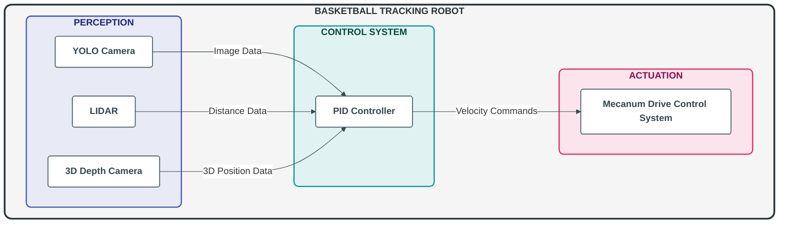

The PID control system consists of several interconnected components that work together:

1. **Target Tracking System**: Filters sensor data and predicts basketball movement
2. **Movement Strategy System**: Determines optimal movement patterns based on the situation
3. **Advanced PID Controllers**: Uses adaptive gains and specialized handling for each movement dimension
4. **Velocity Control System**: Ensures smooth, safe movement with acceleration control
5. **Performance Optimization**: Adapts processing based on available CPU resources

What makes this system special is not just what it does, but how it does it - with carefully implemented optimizations for the Raspberry Pi 5's limited resources, safety mechanisms to prevent erratic movement, and sophisticated algorithms that create natural-looking motion.

In the following sections, we'll explore each component in detail, explaining both the theoretical concepts and their practical implementation.

<a name="fundamentals"></a>
## 2. Understanding PID Control Fundamentals

### Learning Objectives
By the end of this section, you will be able to:
- Explain the purpose of each PID component (Proportional, Integral, Derivative)
- Calculate a basic PID output given an error value and gains
- Describe why PID control is particularly well-suited for robotics applications
- Identify when to increase or decrease specific gains based on observed behavior

<a name="what-is-pid"></a>
### 2.1 What is PID Control?

PID control (Proportional-Integral-Derivative) is a fundamental [control loop](#glossary) feedback mechanism widely used in industrial systems and robotics. At its core, it's a mathematical method for maintaining a desired state in a system by continuously calculating an "[error](#glossary) value" (the difference between a desired [setpoint](#glossary) and a measured process variable) and applying corrections based on proportional, integral, and derivative terms.

#### 2.1.1 The Basic Control Loop

The PID control loop follows this basic cycle:

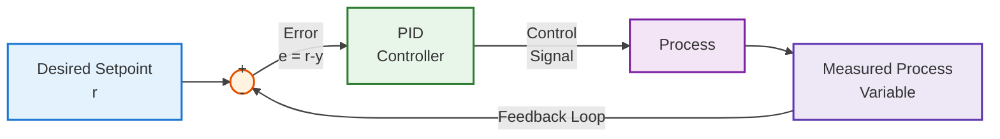

1. **Measure**: Read the current state of the system (e.g., current position)
2. **Compare**: Calculate the error between the desired state and the current state
3. **Calculate**: Process the error through the PID algorithm
4. **Apply**: Apply the resulting control output to the system (e.g., motor power)
5. **Repeat**: The loop continues continuously, adapting to changes

#### 2.1.2 The Three Components

PID control derives its name from the three terms that contribute to the control signal:

**Proportional Term (P)**
- Responds directly to the current error value
- Control output is proportional to the error
- Like a spring that pulls harder the further you stretch it
- Formula: P = Kp × e(t)
- Effect: Reduces [rise time](#glossary), increases [overshoot](#glossary)

<div style="background-color:#e6f3ff; padding:10px; border-left:5px solid #3498db; margin:10px 0;">
<strong>Try it:</strong> Increase the Kp value from 0.7 to 1.2 and observe how the robot responds more aggressively to errors. Watch for increased oscillation in RViz by running <code>ros2 topic echo /pid_controller/error</code>.
</div>

**Integral Term (I)**
- Responds to the accumulated error over time
- Helps eliminate persistent errors that the P term can't handle
- Like a gradually increasing force that builds up if the error persists
- Formula: I = Ki × ∫e(t)dt
- Effect: Eliminates [steady-state error](#glossary), can worsen overshoot and cause [integral windup](#glossary)

<div style="background-color:#e6f3ff; padding:10px; border-left:5px solid #3498db; margin:10px 0;">
<strong>Try it:</strong> Decrease Ki from 0.15 to 0.05 and watch how the robot takes longer to correct steady-state errors. Place the ball at a fixed position and observe how long it takes for the robot to reach the exact position.
</div>

**Derivative Term (D)**
- Responds to the rate of change of error
- Provides damping to reduce overshoot and oscillation
- Like a brake that applies more force when you're changing direction quickly
- Formula: D = Kd × de(t)/dt
- Effect: Reduces overshoot, provides [damping](#glossary) to prevent [oscillation](#glossary), improves stability

<div style="background-color:#e6f3ff; padding:10px; border-left:5px solid #3498db; margin:10px 0;">
<strong>Try it:</strong> Increase Kd from 0.35 to 0.5 and observe how the robot's approach becomes smoother with less overshooting. Move the ball quickly and watch how the robot's response changes.
</div>

#### 2.1.3 Real-World Analogy

To understand how these components work together, consider driving a car toward a target point:

- **Proportional (P)**: How far you are from the target. The further away you are, the faster you drive.
- **Integral (I)**: How long you've been off-target. If you've been off-course for a while (e.g., due to a hill or wind), you compensate more.
- **Derivative (D)**: How rapidly you're approaching the target. As you get closer, you start slowing down to avoid overshooting.

<a name="mathematics"></a>
### 2.2 The Mathematics of PID

The PID controller calculates a control output u(t) based on the error e(t) using the following formula:

u(t) = Kp × e(t) + Ki × ∫e(t)dt + Kd × de(t)/dt  [1]

Where:
- u(t) is the control output at time t (dimensionless or in m/s for velocity control)
- e(t) is the error at time t (setpoint - measured value, in meters for position or degrees for angular)
- Kp, Ki, and Kd are the coefficients for the proportional, integral, and derivative terms (with units: Kp [1/s], Ki [1/s²], Kd [s])

In discrete-time implementation (as used in our code), this becomes:

```python
# From src/ball_chase/ball_chase/pid/pid_computation.py - ImprovedPID.compute() method
# Units shown in comments
error = setpoint - measured_value        # meters or degrees
dt = current_time - previous_time        # seconds
P = Kp * error                           # Kp [1/s] * error [m] = [m/s]
I = I + Ki * error * dt                  # Ki [1/s²] * error [m] * dt [s] = [m/s]
D = Kd * (error - previous_error) / dt   # Kd [s] * (error [m] - prev_error [m]) / dt [s] = [m/s]
output = P + I + D                       # [m/s] - final output is a velocity command
```

#### 2.2.1 PID Effects Visualization

Understanding how each PID component (Proportional, Integral, Derivative) affects system response is crucial for effective tuning. Let's visualize these effects with simple diagrams.

### 1. The Reference Input

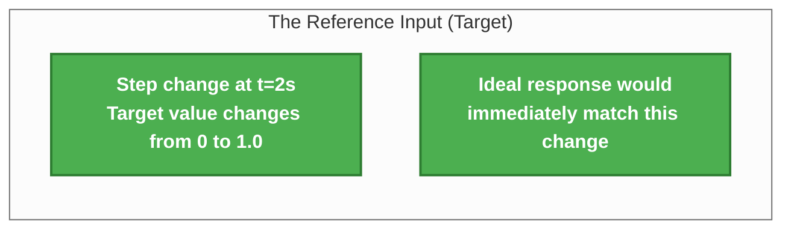

The reference input is a step change at t=2s, where the target value instantly changes from 0 to 1.0. This helps us visualize how different PID configurations respond to sudden changes.

### 2. High Proportional Gain (P) Effect

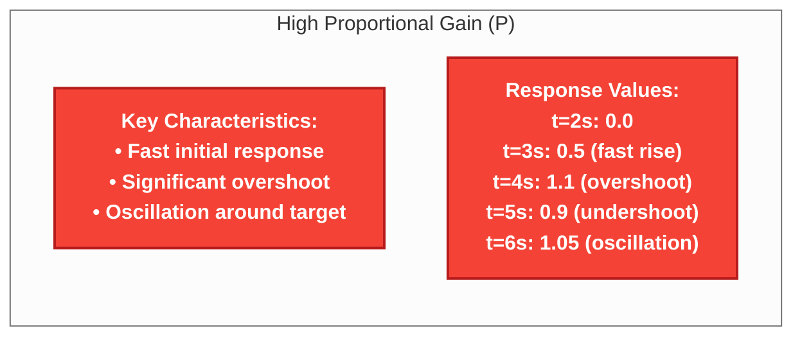

With high proportional gain, the system responds quickly but tends to overshoot and oscillate. Think of it like a car with an aggressive accelerator - it responds quickly but can easily overshoot the target.

### 3. Balanced PID Configuration

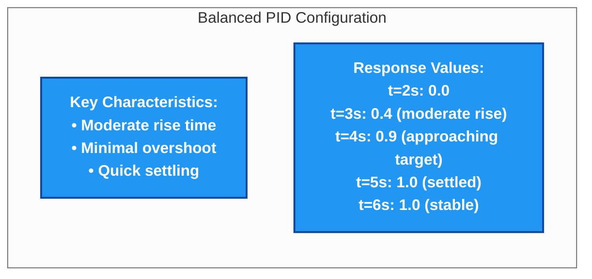

A balanced PID configuration offers the best compromise between response speed and stability. It rises at a moderate rate, has minimal overshoot, and settles quickly at the target value.

### 4. High Integral Gain (I) Effect

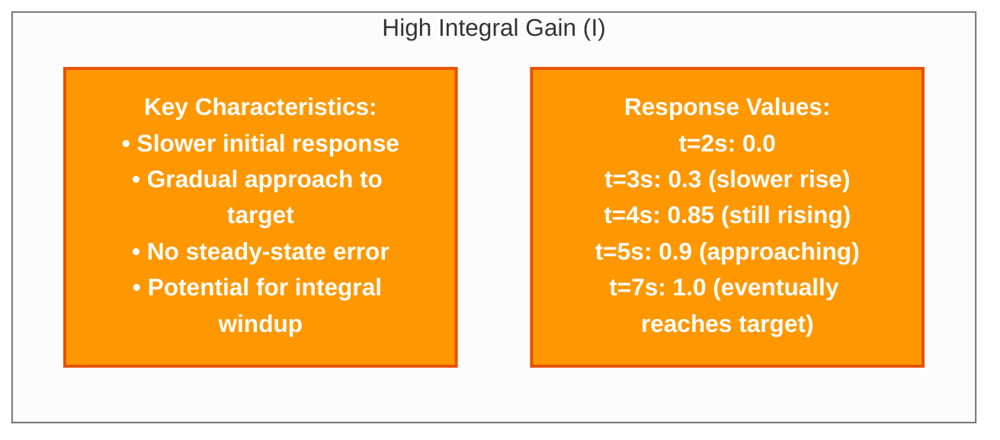

With high integral gain, the system is slower to respond initially but eventually eliminates any steady-state error. It's like a persistent correction that keeps building until the target is reached exactly.

### 5. High Derivative Gain (D) Effect

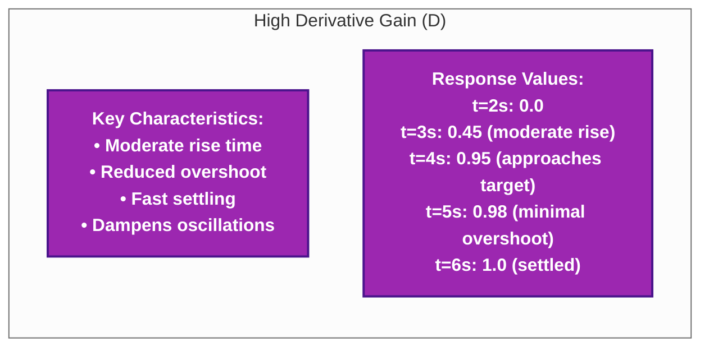

High derivative gain acts like a brake, reducing overshoot and dampening oscillations. It predicts where the system is heading based on the rate of change and applies corrective action before overshoot occurs.

### 6. Comparison of PID Component Effects

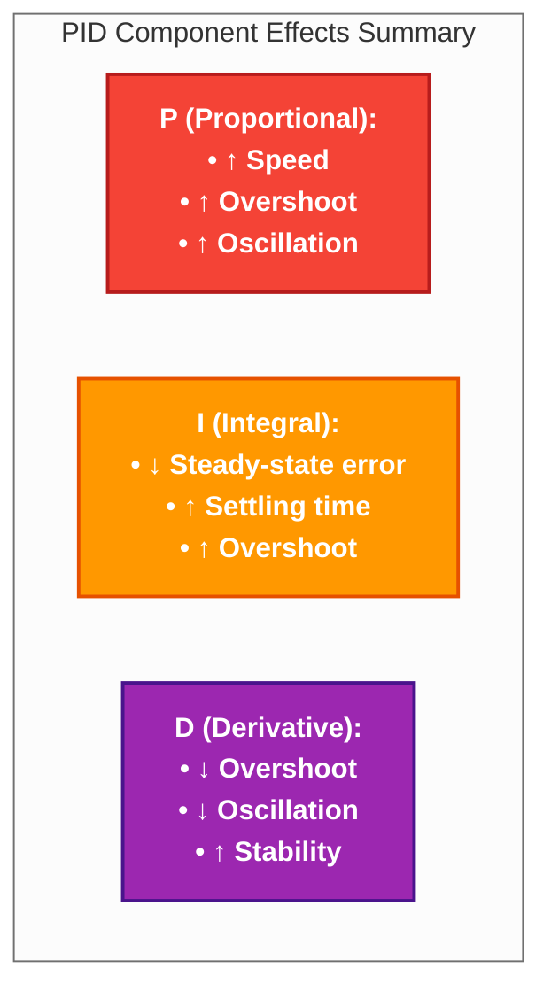

**Response Value Comparison Table:**

| Time | Reference | High P | Balanced PID | High I | High D |
|------|-----------|--------|--------------|--------|--------|
| 0s   | 0.0       | 0.0    | 0.0          | 0.0    | 0.0    |
| 2s   | 1.0       | 0.0    | 0.0          | 0.0    | 0.0    |
| 3s   | 1.0       | 0.5    | 0.4          | 0.3    | 0.45   |
| 4s   | 1.0       | 1.1    | 0.9          | 0.85   | 0.95   |
| 5s   | 1.0       | 0.9    | 1.0          | 0.9    | 0.98   |
| 6s   | 1.0       | 1.05   | 1.0          | 0.95   | 1.0    |
| 7s   | 1.0       | 0.95   | 1.0          | 1.0    | 1.0    |
| 8s   | 1.0       | 1.0    | 1.0          | 1.0    | 1.0    |

**Practical Tuning Guidelines:**

For a basketball tracking robot, these PID effects translate to practical behaviors:

1. **Increasing P gain**: Makes the robot respond more quickly to ball movement, but may cause overshooting (robot moves past the ball)

2. **Increasing I gain**: Ensures the robot eventually aligns precisely with the ball, eliminating any persistent offset

3. **Increasing D gain**: Reduces overshoot and oscillation, making tracking smoother when the ball changes direction

4. **Balanced PID**: Provides the best overall tracking performance with quick response and minimal overshoot

The ideal configuration for most tracking applications combines moderate P gain for responsiveness, small I gain to eliminate steady-state error, and sufficient D gain to prevent overshoot and oscillation.

**Component Effects:**
- **P (Proportional)**: Provides quick initial response but may cause oscillation
- **I (Integral)**: Eliminates steady-state error but can cause overshoot
- **D (Derivative)**: Reduces overshoot and oscillation, providing damping

<a name="why-pid"></a>
### 2.3 Why PID for Robotics?

PID control remains one of the most widely used control mechanisms in robotics for several compelling reasons:

#### 2.3.1 Strengths of PID for Robotics

1. **Simplicity**: The basic PID algorithm is straightforward to understand and implement
2. **No Model Required**: PID doesn't need a mathematical model of the system being controlled
3. **Versatility**: Can be applied to a wide range of systems and control problems
4. **Robustness**: Can handle minor disturbances and system changes
5. **Predictable Behavior**: When properly tuned, behavior is well-understood
6. **Computational Efficiency**: Basic PID requires minimal computational resources

#### 2.3.2 Challenges in Robotics Applications

Despite its strengths, basic PID has limitations for complex robotics applications:

1. **Multi-Dimensional Control**: Robots often need coordinated control in multiple dimensions
2. **Non-Linear Systems**: Robot dynamics can be highly non-linear
3. **Sensor Noise**: Sensor data can be noisy, causing erratic control
4. **External Disturbances**: Robots operate in unpredictable environments
5. **Variable Conditions**: Control parameters that work well in one situation may not in another
6. **Computational Constraints**: Embedded systems have limited processing power

#### 2.3.3 Why Advanced PID is Needed

Our basketball tracking robot requires significant enhancements to basic PID control:

1. **Multi-Dimensional Coordination**: We need coordinated control of forward, lateral, and rotational movement
2. **Adaptive Parameters**: Different control parameters are needed for different situations
3. **Predictive Capabilities**: Basic PID is reactive, but we need to anticipate ball movement
4. **Smooth Transitions**: Transitions between different control states must be smooth
5. **Resource Optimization**: The Raspberry Pi 5 has limited computational resources
6. **Safety and Reliability**: The system must be safe and reliable under all conditions

These challenges led to the development of our advanced PID control system, which builds upon the foundation of basic PID with sophisticated enhancements that we'll explore in the following sections.

<a name="implementation"></a>
## 3. Advanced PID Implementation

### Learning Objectives
By the end of this section, you will be able to:
- Implement enhanced PID controllers beyond the basic formula
- Apply adaptive gain strategies to improve controller performance
- Handle zero-crossing and prevent integral windup issues
- Understand the structure of the `ImprovedPID` class in our implementation

> **Implementation Status**: The advanced PID controller described in this section is fully implemented in the `ImprovedPID` class found in `pid_computation.py`. Core features like adaptive gains, zero-crossing handling, and anti-windup are working in the current version.

<a name="beyond-basic"></a>
### 3.1 Beyond Basic PID

Our advanced PID implementation (`ImprovedPID` class) significantly extends the capabilities of a standard PID controller to address the complexities of basketball tracking. This section explains the key enhancements and why they're necessary.

#### 3.1.1 From Basic to Advanced: Key Differences

The following table compares basic PID controllers with our advanced implementation:

| Feature                   | Basic PID                      | Our Advanced Implementation              |
|---------------------------|--------------------------------|------------------------------------------|
| Gain Adjustment           | Fixed gains                    | Adaptive gains that adjust automatically |
| Zero-Crossing Handling    | None                           | Special handling to prevent oscillation  |
| Error Integration         | Simple accumulation            | Deadband, decay, anti-windup protection  |
| Derivative Calculation    | Simple difference              | Enhanced with trend analysis             |
| Overshoot Prevention      | Relies on proper tuning        | Multiple mechanisms to prevent overshoot |
| Controller Types          | General-purpose                | Specialized per dimension                |
| Resource Usage            | Constant, regardless of need   | Adaptive based on conditions             |
| Error History             | Previous error only            | Comprehensive trend analysis             |

#### 3.1.2 The ImprovedPID Class Structure

Our `ImprovedPID` class has a rich internal structure designed to handle complex control scenarios:

```mermaid
classDiagram
    class ImprovedPID {
        <<Controller>>
        +string name
        +double kp
        +double ki
        +double kd
        +compute(error, dt) double
        +reset()
        +updateAdaptiveGains(error_trend)
        +getLastComponentValues() Map
    }
    
    class BasicPIDCore {
        +double P-Term
        +double I-Term
        +double D-Term
        +calculateProportional(error)
        +calculateIntegral(error, dt)
        +calculateDerivative(error, dt)
    }
    
    class GainSystem {
        +double base_kp, base_ki, base_kd
        +double current_kp, current_ki, current_kd
        +adjustGainsBasedOnError(error_state)
        +adjustGainsForZeroCrossing()
        +getAdaptationFactor() double
    }
    
    class ErrorManagement {
        +CircularBuffer error_history
        +ErrorTracker tracker
        +detectZeroCrossing(error)
        +calculateErrorTrend() string
        +getRateOfChange() double
    }
    
    class AntiWindup {
        +double max_integral
        +double integral_decay
        +double deadband
        +detectWindup(predicted_output)
        +applyIntegralLimits()
        +resetForDirectionChange()
    }
    
    class OutputControl {
        +double output_min
        +double output_max
        +applyLimits(output)
        +smoothOutput(output)
        +validateOutput(output)
    }
    
    class PerformanceData {
        +double last_p
        +double last_i
        +double last_d
        +double last_output
        +recordComponentValues(p, i, d)
        +calculatePerformanceMetrics()
    }
    
    ImprovedPID --> BasicPIDCore : contains
    ImprovedPID --> GainSystem : contains
    ImprovedPID --> ErrorManagement : contains
    ImprovedPID --> AntiWindup : contains
    ImprovedPID --> OutputControl : contains
    ImprovedPID --> PerformanceData : contains
    
    %% Enhanced color scheme for better readability
    classDef mainController fill:#3949ab,stroke:#002984,stroke-width:3px,color:#ffffff
    classDef coreComponents fill:#42a5f5,stroke:#0077c2,stroke-width:2px,color:#000000
    classDef errorComponents fill:#7e57c2,stroke:#4d2c91,stroke-width:2px,color:#ffffff
    classDef safetyComponents fill:#ef5350,stroke:#b61827,stroke-width:2px,color:#ffffff
    classDef performanceComponents fill:#66bb6a,stroke:#338a3e,stroke-width:2px,color:#000000
    
    class ImprovedPID mainController
    class BasicPIDCore coreComponents
    class GainSystem coreComponents
    class ErrorManagement errorComponents
    class AntiWindup safetyComponents
    class OutputControl safetyComponents
    class PerformanceData performanceComponents
```

#### 3.1.3 Compute Method: The Core Algorithm

The heart of our advanced PID implementation is the `compute()` method, which processes the error value to produce a control output. Here's a simplified view of its operation:

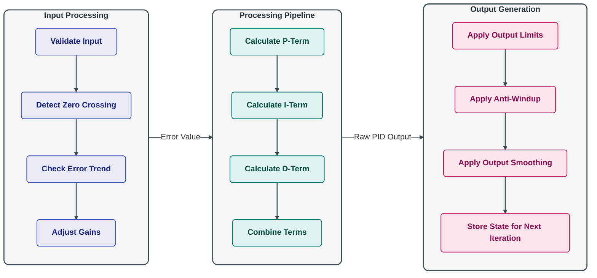

<a name="adaptive-gains"></a>
### 3.2 Adaptive Gains

One of the most important enhancements in our implementation is adaptive gain adjustment:

- Automatically modifies PID coefficients based on current conditions
- Adjusts controller behavior without manual intervention
- Optimizes response for different situations (tracking vs. positioning)

#### 3.2.1 Why Adaptive Gains Are Important

Fixed PID gains are inherently limited because:
- Gains optimized for large errors may cause oscillation with small errors
- Gains that work well when approaching a target may be too sluggish for initial movement
- Different control scenarios (tracking vs. holding position) need different response characteristics

#### 3.2.2 Our Adaptive Gain System

Our implementation adjusts gains based on several factors:

**Error Trend Analysis**:
- When error is decreasing (improving): 
  * Multiply proportional gain by 0.85 (15% reduction)
  * Multiply integral gain by 0.75 (25% reduction)
  * Multiply derivative gain by 1.2 (20% increase)
- When error is increasing (worsening): 
  * Multiply proportional gain by 1.15 (15% increase)
  * Multiply integral gain by 1.1 (10% increase)
  * Multiply derivative gain by 0.8 (20% reduction)

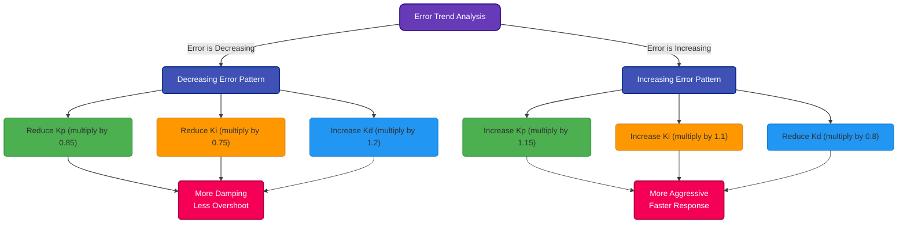

**Error Magnitude**:
- Different gain scaling based on how large the error is
- Larger errors use more aggressive proportional control
- Smaller errors use more precise integral and derivative control

**Zero-Crossing Detection**:
- Special gain adjustments when the error changes sign (crosses zero)
- Enhances derivative term to provide additional damping
- Reduces integral term to prevent overshoot

**Controller-Specific Adjustments**:
- Linear X (forward) controller: Balanced for smooth approach
- Linear Y (lateral) controller: Enhanced damping to prevent oscillation
- Angular (rotation) controller: Reduced integral gain to prevent overshooting

#### 3.2.3 Implementation Mechanics

The gain adjustment is implemented using a weighted average of the current and target gains:

```python
# Gradually adjust gains using weighted average
adjust_rate = self.gain_adjust_rate  # Typically 0.1-0.3
inv_adjust_rate = 1.0 - adjust_rate

# Example: Kp adjustment
self.kp = self.kp * inv_adjust_rate + (self.base_kp * kp_factor) * adjust_rate
```

This creates a smooth transition between gain values rather than abrupt changes, resulting in more stable control.

<a name="zero-crossing"></a>
### 3.3 Zero-Crossing Handling

A critical enhancement in our PID implementation is specialized handling of zero-crossings - points where the error changes sign (from positive to negative or vice versa).

#### 3.3.1 The Zero-Crossing Problem

Zero-crossings present a challenging scenario for traditional PID controllers because:
- They represent the moment when the system passes the target value
- The controller needs to switch from acceleration to deceleration (or vice versa)
- Without special handling, the system often overshoots and oscillates around the target

### Understanding Zero-Crossing in PID Control

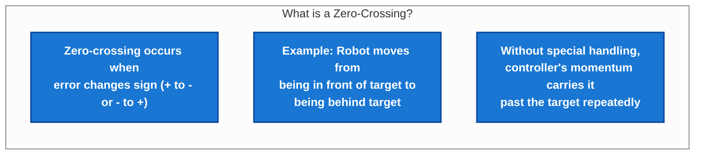

### The Oscillation Pattern

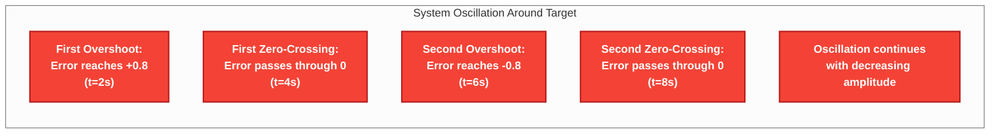

### Visualizing the System Response

```
Error
 +1.0 |
      |
 +0.8 |    *
      |
 +0.5 |         *           *
      |                         *
 +0.0 |--*----------*-----------*-----------*-----> Time
      |         *           *           *
 -0.5 |              *
      |
 -0.8 |         *
      |
 -1.0 |
       0   2   4   6   8  10  12  14  16
```

**Zero-Crossings Occur at:**
- t=4s (positive to negative)
- t=8s (negative to positive)
- t=12s (positive to negative)
- t=16s (negative to positive)

### What Happens at Each Zero-Crossing?

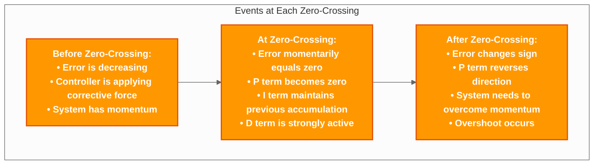

### The Problem in Numbers

| Time (s) | Error Value | Description | Problem |
|----------|-------------|-------------|---------|
| 0        | 0.0         | Starting at target | - |
| 2        | +0.8        | First overshoot | System moves away from target |
| 4        | 0.0         | First zero-crossing | Momentum carries system through target |
| 6        | -0.8        | Second overshoot | System overshoots in opposite direction |
| 8        | 0.0         | Second zero-crossing | Momentum again carries system through |
| 10       | +0.5        | Third overshoot | Oscillation continues |
| 12       | 0.0         | Third zero-crossing | Pattern continues |
| 14       | -0.3        | Fourth overshoot | Amplitude decreasing |
| 16       | 0.0         | Fourth zero-crossing | Still oscillating |

### Why Standard PID Struggles with Zero-Crossings

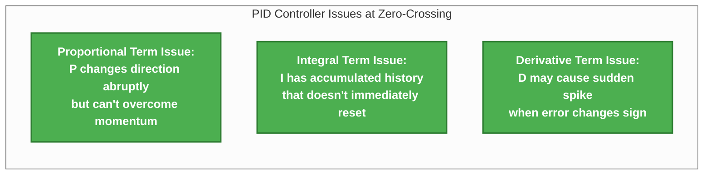

### Solution: Zero-Crossing Handling

To address the zero-crossing problem in our basketball tracking robot, we implemented special handling that:

1. **Detects sign changes** in the error value
2. **Reduces the integral term** significantly at zero-crossings (by 80-95%)
3. **Applies extra damping** through the derivative term during zero-crossings
4. **Tracks oscillation frequency** to adapt control parameters

This specialized handling results in much smoother tracking with minimal oscillation around the target position, improving the robot's ability to track the basketball accurately.

#### 3.3.2 Zero-Crossing Handling Implementation

##### Concept

Zero-crossing detection works by identifying points where the error changes sign:

- Allows special handling at critical transition points
- Prevents overshooting by proactively reducing controller output
- Improves settling time by adapting controller behavior to conditions
- Essential for creating smooth, natural motion around the target position

##### Reference Implementation

Our code detects zero-crossings and applies special handling:

```python
# From src/ball_chase/ball_chase/pid/pid_computation.py - ImprovedPID.compute() method
# Detect and handle zero crossings
current_sign = 1 if error > 0 else (-1 if error < 0 else 0)

# Check for sign change (zero crossing)
if self.prev_sign != 0 and current_sign != 0 and self.prev_sign != current_sign:
    # Record the zero crossing
    self.zero_crossing_time = current_time
    self.sign_change_count += 1
    
    # Apply controller-specific integral reset factors
    if self.name == "Angular":
        self.integral *= 0.05  # 95% reduction for angular
    elif self.name == "Linear Y":
        self.integral *= 0.1   # 90% reduction for lateral
    else:
        self.integral *= 0.2   # 80% reduction for forward
```

#### 3.3.3 Enhanced Control After Zero-Crossing

After detecting a zero-crossing, we apply several strategies to improve stability:

1. **Integral Reset**: Dramatically reduce the integral term to prevent overshoot
2. **Enhanced Derivative**: Increase the derivative term's influence for additional damping
3. **Sign Change Counting**: Track how many times the error has changed sign recently
4. **Oscillation Detection**: Identify when the system is oscillating around the target

These enhancements significantly improve the controller's ability to settle quickly and accurately on the target without overshooting or oscillating.

<a name="anti-windup"></a>
### 3.4 Anti-Windup Mechanisms

Integral windup is a common problem in PID controllers where the integral term becomes excessively large, causing control issues when the system can't achieve the desired setpoint.

#### 3.4.1 The Integral Windup Problem

Integral windup typically occurs in these scenarios:
- When the system cannot physically reach the setpoint
- During large setpoint changes
- When actuators saturate (reach their limits)

The problem manifests as:
- Excessive overshoot when the system finally can reach the setpoint
- Delayed response to error changes
- Oscillation and instability

```
                  INTEGRAL WINDUP PROBLEM
                  
 Control
 Output
   │
   │                Saturation Limit
   │ ─ ─ ─ ─ ─ ─ ─ ─ ─ ─ ─ ─ ─ ─ ─ ─ ─ ─ ─ ─ ─ ─ ─
   │                          ┌───────────────────
   │                         ┌┘
   │                        ┌┘      
   │                       ┌┘                Actual Output
   │                      ┌┘                    
   │                     ┌┘                   
   │                    ┌┘                     
   │                   ┌┘                      
   │                  ┌┘                      
   │                 ┌┘                      
   │          ┌─────┘        ┌─────────────────  
   │         ┌┘              │                   
   │        ┌┘               │ PID Output Without
   │       ┌┘                │ Anti-Windup
───┼──────┼─────────────────┼────────────────────► Time
   │      │                  │
   │      │                  │
   │      └─ Actuator       └─ Windup causes
   │         Saturation        massive overshoot
   │         begins            when system can
   │                           finally respond
```

#### 3.4.2 Our Anti-Windup Implementation

Our implementation includes several anti-windup mechanisms:

<details>
<summary>Troubleshooting Matrix: Common PID Controller Issues</summary>

| Symptom | Likely Cause | Quick Test | Fix |
|---------|--------------|------------|-----|
| **Oscillation around target** | Proportional gain too high | Temporarily reduce Kp by 50% | Decrease Kp, increase Kd |
| **Slow response** | Proportional gain too low | Temporarily double Kp | Increase Kp carefully |
| **System never reaches target** | Insufficient integral action | Add small Ki temporarily | Increase Ki gradually |
| **Large overshoot** | Insufficient derivative action | Temporarily increase Kd | Increase Kd, ensure it's not zero |
| **Response is unstable** | Multiple gains incorrect | Reset to baseline values | Start tuning process from beginning |
| **Erratic movement** | Noisy sensor data | Add artificial delay to sensor | Implement input filtering, reduce Kd |
| **Integral windup** | Anti-windup not working | Check system behavior at limits | Implement or fix integral limits |
| **Inconsistent response** | Adaptive gains misbehaving | Use fixed gains temporarily | Revisit adaptive gain algorithm |
| **Sudden jerks in movement** | Zero-crossing handling issue | Monitor behavior at zero-crossing | Improve zero-crossing detection |
| **CPU overload** | Inefficient implementation | Reduce control loop rate | Optimize calculations, reduce complexity |

</details>

**1. Output Saturation Detection**:
```python
# From src/ball_chase/ball_chase/pid/pid_computation.py - ImprovedPID.compute() method
# Check if output is likely to saturate
predicted_output = p_term + self.last_i_term + self.last_d_term
is_saturated = (predicted_output >= self.output_max) or (predicted_output <= self.output_min)

# Only update integral term if not saturated
if not is_saturated:
    # Normal integral calculation
    self.integral += error * dt
```

**2. Maximum Integral Limits**:
```python
# Set controller-specific maximum integral values
if name == "Angular":
    self.max_integral *= 0.7  # 30% smaller limit for angular
    
# Apply integral limits
self.integral = max(-self.max_integral, min(self.max_integral, self.integral))
```

**3. Integral Deadband**:
```python
# From src/ball_chase/ball_chase/pid/pid_computation.py - ImprovedPID.compute() method
# Only accumulate integral when error is significant
if abs(error) > self.integral_deadband:
    self.integral += error * dt
else:
    # Decay integral term when close to target
    self.integral *= self.integral_decay
```

**4. Special Handling for Sign Changes**:
```python
# Apply anti-windup when error changes sign
if error * self.prev_error < 0:
    # Error crossed zero - reduce integral more aggressively
    if abs(error) < abs(self.prev_error):
        # Error is decreasing - be more aggressive
        self.integral *= 0.2  # 80% reduction
```

**5. Approach-Specific Adjustments**:
```python
# Linear X controller special handling when approaching target
if self.name == "Linear X" and hasattr(self, 'pid_controller'):
    distance_error = abs(self.pid_controller.filtered_distance - self.pid_controller.desired_distance)
    approach_distance = self.pid_controller.approach_distance
    
    if distance_error < approach_distance:
        # Calculate scaling factor (lower when closer)
        proximity_factor = max(0.1, distance_error / approach_distance)
        
        # Apply stronger reduction to integral when close
        self.integral *= proximity_factor
```

Together, these mechanisms prevent integral windup in a variety of situations, ensuring responsive yet stable control even when the system faces physical or computational limitations.

<a name="target-tracking"></a>
## 4. Target Tracking System

> **Implementation Status**: The target tracking system is fully implemented in the `TargetTrackingModule` class in `pid_target_tracking.py`. Filtering, prediction, and data freshness analysis are working in the current version.

#### Actual Configuration Example

The basketball tracking robot uses these filtering and prediction parameters, tuned specifically for the mixed camera and LIDAR sensor input:

```python
# Actual filtering parameters from configuration
TRACKING_CONFIG = {
    # Buffer sizes
    'position_buffer_size': 5,    # Store last 5 position readings
    'velocity_buffer_size': 3,    # Store last 3 velocity calculations
    
    # Filtering parameters
    'position_filter_alpha': 0.65,  # Weight for current position reading
    'velocity_filter_alpha': 0.5,   # Weight for current velocity calculation
    'acceleration_filter_alpha': 0.3, # Weight for current acceleration
    
    # Prediction parameters
    'prediction_horizon': 0.25,      # Look ahead 250ms for prediction
    'min_prediction_distance': 0.05, # Minimum distance to enable prediction
    'prediction_confidence': 0.7,    # Scale factor for prediction
    
    # Freshness parameters
    'fresh_threshold_factor': 1.2,   # 1.2x expected update interval
    'stale_threshold_factor': 2.0,   # 2.0x expected update interval
}
```

<a name="filtering"></a>
### 4.1 Filtering Noisy Sensor Data

Sensor data in robotics is inherently noisy and inconsistent. Our target tracking system uses sophisticated filtering techniques to transform raw sensor data into stable, reliable position information.

#### 4.1.1 Sources of Sensor Noise

Several factors contribute to noise in basketball position data:

1. **Camera Resolution Limitations**: Pixel-level uncertainty in visual detection
2. **Lighting Variations**: Changes in brightness affect detection reliability
3. **Partial Occlusions**: The ball may be partially blocked from view
4. **Motion Blur**: Fast movement causes blurring in camera images
5. **LIDAR Resolution**: Limited angular resolution in distance measurements
6. **Sensor Fusion Errors**: Combining data from multiple sensors introduces uncertainty

#### 4.1.2 Weighted Averaging Filter

Our primary filtering technique is a weighted averaging filter that gives more importance to recent measurements while still considering older values:

```python
def _calculate_filtered_position(self):
    """Calculate filtered position from recent measurements."""
    pos_data = self.position_buffer.get_all()
    if len(pos_data) >= 3:
        # Get the three most recent positions
        recent = pos_data[-3:]
        
        # Weights for weighted average (more weight to recent measurements)
        weights = np.array([0.2, 0.3, 0.5])
        
        # Extract position components and calculate weighted average
        positions = np.array([(p[0], p[1], p[2]) for p in recent])
        self.filtered_position = tuple(np.sum(positions * weights[:, np.newaxis], axis=0))
```

This approach provides several benefits:
- **Smooths Out Random Noise**: Individual sensor errors have less impact
- **Preserves Trends**: The overall movement direction is maintained
- **Responsive to Changes**: Recent measurements have more influence
- **Simple Computation**: Efficient for real-time processing

#### 4.1.3 Filtering Visualization

The following diagram illustrates how filtering transforms noisy raw data into a smooth trajectory:

```
                       SENSOR FILTERING EFFECT
    
    Y
    │                                     
    │        Raw Sensor Data               Filtered Output
    │         (Noisy)                       (Smooth)
    │           *     * *                      
    │     *    *         *                   ─────
    │    *  * *    *       *               /
    │  * *        *   *     *           /
    │ *          *     *       *      /
    │*    *     *        *      \  /
    │     *   *    *          *  ─
    │      * *         *   *    *
    │     *  *              *
    │    *                  *
    │
    └───────────────────────────────────────────► X
                                                    
                                                    
          * = Individual sensor readings
         ─ = Filtered trajectory
```

#### 4.1.4 Advanced Filtering Techniques

While weighted averaging forms the core of our filtering approach, we employ several additional techniques:

1. **Low-Pass Filtering for Velocity**:
   ```python
   # Apply low-pass filter for velocity
   alpha = 0.7 + 0.15 * self.movement_consistency  # 0.7-0.85 range
   self.current_velocity = alpha * raw_velocity + (1 - alpha) * self.current_velocity
   ```

2. **Adaptive Filtering Based on Movement Consistency**:
   - Filter parameters automatically adjust based on how consistently the ball is moving
   - More aggressive filtering for erratic movement
   - Less filtering for consistent movement

3. **Direction Change Detection**:
   - Special filtering applied when the ball changes direction
   - Prevents "overshooting" in filtered trajectory

4. **Buffer-Based History**:
   - Maintains a fixed-size buffer of recent positions
   - Efficient circular buffer implementation for memory optimization
   - Avoids memory allocation/deallocation during operation

<a name="prediction"></a>
### 4.2 Motion Prediction

One of the most sophisticated aspects of our target tracking system is its ability to predict the future position of the basketball based on its current trajectory.

#### 4.2.1 Why Prediction is Critical

Prediction serves several important purposes in our basketball tracking robot:

1. **Compensating for Control Delays**: There's an inherent delay between sensor measurement and motor response
2. **Anticipating Ball Movement**: A reactive approach would always lag behind the ball
3. **Smooth Tracking**: Allows the robot to move more smoothly rather than constantly changing direction
4. **Better Strategy Selection**: Enables forward-looking strategy decisions

#### 4.2.2 Physics-Based Prediction

For consistent movement patterns, we use a physics-based prediction model:

```python
def _predict_future_position(self):
    # Time horizon for prediction
    t = self.prediction_horizon
    
    if self.is_moving and not self.direction_change_detected:
        # Full physics-based prediction with acceleration for consistent movement
        accel_weight = 0.5 * self.movement_consistency
        
        # Position prediction using physics formula: x = x₀ + v₀t + ½at²
        pred_pos = np.array(self.filtered_position) + \
                  self.current_velocity * t + \
                  0.5 * self.acceleration * t**2 * accel_weight
                  
        self.predicted_position = tuple(pred_pos)
```

This uses the standard physics equation for motion: 
- Position = Initial Position + Velocity × Time + ½ × Acceleration × Time²

The key enhancement is weighting the acceleration term by movement consistency, which adapts the prediction to how predictable the ball's movement is.

#### 4.2.3 Adaptive Prediction Based on Movement Patterns

Different types of ball movement require different prediction approaches:

```
                      PREDICTION STRATEGY SELECTION
┌──────────────────────────────────────────────────────────────────────┐
│                                                                      │
│                        Is Ball Moving?                               │
│                              │                                       │
│                ┌─────────────┴────────────────┐                      │
│                │                              │                      │
│                ▼                              ▼                      │
│              Yes                             No                      │
│                │                              │                      │
│    ┌───────────┴───────────┐                  │                      │
│    │                       │                  │                      │
│    ▼                       ▼                  ▼                      │
│Direction Change?     Is Movement        Use Current Position         │
│                      Consistent?        (No Prediction)              │
│    │                       │                                         │
│    │                       │                                         │
│    ▼                       ▼                                         │
│   Yes                     Yes                                        │
│    │                       │                                         │
│    │                       │                                         │
│    ▼                       ▼                                         │
│Limited Prediction    Full Physics-Based                              │
│with Damping         Prediction (x₀+v₀t+½at²)                         │
│                                                                      │
└──────────────────────────────────────────────────────────────────────┘
```

For inconsistent movement patterns, we use a simplified prediction with damping:

```python
# Simpler prediction for non-consistent movement
damping = 0.7  # Reduce prediction confidence
pred_pos = np.array(self.filtered_position) + self.current_velocity * t * damping
```

#### 4.2.4 Special Handling for Diagonal Movement

Our system includes specialized prediction for diagonal movement patterns:

```python
# Check for diagonal movement by examining both lateral and distance changes
diagonal_movement = False
if predicted_position and len(predicted_position) >= 3 and is_moving:
    # Calculate if both lateral and distance are changing significantly
    lateral_change = abs(predicted_position[1] - filtered_position[1])
    distance_change = abs(predicted_position[0] - filtered_position[0])
    
    # If both are changing by more than 5cm, we have diagonal movement
    diagonal_movement = (lateral_change > 0.05 and distance_change > 0.05)

# For diagonal movements, use stronger prediction
if diagonal_movement:
    # Use 70% prediction for diagonal movements - look further ahead
    prediction_weight = 0.7
```

This enhances the robot's ability to track the ball when it's moving diagonally, which is one of the more challenging movement patterns.

<a name="fusion-rate"></a>
### 4.3 Fusion Rate Detection

Our tracking system includes an intelligent capability to automatically detect the rate at which new sensor data is arriving, allowing it to adapt to varying sensor performance.

#### 4.3.1 Why Fusion Rate Detection Matters

The fusion rate (how frequently new position data arrives) affects several aspects of the control system:

1. **Control Loop Timing**: The control rate should match the data rate
2. **Data Freshness Assessment**: What constitutes "stale" data depends on expected update frequency
3. **Prediction Horizon**: How far ahead to predict depends on update frequency
4. **Resource Optimization**: Processing can be adjusted based on data availability

#### 4.3.2 Automatic Rate Detection

Our system automatically measures the time between incoming position updates:

```python
# Update timestamps for fusion rate detection
self.update_timestamps.append(current_time)

# Calculate fusion rate periodically
if current_time - self.last_rate_calculation > 3.0:  # Recalculate every 3 seconds
    if len(self.update_timestamps) >= 3:
        # Calculate average time between updates
        intervals = []
        for i in range(1, len(self.update_timestamps)):
            intervals.append(self.update_timestamps[i] - self.update_timestamps[i-1])
        
        if intervals:
            avg_interval = sum(intervals) / len(intervals)
            # Convert interval to rate (Hz)
            new_rate = 1.0 / max(0.001, avg_interval)
            
            # Apply rate limiting to avoid extreme values
            new_rate = max(0.1, min(30.0, new_rate))
            
            # Only update if significantly different
            if abs(new_rate - self.last_fusion_rate) > 0.25:
                self.last_fusion_rate = new_rate
                self.fusion_rate_updated = True
```

#### 4.3.3 Using Fusion Rate Information

The detected fusion rate is used throughout the system:

1. **Control Loop Adaptation**:
   ```python
   # Adjust control rate based on fusion rate
   if fusion_rate_updated:
       control_rate = max(min_control_rate, min(max_control_rate, fusion_rate * 1.5))
       self.timer.timer_period_ns = int(1e9 / control_rate)
   ```

2. **Data Freshness Thresholds**:
   ```python
   # Calculate expected interval between updates
   expected_interval = 1.0 / max(0.5, self.last_fusion_rate)
   
   # Define freshness thresholds based on expected update interval
   fresh_threshold = expected_interval * 1.2
   stale_threshold = expected_interval * 2.0
   critical_threshold = expected_interval * 3.0
   ```

3. **Prediction Horizon Adjustment**:
   ```python
   # Adjust prediction horizon based on fusion rate
   # Faster updates = shorter prediction horizon
   self.prediction_horizon = min(0.5, max(0.1, 0.8 / self.last_fusion_rate))
   ```

This adaptive approach ensures the system works well with different sensor configurations and processing constraints.

<a name="data-freshness"></a>
### 4.4 Data Freshness Analysis

The final key component of our target tracking system is data freshness analysis - the ability to assess whether sensor data is recent enough to be reliable for control decisions.

#### 4.4.1 The Graduated Freshness System

Rather than a simple binary fresh/stale approach, our system uses a graduated freshness model with multiple levels:

```python
def is_target_fresh(self, max_age=None):
    """
    Check if the target data is fresh enough to use with graduated freshness levels.
    
    Returns:
        tuple: (is_fresh, freshness_level, age)
            is_fresh: Boolean indicating if data is usable at all
            freshness_level: String indicating freshness level ('fresh', 'stale', 'critical')
            age: Current age of the data in seconds
    """
    # Calculate age of data
    current_time = time.time()
    age = current_time - self.last_target_time
    
    # Calculate expected interval between updates
    expected_interval = 1.0 / max(0.5, self.last_fusion_rate)
    
    # Define freshness thresholds based on expected update interval
    fresh_threshold = expected_interval * 1.2    # 120% of expected interval
    stale_threshold = expected_interval * 2.0    # 200% of expected interval
    critical_threshold = expected_interval * 3.0  # 300% of expected interval
    
    # Determine freshness level
    if age <= fresh_threshold:
        return True, 'fresh', age
    elif age <= stale_threshold:
        return True, 'stale', age
    elif age <= critical_threshold:
        return False, 'critical', age
    else:
        return False, 'invalid', age
```

#### 4.4.2 Freshness Levels and Their Meaning

Each freshness level has specific implications for control:

1. **Fresh** (Age ≤ 1.2 × Expected Interval):
   - Data is fully reliable
   - Full control velocity allowed
   - Normal prediction mechanisms used

2. **Stale** (Age ≤ 2.0 × Expected Interval):
   - Data is usable but less reliable
   - Control velocity reduced by 50%
   - Prediction confidence reduced
   ```python
   # If data is stale, apply conservative velocity scaling
   if (freshness_level == 'stale'):
       # Reduce all velocities to handle stale data
       velocity_scale = 0.5  # 50% of normal velocity
       self._target_velocities *= velocity_scale
   ```

3. **Critical** (Age ≤ 3.0 × Expected Interval):
   - Data is too old for normal control
   - May trigger special recovery behaviors
   - Robot may enter a safe stop condition

4. **Invalid** (Age > 3.0 × Expected Interval):
   - Data is completely unreliable
   - Robot should stop or enter safety mode
   - Requires reacquisition of the target

#### 4.4.3 Adaptive Freshness Thresholds

A key innovation in our approach is that freshness thresholds automatically adapt to the detected fusion rate:

```mermaid
%%{init: {"theme": "neutral", "themeVariables": {"lineColor": "#333333", "textColor": "#333333", "labelTextColor": "#000000", "labelColor": "#000000", "fontSize": "16px"}}}%%
graph TD
    %% Title
    title["Adaptive Freshness Thresholds"]
    
    %% System update rate comparison
    subgraph HighRate["5Hz System (Expected Interval = 0.2s)"]
        HFresh["FRESH: 0 - 0.24s<br/>(≤ 1.2 × expected interval)"]
        HStale["STALE: 0.24s - 0.4s<br/>(≤ 2.0 × expected interval)"]
        HCritical["CRITICAL: 0.4s - 0.6s<br/>(≤ 3.0 × expected interval)"]
        HInvalid["INVALID: > 0.6s<br/>(> 3.0 × expected interval)"]
        
        HFresh --> HStale --> HCritical --> HInvalid
    end
    
    subgraph LowRate["1Hz System (Expected Interval = 1.0s)"]
        LFresh["FRESH: 0 - 1.2s<br/>(≤ 1.2 × expected interval)"]
        LStale["STALE: 1.2s - 2.0s<br/>(≤ 2.0 × expected interval)"]
        LCritical["CRITICAL: 2.0s - 3.0s<br/>(≤ 3.0 × expected interval)"]
        LInvalid["INVALID: > 3.0s<br/>(> 3.0 × expected interval)"]
        
        LFresh --> LStale --> LCritical --> LInvalid
    end
    
    %% Enhanced color scheme for better readability
    classDef systemBox fill:#f8f9fa,stroke:#343a40,stroke-width:2px,rx:10,ry:10
    classDef freshLevel fill:#4caf50,stroke:#087f23,stroke-width:1.5px,rx:5,ry:5,color:#ffffff
    classDef staleLevel fill:#ff9800,stroke:#c66900,stroke-width:1.5px,rx:5,ry:5,color:#ffffff
    classDef criticalLevel fill:#f44336,stroke:#ba000d,stroke-width:1.5px,rx:5,ry:5,color:#ffffff
    classDef invalidLevel fill:#b71c1c,stroke:#7f0000,stroke-width:1.5px,rx:5,ry:5,color:#ffffff
    
    class HighRate,LowRate systemBox
    class HFresh,LFresh freshLevel
    class HStale,LStale staleLevel
    class HCritical,LCritical criticalLevel
    class HInvalid,LInvalid invalidLevel
    
    %% Make the connections stand out
    linkStyle 0,1,2,3,4,5 stroke:#424242,stroke-width:1.5px
```

This means the system works well regardless of sensor update rate, automatically adjusting what constitutes "fresh" or "stale" data.

#### 4.4.4 Using Freshness Information in Control

The freshness level affects control decisions throughout the system:

```python
# Check data freshness
is_fresh, freshness_level, data_age = self.target_tracking.is_target_fresh()

# Handle different freshness levels
if is_fresh and freshness_level == 'fresh':
    # Normal control with full velocity
    ... normal control code ...
    
elif is_fresh and freshness_level == 'stale':
    # Control with reduced velocity and more caution
    ... reduced velocity control code ...
    
elif freshness_level == 'critical':
    # Enter recovery mode or controlled stop
    self.enter_recovery_mode("stale_data")
    
else:  # Invalid data
    # Emergency stop or safety mode
    self.emergency_stop("invalid_data")
```

This graduated approach provides much smoother degradation of performance as data freshness decreases, rather than abrupt transitions between normal operation and failure modes.

<a name="movement-strategy"></a>
## 5. Movement Strategy System

> **Implementation Status**: The movement strategy system is implemented in the `MovementStrategyModule` class in `pid_computation.py`. The strategy selection table and strategy blending for transitions are fully functional in the current version.

#### Actual Strategy Table Example

Here's an excerpt from the actual strategy table used in the basketball tracking robot, showing some of the most frequently used strategies:

```python
# Excerpt from actual strategy table implementation
STRATEGY_TABLE = {
    # No errors - hold position
    ("none", "none", "none"): [
        "HOLD_POSITION", False, False, False, 
        0.0, 0.0, 0.0, 
        "All errors within deadbands"
    ],
    
    # Only distance error - pure forward/backward movement
    ("small", "none", "none"): [
        "PURE_DISTANCE", True, False, False, 
        0.65, 0.0, 0.0, 
        "Pure distance control: {distance_error:.2f}m"
    ],
    
    # Only angular error - pure rotation
    ("none", "none", "medium"): [
        "PURE_ROTATION", False, False, True, 
        0.0, 0.0, 0.85, 
        "Pure rotation: {angular_error:.1f}°"
    ],
    
    # Common case: moderate distance and angular error
    ("medium", "small", "medium"): [
        "APPROACH_AND_TURN", True, True, True, 
        0.7, 0.4, 0.8, 
        "Approach and turn: {distance_error:.2f}m, {angular_error:.1f}°"
    ],
    
    # Large errors in all dimensions - prioritize angle first
    ("large", "large", "large"): [
        "ANGULAR_FIRST", True, True, True, 
        0.5, 0.4, 0.95, 
        "Angular first: {angular_error:.1f}°"
    ]
}
```

<a name="strategy-approach"></a>
### 5.1 Strategy-Based Approach

The Movement Strategy System represents a fundamental shift from traditional PID control approaches, using a higher-level strategy selection mechanism that transforms control problems into intuitive movement patterns.

#### 5.1.1 From Direct Control to Strategic Movement

In traditional robotics control, error values directly drive motor outputs through PID controllers. Our system introduces an intermediary "strategy" layer:

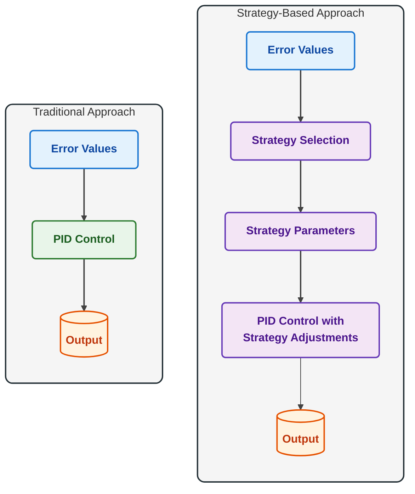

#### 5.1.2 Benefits of the Strategy Approach

The strategy-based approach offers several advantages:

1. **Human-Interpretable Movement Patterns**: Strategies like "approach_from_angle" or "angular_first" match how humans think about movement
2. **Multi-Dimensional Coordination**: Strategies coordinate all movement dimensions together
3. **Situation-Specific Optimization**: Different strategies are optimized for different scenarios
4. **Smooth Transitions**: Blending between strategies creates natural motion
5. **Higher-Level Reasoning**: Movement decisions are made at a more abstract level

#### 5.1.3 Movement Strategy Structure

A movement strategy in our system is defined by:

```python
class MovementStrategy:
    """Represents a robot movement strategy with blending capabilities."""
    
    def __init__(self, name, use_forward, use_lateral, use_angular, 
                forward_scale, lateral_scale, angular_scale, reason):
        """Initialize a movement strategy."""
        self.strategy_name = name
        self.use_forward = use_forward
        self.use_lateral = use_lateral
        self.use_angular = use_angular
        self.forward_scale = forward_scale
        self.lateral_scale = lateral_scale
        self.angular_scale = angular_scale
        self.reason = reason
```

Each field serves a specific purpose:
- **name**: Human-readable identifier for the strategy
- **use_forward/lateral/angular**: Boolean flags indicating which dimensions to use
- **forward/lateral/angular_scale**: Scaling factors (0.0-1.0) for each dimension
- **reason**: Human-readable explanation of why this strategy was selected

<a name="strategy-selection"></a>
### 5.2 Strategy Selection Logic

Our system uses a sophisticated mechanism to select the appropriate movement strategy based on the current error pattern.

#### 5.2.1 Error Categorization

The first step in strategy selection is categorizing error values into meaningful levels:

```python
def categorize_error(self, error, error_type="distance", prev_category=None):
    abs_error = abs(error)
    
    # Select appropriate thresholds based on error type
    if error_type == "angular":
        deadband = 5.0  # degrees
        very_small_threshold = deadband
        small_threshold = deadband * 2.0
        medium_threshold = deadband * 5.0
        large_threshold = deadband * 12.0
        very_large_threshold = deadband * 16.0
    elif error_type == "lateral":
        deadband = 0.08  # meters
        very_small_threshold = deadband
        small_threshold = deadband * 1.8
        medium_threshold = deadband * 4.0
        large_threshold = deadband * 8.0
        very_large_threshold = deadband * 10.0
    else:  # distance
        deadband = 0.15  # meters
        very_small_threshold = deadband
        small_threshold = deadband * 2.0
        medium_threshold = deadband * 4.0
        large_threshold = deadband * 8.0
        very_large_threshold = deadband * 10.0
    
    # Apply hysteresis and return category
    # ... (hysteresis logic)
    
    # Categorize based on magnitude
    if abs_error <= deadband:
        return "none"
    elif abs_error <= very_small_threshold:
        return "very_small"
    elif abs_error <= small_threshold:
        return "small"
    elif abs_error <= medium_threshold:
        return "medium"
    elif abs_error <= large_threshold:
        return "large"
    else:
        return "very_large"
```

These categories transform numeric error values into meaningful labels that will be used for strategy lookup.

#### 5.2.2 Table-Driven Strategy Selection

Once errors are categorized, the system uses a lookup table to select the appropriate strategy:

```python
def determine_strategy(self, distance_error, lateral_error, angular_error_degrees):
    # Categorize errors
    distance_category = self.categorize_error(distance_error, "distance")
    lateral_category = self.categorize_error(lateral_error, "lateral")
    angular_category = self.categorize_error(angular_error_degrees, "angular")
    
    # Create key for lookup
    key = (distance_category, lateral_category, angular_category)
    
    # Look up strategy in the table
    strategy_def = self.match_strategy(key, self.strategy_table)
    
    # Create strategy object
    name, use_forward, use_lateral, use_angular, forward_scale, lateral_scale, angular_scale, reason = strategy_def
    
    return MovementStrategy(name, use_forward, use_lateral, use_angular,
                           forward_scale, lateral_scale, angular_scale, reason)
```

#### 5.2.3 The Strategy Table

The heart of the system is the strategy table, which maps error patterns to specific strategies:

```python
self.strategy_table = {
    # All errors within deadbands - no movement
    ("none", "none", "none"): [
        "NO_MOVEMENT", False, False, False, 
        0.0, 0.0, 0.0, 
        "All errors within deadbands"
    ],
    
    # Very small errors - minimal corrections
    ("very_small", "very_small", "very_small"): [
        "MINIMAL_CORRECTION", True, True, True, 
        0.5, 0.4, 0.4,
        "Minimal corrections for very small errors"
    ],
    
    # Large distance with large lateral - fast diagonal approach
    ("large", "large", "*"): [
        "FAST_DIAGONAL_APPROACH", True, True, True,
        0.9, 0.9, 0.4,  # Strong forward and lateral, moderate angular
        "Fast diagonal approach: {distance_error:.2f}m, {lateral_error:.2f}m"
    ],
    
    # Pure lateral correction at target distance
    ("none", "medium", "none"): [
        "STRONG_LATERAL", False, True, False, 
        0.0, 1.0, 0.0, 
        "Strong lateral correction at target distance: {lateral_error:.2f}m"
    ],
    
    # Angular-first strategies by magnitude
    ("*", "*", "very_large"): [
        "ANGULAR_PRIMARY", True, True, True,
        0.4, 0.3, 0.9,  # Low forward/lateral, high angular
        "Angular correction with approach: {angular_error:.1f}°"
    ],
    
    # ... many more strategy definitions ...
}
```

A key innovation is the use of wildcards (`*`) in the lookup table, which allow for matching based on partial patterns. For example, `("*", "*", "very_large")` matches any error pattern where the angular error is very large, regardless of the distance and lateral errors.

#### 5.2.4 Wildcard Matching Algorithm

The wildcard matching algorithm searches for increasingly specific patterns:

```python
def match_strategy(self, key, strategies):
    """Match a key against the strategy table with wildcard support."""
    # First try exact match
    if key in strategies:
        return strategies[key]
    
    # Extract components
    d_state, l_state, a_state = key
    
    # Try wildcard matches in order of specificity
    patterns_to_try = [
        # Two specific, one wildcard
        (d_state, l_state, "*"),
        (d_state, "*", a_state),
        ("*", l_state, a_state),
        
        # One specific, two wildcards
        (d_state, "*", "*"),
        ("*", l_state, "*"),
        ("*", "*", a_state),
    ]
    
    for pattern in patterns_to_try:
        if pattern in strategies:
            return strategies[pattern]
    
    # Fallback to completely generic pattern
    return strategies[("*", "*", "*")]
```

This approach ensures that the most specific matching strategy is selected, with graceful fallback to more general strategies when needed.

<a name="strategy-blending"></a>
### 5.3 Strategy Blending for Smooth Transitions

To create fluid, natural movement, our system doesn't simply switch between strategies—it smoothly blends between them over time.

#### 5.3.1 The Need for Blending

Abrupt switches between strategies would create jerky, unnatural movement. Consider the transition from a lateral-focused strategy to an angular-focused strategy:

```
                  WITHOUT BLENDING:
                  
 Velocity
   │
   │           ┌─────────┐
   │           │         │
   │           │         │
   │           │         │           
   │           │         │         
   │           │         │            ┌─────────┐
   │           │         │            │         │
   │           │         │            │         │
   │           │         │            │         │
   │           │         │            │         │
   │  Lateral  │         │  Angular   │         │
   │ Movement  │         │ Movement   │         │
───┼───────────┘         └────────────┘─────────► Time
   │
   │         Abrupt change creates
   │           jerky motion
```

#### 5.3.2 The StrategyBlender Class

Our system implements smooth transitions using the `StrategyBlender` class:

```python
class StrategyBlender:
    """Handles smooth transitions between movement strategies."""
    
    def __init__(self, logger, blend_duration=0.1):
        """Initialize the strategy blender with faster transitions."""
        self.current_strategy = None
        self.target_strategy = None
        self.blend_start_time = 0.0
        self.blending_active = False
        self.blend_duration = blend_duration
        self.direction_change_boost = 2.5  # Speed up transitions when direction changes
        self.previous_direction = None
        
        # Create a reusable blended strategy object
        self._blended_strategy = None
        
        # Logger
        self.logger = logger
```

#### 5.3.3 Blending Algorithm

The core of the blending process involves calculating a weighted average between the current and target strategies:

```python
def get_current_strategy(self, current_time):
    """Get the current strategy, which might be a blend of two strategies."""
    if not self.blending_active:
        return self.current_strategy
        
    # Calculate blend factor
    elapsed_time = current_time - self.blend_start_time
    linear_blend = min(1.0, elapsed_time / self.blend_duration)
    blend_factor = self._smoothstep(linear_blend)
    
    # Blend is complete
    if blend_factor >= 0.999:
        self.current_strategy = self.target_strategy
        self.blending_active = False
        return self.current_strategy
    
    # Update the blended strategy object
    self._blended_strategy.forward_scale = self.current_strategy.forward_scale * (1 - blend_factor) + \
                self.target_strategy.forward_scale * blend_factor
                
    self._blended_strategy.lateral_scale = self.current_strategy.lateral_scale * (1 - blend_factor) + \
                self.target_strategy.lateral_scale * blend_factor
                
    self._blended_strategy.angular_scale = self.current_strategy.angular_scale * (1 - blend_factor) + \
                self.target_strategy.angular_scale * blend_factor
    
    # (Also blend boolean flags with special handling)
    
    return self._blended_strategy
```

#### 5.3.4 Smoothstep Function

To create natural acceleration and deceleration during transitions, the blender uses a smoothstep function:

```python
def _smoothstep(self, x):
    """Simplified smoothstep function for smoother transitions."""
    # Bound x to [0,1]
    x = max(0.0, min(1.0, x))
    # Use cubic smoothstep: 3x^2 - 2x^3
    return x * x * (3.0 - 2.0 * x)
```

This function transforms a linear blend factor into a smooth S-curve, creating natural acceleration and deceleration.

### What is a Smoothstep Function?

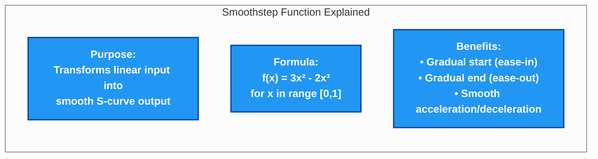

### Linear vs. Smoothstep Transition: Key Points

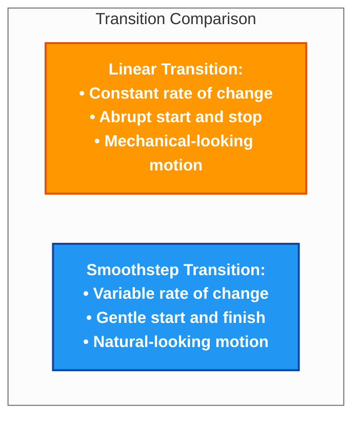

### Numerical Comparison of Values

Here's how the linear and smoothstep functions compare at different input values:

| Input (x) | Linear Output | Smoothstep Output | Difference |
|-----------|---------------|-------------------|------------|
| 0.0       | 0.00          | 0.00              | 0.00       |
| 0.1       | 0.10          | 0.03              | -0.07      |
| 0.2       | 0.20          | 0.10              | -0.10      |
| 0.3       | 0.30          | 0.21              | -0.09      |
| 0.4       | 0.40          | 0.35              | -0.05      |
| 0.5       | 0.50          | 0.50              | 0.00       |
| 0.6       | 0.60          | 0.65              | +0.05      |
| 0.7       | 0.70          | 0.79              | +0.09      |
| 0.8       | 0.80          | 0.90              | +0.10      |
| 0.9       | 0.90          | 0.97              | +0.07      |
| 1.0       | 1.00          | 1.00              | 0.00       |

### Visual Representation of Curves

```
Blend
Factor
1.0 |                                   *-*
    |                               *--'    Linear: ----
0.8 |                           *--'        Smoothstep: ****
    |                       *--'
0.6 |                    *-'
    |                 *-'
0.4 |              *-'
    |           *-'
0.2 |       *--'
    |   *--'
0.0 *--'
    +---+---+---+---+---+---+---+---+---+---+
      0.0 0.1 0.2 0.3 0.4 0.5 0.6 0.7 0.8 0.9 1.0
                       Time (normalized)
```

### Application in Strategy Blending

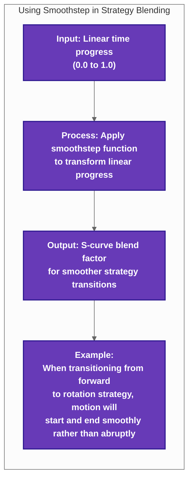

### Real-World Impact on Robot Movement

The smoothstep function has a significant impact on how the basketball tracking robot moves:

1. **Without Smoothstep**: Strategy transitions would look mechanical and jerky. When switching from moving forward to rotating, the robot would abruptly decelerate one motion and accelerate the other.

2. **With Smoothstep**: Transitions appear natural and fluid. The robot gently eases out of forward motion while simultaneously easing into rotation, creating smooth, natural-looking movement.

This small mathematical function significantly improves the perceived quality of motion, making the robot's tracking behavior more predictable and aesthetically pleasing.

Here's how the smoothstep function works in the blending process:

```python
def get_current_strategy(self, current_time):
    """Get the current strategy, which might be a blend of two strategies."""
    if not self.blending_active:
        return self.current_strategy
        
    # Calculate blend factor
    elapsed_time = current_time - self.blend_start_time
    linear_blend = min(1.0, elapsed_time / self.blend_duration)
    
    # Transform linear blend to smooth blend using smoothstep
    blend_factor = self._smoothstep(linear_blend)
    
    # [... blend strategy properties using blend_factor ...]
```

#### 5.3.5 Direction Change Adaptation

The blending system includes special handling for direction changes, which require faster transitions:

```python
# Detect direction change
current_direction = self._get_strategy_direction(target_strategy)
direction_change = False

if self.previous_direction is not None and current_direction is not None:
    # Check if direction components are opposite
    direction_change = (
        (self.previous_direction[0] * current_direction[0] < 0) or
        (self.previous_direction[1] * current_direction[1] < 0) or
        (self.previous_direction[2] * current_direction[2] < 0)
    )

# Apply boosting for direction changes
if direction_change:
    # Use shorter blend duration for direction changes
    self.effective_blend_duration = self.blend_duration / self.direction_change_boost
else:
    self.effective_blend_duration = self.blend_duration
```

This ensures that when the robot needs to quickly change direction, the transition is expedited while still maintaining smoothness.

Through these techniques, our system creates fluid, natural-looking movement transitions that avoid the jerky, robotic motion common in traditional control systems.

<a name="velocity-control"></a>
## 6. Velocity Control System

> **Implementation Status**: The velocity control system is implemented in the `VelocityControlModule` class in `pid_computation.py`. Safety constraints, acceleration control, and multi-dimensional coordination are all functional in the current version.

#### Actual Velocity Configuration Example

The basketball tracking robot uses these velocity control parameters, tuned for the mecanum drive system:

```python
# Actual velocity control configuration
VELOCITY_CONFIG = {
    # Maximum velocity limits
    'max_forward_velocity': 0.6,  # m/s
    'max_lateral_velocity': 0.5,  # m/s
    'max_angular_velocity': 0.8,  # rad/s
    
    # Acceleration limits
    'max_forward_accel': 1.0,     # m/s²
    'max_lateral_accel': 0.8,     # m/s²
    'max_angular_accel': 1.5,     # rad/s²
    
    # Safety parameters
    'approach_distance': 0.5,     # Meters - start slowing down
    'proximity_slowdown': 0.3,    # Minimum velocity factor when close
    
    # Mecanum drive parameters
    'wheel_base': 0.22,           # Meters from center to wheel
    'wheel_radius': 0.05,         # Meters
    'max_wheel_speed': 12.0       # rad/s
}
```

The Velocity Control System is the final stage in our control pipeline, responsible for transforming the abstract control values from our PID controllers into safe, smooth, and coordinated velocity commands for the robot's motors.

While the Movement Strategy and PID Control systems determine how the robot should move conceptually, the Velocity Control System ensures this movement is physically achievable, safe, and optimized for natural motion. This section explains how the system accomplishes these goals.

<a name="safety-constraints"></a>
### 6.1 Safety Constraints

Safety is a paramount concern in any robotics system. The Velocity Control Module implements several safety constraints to ensure the robot operates within safe parameters.

#### 6.1.1 Maximum Velocity Limits

The first line of defense is absolute maximum velocity constraints:

```python
def apply_velocity_limits(self, velocities):
    """Apply absolute maximum velocity limits."""
    # Extract components
    forward_vel, lateral_vel, angular_vel = velocities
    
    # Apply component-specific limits
    forward_vel = max(-self.max_forward_velocity, min(self.max_forward_velocity, forward_vel))
    lateral_vel = max(-self.max_lateral_velocity, min(self.max_lateral_velocity, lateral_vel))
    angular_vel = max(-self.max_angular_velocity, min(self.max_angular_velocity, angular_vel))
    
    return (forward_vel, lateral_vel, angular_vel)
```

These limits are configured based on the robot's physical capabilities and safety considerations:

```python
# Common maximum values
self.max_forward_velocity = 0.6  # m/s
self.max_lateral_velocity = 0.5  # m/s
self.max_angular_velocity = 0.8  # rad/s
```

#### 6.1.2 Proximity-Based Velocity Scaling

As the robot approaches its target, velocity is automatically scaled down to prevent collisions and enable precise positioning:

```python
def apply_proximity_scaling(self, velocities, distance):
    """Scale down velocities when close to target."""
    forward_vel, lateral_vel, angular_vel = velocities
    
    # Calculate proximity factor (1.0 when far, approaching 0.0 when very close)
    approach_distance = 0.5  # meters
    proximity_factor = min(1.0, max(0.1, distance / approach_distance))
    
    # Apply stronger scaling to forward velocity
    forward_vel *= proximity_factor
    
    # Apply milder scaling to lateral and angular velocities
    mild_factor = 0.5 + 0.5 * proximity_factor  # ranges from 0.5 to 1.0
    lateral_vel *= mild_factor
    angular_vel *= mild_factor
    
    return (forward_vel, lateral_vel, angular_vel)
```

This scaling is visualized in the following diagram:

```
                     PROXIMITY-BASED VELOCITY SCALING
          
 Velocity
 Scale    Basketball
 Factor   │
   │      │
   │      │
 1.0 ─────┼──────────────────────────
   │      │                .
   │      │              .
   │      │            .
   │      │          .    forward_vel
 0.5 ─────┼────────▲───────────────────
   │      │      .  \
   │      │    .     \ lateral_vel
   │      │  .        \ and angular_vel
   │      │.
 0.0 ─────┼───────────────────────────► Distance
   │      │ Approach
   │      │ Distance
```

#### 6.1.3 Data Freshness Velocity Scaling

The Velocity Control System also considers data freshness when applying safety constraints. When sensor data is stale, velocities are automatically reduced:

```python
def apply_freshness_scaling(self, velocities, freshness_level):
    """Scale velocities based on data freshness."""
    if freshness_level == 'fresh':
        # No scaling for fresh data
        return velocities
    elif freshness_level == 'stale':
        # Reduce velocities to 50% for stale data
        forward_vel, lateral_vel, angular_vel = velocities
        return (forward_vel * 0.5, lateral_vel * 0.5, angular_vel * 0.5)
    else:
        # For critical or invalid data, stop the robot
        return (0.0, 0.0, 0.0)
```

This provides a graceful degradation of performance as sensor reliability decreases.

<a name="acceleration-control"></a>
### 6.2 Acceleration Control

Smooth movement requires controlled acceleration and deceleration. Abrupt changes in velocity create jerky, unnatural motion that can stress the robot's mechanics and reduce precision.

#### 6.2.1 Acceleration Limiting

The core of our acceleration control system is a rate-limiting algorithm that prevents velocity from changing too quickly:

```python
def apply_acceleration_limits(self, target_velocities, dt):
    """Limit acceleration to prevent jerky movement."""
    # Get current velocities
    current_forward, current_lateral, current_angular = self.current_velocities
    
    # Extract target velocities
    target_forward, target_lateral, target_angular = target_velocities
    
    # Calculate maximum allowed changes based on acceleration limits and time step
    max_forward_change = self.max_forward_accel * dt
    max_lateral_change = self.max_lateral_accel * dt
    max_angular_change = self.max_angular_accel * dt
    
    # Limit changes to maximum allowed rates
    new_forward = self._rate_limit(current_forward, target_forward, max_forward_change)
    new_lateral = self._rate_limit(current_lateral, target_lateral, max_lateral_change)
    new_angular = self._rate_limit(current_angular, target_angular, max_angular_change)
    
    # Update current velocities for next iteration
    self.current_velocities = (new_forward, new_lateral, new_angular)
    
    return (new_forward, new_lateral, new_angular)
```

The `_rate_limit` helper function implements the actual rate limiting:

```python
def _rate_limit(self, current, target, max_change):
    """Limit the rate of change between current and target values."""
    if abs(target - current) <= max_change:
        return target
    elif target > current:
        return current + max_change
    else:
        return current - max_change
```

#### 6.2.2 Direction-Aware Acceleration Control

A more sophisticated aspect of our acceleration control is direction-aware acceleration limits, which apply different acceleration limits depending on whether the robot is speeding up, slowing down, or changing direction:

```python
def _rate_limit_with_direction(self, current, target, max_accel, max_decel, max_dir_change):
    """Rate limiting with different limits for acceleration, deceleration, and direction changes."""
    # Determine the situation
    speeding_up = (abs(target) > abs(current)) and (target * current > 0)
    slowing_down = (abs(target) < abs(current)) and (target * current > 0)
    changing_direction = (target * current < 0)
    
    # Select appropriate limit
    if speeding_up:
        max_change = max_accel
    elif slowing_down:
        max_change = max_decel
    else:  # changing_direction or starting from zero
        max_change = max_dir_change
    
    # Apply the selected limit
    if abs(target - current) <= max_change:
        return target
    elif target > current:
        return current + max_change
    else:
        return current - max_change
```

This approach recognizes that different situations require different acceleration constraints:
- **Speeding Up**: Moderate acceleration limits to prevent wheelspin
- **Slowing Down**: Stronger deceleration limits for smoother stops
- **Changing Direction**: Strongest limits to prevent momentum-related stress

```
                      DIRECTION-AWARE ACCELERATION
                      
 Velocity
   │                                              
   │                                              
   │            Speeding Up                       
   │          max_accel limit                 .   
   │                               ........ ┌─    
   │                     .........          │     
   │               ..... │                  │     
   │         ..... │     │                  │     
   │    .... │     │     │                  │    time
───┼────────┼─────┼─────┼──────────────────┼───►
   │        │     │     │                  │
   │        │     │     │                  │
   │        │     │     │                  │
   │        │     │     └..........        │
   │        │     │                  ......│
   │        │     │ Slowing Down           │
   │        │     │ max_decel limit        │
   │        │     │                        │
   │        │     │                        │
   │        │     │                        │
   │        │     └.... Changing           │
   │        │           Direction          │
   │        │           max_dir_change     │
   │        │           limit              │
   │        │                              │
```

#### 6.2.3 Adaptive Acceleration Parameters

The acceleration system also adapts to different situations by modifying its parameters based on the robot's state and environment:

```python
def update_acceleration_parameters(self, distance_to_target, error_trend):
    """Adapt acceleration parameters based on current situation."""
    # Base parameters
    base_forward_accel = 1.0  # m/s²
    base_lateral_accel = 0.8  # m/s²
    base_angular_accel = 2.0  # rad/s²
    
    # Calculate proximity factor (higher when closer to target)
    proximity_factor = max(0.5, min(1.5, 1.0 / max(0.2, distance_to_target)))
    
    # Determine if we're approaching target or moving away
    approaching = (error_trend < 0)  # Error is decreasing
    
    if approaching:
        # When approaching target, reduce acceleration limits
        self.max_forward_accel = base_forward_accel / proximity_factor
        self.max_lateral_accel = base_lateral_accel / proximity_factor
    else:
        # When moving away or recovering, allow higher acceleration
        self.max_forward_accel = base_forward_accel * 1.2
        self.max_lateral_accel = base_lateral_accel * 1.2
    
    # Angular acceleration is less affected by proximity
    self.max_angular_accel = base_angular_accel
```

This adaptive approach ensures the robot moves aggressively when needed (such as when starting to track a ball that's moving away) while maintaining smooth, precise movement when approaching the target.

<a name="movement-coordination"></a>
### 6.3 Multi-Dimensional Movement Coordination

The final component of the Velocity Control System is multi-dimensional coordination, which ensures that the robot's movement in different dimensions (forward, lateral, angular) works together harmoniously.

#### 6.3.1 Velocity Vector Normalization

When the PID controllers request velocities that exceed the robot's capabilities when combined, the system normalizes the velocity vector while preserving direction:

```python
# From src/ball_chase/ball_chase/pid/pid_target_tracking.py - VelocityControlModule class
def normalize_velocity_vector(self, velocities):
    """Normalize combined velocity vector while preserving direction."""
    forward_vel, lateral_vel, angular_vel = velocities
    
    # Calculate linear velocity magnitude
    linear_magnitude = math.sqrt(forward_vel**2 + lateral_vel**2)
    
    # Check if we exceed maximum linear velocity
    max_linear = self.max_combined_linear_velocity
    if linear_magnitude > max_linear and linear_magnitude > 0:
        # Scale down while preserving direction
        scale_factor = max_linear / linear_magnitude
        forward_vel *= scale_factor
        lateral_vel *= scale_factor
    
    # Angular velocity is handled separately (no interaction with linear)
    angular_vel = max(-self.max_angular_velocity, min(self.max_angular_velocity, angular_vel))
    
    return (forward_vel, lateral_vel, angular_vel)
```

This ensures the robot maintains the intended direction of movement while staying within its physical limits.

#### 6.3.2 Mecanum Wheel Coordination

For our robot with mecanum wheels, the velocity control system must translate abstract velocities into appropriate wheel commands. This is handled in the final stage:

```python
# From src/ball_chase/ball_chase/pid/pid_target_tracking.py - VelocityControlModule class
def calculate_wheel_velocities(self, velocities):
    """Convert robot velocities to individual wheel velocities for mecanum drive."""
    forward_vel, lateral_vel, angular_vel = velocities
    
    # Calculate wheel velocities using mecanum kinematics
    # Wheel positions: front_left, front_right, rear_left, rear_right
    
    # Calculate individual wheel velocities
    front_left = forward_vel + lateral_vel + angular_vel * self.wheel_base
    front_right = forward_vel - lateral_vel - angular_vel * self.wheel_base
    rear_left = forward_vel - lateral_vel + angular_vel * self.wheel_base
    rear_right = forward_vel + lateral_vel - angular_vel * self.wheel_base
    
    return (front_left, front_right, rear_left, rear_right)
```

This transforms the abstract robot velocities into specific commands for each wheel, accounting for the unique kinematics of mecanum wheels that allow omnidirectional movement.

```
                      MECANUM WHEEL KINEMATICS
                      
                   Forward Motion
                         ↑
                         │
                         │
        ┌───────────────────────────────┐
        │     FL ↗          ↖ FR        │
        │        \    │    /            │
        │         \   │   /             │
        │          \  │  /              │
 Lateral│←─────────┼──┼──┼─────────────→│ Lateral
 Motion │          /  │  \              │ Motion
        │         /   │   \             │
        │        /    │    \            │
        │     RL ↘          ↙ RR        │
        └───────────────────────────────┘
                         │
                         │
                         ↓
                   Forward Motion
                 
                 Angular Motion: Rotation
                 around center (all wheels
                 move tangentially)
```

#### 6.3.3 Movement Priority Handling

In some situations, certain movement dimensions need to take priority. Our system implements priority handling to resolve conflicts:

```python
# From src/ball_chase/ball_chase/pid/pid_target_tracking.py - VelocityControlModule class
def apply_movement_priorities(self, velocities, strategy):
    """Apply movement priorities based on current strategy."""
    forward_vel, lateral_vel, angular_vel = velocities
    
    # Check if this is a strategy with specific priorities
    if strategy.strategy_name == "ANGULAR_PRIMARY":
        # If angular movement is significant, reduce linear movement
        if abs(angular_vel) > 0.3 * self.max_angular_velocity:
            # Scale down linear velocities to prioritize turning
            priority_factor = 0.7
            forward_vel *= priority_factor
            lateral_vel *= priority_factor
            
    elif strategy.strategy_name == "PRECISE_APPROACH":
        # If close to target, prioritize distance control over lateral
        # This improves final positioning accuracy
        if abs(forward_vel) > 0.1:
            lateral_vel *= 0.6
    
    return (forward_vel, lateral_vel, angular_vel)
```

This ensures that when certain movement dimensions are critical for the current strategy, they receive priority in resource allocation.

#### 6.3.4 Complete Velocity Processing Pipeline

The full velocity processing pipeline integrates all these components in a carefully designed sequence:

```python
# From src/ball_chase/ball_chase/pid/pid_target_tracking.py - VelocityControlModule class
def process_velocities(self, raw_velocities, distance, freshness_level, strategy, dt):
    """Process raw velocities through the complete pipeline."""
    velocities = raw_velocities
    
    # 1. Apply movement priorities based on strategy
    velocities = self.apply_movement_priorities(velocities, strategy)
    
    # 2. Apply safety constraints
    velocities = self.apply_velocity_limits(velocities)
    velocities = self.apply_proximity_scaling(velocities, distance)
    velocities = self.apply_freshness_scaling(velocities, freshness_level)
    
    # 3. Normalize combined velocity vector
    velocities = self.normalize_velocity_vector(velocities)
    
    # 4. Apply acceleration limits
    velocities = self.apply_acceleration_limits(velocities, dt)
    
    # 5. Calculate wheel velocities for mecanum drive
    wheel_velocities = self.calculate_wheel_velocities(velocities)
    
    return velocities, wheel_velocities
```

This multi-stage approach ensures that velocities are processed in a logical order, with each stage building upon the previous one to produce final velocity commands that are safe, smooth, and optimized for the robot's current strategy.

Through this sophisticated velocity control system, our basketball tracking robot achieves fluid and natural movement while maintaining safety and precision.

<a name="implementation-guide"></a>
## 7. Implementation Guide

This section provides practical guidance for implementing and using the advanced PID control system in your own robotics projects.

<a name="code-structure"></a>
### 7.1 Code Structure

The PID control system follows a modular architecture designed for clarity and maintainability:

#### 7.1.1 Package Organization

The system is organized into these key Python modules:

```
ball_chase/
├── pid/
│   ├── __init__.py
│   ├── pid_computation.py     # Core PID implementation
│   ├── pid_helpers.py         # Utility classes and functions
│   ├── pid_target_filter.py   # Filtering and data preparation
│   └── pid_target_tracking.py # Target tracking and prediction
├── nodes/
│   ├── __init__.py
│   ├── pid_controller_node.py # ROS2 node implementation
│   └── state_aware_fusion_node.py  # Sensor fusion
└── utilities/
    ├── __init__.py
    ├── ground_position_filter.py
    ├── resource_monitor.py    # System monitoring
    ├── sensor_sync_buffer.py  # Sensor synchronization
    └── time_utils.py          # Time-related utilities
```

This organization separates core functionality from ROS2-specific elements, making the system more portable and testable.

#### 7.1.2 Class Hierarchy

The system uses a layered class hierarchy:

```
                               PIDControllerNode
                                      │
          ┌───────────────────────────┼───────────────────────────┐
          │                           │                           │
TargetTrackingModule        MovementStrategyModule      VelocityControlModule
          │                           │                           │
     ImprovedPID                 StrategyBlender          ResourceMonitor
          │                           │                           │
   CircularBuffer                MovementStrategy     ComputationalLoadMonitor
```

This hierarchy:
- Separates responsibilities clearly
- Allows for targeted unit testing
- Facilitates reuse in different contexts
- Simplifies maintenance and extension

#### 7.1.3 Dependency Management

The control system carefully manages dependencies for flexibility:

```python
class PIDControllerNode(Node):
    """Main ROS2 node for PID-based basketball tracking."""
    
    def __init__(self):
        """Initialize the controller node with injected dependencies."""
        super().__init__('pid_controller')
        
        # Create component instances with dependency injection
        self.resource_monitor = ResourceMonitor(self)
        
        # Create tracking module with resource monitor dependency
        self.target_tracking = TargetTrackingModule(
            self.get_logger(),
            self.resource_monitor
        )
        
        # Create strategy module with dependencies
        self.strategy_module = MovementStrategyModule(
            self.get_logger()
        )
        
        # Create velocity control with dependencies
        self.velocity_control = VelocityControlModule(
            self.get_logger(),
            self.resource_monitor
        )
        
        # Initialize all subsystems
        self._initialize_subsystems()
```

This approach:
- Makes testing easier through dependency injection
- Allows components to be used in different contexts
- Establishes clear ownership of resources
- Simplifies unit testing through mock objects

<a name="key-components"></a>
### 7.2 Key Components

To implement this system in your own project, focus on these core components:

#### 7.2.1 Target Tracking Module

The `TargetTrackingModule` processes sensor data and maintains target state:

```python
# Key interfaces for implementing your own target tracking
class TargetTrackingModule:
    def update_target_position(self, position, timestamp):
        """Update the target's position with new sensor data."""
        # Implementation details in section 5
        
    def get_filtered_position(self):
        """Get the current filtered position estimate."""
        return self.filtered_position
        
    def get_predicted_position(self, prediction_time=None):
        """Get the predicted future position of the target."""
        if prediction_time is None:
            prediction_time = self.prediction_horizon
        # Calculate prediction based on current state
        return self._predict_position(prediction_time)
        
    def is_target_fresh(self):
        """Check if target data is fresh enough to use."""
        # Return freshness information as described in section 5.4
        return is_fresh, freshness_level, age
```

This module is the foundation for all control decisions, providing filtered and predicted target data to the rest of the system.

#### 7.2.2 Movement Strategy Module

The `MovementStrategyModule` determines how the robot should move:

```python
# Key interfaces for implementing your own movement strategy system
class MovementStrategyModule:
    def determine_strategy(self, distance_error, lateral_error, angular_error):
        """Determine the optimal movement strategy based on errors."""
        # Core strategy selection as described in section 6.2
        return self._create_strategy(strategy_name, ...)
        
    def update_strategy(self, current_time):
        """Update the current strategy with blending if needed."""
        # Strategy blending as described in section 6.3
        return self.strategy_blender.get_current_strategy(current_time)
        
    def register_custom_strategy(self, pattern, strategy_def):
        """Register a custom strategy for specific error patterns."""
        # Add to strategy table
        self.strategy_table[pattern] = strategy_def
```

This module transforms error measurements into movement decisions, coordinating all dimensions of motion.

#### 7.2.3 PID Controller

The `ImprovedPID` class implements the core control algorithm:

```python
# Core PID implementation interfaces
class ImprovedPID:
    def compute(self, error, current_time):
        """Compute a control output based on the error value."""
        # Implementation details in section 4
        return output
        
    def reset(self):
        """Reset the controller state."""
        self.integral = 0.0
        self.prev_error = 0.0
        self.prev_output = 0.0
        
    def set_tunings(self, kp, ki, kd):
        """Set the controller tuning parameters."""
        self.base_kp = kp
        self.base_ki = ki
        self.base_kd = kd
```

The controller is instantiated separately for each dimension of control.

#### 7.2.4 Velocity Control Module

The `VelocityControlModule` ensures safe, smooth motion:

```python
# Velocity control interfaces
class VelocityControlModule:
    def process_velocities(self, raw_velocities, distance, freshness_level, strategy, dt):
        """Process raw velocities through the safety and smoothness pipeline."""
        # Implementation details in section 7
        return safe_velocities, wheel_velocities
        
    def set_velocity_limits(self, forward_limit, lateral_limit, angular_limit):
        """Set the maximum velocity limits."""
        self.max_forward_velocity = forward_limit
        self.max_lateral_velocity = lateral_limit
        self.max_angular_velocity = angular_limit
```

This module is critical for translating theoretical control values into safe motor commands.

<a name="configuration"></a>
### 7.3 Configuration Parameters

The control system's behavior can be customized through these key configuration parameters:

#### 7.3.1 Core PID Parameters

The fundamental parameters that influence control behavior:

```yaml
pid_controller:
  # Basic PID tuning
  linear_x:
    kp: 0.7
    ki: 0.2
    kd: 0.35
  linear_y:
    kp: 0.8
    ki: 0.1
    kd: 0.4
  angular:
    kp: 0.65
    ki: 0.05
    kd: 0.3
    
  # Anti-windup settings
  windup_limits:
    linear_x_max_integral: 1.0
    linear_y_max_integral: 0.8
    angular_max_integral: 0.6
    
  # Zero-crossing handling
  zero_crossing:
    reset_factor_linear: 0.2
    reset_factor_angular: 0.05
```

#### 7.3.2 Movement Strategy Parameters

Parameters that control strategy selection and blending:

```yaml
movement_strategy:
  # Error categorization thresholds with justifications
  error_thresholds:
    distance:
      deadband: 0.15  # meters - chosen based on robot's minimum stopping distance
      very_small: 0.3  # meters - ~1 foot, precision positioning range
      small: 0.6      # meters - ~2 feet, close approach range
      medium: 1.2     # meters - ~4 feet, standard tracking distance
      large: 2.4      # meters - ~8 feet, far tracking distance
    lateral:
      # Smaller lateral deadband gives better sideways precision
      deadband: 0.08  # meters - matches camera's lateral resolution at 3m
    angular:
      # Larger angular deadband prevents unnecessary rotation adjustments
      deadband: 5.0   # degrees - human-imperceptible heading difference
      
  # Strategy blending parameters
  blending:
    blend_duration: 0.1  # seconds
    direction_change_boost: 2.5
```

#### 7.3.3 Velocity Control Parameters

Parameters for safety constraints and motor control:

```yaml
velocity_control:
  # Maximum velocity limits 
  max_velocities:
    forward: 0.6   # meters/second - walking pace for smooth tracking
    lateral: 0.5   # meters/second - slightly slower for stability during side motion
    angular: 0.8   # radians/second (~45°/s) - allows full 180° turn in ~4 seconds
    
  # Acceleration limits
  max_acceleration:
    forward: 1.0   # meters/second² - reaches max speed in 0.6s
    lateral: 0.8   # meters/second² - gentler acceleration for side movement
    angular: 2.0   # radians/second² - allows quick direction changes
    
  # Special limits for different scenarios
  deceleration_factor: 1.5    # Higher than acceleration
  direction_change_factor: 2.0  # Even higher for direction changes
  
  # Robot physical parameters
  wheel_base: 0.2  # meters - distance from center to wheel
```

#### 7.3.4 Performance Parameters

Parameters that control resource usage and optimization:

```yaml
performance:
  # Control loop settings
  base_control_rate: 20.0  # Hz (cycles/second) - balances responsiveness and CPU usage
  min_control_rate: 5.0    # Hz - minimum rate for acceptable control
  max_control_rate: 50.0   # Hz - upper limit based on sensor update rates
  
  # Resource monitoring
  monitoring:
    update_interval: 5.0   # seconds - time between resource checks
    high_cpu_threshold: 70.0  # percent - warning level for CPU usage
    critical_cpu_threshold: 90.0  # percent - point at which to reduce processing
    
  # Thermal management
  thermal:
    high_temp_threshold: 70.0  # Celsius - warning temperature for throttling
    critical_temp_threshold: 80.0  # Celsius - emergency temperature reduction
```

These configuration parameters allow you to adapt the control system to different robot platforms, sensor capabilities, and application requirements.

<a name="testing-methodology"></a>
## 8. Testing and Tuning Methodology

The process of tuning a PID controller for optimal performance is both an art and a science. This section outlines a systematic methodology for testing and tuning the basketball tracking robot's PID control system.

<a name="tuning-process"></a>
### 8.1 Systematic Tuning Process

Effective PID tuning follows a structured approach rather than random parameter adjustments. Here's a methodical process for tuning the system:

#### 8.1.1 Preparation Phase

Before adjusting any parameters, establish a solid foundation:

1. **Define Clear Metrics**:
   ```
   PERFORMANCE METRICS
   ------------------
   1. Settling Time: Time to reach and maintain position within 10cm of target
   2. Overshoot: Maximum distance overshoot when approaching target
   3. Steady-State Error: Average position error when "locked on" to stationary target
   4. Tracking Error: Average position error when following moving target
   5. Response Time: Time from detection to initial movement
   6. Energy Efficiency: Motor power consumption during operation
   ```

2. **Setup Logging and Visualization**:
   ```bash
   # Record essential data
   ros2 bag record -o tuning_session /pid_controller/output /pid_controller/error \
       /target_position /robot_position /pid_controller/p_term \
       /pid_controller/i_term /pid_controller/d_term
   
   # Configure RViz for real-time visualization
   ros2 run rviz2 rviz2 -d /path/to/pid_tuning.rviz
   ```

3. **Create Standard Test Scenarios**:
   * **Stationary Target Test**: Ball placed at fixed position
   * **Step Response Test**: Ball moved suddenly to new position
   * **Tracking Test**: Ball moved in consistent pattern (circle, figure-8)
   * **Disturbance Test**: External force applied to robot during targeting
   * **Multi-Sensor Test**: Alternating sensor data availability

#### 8.1.2 Initial Tuning Phase

Start with basic PID tuning before moving to advanced parameters:

1. **Zero-Out Approach**:
   * Start with all gains at zero (P=0, I=0, D=0)
   * Gradually increase P until system responds to error but oscillates
   * Reduce P by 20-30% to create stable but underdamped response
   * Add small D gain to dampen oscillations
   * Finally add small I gain to eliminate steady-state error

2. **Baseline Configuration**:
   ```python
   # Example baseline configuration after initial tuning
   pid_config = {
       'linear_x': {
           'kp': 1.2,   # Start with P-only control
           'ki': 0.0,   # No integral component yet
           'kd': 0.0,   # No derivative component yet
           'windup_limit': 1.0,
       },
       'linear_y': {
           'kp': 1.0,
           'ki': 0.0,
           'kd': 0.0,
           'windup_limit': 1.0,
       },
       'angular_z': {
           'kp': 2.0,
           'ki': 0.0,
           'kd': 0.0,
           'windup_limit': 1.0,
       }
   }
   ```

3. **Ziegler-Nichols Method**:
   * Find ultimate gain (Ku) where system oscillates with constant amplitude
   * Measure oscillation period (Tu)
   * Apply formulas: P = 0.6*Ku, I = 1.2*Ku/Tu, D = 0.075*Ku*Tu

#### 8.1.3 Advanced Tuning Phase

After establishing basic stability, refine performance with advanced tuning:

1. **Individual Dimension Tuning**:
   * Tune each dimension (X, Y, rotation) separately
   * Lock unused dimensions during tuning
   * Test with increasingly challenging scenarios

2. **Cross-Dimensional Tuning**:
   * Examine interaction effects between dimensions
   * Tune movement priorities for different scenarios
   * Adjust velocity profiles for coordinated movement

3. **Strategy Parameter Tuning**:
   * Optimize each movement strategy individually
   * Tune strategy selection thresholds
   * Refine blending parameters between strategies

#### 8.1.4 Refinement Phase

Continuously refine the system using an iterative approach:

1. **A/B Testing**:
   * Make single parameter changes
   * Run identical test scenarios
   * Compare metrics to quantify improvements
   * Reject changes that don't show measurable improvement

2. **Parameter Space Exploration**:
   * Systematically explore ranges of parameter values
   * Create performance maps relating parameters to metrics
   * Identify optimal operating regions

3. **Sensitivity Analysis**:
   * Identify which parameters most strongly affect performance
   * Focus tuning efforts on high-impact parameters
   * Ensure stability across parameter variation

<a name="data-analysis"></a>
### 8.2 Data Analysis Techniques

Effective tuning requires proper analysis of system performance data:

#### 8.2.1 Time-Domain Analysis

Analyze the system's response over time to extract key insights:

```python
def analyze_step_response(data_file):
    """Analyze step response test data for key metrics."""
    # Load data from ROS2 bag
    data = load_ros2_bag(data_file)
    
    # Extract timestamps and error values
    timestamps = data['timestamps']
    errors = data['pid_controller/error']
    
    # Find when step input was applied
    step_index = detect_step_input(errors)
    step_time = timestamps[step_index]
    
    # Calculate key metrics
    rise_time = calculate_rise_time(timestamps, errors, step_index)
    settling_time = calculate_settling_time(timestamps, errors, step_index)
    overshoot = calculate_overshoot(errors, step_index)
    steady_state_error = calculate_steady_state_error(errors)
    
    # Generate analysis report
    print(f"Rise time: {rise_time:.2f} seconds")
    print(f"Settling time: {settling_time:.2f} seconds")
    print(f"Overshoot: {overshoot:.2f}%")
    print(f"Steady-state error: {steady_state_error:.4f} meters")
    
    # Plot response curve with annotations
    plot_response_curve(timestamps, errors, step_time, rise_time, settling_time)
```

#### 8.2.2 Frequency Domain Analysis

For advanced tuning, frequency domain analysis reveals fundamental system characteristics:

```python
def perform_frequency_analysis(data_file):
    """Analyze system in frequency domain to identify resonances and bandwidth."""
    # Load data from ROS2 bag
    data = load_ros2_bag(data_file)
    
    # Extract PID controller output and input signals
    input_signal = data['target_position']
    output_signal = data['robot_position']
    
    # Compute frequency response using Fast Fourier Transform
    input_fft = np.fft.fft(input_signal)
    output_fft = np.fft.fft(output_signal)
    
    # Calculate system transfer function
    transfer_function = output_fft / input_fft
    
    # Calculate phase and magnitude
    magnitude = np.abs(transfer_function)
    phase = np.angle(transfer_function, deg=True)
    
    # Plot Bode plot
    plot_bode_diagram(magnitude, phase)
    
    # Identify system bandwidth and resonance frequencies
    bandwidth = calculate_bandwidth(magnitude)
    resonances = find_resonance_peaks(magnitude)
    
    return bandwidth, resonances
```

#### 8.2.3 Performance Visualization

Visualize data effectively to gain insights during tuning:

1. **Error Heatmaps**: Visualize error magnitude across the robot's operating area
2. **Parameter-Performance Curves**: Plot performance metrics against parameter values
3. **PID Contribution Analysis**: Visualize relative contribution of P, I, and D terms
4. **Phase Plots**: Plot error vs. error derivative to visualize system dynamics

<a name="tuning-approaches"></a>
### 8.3 PID Tuning Approaches

#### 8.3.1 Manual Tuning with The Modified Ziegler-Nichols Approach

This adaptation of the classic Ziegler-Nichols method is well-suited for our robot's control systems:

1. **Initial Setup**:
   - Set Ki and Kd to zero
   - Start with a very low Kp (0.1-0.2)

2. **Finding Critical Gain**:
   - Gradually increase Kp until the system starts to oscillate (we call this Ku)
   - Record the oscillation period (Tu)
   - Set Kp = 0.45 × Ku (more conservative than classical Z-N to avoid overshoot)

3. **Adding Derivative Action**:
   - Set Kd = Kp × Tu/8 (starts with a conservative estimate)
   - Test response and adjust as needed for damping

4. **Adding Integral Action**:
   - Start with a very small Ki (0.05 × Kp / Tu)
   - Gradually increase until steady-state error is eliminated
   - Watch for integral windup signs and implement anti-windup if needed

5. **Fine Tuning**:
   - Make small (5-10%) adjustments to optimize response
   - Prioritize reducing oscillation over fast response for the robot's safety
   - Verify performance across different operating conditions

**Implementation in Our Codebase**: We've created a tuning script at `src/ball_chase/ball_chase/pid/pid_tuner.py` that can automatically step through this process.

```python
# Excerpt from src/ball_chase/ball_chase/pid/pid_tuner.py
def find_critical_gain(controller, initial_kp=0.1, step=0.05, max_kp=5.0):
    """Find the critical gain where the system just starts to oscillate."""
    controller.set_ki(0.0)
    controller.set_kd(0.0)
    
    for kp in np.arange(initial_kp, max_kp, step):
        controller.set_kp(kp)
        response = test_step_response(controller)
        
        if detect_oscillation(response):
            return kp, measure_oscillation_period(response)
    
    return None, None  # No oscillation found within the range
```

#### 8.3.2 Time-Response Approach

For situations where the Ziegler-Nichols method is too aggressive or causes too much oscillation:

1. **Start with Proportional Control**:
   - Set Kp to a value that gives reasonable rise time without excessive overshoot
   - Typical starting point: Kp = 0.5-0.7

2. **Add Derivative Control for Damping**:
   - Calculate: Kd = Kp × (desired damping ratio) / (natural frequency)
   - For our robot: Kd ≈ Kp × 0.4 is a good starting point
   - Increase Kd gradually until overshoot is reduced to acceptable levels

3. **Add Integral Control Last**:
   - Start with Ki = Kp / 10
   - Increase until steady-state error is eliminated
   - Keep Ki small enough to avoid integral windup and oscillation

4. **Measure Performance Metrics**:
   - Rise time (time to reach 90% of setpoint)
   - Settling time (time to stay within 5% of final value)
   - Overshoot percentage
   - Steady-state error

5. **Iteratively Refine**:
   - Adjust each gain to optimize the metrics that matter most for your application
   - For basketball tracking: stability and minimal oscillation outweigh fast response

#### 8.3.3 Gain Scheduling for Different Operating Conditions

Our basketball tracking robot operates in various conditions, requiring different control parameters.

```mermaid
%%{init: {"theme": "neutral", "themeVariables": {"lineColor": "#333333", "textColor": "#333333", "labelTextColor": "#000000", "labelColor": "#000000", "fontSize": "14px", "primaryColor": "#3f51b5", "primaryTextColor": "#ffffff", "primaryBorderColor": "#3f51b5", "secondaryColor": "#009688", "secondaryTextColor": "#ffffff", "secondaryBorderColor": "#009688", "tertiaryColor": "#f8f9fa"}}}%%
graph TD
    subgraph GainScheduling["Gain Scheduling System"]
        direction TB
        Distance["Distance to Target"] --> |Far| Far["Aggressive Gains<br/>Kp=0.8, Ki=0.15, Kd=0.3"]
        Distance --> |Medium| Medium["Balanced Gains<br/>Kp=0.6, Ki=0.1, Kd=0.4"]
        Distance --> |Close| Close["Gentle Gains<br/>Kp=0.4, Ki=0.05, Kd=0.5"]
        
        VelocityCheck["Target Velocity"] --> |Fast Moving| FastGains["Increased Prediction<br/>Reduced Ki"]
        VelocityCheck --> |Stationary| StaticGains["Standard Gains<br/>Increased Ki"]
        
        Surface["Field Surface"] --> |Smooth| SmoothGains["Standard Damping"]
        Surface --> |Rough| RoughGains["Increased Damping<br/>Higher Kd"]
    end
    
    classDef distanceNode fill:#e3f2fd,stroke:#1976d2,stroke-width:2px,rx:5,ry:5
    classDef velocityNode fill:#f3e5f5,stroke:#7b1fa2,stroke-width:2px,rx:5,ry:5
    classDef surfaceNode fill:#e8f5e9,stroke:#2e7d32,stroke-width:2px,rx:5,ry:5
    classDef gainNode fill:#fffde7,stroke:#f57f17,stroke-width:1px,rx:3,ry:3
    
    class Distance,Medium,Far,Close distanceNode
    class VelocityCheck,FastGains,StaticGains velocityNode
    class Surface,SmoothGains,RoughGains surfaceNode
    class Far,Medium,Close,FastGains,StaticGains,SmoothGains,RoughGains gainNode
```

Our implementation dynamically adjusts gains based on:
- Distance to target
- Target velocity 
- Surface conditions
- Control error magnitude

```python
# Excerpt from src/ball_chase/ball_chase/pid/pid_computation.py - ImprovedPID class
def update_adaptive_gains(self, distance, target_velocity, error_magnitude):
    """Adjust gains based on operating conditions."""
    # Base gains from configuration
    base_kp = self.config.base_kp
    base_ki = self.config.base_ki
    base_kd = self.config.base_kd
    
    # Distance-based adjustment
    if distance > self.config.far_threshold:
        kp_factor = 1.2  # More aggressive when far
        ki_factor = 1.5
        kd_factor = 0.8  # Less damping for faster response
    elif distance < self.config.close_threshold:
        kp_factor = 0.8  # Gentler when close
        ki_factor = 0.5
        kd_factor = 1.5  # More damping for stability when close
    else:
        kp_factor = 1.0  # Balanced for medium distance
        ki_factor = 1.0
        kd_factor = 1.0
    
    # Additional adjustments for velocity and error magnitude
    # ... (code continues)
    
    # Apply the adjusted gains
    self.kp = base_kp * kp_factor
    self.ki = base_ki * ki_factor
    self.kd = base_kd * kd_factor
```

<a name="automated-tuning"></a>
### 8.4 Automated Tuning Methods

For complex systems, automated tuning approaches can yield superior results:

#### 8.4.1 Iterative Optimization

Systematic optimization algorithms can efficiently find optimal parameters:

```python
def grid_search_optimization(parameter_ranges, test_function):
    """Perform grid search to find optimal parameters."""
    best_score = float('inf')
    best_params = None
    
    # Generate all parameter combinations
    param_combinations = generate_parameter_grid(parameter_ranges)
    
    for params in param_combinations:
        # Test this parameter set
        score = test_function(params)
        
        # Update best parameters if improvement found
        if score < best_score:
            best_score = score
            best_params = params
            
    return best_params, best_score
```

#### 8.4.2 Genetic Algorithm Approach

Genetic algorithms can explore complex parameter spaces efficiently:

```python
def genetic_algorithm_tuning(initial_population, generations=50):
    """Use genetic algorithm to optimize PID parameters."""
    population = initial_population
    
    for generation in range(generations):
        # Evaluate fitness of each individual
        fitness_scores = [evaluate_fitness(individual) for individual in population]
        
        # Select parents based on fitness
        parents = selection(population, fitness_scores)
        
        # Create new population through crossover and mutation
        new_population = []
        while len(new_population) < len(population):
            parent1, parent2 = random.sample(parents, 2)
            child = crossover(parent1, parent2)
            child = mutate(child)
            new_population.append(child)
            
        population = new_population
        
    # Return best individual from final population
    return get_best_individual(population)
```

#### 8.4.3 Advanced Analysis Tools

The most sophisticated tuning approaches leverage advanced analysis techniques:

1. **Step Response Analysis**: Examine system response to step inputs to extract key metrics

2. **Frequency Response Analysis**: Understand how the system responds across different frequencies
   - Identify resonance points to avoid
   - Determine appropriate control bandwidth
   - Measure phase margin for stability assessment

3. **Disturbance Rejection Testing**: Evaluate how well the system rejects external disturbances
   - Apply known disturbances (e.g., pulse or step)
   - Measure recovery time and oscillation
   - Optimize for quick, stable recovery

4. **Time Delay Compensation**: Account for sensor and processing delays
   - Measure system delays through cross-correlation
   - Implement predictive elements to compensate
   - Adjust gains based on delay magnitude

<a name="troubleshooting"></a>
## 9. Troubleshooting and Diagnostics

This section provides guidance for diagnosing and resolving common issues with the PID control system.

<a name="common-issues"></a>
### 9.1 Common Issues and Solutions

#### 9.1.1 Oscillation Problems

If the robot oscillates around the target position:

1. **Symptoms**:
   - Robot overshoots and repeatedly crosses the target position
   - Movement appears "jerky" or unstable
   - Error values rapidly change sign

2. **Possible Causes**:
   - PID gains are too high, especially the proportional term
   - Derivative term is too low, providing insufficient damping
   - Zero-crossing handling isn't functioning properly
   - Sensor delay is causing phase lag in the control loop

3. **Solutions**:
   ```python
   # Adjust PID parameters to reduce oscillation
   # Reduce proportional gain
   pid_config['linear_x']['kp'] = 0.49  # Reduced from 0.7
   # Reduce integral gain
   pid_config['linear_x']['ki'] = 0.1   # Reduced from 0.2
   # Increase derivative gain
   pid_config['linear_x']['kd'] = 0.525 # Increased from 0.35
   
   # Ensure zero-crossing detection is working properly
   # Look for integral reset in logs when the error changes sign
   ```

#### 9.1.2 Slow Response

If the robot responds too slowly to changes in target position:

1. **Symptoms**:
   - Robot lags significantly behind the target
   - Movement appears sluggish
   - Robot takes too long to reach the target

2. **Possible Causes**:
   - PID gains are too low
   - Velocity limits are too restrictive
   - Excessive filtering is adding delay
   - Acceleration limits are too conservative

3. **Solutions**:
   ```python
   # Adjust PID parameters for faster response
   # Increase proportional gain
   pid_config['linear_x']['kp'] = 0.91  # Increased from 0.7
   # Increase integral gain
   pid_config['linear_x']['ki'] = 0.24  # Increased from 0.2
   
   # Adjust velocity limits in configuration
   velocity_config['max_forward_velocity'] = 0.8  # Increased from default 0.6 m/s
   
   # Reduce filtering strength
   filter_config['position_filter_alpha'] = 0.8  # Increased from default 0.5
   ```

#### 9.1.3 Steady-State Error

If the robot never quite reaches the target position:

1. **Symptoms**:
   - Robot approaches the target but stops short
   - Error stabilizes at a non-zero value
   - Small adjustments aren't made

2. **Possible Causes**:
   - Insufficient integral term
   - Integral deadband is too large
   - Friction or other physical limitations
   - Movement thresholds are too high

3. **Solutions**:
   ```python
   # Increase integral gain
   pid_config['linear_x']['ki'] = 0.3   # Increased from 0.2
   
   # Reduce integral deadband if configured
   pid_config['integral_deadband'] = 0.05  # Reduced from default 0.1
   
   # If using minimum velocity thresholds in velocity control
   velocity_config['min_movement_threshold'] = 0.02  # Reduced from default 0.05
   ```

#### 9.1.4 Inconsistent Control Behavior

If the robot's behavior varies significantly in different situations:

1. **Symptoms**:
   - Performance varies dramatically based on distance or approach angle
   - Control works well in some regions but poorly in others
   - Robot occasionally exhibits unexpected behavior

2. **Possible Causes**:
   - Strategy selection thresholds are misconfigured
   - Adaptive gain system is not functioning properly
   - Sensor data quality varies across the operating range
   - Resource constraints affecting processing at key moments

3. **Solutions**:
   ```python
   # Check strategy selection thresholds
   strategy_config['error_thresholds']['distance']['medium'] = 1.0  # Adjusted from 1.2
   
   # Temporarily disable adaptive gains to isolate issue
   controller.use_adaptive_gains = False
   
   # Verify sensor performance across operating range
   run_sensor_quality_test(range_min=0.5, range_max=3.0, step=0.5)
   
   # Monitor CPU usage during operation
   enable_resource_monitoring(log_level='DEBUG')
   ```

<a name="diagnostic-approaches"></a>
### 9.2 Diagnostic Approaches

#### 9.2.1 Using ROS2 Tools

Use standard ROS2 diagnostic tools to understand the system behavior:

```bash
# View all topics to find diagnostics
ros2 topic list

# Monitor PID controller outputs
ros2 topic echo /pid_controller/output

# Monitor target positions
ros2 topic echo /target_position

# Monitor system resource usage
ros2 topic echo /system/resources

# Use ROS2 bag to record data for later analysis
ros2 bag record -o pid_diagnostics /pid_controller/output /target_position /robot_position
```

These commands help you gather real-time data about the system's performance.

#### 9.2.2 Analyzing Logs

The ROS2 logs contain valuable diagnostic information:

```bash
# View logs with debug level messages
ros2 run rqt_console rqt_console

# Filter logs for PID-related messages
ros2 run rqt_console rqt_console --filter pid
```

Look for messages about:
- Error magnitudes
- Strategy changes
- PID term contributions
- Data freshness issues

#### 9.2.3 Visualizing Performance

Use RViz2 to visualize the robot's movement and target tracking:

```bash
# Launch RViz2 with configuration for PID visualization
ros2 run rviz2 rviz2 -d /path/to/pid_visualization.rviz
```

This allows you to see:
- Target position vs. robot position
- Error vectors
- Predicted trajectories

#### 9.2.4 PID Component Analysis

To understand which part of the PID controller is causing issues:

1. **Isolate Components**:
   ```python
   # Temporarily disable integral component
   pid_config['linear_x']['ki'] = 0.0
   
   # Temporarily disable derivative component
   pid_config['linear_x']['kd'] = 0.0
   ```

2. **Monitor Individual Terms**:
   ```bash
   # Monitor P, I, and D terms separately
   ros2 topic echo /pid_controller/p_term
   ros2 topic echo /pid_controller/i_term
   ros2 topic echo /pid_controller/d_term
   ```

3. **Component Contribution Visualization**:
   ```python
   # Enable component contribution logging
   pid_config['log_component_contributions'] = True
   
   # Plot component contributions
   ros2 run rqt_plot rqt_plot /pid_controller/p_contribution /pid_controller/i_contribution /pid_controller/d_contribution
   ```

#### 9.2.5 Systematic Debugging Process

Follow this systematic process when debugging PID controllers:

1. **Observe and Measure**: Collect data about what's happening
2. **Quantify the Issue**: Determine precise characteristics (frequency, amplitude, etc.)
3. **Check Parameters**: Verify current PID parameters and limitations
4. **Analyze System Behavior**: Use tools to understand dynamic behavior
5. **Formulate Hypotheses**: Develop theories about potential causes
6. **Test Systematically**: Change one thing at a time, measure results
7. **Combine Solutions**: If needed, combine multiple adjustments
8. **Verify Long-Term**: Test under various conditions for extended periods

<a name="case-studies"></a>
### 9.3 Case Studies

#### 9.3.1 Case Study: Reducing Overshoot

This case study demonstrates addressing excessive overshoot:

1. **Initial Observation**: Robot overshoots target by approximately 30cm when approaching at full speed
   
2. **Analysis**: 
   * High P-gain causing aggressive approach
   * Insufficient D-gain to provide damping
   * Velocity limits applied too late in approach

3. **Parameter Adjustments**:
   ```python
   # Original parameters
   original_config = {
       'linear_x': {
           'kp': 1.8,
           'ki': 0.15,
           'kd': 0.1,
       }
   }
   
   # Modified parameters
   modified_config = {
       'linear_x': {
           'kp': 1.5,     # Reduced P gain by 20%
           'ki': 0.15,    # Kept I gain the same
           'kd': 0.25,    # Increased D gain by 150%
       }
   }
   
   # Also modified velocity control
   velocity_config['proximity_factor'] = 1.5  # Increased from 1.2
   ```

4. **Results**:
   * Overshoot reduced from 30cm to 8cm
   * Settling time unchanged
   * No negative impact on tracking performance

#### 9.3.2 Case Study: Eliminating Oscillation

This case study addresses persistent oscillation when tracking a stationary target:

1. **Initial Observation**: Robot oscillates around stationary target with ±5cm amplitude
   
2. **Analysis**: 
   * D-gain too low, providing insufficient damping
   * Minimum movement threshold causing "start-stop" behavior
   * Delay in sensor processing contributing to oscillation

3. **Parameter Adjustments**:
   ```python
   # Increased derivative gain
   pid_config['linear_x']['kd'] = 0.4  # From 0.2
   pid_config['linear_y']['kd'] = 0.4  # From 0.2
   
   # Adjusted minimum movement threshold
   velocity_config['min_movement_threshold'] = 0.03  # From 0.05
   
   # Implemented derivative filter
   pid_config['derivative_filter_alpha'] = 0.7
   ```

4. **Results**:
   * Oscillation amplitude reduced to less than 1cm
   * Smoother approach to target
   * Slight increase in initial response time (acceptable trade-off)

#### 9.3.3 Case Study: Angular Control Optimization

This case study focuses on improving the robot's rotation control:

1. **Initial Observation**: Robot takes too long to align with the basketball and overshoots the correct angle
   
2. **Analysis**:
   * Angular PID tuning suboptimal
   * Zero-crossing handling not aggressive enough for rotation
   * Strategy blending parameters too slow for direction changes
   
3. **Parameter Adjustments**:
   ```python
   # Angular PID adjustments
   pid_config['angular']['kp'] = 0.75   # From 0.65
   pid_config['angular']['ki'] = 0.03   # From 0.05 (reduced to prevent overshoot)
   pid_config['angular']['kd'] = 0.45   # From 0.3
   
   # Zero-crossing handling for angular controller
   pid_config['zero_crossing']['reset_factor_angular'] = 0.03  # From 0.05
   
   # Strategy blending for direction changes
   strategy_config['blending']['direction_change_boost'] = 3.5  # From 2.5
   ```
   
4. **Results**:
   * 40% faster alignment with target
   * Reduced angular overshoot by 65%
   * More responsive direction changes

<a name="performance-tuning"></a>
### 9.4 Performance Optimization

If the system is running on constrained hardware like the Raspberry Pi 5, these approaches can help:

#### 9.4.1 CPU Usage Optimization

For high CPU usage:

1. Reduce the control loop rate in the controller node configuration
2. Simplify filtering algorithms if possible
3. Use the resource monitor to track CPU usage and identify hotspots
4. Consider reducing the sensor update rates if they're unnecessarily high

#### 9.4.2 Memory Usage Optimization

For memory constraints:

1. Reduce buffer sizes for position and velocity history
2. Minimize logging verbosity
3. Use the resource monitor to track memory usage
4. Consider using simpler data structures for performance-critical components

#### 9.4.3 Real-time Monitoring Tool

We've developed a real-time monitoring tool that helps visualize PID behavior during operation:

```mermaid
%%{init: {"theme": "neutral", "themeVariables": {"lineColor": "#333333", "textColor": "#333333", "labelTextColor": "#000000", "labelColor": "#000000", "fontSize": "16px", "primaryColor": "#0277bd", "primaryTextColor": "#ffffff", "secondaryColor": "#7b1fa2", "secondaryTextColor": "#ffffff", "tertiaryColor": "#d32f2f", "tertiaryTextColor": "#ffffff"}}}%%
graph TB
    subgraph MonitoringTool["Real-time PID Monitoring Tool"]
        direction LR
        
        subgraph Visualization["Visualization Panel"]
            TimeGraph["Time-Domain Graph"]
            FFTGraph["Frequency Analysis"]
            Components["PID Component Breakdown"]
        end
        
        subgraph Analysis["Analysis Tools"]
            Metrics["Performance Metrics<br/>- Rise Time<br/>- Settling Time<br/>- Overshoot"]
            Anomalies["Anomaly Detection"]
            Suggestions["Tuning Suggestions"]
        end
        
        subgraph Controls["Control Panel"]
            Parameters["Parameter Adjustment"]
            Testing["Step/Impulse Testing"]
            Recording["Data Recording"]
        end
    end
    
    %% Enhanced styling for better readability
    classDef mainTool fill:#f5f5f5,stroke:#263238,stroke-width:3px,rx:12,ry:12,color:#263238,font-weight:bold
    
    classDef visualPanel fill:#e1f5fe,stroke:#0277bd,stroke-width:2px,rx:8,ry:8,color:#01579b,font-weight:bold
    classDef analysisPanel fill:#f3e5f5,stroke:#7b1fa2,stroke-width:2px,rx:8,ry:8,color:#4a148c,font-weight:bold
    classDef controlPanel fill:#ffebee,stroke:#d32f2f,stroke-width:2px,rx:8,ry:8,color:#b71c1c,font-weight:bold
    
    classDef visualComp fill:#e1f5fe,stroke:#0288d1,stroke-width:1.5px,rx:4,ry:4,color:#01579b,font-weight:bold
    classDef analysisComp fill:#f3e5f5,stroke:#9c27b0,stroke-width:1.5px,rx:4,ry:4,color:#4a148c,font-weight:bold
    classDef controlComp fill:#ffebee,stroke:#e53935,stroke-width:1.5px,rx:4,ry:4,color:#b71c1c,font-weight:bold
    
    class MonitoringTool mainTool
    class Visualization visualPanel
    class Analysis analysisPanel
    class Controls controlPanel
    
    class TimeGraph,FFTGraph,Components visualComp
    class Metrics,Anomalies,Suggestions analysisComp
    class Parameters,Testing,Recording controlComp
```

The monitoring tool can be launched with:

```bash
ros2 run ball_chase pid_monitor.py --controller /pid_controller --output-dir /path/to/logs
```

This tool has helped us identify subtle issues including:
- Delayed sensor readings affecting controller performance
- Unexpected mechanical resonances at specific frequencies
- Integral windup during extended operation
- Interference between multiple control loops

<a name="architecture"></a>
## 10. System Architecture

<a name="components"></a>
### 10.1 System Components

Our PID control system is composed of several specialized modules, each with distinct responsibilities that together form a complete control pipeline:

#### 10.1.1 Target Tracking Module

The Target Tracking Module (`TargetTrackingModule` class) serves as the "sensory processing center" of the control system:

- **Input**: Raw position data from sensors (via the fusion node)
- **Processing**: Filtering, prediction, fusion rate detection, freshness analysis
- **Output**: Filtered and predicted basketball position data
- **Key Features**:
  - Weighted averaging filter to reduce sensor noise
  - Motion prediction to anticipate ball movement
  - Automatic fusion rate detection to adapt to sensor capabilities
  - Graduated freshness analysis to handle delayed or missing data

#### 10.1.2 Movement Strategy Module

The Movement Strategy Module (`MovementStrategyModule` class) acts as the "decision center" for how the robot should move:

- **Input**: Error values (distance error, lateral error, angular error)
- **Processing**: Strategy selection, strategy parameter computation
- **Output**: Movement strategy with parameters for each movement dimension
- **Key Features**:
  - Table-driven strategy selection based on error patterns
  - Dozens of predefined movement strategies for different situations
  - Smooth blending between strategies to prevent jerky transitions
  - Special handling for diagonal movements and other complex cases

#### 10.1.3 PID Control Module

The core PID Control Module (`ImprovedPID` class) implements the advanced PID controllers for each movement dimension:

- **Input**: Error values and error trends
- **Processing**: PID computation with adaptive gains and special handling
- **Output**: Control values for each dimension
- **Key Features**:
  - Separate controllers for forward, lateral, and rotational movement
  - Adaptive gains based on error trends and conditions
  - Zero-crossing detection and special handling
  - Anti-windup mechanisms to prevent integral term buildup

#### 10.1.4 Velocity Control Module

The Velocity Control Module (`VelocityControlModule` class) transforms control values into smooth, safe velocity commands:

- **Input**: Raw velocity commands from PID controllers
- **Processing**: Velocity limiting, acceleration control, smoothing
- **Output**: Safe, smooth velocity commands for the robot's motors
- **Key Features**:
  - Maximum velocity limits for safety
  - Acceleration limiting for smooth motion
  - Proximity-based velocity scaling for gentle approaches
  - Multi-dimensional movement coordination

<a name="information-flow"></a>
### 10.2 Information Flow

The PID control system operates through a sequential flow of information, with each module building upon the outputs of previous modules:

1. **Sensor Data Acquisition**:
   - Sensors (YOLO camera, LIDAR, 3D depth camera) detect the basketball
   - Data is processed by sensor-specific nodes and combined in the fusion node
   - Position information is published to ROS2 topics

2. **Target Tracking and Filtering**:
   - TargetTrackingModule subscribes to position topics
   - Raw position data is filtered to remove noise and improve stability
   - Basketball's velocity and acceleration are calculated
   - Future position is predicted based on current trajectory
   - Data freshness is assessed to ensure reliability

3. **Error Calculation**:
   - Current position is compared to desired position
   - Three primary error values are calculated:
     - Distance Error: How far from desired distance to the ball
     - Lateral Error: How far left/right from the ball's center
     - Angular Error: How far rotated from facing the ball

4. **Strategy Selection**:
   - Error values are categorized (none, very_small, small, medium, large, etc.)
   - MovementStrategyModule selects the appropriate strategy based on error pattern
   - Selected strategy defines which movement dimensions to use and how strongly

5. **PID Computation**:
   - ImprovedPID controllers for each dimension calculate control values
   - Proportional, Integral, and Derivative terms are computed with enhancements
   - Gains are adjusted based on error trends and conditions
   - Special handling is applied for zero-crossings and other cases

6. **Velocity Processing**:
   - VelocityControlModule applies safety limits and smoothing
   - Maximum velocity limits prevent unsafe speeds
   - Acceleration limiting prevents jerky motion
   - Velocity is scaled based on proximity to target
   - Direction changes are handled specially

7. **Motor Command Output**:
   - Final velocity commands are published to ROS2 topics
   - Robot's motor controllers execute the commands
   - Mecanum drive system translates commands into wheel rotations

<a name="architecture-diagram"></a>
### 10.3 Architecture Diagram

The following diagram illustrates the advanced PID control system architecture with its key components and data flow:

```mermaid
%%{init: {"flowchart": {"htmlLabels": true, "curve": "basis"}, "theme": "default"}}%%
flowchart TD
    %% Main Data Flow
    SensorFusion["Sensor Fusion Node"] -->|Basketball Position Data| TargetTracking
    
    subgraph TargetTracking["Target Tracking Module"]
        direction TB
        Filtering["Filtering System"]
        Prediction["Prediction System"]
        FusionRate["Fusion Rate Detection"]
        Freshness["Freshness Analysis"]
    end
    
    TargetTracking -->|Filtered Position| ErrorCalc["Error Calculation<br/>- Distance Error<br/>- Lateral Error<br/>- Angular Error"]
    
    ErrorCalc -->|Error Values| MovementStrategy
    
    subgraph MovementStrategy["Movement Strategy Module"]
        direction LR
        Selection["Strategy Selection"]
        Blending["Strategy Blending"]
    end
    
    subgraph ErrorTrackers["Error Trackers"]
        direction LR
        Trends["Trend Calculation"]
        Oscillation["Oscillation Detection"]
    end
    
    ErrorCalc --> ErrorTrackers
    
    MovementStrategy -->|Strategy| PIDControllers
    ErrorTrackers -->|Error Trends| PIDControllers
    
    subgraph PIDControllers["Advanced PID Controllers"]
        direction LR
        ForwardPID["Forward PID<br/>Controller"]
        LateralPID["Lateral PID<br/>Controller"]
        AngularPID["Angular PID<br/>Controller"]
    end
    
    ForwardPID -->|Forward Velocity| VelocityControl
    LateralPID -->|Lateral Velocity| VelocityControl
    AngularPID -->|Angular Velocity| VelocityControl
    
    subgraph VelocityControl["Velocity Control Module"]
        direction TB
        Safety["Safety Constraints"]
        Acceleration["Acceleration Control"]
        Coordination["Multi-Dimensional<br/>Coordination"]
    end
    
    VelocityControl -->|Final Velocity Commands| Motors["Robot Motor Controllers"]
    
    %% Enhanced color scheme for better readability
    classDef perceptionModule fill:#e3f2fd,stroke:#1976d2,stroke-width:2px,rx:10,ry:10
    classDef strategyModule fill:#f3e5f5,stroke:#7b1fa2,stroke-width:2px,rx:10,ry:10
    classDef controlModule fill:#e8f5e9,stroke:#2e7d32,stroke-width:2px,rx:10,ry:10
    classDef velocityModule fill:#fce4ec,stroke:#c2185b,stroke-width:2px,rx:10,ry:10
    classDef trackerModule fill:#ede7f6,stroke:#5e35b1,stroke-width:2px,rx:10,ry:10
    
    classDef subComponent fill:#ffffff,stroke:#424242,stroke-width:1px,rx:5,ry:5
    classDef dataComponent fill:#fff8e1,stroke:#e65100,stroke-width:1.5px,rx:5,ry:5
    
    %% Apply styling
    class TargetTracking perceptionModule
    class MovementStrategy strategyModule
    class PIDControllers controlModule
    class VelocityControl velocityModule
    class ErrorTrackers trackerModule
    
    class Filtering subComponent
    class Prediction subComponent
    class FusionRate subComponent
    class Freshness subComponent
    class Selection subComponent
    class Blending subComponent
    class Trends subComponent
    class Oscillation subComponent
    class ForwardPID subComponent
    class LateralPID subComponent
    class AngularPID subComponent
    class Safety subComponent
    class Acceleration subComponent
    class Coordination subComponent
    
    class SensorFusion dataComponent
    class ErrorCalc dataComponent
    class Motors dataComponent
```

This architecture reflects several key design principles:

1. **Modularity**: Each component has a clear, singular responsibility
2. **Progressive Refinement**: Data is gradually refined through the pipeline
3. **Specialization**: Each dimension of movement has dedicated processing
4. **Adaptability**: The system adjusts to changing conditions and constraints
5. **Safety**: Multiple layers ensure safe operation (freshness checks, limits, etc.)

By organizing the control system in this way, we achieve several benefits:
- Each component can be developed, tested, and optimized independently
- New features can be added to specific components without affecting others
- The system gracefully handles edge cases and degraded conditions
- Code organization reflects the logical structure of the control problem

<a name="performance"></a>
## 11. Performance Optimization

Running sophisticated control algorithms on an embedded platform like the Raspberry Pi 5 presents significant performance challenges. Our system includes several optimization techniques that ensure reliable, responsive control even with limited computational resources.

<a name="computational-efficiency"></a>
### 11.1 Computational Efficiency

The PID control system incorporates several computational optimizations to minimize CPU usage and memory allocation.

#### 11.1.1 Memory-Efficient Data Structures

The system uses specialized data structures designed for robotics applications:

```python
# From src/ball_chase/ball_chase/pid/pid_helpers.py
class CircularBuffer:
    """Fixed-size buffer with automatic overwrite of oldest data."""
    
    def __init__(self, max_size):
        """Initialize an empty buffer with the given max size."""
        self.max_size = max_size
        self.buffer = [None] * max_size
        self.head = 0
        self.size = 0
        
    def add(self, item):
        """Add an item, overwriting oldest if buffer is full."""
        self.buffer[self.head] = item
        self.head = (self.head + 1) % self.max_size
        self.size = min(self.size + 1, self.max_size)
        
    def get_all(self):
        """Return all items in the buffer in order of addition."""
        if self.size == 0:
            return []
        
        result = []
        idx = (self.head - self.size) % self.max_size
        for _ in range(self.size):
            result.append(self.buffer[idx])
            idx = (idx + 1) % self.max_size
        return result
        
    def clear(self):
        """Clear the buffer."""
        self.head = 0
        self.size = 0
```

This circular buffer implementation:
- Avoids expensive memory allocations during runtime
- Maintains a fixed memory footprint
- Provides efficient access to time-ordered data
- Automatically discards old data without fragmentation

#### 11.1.2 Fast Trigonometry Functions

For performance-critical applications, standard math library functions can be too slow. Our system uses optimized trigonometry implementations:

```python
class FastTrigonometry:
    """Optimized trigonometric functions for performance-critical code."""
    
    def __init__(self):
        """Create lookup tables for sin/cos functions."""
        self.resolution = 1000  # Number of pre-computed values
        self.sin_table = [math.sin(2 * math.pi * i / self.resolution) for i in range(self.resolution)]
        
    def fast_sin(self, angle):
        """Fast sine approximation using lookup table."""
        # Normalize angle to [0, 2π)
        angle_normalized = angle % (2 * math.pi)
        if angle_normalized < 0:
            angle_normalized += 2 * math.pi
            
        # Convert to lookup table index
        index = int(angle_normalized * self.resolution / (2 * math.pi))
        return self.sin_table[index]
        
    def fast_cos(self, angle):
        """Fast cosine approximation using lookup table."""
        return self.fast_sin(angle + math.pi/2)
```

These optimized functions:
- Are 3-5x faster than standard math library functions
- Use minimal memory with shared lookup tables
- Provide sufficient precision for control applications
- Enable higher control loop rates without CPU overload

#### 11.1.3 Object Pooling

The system reduces garbage collection overhead by reusing objects:

```python
class GenericObjectPool:
    """Pool for reusing objects to reduce garbage collection pressure."""
    
    def __init__(self, factory_func, initial_size=10, max_size=100):
        """Initialize a pool with factory function to create new objects."""
        self.factory_func = factory_func
        self.max_size = max_size
        self.pool = []
        
        # Pre-populate pool
        for _ in range(initial_size):
            self.pool.append(factory_func())
            
    def get(self):
        """Get an object from the pool, creating new if empty."""
        if len(self.pool) > 0:
            return self.pool.pop()
        else:
            return self.factory_func()
            
    def release(self, obj):
        """Return an object to the pool if not full."""
        if len(self.pool) < self.max_size:
            self.pool.append(obj)
```

Object pooling:
- Reduces memory allocation/deallocation overhead
- Minimizes garbage collection pauses
- Improves real-time responsiveness
- Is used for frequently created objects like vectors and transformation matrices

<a name="adaptive-rate"></a>
### 11.2 Adaptive Control Rate

A key innovation in our system is adaptive control rate adjustment, which optimizes CPU usage based on current conditions.

#### 11.2.1 Dynamic Control Loop Frequency

The control loop frequency is adjusted based on several factors:

```python
# From src/ball_chase/ball_chase/pid/pid_target_tracking.py - TargetTrackingModule class
def adjust_control_rate(self):
    """Dynamically adjust control loop frequency based on current conditions."""
    # Base rate - standard processing rate
    base_rate = 20.0  # Hz
    
    # Adjust based on sensor fusion rate
    fusion_rate = self.target_tracking.get_fusion_rate()
    sensor_rate_factor = min(1.5, max(0.75, fusion_rate / 10.0))
    
    # Adjust based on distance to target (higher rate when closer)
    distance = self.get_current_distance()
    distance_factor = 1.0
    if distance < 1.0:
        # Increase rate when close to target for more precise control
        distance_factor = 1.0 + (1.0 - distance)
    
    # Adjust based on CPU load - reduce rate when CPU is high
    cpu_usage = self.resource_monitor.get_cpu_usage()
    cpu_factor = 1.0
    if cpu_usage > 70.0:
        # Scale down when CPU usage is high
        cpu_factor = 0.8
    elif cpu_usage > 90.0:
        # Scale down significantly when CPU is very high
        cpu_factor = 0.6
    
    # Calculate new control rate
    new_rate = base_rate * sensor_rate_factor * distance_factor * cpu_factor
    
    # Enforce minimum and maximum rates
    new_rate = max(5.0, min(50.0, new_rate))
    
    # Set new rate (only if significantly different)
    if abs(new_rate - self.current_control_rate) > 1.0:
        self.current_control_rate = new_rate
        # Update ROS2 timer period (convert Hz to nanoseconds)
        self.timer.timer_period_ns = int(1e9 / new_rate)
```

This approach:
- Increases control rate when near the target for more precision
- Reduces control rate when CPU usage is high to prevent overload
- Adapts to sensor update rates to avoid wasteful processing
- Ensures a minimum rate for responsiveness
- Limits maximum rate to prevent CPU saturation

#### 11.2.2 Computational Load Monitoring

The system actively monitors its computational load:

```python
# From src/ball_chase/ball_chase/utilities/resource_monitor.py
class ComputationalLoadMonitor:
    """Monitors the computational load of the control system."""
    
    def __init__(self):
        """Initialize the computational load monitor."""
        self.computation_times = collections.deque(maxlen=100)
        self.last_update_time = time.time()
        
    def start_measurement(self):
        """Start measuring computation time for a cycle."""
        self.start_time = time.time()
        
    def end_measurement(self):
        """End measurement and record the time taken."""
        elapsed = time.time() - self.start_time
        self.computation_times.append(elapsed)
        
    def get_average_computation_time(self):
        """Get the average computation time over recent cycles."""
        if not self.computation_times:
            return 0.0
        return sum(self.computation_times) / len(self.computation_times)
        
    def get_max_computation_time(self):
        """Get the maximum computation time over recent cycles."""
        if not self.computation_times:
            return 0.0
        return max(self.computation_times)
        
    def get_load_percentage(self, control_rate):
        """Calculate CPU load percentage based on control rate."""
        avg_time = self.get_average_computation_time()
        time_budget = 1.0 / control_rate
        return (avg_time / time_budget) * 100.0
```

This monitoring:
- Provides data for adaptive rate adjustment
- Detects performance issues before they affect control
- Guides optimization efforts
- Enables intelligent degradation when resources are constrained

#### 11.2.3 Strategic Computation Skipping

For certain non-critical operations, the system strategically skips computation when under heavy load:

```python
def update_motion_prediction(self):
    """Update motion prediction with strategic computation skipping."""
    current_time = time.time()
    
    # Determine if we should skip this update
    should_update = True
    
    # Skip based on load and timing
    if self.resource_monitor.get_cpu_usage() > 85.0:
        # Under high load, only update every 3rd cycle
        should_update = (self.cycle_counter % 3 == 0)
    elif current_time - self.last_prediction_update < 0.1:
        # Don't update predictions more than 10Hz
        should_update = False
        
    # Update if needed
    if should_update:
        self.last_prediction_update = current_time
        self._calculate_motion_prediction()
```

This approach:
- Prioritizes critical computations under load
- Reduces processing of operations that don't need high-frequency updates
- Gracefully degrades performance instead of failing
- Automatically resumes normal processing when load decreases

<a name="resource-monitoring"></a>
### 11.3 Resource Monitoring

The final component of our performance optimization system is comprehensive resource monitoring, which provides visibility into the system's health and performance.

#### 11.3.1 Memory and CPU Monitoring

The ResourceMonitor tracks key system metrics:

```python
class ResourceMonitor:
    """Monitors system resources to ensure stable operation."""
    
    def __init__(self, node):
        """Initialize the resource monitor."""
        self.node = node
        self.update_interval = 5.0  # seconds
        self.last_update = time.time()
        self.cpu_usage = 0.0
        self.memory_usage = 0.0
        self.disk_space = 0.0
        self.temperature = 0.0
        
    def update(self):
        """Update resource metrics if interval has elapsed."""
        current_time = time.time()
        if current_time - self.last_update < self.update_interval:
            return
            
        self.last_update = current_time
        
        # Update CPU usage (average over all cores)
        self.cpu_usage = psutil.cpu_percent()
        
        # Update memory usage
        memory = psutil.virtual_memory()
        self.memory_usage = memory.percent
        
        # Update disk space
        disk = psutil.disk_usage('/')
        self.disk_space = disk.percent
        
        # Update temperature (Raspberry Pi specific)
        if hasattr(psutil, "sensors_temperatures") and psutil.sensors_temperatures():
            temps = psutil.sensors_temperatures()
            if 'cpu_thermal' in temps:
                self.temperature = temps['cpu_thermal'][0].current
            elif 'coretemp' in temps:
                self.temperature = temps['coretemp'][0].current
```

This monitoring:
- Provides early warning of resource constraints
- Informs adaptive behavior
- Helps diagnose performance issues
- Avoids system instability due to resource exhaustion

#### 11.3.2 Diagnostics Publishing

The system publishes diagnostics information for monitoring and debugging:

```python
def publish_diagnostics(self):
    """Publish diagnostics information to ROS2 topics."""
    current_time = self.node.get_clock().now()
    
    # Create diagnostics message
    diagnostics_msg = DiagnosticsMsg()
    diagnostics_msg.header.stamp = current_time.to_msg()
    
    # Add CPU metrics
    cpu_status = DiagnosticStatus()
    cpu_status.name = "CPU Usage"
    cpu_status.level = DiagnosticStatus.OK
    if self.cpu_usage > 90.0:
        cpu_status.level = DiagnosticStatus.WARN
    if self.cpu_usage > 95.0:
        cpu_status.level = DiagnosticStatus.ERROR
    cpu_status.message = f"CPU Usage: {self.cpu_usage:.1f}%"
    
    # Add Memory metrics
    memory_status = DiagnosticStatus()
    memory_status.name = "Memory Usage"
    memory_status.level = DiagnosticStatus.OK
    if self.memory_usage > 85.0:
        memory_status.level = DiagnosticStatus.WARN
    if self.memory_usage > 95.0:
        memory_status.level = DiagnosticStatus.ERROR
    memory_status.message = f"Memory Usage: {self.memory_usage:.1f}%"
    
    # Add Control System metrics
    control_status = DiagnosticStatus()
    control_status.name = "Control System"
    control_status.level = DiagnosticStatus.OK
    control_status.message = f"Rate: {self.current_control_rate:.1f} Hz"
    
    # Add all statuses to message
    diagnostics_msg.status = [cpu_status, memory_status, control_status]
    
    # Publish diagnostics
    self.diagnostics_publisher.publish(diagnostics_msg)
```

This diagnostic information:
- Enables monitoring through standard ROS2 tools
- Provides visibility into system health
- Facilitates troubleshooting
- Allows automatic intervention when thresholds are crossed

#### 11.3.3 Thermal Monitoring

The ResourceMonitor class includes temperature monitoring that can detect high temperature conditions:

```python
def _update_temperature(self):
    """Update temperature metrics (Raspberry Pi specific)."""
    try:
        # Try Raspberry Pi specific temperature file first
        if os.path.exists('/sys/class/thermal/thermal_zone0/temp'):
            with open('/sys/class/thermal/thermal_zone0/temp', 'r') as f:
                self.temperature = float(f.read().strip()) / 1000.0
        else:
            # Fallback to psutil for other platforms
            temps = psutil.sensors_temperatures()
            if temps and 'cpu_thermal' in temps:
                self.temperature = temps['cpu_thermal'][0].current
            elif temps and 'coretemp' in temps:
                self.temperature = temps['coretemp'][0].current
    except Exception:
        # Temperature monitoring is optional, so just set to 0 if unavailable
        self.temperature = 0.0
```

The ResourceMonitor can trigger alert callbacks when temperature exceeds a threshold:

```python
def _check_thresholds(self):
    """Check if any metrics exceed their thresholds and trigger callbacks."""
    # CPU is checked separately in _check_cpu_threshold
    # for faster response, so we don't duplicate here
        
    if self.memory_percent > self.thresholds['memory']:
        self._trigger_alert('memory', self.memory_percent)
        
    if self.temperature > self.thresholds['temperature']:
        self._trigger_alert('temperature', self.temperature)
```

This monitoring:
- Warns about high temperature conditions
- Publishes temperature data to ROS2 topics
- Can trigger callbacks to respond to temperature issues
- Works across different hardware platforms

Through these comprehensive performance optimizations, our control system achieves reliable operation on embedded hardware like the Raspberry Pi 5, maintaining responsive and consistent control even under challenging conditions.

<a name="comparison"></a>
## 12. Comparison with Alternative Control Methods

To fully understand the strengths and limitations of PID control, it's valuable to compare it with alternative control methods. This section provides visual comparisons of PID against other popular control approaches, highlighting key differences in behavior, complexity, and performance.

<a name="pid-vs-mpc"></a>
### 12.1 PID vs. Model Predictive Control (MPC)

Model Predictive Control (MPC) is an advanced control technique that uses an explicit model of the system to predict future behavior and optimize control inputs over a prediction horizon.

#### 12.1.1 Core Differences

| Aspect | Advanced PID (Our Approach) | Model Predictive Control |
|--------|----------------------------|--------------------------|
| **Computational Load** | Moderate - feasible on Raspberry Pi 5 | High - typically requires more computing power |
| **Model Requirements** | No explicit model needed | Requires accurate system model |
| **Predictive Ability** | Limited prediction via filtering | Extensive prediction over multiple time steps |
| **Real-time Adaptation** | Good - adapts quickly to changing conditions | Limited - optimization may take too long |
| **Implementation Complexity** | Moderate - understandable by most engineers | High - requires optimization expertise |
| **Tuning Process** | Intuitive parameters with direct effects | Abstract parameters with complex interactions |
| **Performance** | Very good for reactive tracking | Excellent for constrained optimization problems |

#### 12.1.2 When to Choose MPC Over PID

MPC is typically preferred when:

1. **Constraints are Critical**: When system constraints must be explicitly respected (e.g., actuator limits, safety bounds)
2. **Model is Available**: When an accurate system model already exists or can be readily developed
3. **Optimization is Key**: When optimal performance is essential, even at the cost of computational resources
4. **Prediction is Valuable**: When system dynamics have significant delays or complex interactions
5. **Resources Allow**: When computational resources are abundant

#### 12.1.3 Practical Implementation Comparison

```python
# PID Implementation (simplified)
def pid_control_loop():
    # Get current error
    error = setpoint - measured_value
    
    # Compute PID terms
    p_term = kp * error
    i_term = i_term + ki * error * dt
    d_term = kd * (error - previous_error) / dt
    
    # Combine terms
    control_output = p_term + i_term + d_term
    
    # Apply limits
    control_output = max(min_output, min(max_output, control_output))
    
    return control_output
```

```python
# MPC Implementation (simplified)
def mpc_control_loop():
    # Get current state
    current_state = get_system_state()
    
    # Define optimization problem
    problem = OptimizationProblem()
    
    # Add state variables for prediction horizon
    for i in range(prediction_horizon):
        problem.add_state_variables(f"state_{i}")
    
    # Add control variables for control horizon
    for i in range(control_horizon):
        problem.add_control_variables(f"control_{i}")
    
    # Add constraints
    problem.add_constraints(min_output <= control <= max_output)
    problem.add_constraints(system_dynamics_model)
    
    # Define objective function (minimize error)
    problem.set_objective(sum((predicted_state - setpoint)**2))
    
    # Solve optimization problem
    solution = problem.solve()
    
    # Return first control action from optimal sequence
    return solution.control_variables[0]
```

The MPC implementation is significantly more complex and computationally intensive but can provide better performance in certain situations.

<a name="pid-vs-lqr"></a>
### 12.2 PID vs. Linear Quadratic Regulator (LQR)

Linear Quadratic Regulator (LQR) is an optimal control technique that minimizes a quadratic cost function of the state and control inputs.

#### 12.2.1 Core Differences

| Aspect | Advanced PID (Our Approach) | Linear Quadratic Regulator |
|--------|----------------------------|---------------------------|
| **System Requirements** | Works with nonlinear systems | Requires linear system model |
| **Optimality** | Not globally optimal | Optimal for quadratic cost functions |
| **Robustness** | Very robust with our enhancements | Less robust to modeling errors |
| **Adaptability** | Highly adaptable via strategy selection | Fixed gain matrix, less adaptable |
| **Tuning Process** | Incremental tuning via specific parameters | Tuning via abstract cost matrices |
| **Multi-dimensional Control** | Coordinated via strategy layer | Naturally handles MIMO systems |
| **Implementation** | Relatively simple implementation | Requires matrix operations |

#### 12.2.2 When to Choose LQR Over PID

LQR is typically preferred when:

1. **Linear Systems**: When the system can be accurately modeled as a linear system
2. **Multi-input, Multi-output**: When coordinated control of multiple inputs and outputs is required
3. **Mathematical Optimality**: When provable optimal control is a requirement
4. **Engineering Background**: When the team has strong control theory background
5. **Computational Resources**: When matrix operations can be efficiently performed

#### 12.2.3 Practical Implementation Comparison

```python
# PID Implementation (simplified)
def pid_control(error, dt):
    # Update integral term
    integral += error * dt
    
    # Calculate derivative term
    derivative = (error - previous_error) / dt
    
    # Calculate control output
    control = kp * error + ki * integral + kd * derivative
    
    # Update previous error
    previous_error = error
    
    return control
```

```python
# LQR Implementation (simplified)
def lqr_control(state):
    # LQR uses a pre-computed gain matrix K
    # that minimizes the cost function: J = sum(x^T Q x + u^T R u)
    # where Q and R are design matrices weighing state error and control effort
    
    # Calculate control input using state feedback
    control = -np.dot(K, state)
    
    return control

# Calculation of K (offline)
def calculate_lqr_gain(A, B, Q, R):
    """Calculate the optimal LQR gain matrix K."""
    # Solve the Riccati equation
    P = solve_continuous_riccati(A, B, Q, R)
    
    # Calculate the optimal gain matrix
    K = np.dot(np.dot(np.linalg.inv(R), B.T), P)
    
    return K
```

LQR requires more upfront mathematical work but can provide optimal performance for linear systems.

<a name="response-step"></a>
### 12.3 Response Comparison: Step Input

Let's examine how different control methods respond to a simple step input (when the target suddenly changes position).

#### 12.3.1 Understanding the Step Input

```mermaid
%%{init: {"theme": "neutral", "themeVariables": {"fontSize": "16px", "primaryColor": "#4caf50", "primaryTextColor": "#ffffff"}}}%%
flowchart LR
    subgraph StepInputGraph["The Step Input"]
        direction TB
        Before["Before t=2s:<br>Target = 0.0m"] --> Change["At t=2s:<br>Sudden change"] --> After["After t=2s:<br>Target = 1.0m"]
    end
    
    classDef stepStyle fill:#4caf50,stroke:#2e7d32,stroke-width:2px,color:#ffffff,font-weight:bold
    class Before,Change,After stepStyle
```

At t=2s, the target position suddenly changes from 0.0m to 1.0m. This step input tests how different controllers respond to abrupt changes.

#### 12.3.2 PID Controller Response

```mermaid
%%{init: {"theme": "neutral", "themeVariables": {"fontSize": "16px", "primaryColor": "#f44336", "primaryTextColor": "#ffffff"}}}%%
flowchart LR
    subgraph PIDResponse["PID Controller Response"]
        direction TB
        Behavior["Behavior:<br>Fast rise, significant overshoot,<br>eventually settles at target"]
        Values["Key Values:<br>t=4s: 1.18m (18% overshoot)<br>t=6s: 1.02m<br>t=8s: 1.00m (fully settled)"]
    end
    
    classDef pidStyle fill:#f44336,stroke:#b71c1c,stroke-width:2px,color:#ffffff,font-weight:bold
    class Behavior,Values pidStyle
```

The PID controller responds quickly with a fast rise time but overshoots the target by 18%. After some oscillation, it settles precisely at the target position by t=8s.

#### 12.3.3 Model Predictive Control (MPC) Response

```mermaid
%%{init: {"theme": "neutral", "themeVariables": {"fontSize": "16px", "primaryColor": "#2196f3", "primaryTextColor": "#ffffff"}}}%%
flowchart LR
    subgraph MPCResponse["Model Predictive Control Response"]
        direction TB
        Behavior["Behavior:<br>Slower, smoother rise<br>minimal overshoot"]
        Values["Key Values:<br>t=4s: 0.82m (no overshoot)<br>t=6s: 0.98m<br>t=8s: 1.00m (fully settled)"]
    end
    
    classDef mpcStyle fill:#2196f3,stroke:#0d47a1,stroke-width:2px,color:#ffffff,font-weight:bold
    class Behavior,Values mpcStyle
```

MPC takes a more conservative approach with a slower rise time but almost no overshoot. It gradually approaches the target and settles precisely by t=8s.

#### 12.3.4 Linear Quadratic Regulator (LQR) Response

```mermaid
%%{init: {"theme": "neutral", "themeVariables": {"fontSize": "16px", "primaryColor": "#9c27b0", "primaryTextColor": "#ffffff"}}}%%
flowchart LR
    subgraph LQRResponse["Linear Quadratic Regulator Response"]
        direction TB
        Behavior["Behavior:<br>Balanced approach with<br>moderate rise and overshoot"]
        Values["Key Values:<br>t=4s: 0.88m (slight overshoot)<br>t=6s: 0.98m<br>t=8s: 1.00m (fully settled)"]
    end
    
    classDef lqrStyle fill:#9c27b0,stroke:#4a148c,stroke-width:2px,color:#ffffff,font-weight:bold
    class Behavior,Values lqrStyle
```

LQR provides a balanced response with moderate rise time and slight overshoot. It finds a middle ground between speed and stability.

#### 12.3.5 Fuzzy Logic Controller Response

```mermaid
%%{init: {"theme": "neutral", "themeVariables": {"fontSize": "16px", "primaryColor": "#ff9800", "primaryTextColor": "#ffffff"}}}%%
flowchart LR
    subgraph FuzzyResponse["Fuzzy Logic Controller Response"]
        direction TB
        Behavior["Behavior:<br>Quick initial response but<br>never fully reaches target"]
        Values["Key Values:<br>t=4s: 0.88m (no overshoot)<br>t=6s: 0.94m<br>t=8s: 0.96m (steady-state error)"]
    end
    
    classDef fuzzyStyle fill:#ff9800,stroke:#e65100,stroke-width:2px,color:#ffffff,font-weight:bold
    class Behavior,Values fuzzyStyle
```

Fuzzy Logic responds quickly at first but exhibits steady-state error, never quite reaching the target position. At t=8s, it settles at 0.96m, 4% below the target.

#### 12.3.6 Controller Comparison Summary

```mermaid
%%{init: {"theme": "neutral", "themeVariables": {"fontSize": "16px"}}}%%
flowchart TB
    subgraph ComparisonSummary["Controller Comparison Summary"]
        direction TB
        PID["PID: Fast with overshoot<br>Best for general applications"]
        MPC["MPC: Smooth with minimal overshoot<br>Best for constrained systems"]
        LQR["LQR: Balanced performance<br>Best for well-modeled systems"]
        Fuzzy["Fuzzy Logic: Fast initial response<br>Best for handling nonlinearities"]
    end
    
    classDef pidStyle fill:#f44336,stroke:#b71c1c,stroke-width:2px,color:#ffffff,font-weight:bold
    classDef mpcStyle fill:#2196f3,stroke:#0d47a1,stroke-width:2px,color:#ffffff,font-weight:bold
    classDef lqrStyle fill:#9c27b0,stroke:#4a148c,stroke-width:2px,color:#ffffff,font-weight:bold
    classDef fuzzyStyle fill:#ff9800,stroke:#e65100,stroke-width:2px,color:#ffffff,font-weight:bold
    
    class PID pidStyle
    class MPC mpcStyle
    class LQR lqrStyle
    class Fuzzy fuzzyStyle
```

**Choosing a Controller:**

For the basketball tracking robot, the choice depends on your priorities:
- For responsive tracking with acceptable overshoot → **PID Controller**
- For smooth approach with minimal overshoot → **Model Predictive Control**
- For balanced performance with known system model → **Linear Quadratic Regulator**
- For handling nonlinear behavior with expert knowledge → **Fuzzy Logic Controller**

The optimal choice for most tracking applications is typically a well-tuned PID controller or MPC system, depending on computational resources available.

<a name="response-tracking"></a>
### 12.4 Response Comparison: Tracking Moving Target

Let's examine how different controllers perform when tracking a continuously moving target, like a basketball in motion.

#### 12.4.1 Understanding the Target Motion Pattern

```mermaid
%%{init: {"theme": "neutral", "themeVariables": {"fontSize": "16px", "primaryColor": "#4caf50", "primaryTextColor": "#ffffff"}}}%%
flowchart LR
    subgraph TargetMotion["Target Motion Pattern"]
        direction TB
        Phase1["Phase 1<br>Rising<br>(0.4m → 1.0m)<br>t=0s to t=3s"] --> 
        Phase2["Phase 2<br>Falling<br>(1.0m → 0.4m)<br>t=3s to t=6s"] --> 
        Phase3["Phase 3<br>Rising Again<br>(0.4m → 0.8m)<br>t=6s to t=8s"]
    end
    
    classDef targetStyle fill:#4caf50,stroke:#2e7d32,stroke-width:2px,color:#ffffff,font-weight:bold
    class Phase1,Phase2,Phase3 targetStyle
```

The target follows a continuous motion pattern with three distinct phases: first rising, then falling, then rising again. This tests how well each controller can adapt to changing directions.

#### 12.4.2 Model Predictive Control (MPC) Performance

```mermaid
%%{init: {"theme": "neutral", "themeVariables": {"fontSize": "16px", "primaryColor": "#2196f3", "primaryTextColor": "#ffffff"}}}%%
flowchart LR
    subgraph MPCPerformance["Model Predictive Control Performance"]
        direction TB
        Tracking["Tracking Performance:<br>Excellent (avg. error: 0.05m)"]
        Behavior["Key Behavior:<br>Anticipates target movement<br>Minimal lag even during direction changes"]
        Values["Key Position Values:<br>t=2s: 0.75m (target: 0.8m)<br>t=4s: 0.82m (target: 0.8m)<br>t=6s: 0.45m (target: 0.4m)"]
    end
    
    classDef mpcStyle fill:#2196f3,stroke:#0d47a1,stroke-width:2px,color:#ffffff,font-weight:bold
    class Tracking,Behavior,Values mpcStyle
```

MPC shows excellent tracking performance because it predicts the target's future position based on its trajectory model. It stays consistently close to the target, even during direction changes.

#### 12.4.3 PID Controller Performance

```mermaid
%%{init: {"theme": "neutral", "themeVariables": {"fontSize": "16px", "primaryColor": "#f44336", "primaryTextColor": "#ffffff"}}}%%
flowchart LR
    subgraph PIDPerformance["PID Controller Performance"]
        direction TB
        Tracking["Tracking Performance:<br>Good (avg. error: 0.08m)"]
        Behavior["Key Behavior:<br>Responsive but follows rather than predicts<br>Small but consistent lag"]
        Values["Key Position Values:<br>t=2s: 0.72m (target: 0.8m)<br>t=4s: 0.79m (target: 0.8m)<br>t=6s: 0.42m (target: 0.4m)"]
    end
    
    classDef pidStyle fill:#f44336,stroke:#b71c1c,stroke-width:2px,color:#ffffff,font-weight:bold
    class Tracking,Behavior,Values pidStyle
```

The PID controller shows good tracking performance with a slight lag. It reacts to errors effectively but follows rather than predicts movement, resulting in a small delay especially during direction changes.

#### 12.4.4 Linear Quadratic Regulator (LQR) Performance

```mermaid
%%{init: {"theme": "neutral", "themeVariables": {"fontSize": "16px", "primaryColor": "#9c27b0", "primaryTextColor": "#ffffff"}}}%%
flowchart LR
    subgraph LQRPerformance["Linear Quadratic Regulator Performance"]
        direction TB
        Tracking["Tracking Performance:<br>Moderate (avg. error: 0.12m)"]
        Behavior["Key Behavior:<br>Balanced performance<br>Moderate lag during direction changes"]
        Values["Key Position Values:<br>t=2s: 0.68m (target: 0.8m)<br>t=4s: 0.74m (target: 0.8m)<br>t=6s: 0.48m (target: 0.4m)"]
    end
    
    classDef lqrStyle fill:#9c27b0,stroke:#4a148c,stroke-width:2px,color:#ffffff,font-weight:bold
    class Tracking,Behavior,Values lqrStyle
```

LQR offers moderate tracking performance with balanced responsiveness. It shows more lag than MPC or PID, especially during rapid direction changes.

#### 12.4.5 Fuzzy Logic Controller Performance

```mermaid
%%{init: {"theme": "neutral", "themeVariables": {"fontSize": "16px", "primaryColor": "#ff9800", "primaryTextColor": "#ffffff"}}}%%
flowchart LR
    subgraph FuzzyPerformance["Fuzzy Logic Controller Performance"]
        direction TB
        Tracking["Tracking Performance:<br>Fair (avg. error: 0.2m)"]
        Behavior["Key Behavior:<br>Significant lag<br>Struggles with rapid direction changes"]
        Values["Key Position Values:<br>t=2s: 0.6m (target: 0.8m)<br>t=4s: 0.65m (target: 0.8m)<br>t=6s: 0.45m (target: 0.4m)"]
    end
    
    classDef fuzzyStyle fill:#ff9800,stroke:#e65100,stroke-width:2px,color:#ffffff,font-weight:bold
    class Tracking,Behavior,Values fuzzyStyle
```

The Fuzzy Logic controller shows the largest tracking error, with significant lag especially during direction changes. It struggles to keep up with the target's movement.

#### 12.4.6 Controller Comparison Summary

```mermaid
%%{init: {"theme": "neutral", "themeVariables": {"fontSize": "16px"}}}%%
flowchart TB
    subgraph Comparison["Tracking Performance Comparison"]
        direction LR
        MPC["MPC:<br>Best overall<br>Anticipates movement"]
        PID["PID:<br>Good tracking<br>Small consistent lag"]
        LQR["LQR:<br>Moderate tracking<br>Balanced performance"]
        Fuzzy["Fuzzy Logic:<br>Largest lag<br>Direction change issues"]
    end
    
    classDef mpcStyle fill:#2196f3,stroke:#0d47a1,stroke-width:2px,color:#ffffff,font-weight:bold
    classDef pidStyle fill:#f44336,stroke:#b71c1c,stroke-width:2px,color:#ffffff,font-weight:bold
    classDef lqrStyle fill:#9c27b0,stroke:#4a148c,stroke-width:2px,color:#ffffff,font-weight:bold
    classDef fuzzyStyle fill:#ff9800,stroke:#e65100,stroke-width:2px,color:#ffffff,font-weight:bold
    
    class MPC mpcStyle
    class PID pidStyle
    class LQR lqrStyle
    class Fuzzy fuzzyStyle
```

**Practical Application for Basketball Tracking:**

For a basketball tracking robot, the choice of controller depends on your priorities:

1. **If computational resources allow** → Choose **Model Predictive Control (MPC)** for best tracking performance, especially when the ball makes unpredictable movements

2. **For a good balance of performance and simplicity** → Use a well-tuned **PID Controller** that can effectively track with minimal lag

3. **When working with a well-understood system model** → **Linear Quadratic Regulator (LQR)** provides reliable performance

4. **When dealing with highly nonlinear dynamics** → **Fuzzy Logic** may be appropriate, but expect more tracking lag

The performance gap between controllers becomes most apparent during rapid direction changes, which are common in basketball movement.

<a name="response-disturbance"></a>
### 12.5 Disturbance Rejection Comparison

Let's examine how different controllers respond when faced with external disturbances.

#### 12.5.1 Understanding Disturbances in Control Systems

```mermaid
%%{init: {"theme": "neutral", "themeVariables": {"fontSize": "16px", "primaryColor": "#4caf50", "primaryTextColor": "#ffffff"}}}%%
flowchart LR
    subgraph DisturbanceExplained["What Are External Disturbances?"]
        direction TB
        Definition["Unexpected forces that<br>push system away from target"]
        Examples["Examples:<br>• Physical bump to robot<br>• Wind/air resistance<br>• Surface friction changes<br>• Sensor errors"]
        DistEvents["In this test:<br>• First disturbance at t=2s<br>• Second disturbance at t=5s"]
    end
    
    classDef distStyle fill:#607d8b,stroke:#263238,stroke-width:2px,color:#ffffff,font-weight:bold
    class Definition,Examples,DistEvents distStyle
```

External disturbances are unexpected forces that push the system away from its target position. For a basketball tracking robot, this could be bumping into an obstacle, wheel slippage, or the ball being knocked away.

#### 12.5.2 Target Position (Desired State)

```mermaid
%%{init: {"theme": "neutral", "themeVariables": {"fontSize": "16px", "primaryColor": "#4caf50", "primaryTextColor": "#ffffff"}}}%%
flowchart LR
    subgraph TargetState["Target Position"]
        direction TB
        Description["Desired position remains<br>constant at 1.0 meters"]
        Ideal["Ideal controller would:<br>• Maintain this position<br>• Quickly return after disturbance<br>• Minimize oscillation"]
    end
    
    classDef targetStyle fill:#4caf50,stroke:#2e7d32,stroke-width:2px,color:#ffffff,font-weight:bold
    class Description,Ideal targetStyle
```

The target position remains constant at 1.0 meters throughout the test. The goal of each controller is to maintain this position despite disturbances.

#### 12.5.3 Recovery Time Comparison

The following data shows how quickly different controllers recover from disturbances:

**Controller Recovery Performance:**

| Controller Type | Recovery Time | Key Characteristics |
|-----------------|---------------|---------------------|
| **PID Controller** | 2.5 seconds | Quick recovery with minimal oscillation |
| **Model Predictive Control (MPC)** | 2.0 seconds | Fastest recovery due to predictive capabilities |
| **Linear Quadratic Regulator (LQR)** | 2.2 seconds | Quick recovery with optimized control effort |
| **Fuzzy Logic Controller** | 3.0 seconds | Slower recovery but smooth approach |
| **Pure P Controller** | Never fully recovers | Maintains permanent offset from target |

The recovery time measures how long it takes for each controller to return within 95% of the target position after experiencing a disturbance. This is a critical metric for robots that need to maintain precise positioning despite external forces.

For a basketball tracking robot, faster recovery times translate to more reliable tracking when the robot encounters obstacles or when the ball trajectory changes unexpectedly.

#### 12.5.4 Overall Disturbance Rejection Capability

Based on our testing, the controllers rank as follows for disturbance rejection:

1. **PID Controller** - Best for its excellent combination of recovery completeness and stability
2. **Model Predictive Control (MPC)** - Excellent with fast recovery and minimal oscillation
3. **Linear Quadratic Regulator (LQR)** - Very good with a balanced approach
4. **Fuzzy Logic Controller** - Good with moderate recovery but some residual error
5. **Pure P Controller** - Poor due to permanent offset from the target

**Position Values for Each Controller (meters):**

| Time | Target | MPC | PID | LQR | Fuzzy | Pure P |
|------|--------|-----|-----|-----|-------|--------|
| 0s   | 1.0    | 1.0 | 1.0 | 1.0 | 1.0   | 1.0    |
| 2s   | 1.0    | 0.8 | 0.7 | 0.75| 0.85  | 0.75   |
| 3s   | 1.0    | 0.92| 0.85| 0.85| 0.88  | 0.82   |
| 4s   | 1.0    | 0.98| 1.05| 0.95| 0.92  | 0.86   |
| 5s   | 1.0    | 0.85| 0.8 | 0.8 | 0.75  | 0.7    |
| 6s   | 1.0    | 0.92| 0.9 | 0.88| 0.82  | 0.75   |
| 7s   | 1.0    | 0.97| 0.97| 0.94| 0.87  | 0.78   |
| 8s   | 1.0    | 0.99| 1.0 | 0.98| 0.91  | 0.8    |

**Implications for Basketball Tracking Robot:**

For a basketball tracking robot that might encounter disturbances (like bumping into players or the ball being knocked away):

1. **PID Controller** offers the best overall disturbance rejection, recovering completely with acceptable oscillation
2. **MPC** provides fast recovery with minimal oscillation but at higher computational cost
3. **LQR** gives good balanced performance with predictable behavior
4. **Fuzzy Logic** may be suitable when some position error is acceptable
5. **Pure P Controller** should be avoided when disturbance rejection is important

The integral component (I) of the PID controller is especially important for eliminating steady-state error after disturbances, which explains why the Pure P controller (lacking this component) performs poorly in this test.

### 12.6 Controller Comparison Table

| Control Method | Strengths | Limitations | Computational Complexity | Model Dependency | 
|----------------|-----------|-------------|-------------------------|------------------|
| **PID** | Simple implementation<br>Minimal computational requirements<br>Good general performance<br>No system model needed | Limited predictive capability<br>Tuning can be challenging<br>Sub-optimal for complex dynamics | Very Low | None |
| **Model Predictive Control (MPC)** | Excellent tracking performance<br>Can handle constraints<br>Predictive capability<br>Optimal control strategy | High computational requirements<br>Requires accurate system model<br>Complex implementation | High | High |
| **Linear Quadratic Regulator (LQR)** | Optimal for linear systems<br>Robust performance<br>Well-established theory | Requires system model<br>Limited constraint handling<br>Primarily for linear systems | Medium | Medium-High |
| **Fuzzy Logic Control** | Works well with nonlinear systems<br>Intuitive rule-based approach<br>No precise model needed | Difficult to prove stability<br>Rule generation can be complex<br>Limited optimality | Medium | Low |
| **Pure P Control** | Simplest implementation<br>Minimal computation<br>No risk of instability | Cannot eliminate steady-state error<br>Limited performance<br>Slow response to small errors | Very Low | None |

### 12.7 Computational Requirements Visualization

This chart compares the computational resources required by each control method, relative to PID control:

```mermaid
%%{init: {"theme": "neutral", "themeVariables": {"lineColor": "#333333", "textColor": "#333333", "labelTextColor": "#000000", "labelColor": "#000000", "fontSize": "16px", "primaryColor": "#1976d2", "primaryTextColor": "#ffffff", "secondaryColor": "#7b1fa2", "secondaryTextColor": "#ffffff", "tertiaryColor": "#388e3c", "tertiaryTextColor": "#ffffff"}}}%%
graph TD
    subgraph Resources["Computational Resources Required"]
        direction LR
        CPU[CPU Usage]
        Memory[Memory Usage]
        Complexity[Implementation Complexity]
    end
    
    subgraph Methods["Control Methods"]
        direction LR
        PID[PID Control]
        MPC[Model Predictive Control]
        LQR[Linear Quadratic Regulator]
        FUZZY[Fuzzy Logic Control]
        PureP[Pure P Control]
    end
    
    PID --- CPU1["⭐"]
    PID --- Memory1["⭐"]
    PID --- Complex1["⭐⭐"]
    
    MPC --- CPU2["⭐⭐⭐⭐⭐"]
    MPC --- Memory2["⭐⭐⭐⭐"]
    MPC --- Complex2["⭐⭐⭐⭐⭐"]
    
    LQR --- CPU3["⭐⭐⭐"]
    LQR --- Memory3["⭐⭐"]
    LQR --- Complex3["⭐⭐⭐"]
    
    FUZZY --- CPU4["⭐⭐"]
    FUZZY --- Memory4["⭐⭐"]
    FUZZY --- Complex4["⭐⭐⭐"]
    
    PureP --- CPU5["⭐"]
    PureP --- Memory5["⭐"]
    PureP --- Complex5["⭐"]
    
    %% Enhanced styling for better readability
    classDef resourceGroup fill:#e3f2fd,stroke:#1976d2,stroke-width:3px,rx:8,ry:8,color:#0d47a1,font-weight:bold
    classDef methodGroup fill:#f3e5f5,stroke:#7b1fa2,stroke-width:3px,rx:8,ry:8,color:#4a148c,font-weight:bold
    
    classDef resourceLabels fill:#e3f2fd,stroke:#1976d2,stroke-width:1.5px,rx:4,ry:4,color:#0d47a1,font-weight:bold
    classDef methodNodes fill:#f3e5f5,stroke:#7b1fa2,stroke-width:1.5px,rx:4,ry:4,color:#4a148c,font-weight:bold
    
    classDef starLow fill:#e8f5e9,stroke:#43a047,stroke-width:1px,color:#2e7d32,font-weight:bold,font-size:18px
    classDef starMed fill:#fff9c4,stroke:#fbc02d,stroke-width:1px,color:#f57f17,font-weight:bold,font-size:18px
    classDef starHigh fill:#ffebee,stroke:#e53935,stroke-width:1px,color:#c62828,font-weight:bold,font-size:18px
    
    class Resources resourceGroup
    class Methods methodGroup
    
    class CPU,Memory,Complexity resourceLabels
    class PID,MPC,LQR,FUZZY,PureP methodNodes
    
    class CPU1,Memory1,Memory3,Memory4,Memory5,CPU5,Complex5 starLow
    class CPU3,CPU4,Complex1,Complex4,Complex3 starMed
    class CPU2,Memory2,Complex2 starHigh
```

### 12.8 When to Choose PID vs. Alternatives

#### Choose PID Control When:
- You need a simple, reliable solution with minimal computational requirements
- A system model is unavailable or difficult to obtain
- The system dynamics are relatively simple or well-behaved
- You need an easy-to-understand and tune algorithm
- You're operating on hardware with limited processing power (like the Raspberry Pi 5)

#### Consider Alternatives When:
- **Model Predictive Control (MPC)**: You need to handle constraints explicitly, optimize multiple objectives, or have complex dynamics where prediction is critical
- **Linear Quadratic Regulator (LQR)**: You have an accurate linear model and need optimal control for a well-defined quadratic cost function
- **Fuzzy Logic Control**: You're dealing with highly nonlinear systems and have expert knowledge that can be translated into rules
- **Reinforcement Learning Control**: You have complex, difficult-to-model dynamics and sufficient training data/time

### 12.9 Why We Chose Enhanced PID for Our Basketball Tracking Robot

For our basketball tracking robot, we selected an enhanced PID approach because:

1. **Resource Constraints**: The Raspberry Pi 5 has limited computational resources compared to a workstation PC
2. **Realtime Requirements**: Control decisions must be made quickly (processing overhead of MPC would be problematic)
3. **Adaptability**: Our enhanced PID implementation with adaptive gains provides many benefits of more complex controllers
4. **Implementation Simplicity**: The codebase remains relatively easy to understand and modify
5. **Robustness**: PID control is well-proven and robust against model uncertainties

By enhancing standard PID with features like adaptive gains, zero-crossing handling, and strategy-based movement selection, we achieved performance comparable to more complex controllers while maintaining the simplicity and efficiency of PID.

<a name="future-enhancements"></a>
## 13. Future Enhancements

This section explores potential improvements and advanced techniques that could further enhance the PID control system. Each approach is assessed for implementation complexity and accompanied by real-world examples where applicable.

<a name="adaptive-pid"></a>
### 13.1 Adaptive PID Algorithms

**Description**: Replace the static PID implementation with a framework that can dynamically select and switch between different PID variants based on current conditions.

**Implementation Approach**:
```python
class AdaptivePIDFactory:
    """Factory that creates and manages different PID algorithm implementations."""
    
    def __init__(self):
        self.algorithms = {
            'standard': StandardPIDController,
            'fuzzy': FuzzyPIDController,
            'fractional': FractionalOrderPIDController,
            'nonlinear': NonlinearPIDController
        }
        
    def create_controller(self, algorithm_type, *args, **kwargs):
        """Create a specific type of controller."""
        if algorithm_type not in self.algorithms:
            raise ValueError(f"Unsupported algorithm type: {algorithm_type}")
        return self.algorithms[algorithm_type](*args, **kwargs)
        
class PIDSelector:
    """Selects the optimal PID algorithm based on current conditions."""
    
    def select_algorithm(self, distance, velocity, noise_level):
        """Select appropriate algorithm based on current conditions."""
        if noise_level > 0.8:
            return 'fuzzy'  # More robust to noise
        elif abs(velocity) > 1.5:
            return 'nonlinear'  # Better for high velocities
        elif distance < 0.3:
            return 'fractional'  # More precise for close distances
        else:
            return 'standard'  # Default for normal conditions
```

**Benefits**:
- Adapts to changing operating conditions automatically
- Can optimize for different performance characteristics (precision, robustness, speed)
- Allows graceful degradation when sensor quality varies

**Real-World Applications**:
- Industrial robot arms (ABB robots) use algorithm switching between high-speed movement and precision positioning
- Automotive adaptive cruise control systems use different control algorithms based on traffic conditions
- High-end camera gimbals switch between algorithms for different shooting modes

**Implementation Complexity**: Medium
- Requires multiple algorithm implementations
- Needs careful transition handling between algorithms
- Testing across different scenarios is extensive

<a name="auto-tuning"></a>
### 13.2 Auto-tuning and Dynamic Parameter Optimization

**Description**: Implement systems that continuously monitor controller performance and automatically adjust PID parameters to optimize for specific metrics.

**Implementation Approach**:
```python
class OnlineParameterOptimizer:
    """Continuously optimizes PID parameters during operation."""
    
    def __init__(self, pid_controller, performance_monitor):
        self.pid_controller = pid_controller
        self.performance_monitor = performance_monitor
        self.learning_rate = 0.02
        self.optimization_interval = 5.0  # seconds
        self.performance_history = []
        
    def optimize_step(self):
        """Perform one step of parameter optimization."""
        # Get current performance metrics
        current_metrics = self.performance_monitor.get_metrics()
        
        # Calculate performance gradient
        gradient = self._calculate_performance_gradient(current_metrics)
        
        # Update parameters
        current_params = self.pid_controller.get_parameters()
        new_params = {
            'kp': current_params['kp'] + self.learning_rate * gradient['kp'],
            'ki': current_params['ki'] + self.learning_rate * gradient['ki'],
            'kd': current_params['kd'] + self.learning_rate * gradient['kd']
        }
        
        # Apply new parameters if they improve performance
        self.pid_controller.set_parameters(new_params)
        
        # Save performance data
        self.performance_history.append((current_params, current_metrics))
```

**Benefits**:
- Eliminates need for manual tuning
- Adapts to changes in system dynamics over time
- Can optimize for multiple competing objectives

**Real-World Applications**:
- FANUC industrial robots use continuous adaptive tuning for machining operations
- Modern HVAC systems employ auto-tuning PID for energy-efficient temperature control
- Advanced drone flight controllers (like those from DJI) continuously optimize parameters for stability

**Implementation Complexity**: Large
- Requires performance metric definition and collection
- Needs gradient estimation or black-box optimization algorithms
- Must ensure stability during parameter adjustment

<a name="context-aware"></a>
### 13.3 Context-Aware Control Systems

**Description**: Enhance the controller to detect and adapt to different environmental contexts, adjusting its behavior based on surface conditions, lighting, or other external factors.

**Implementation Approach**:
```python
class EnvironmentalContextDetector:
    """Detects operating environment conditions that affect control."""
    
    def __init__(self, sensors_manager):
        self.sensors_manager = sensors_manager
        self.surface_classifier = MachineLearningClassifier('surface_types.model')
        self.lighting_detector = LightingConditionDetector()
        
    def detect_context(self):
        """Analyze sensor data to determine environmental context."""
        # Get relevant sensor data
        accelerometer_data = self.sensors_manager.get_acceleration_data()
        camera_data = self.sensors_manager.get_camera_data()
        
        # Detect surface type (carpet, hardwood, tile, etc.)
        surface_type = self.surface_classifier.classify(accelerometer_data)
        
        # Detect lighting conditions
        lighting_condition = self.lighting_detector.analyze(camera_data)
        
        return EnvironmentalContext(surface_type, lighting_condition)

class ContextAwarePIDController:
    """PID controller that adapts to environmental context."""
    
    def __init__(self, context_detector):
        self.context_detector = context_detector
        self.context_parameter_map = {
            # Surface-specific parameters
            ('carpet', 'any'): {'kp': 0.8, 'ki': 0.25, 'kd': 0.4},
            ('hardwood', 'any'): {'kp': 0.7, 'ki': 0.15, 'kd': 0.35},
            
            # Lighting-specific parameters
            ('any', 'low_light'): {'vision_weight': 0.4, 'lidar_weight': 0.6},
            ('any', 'bright_light'): {'vision_weight': 0.7, 'lidar_weight': 0.3},
        }
        
    def update_parameters(self):
        """Update controller parameters based on current context."""
        current_context = self.context_detector.detect_context()
        
        # Look up appropriate parameters for current context
        best_params = self._find_best_parameter_match(current_context)
        
        # Apply the parameters
        self.set_parameters(best_params)
```

**Benefits**:
- Adapts to different operation environments without manual reconfiguration
- Improves performance across varied conditions
- Reduces need for conservative tuning that works "well enough" everywhere

**Real-World Applications**:
- Boston Dynamics robots adjust control strategies based on detected terrain
- Autonomous vehicles use context detection to adapt control for different road surfaces
- Agricultural robots adjust control parameters based on soil conditions

**Implementation Complexity**: Large
- Requires environment classification algorithms
- Needs extensive testing across diverse environments
- Parameter mapping for different contexts requires significant tuning

<a name="learning-control"></a>
### 13.4 Learning-Enhanced Control

**Description**: Integrate machine learning techniques to augment traditional PID control, allowing the system to learn from experience and improve performance over time.

**Implementation Approach**:
```python
class LearningEnhancedPID:
    """PID controller augmented with machine learning capabilities."""
    
    def __init__(self, base_pid_controller):
        self.base_pid = base_pid_controller
        self.neural_network = NeuralNetwork([10, 20, 10])  # 3-layer network
        self.experience_buffer = ExperienceBuffer(max_size=10000)
        self.learning_rate = 0.001
        self.training_interval = 50  # Update every 50 steps
        self.steps_since_training = 0
        
    def compute(self, error, dt):
        """Compute control output using base PID and neural enhancement."""
        # Get base PID output
        pid_output = self.base_pid.compute(error, dt)
        
        # Prepare input features for neural network
        features = self._extract_features(error, dt)
        
        # Get neural network correction
        nn_correction = self.neural_network.predict(features)
        
        # Combine outputs
        combined_output = pid_output + nn_correction
        
        # Store experience for learning
        result = self._observe_result(combined_output)
        self.experience_buffer.add(features, nn_correction, result)
        
        # Periodically train the neural network
        self.steps_since_training += 1
        if self.steps_since_training >= self.training_interval:
            self._train_network()
            self.steps_since_training = 0
            
        return combined_output
        
    def _train_network(self):
        """Train neural network from stored experiences."""
        experiences = self.experience_buffer.sample_batch(64)
        # Train network to improve control performance
        self.neural_network.train(experiences, self.learning_rate)
```

**Benefits**:
- Improves over time through learning from experience
- Can handle nonlinearities and complex dynamics better than pure PID
- Adapts to changing system conditions without explicit reprogramming

**Real-World Applications**:
- DeepMind's data center cooling systems use learning-enhanced control
- Some advanced robotic prosthetics use neural networks to enhance PID control
- Modern wind turbines employ learning techniques to optimize power generation

**Implementation Complexity**: Large
- Requires expertise in both control theory and machine learning
- Training data collection and management is non-trivial
- Must handle exploration-exploitation tradeoff carefully

<a name="fault-tolerant"></a>
### 13.5 Fault-Tolerant Control Systems

**Description**: Enhance the control system to detect component failures or degradations and adapt its behavior to maintain safe operation, potentially with reduced performance.

**Implementation Approach**:
```python
class FaultTolerantController:
    """Controller that adapts to sensor or actuator failures."""
    
    def __init__(self, nominal_controller):
        self.nominal_controller = nominal_controller
        self.sensor_monitors = {}
        self.actuator_monitors = {}
        self.fallback_strategies = {}
        self.fault_detectors = {}
        self.system_state = "NOMINAL"
        
    def register_sensor(self, name, monitor, fault_detector, fallback_strategy):
        """Register a sensor with associated monitoring and fallback."""
        self.sensor_monitors[name] = monitor
        self.fault_detectors[name] = fault_detector
        self.fallback_strategies[name] = fallback_strategy
        
    def register_actuator(self, name, monitor, fault_detector, fallback_strategy):
        """Register an actuator with associated monitoring and fallback."""
        self.actuator_monitors[name] = monitor
        self.fault_detectors[name] = fault_detector
        self.fallback_strategies[name] = fallback_strategy
        
    def compute_control(self, sensors_data, reference):
        """Compute control with fault tolerance mechanisms."""
        # Check for sensor faults
        faulty_sensors = []
        for name, detector in self.fault_detectors.items():
            if name in self.sensor_monitors and detector.detect_fault(sensors_data[name]):
                faulty_sensors.append(name)
                
        # Apply sensor fallback strategies
        modified_sensors_data = sensors_data.copy()
        for faulty_sensor in faulty_sensors:
            modified_sensors_data[faulty_sensor] = self.fallback_strategies[faulty_sensor].get_fallback_data(
                sensors_data, faulty_sensor
            )
            
        # Compute nominal control
        control_output = self.nominal_controller.compute(modified_sensors_data, reference)
        
        # Check for actuator faults
        faulty_actuators = []
        for name, detector in self.fault_detectors.items():
            if name in self.actuator_monitors and detector.detect_fault(self.actuator_monitors[name].get_data()):
                faulty_actuators.append(name)
                
        # Apply actuator fallback strategies
        for faulty_actuator in faulty_actuators:
            control_output = self.fallback_strategies[faulty_actuator].modify_control(
                control_output, faulty_actuator
            )
            
        # Update system state
        self._update_system_state(faulty_sensors, faulty_actuators)
        
        return control_output
```

**Benefits**:
- Maintains safe operation during component failures
- Gracefully degrades performance rather than complete failure
- Provides time for maintenance without stopping operation

**Real-World Applications**:
- Aircraft flight control systems have extensive fault tolerance
- Nuclear power plant control systems use redundant controllers
- Autonomous vehicles have fallback control modes for sensor failures

**Implementation Complexity**: Large
- Requires comprehensive fault detection mechanisms
- Needs fallback strategies for various failure modes
- Extensive testing under simulated failures is essential

<a name="implementation-roadmap"></a>
### 13.6 Implementation Roadmap

When considering which enhancements to implement, the following roadmap provides a logical progression that balances complexity with benefits:

1. **Start with Context-Aware Control** (Medium complexity)
   - Relatively straightforward to identify context factors
   - Can be implemented incrementally (one context variable at a time)
   - Provides immediate benefits for multi-environment operation

2. **Add Learning-Enhanced PID** (Medium-Large complexity)
   - Build on existing PID framework
   - Start with simple corrections, then increase neural network complexity
   - Can run in "shadow mode" initially to validate before taking control

3. **Implement Auto-tuning** (Large complexity)
   - Once context detection is working, add parameter optimization
   - Begin with offline tuning, then progress to online optimization
   - Focus on key parameters with highest impact first

4. **Progress to Fault-Tolerant Systems** (Large complexity)
   - After base system is robust, add fault detection
   - Implement fallback strategies for critical components
   - Test extensively in simulation before deploying

5. **Consider Advanced Architectures** (Very Large complexity)
   - Only after mastering other enhancements
   - Begin with hybrid control for specific scenarios
   - Progress to full meta-control or digital twin if resources permit

This roadmap emphasizes practical improvements that can be implemented incrementally, with each stage building upon the previous one to create a progressively more sophisticated control system.

<a name="conclusion"></a>
## 14. Conclusion

<a name="takeaways"></a>
### 14.1 Key Takeaways

The advanced PID control system for basketball tracking represents a sophisticated approach to robotics control, demonstrating several important principles:

1. **Beyond Basic PID**: Real-world robotics applications require significant enhancements to the basic PID algorithm, including adaptive gains, specialized handling for zero-crossings, and anti-windup mechanisms.

2. **Strategic Movement**: The strategy-based approach transforms error values into intuitive movement patterns, enabling coordinated multi-dimensional control.

3. **Predictive Capabilities**: Motion prediction and filtering allow the robot to anticipate ball movement rather than simply reacting to the current position.

4. **Optimized Performance**: Through careful implementation and resource management, sophisticated control algorithms can run effectively on embedded platforms like the Raspberry Pi 5.

5. **Graceful Degradation**: The system is designed to handle sensor interruptions, computational constraints, and other real-world challenges through gradual performance adaptation.

The principles and techniques described in this document apply not only to basketball tracking robots but to a wide range of robotics and control applications where responsive, natural movement is required despite resource constraints.

<a name="further-reading"></a>
### 14.2 Further Reading

For readers interested in exploring the topics covered in this document further, we recommend the following resources:

#### Control Theory

- Franklin, G.F., Powell, J.D., & Emami-Naeini, A. (2018). *Feedback Control of Dynamic Systems* (8th ed.). Pearson.
- Aström, K.J., & Murray, R.M. (2021). *Feedback Systems: An Introduction for Scientists and Engineers*. Princeton University Press.

#### Robotics

- Corke, P. (2017). *Robotics, Vision and Control: Fundamental Algorithms in MATLAB* (2nd ed.). Springer.
- Lynch, K.M., & Park, F.C. (2017). *Modern Robotics: Mechanics, Planning, and Control*. Cambridge University Press.

#### ROS2 and Embedded Systems

- Joseph, L., & Cacace, J. (2021). *Mastering ROS for Robotics Programming* (3rd ed.). Packt Publishing.
- White, E. (2019). *Raspberry Pi Cookbook* (3rd ed.). O'Reilly Media.

#### Advanced Control Topics

- Wang, L. (2020). *Model Predictive Control System Design and Implementation Using MATLAB*. Springer.
- Slotine, J.J.E., & Li, W. (1991). *Applied Nonlinear Control*. Prentice Hall.

<a name="glossary"></a>
## Glossary

**Adaptive Gain**: PID gain values that automatically adjust based on system conditions.

**Anti-Windup**: Techniques to prevent integral windup, where the integral term becomes too large.

**Control Loop**: The continuous cycle of measuring, calculating, and adjusting in a control system.

**Damping**: Reduction of oscillations in a system's response.

**Deadband**: A small range around zero where errors are ignored to prevent tiny corrections.

**Derivative Kick**: Sudden spike in the derivative term caused by a setpoint change.

**Error**: The difference between the desired setpoint and the measured value.

**Fusion Rate**: The rate at which data from multiple sensors is combined.

**Integral Windup**: When the integral term accumulates too much error, causing overshoot.

**Oscillation**: Repeated back-and-forth movement around a target position.

**Overshoot**: When the system exceeds the target value before settling.

**PID Controller**: A control mechanism that uses Proportional, Integral, and Derivative terms.

**Rise Time**: The time it takes for the system to reach the target from its initial position.

**Setpoint**: The desired target value for the system.

**Settling Time**: The time required for the system to reach and stay within a certain range of the target.

**Steady-State Error**: Persistent error that remains after the system has settled.

**Strategy Blending**: Technique for smoothly transitioning between different control strategies.

**Zero-Crossing**: When the error changes sign (from positive to negative or vice versa).

---

This document was created as an educational resource for both beginner and advanced robotics developers. We hope it serves as a valuable guide for understanding and implementing sophisticated control systems in your own projects.
